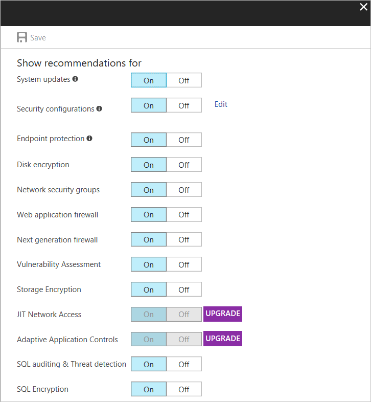
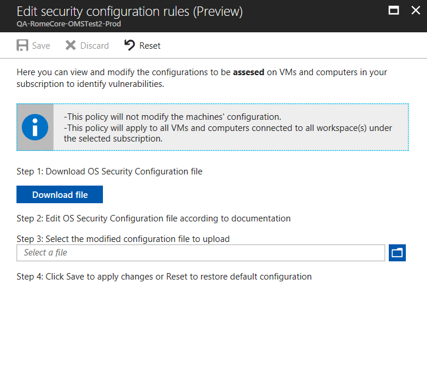
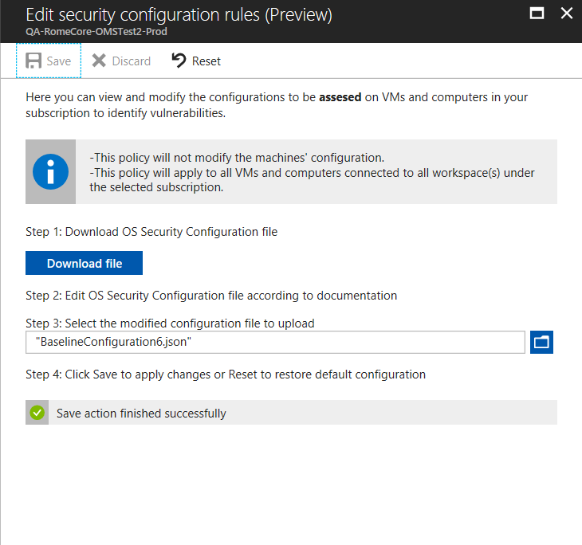
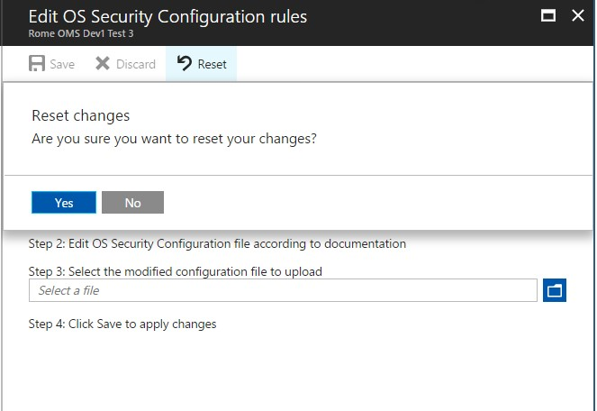
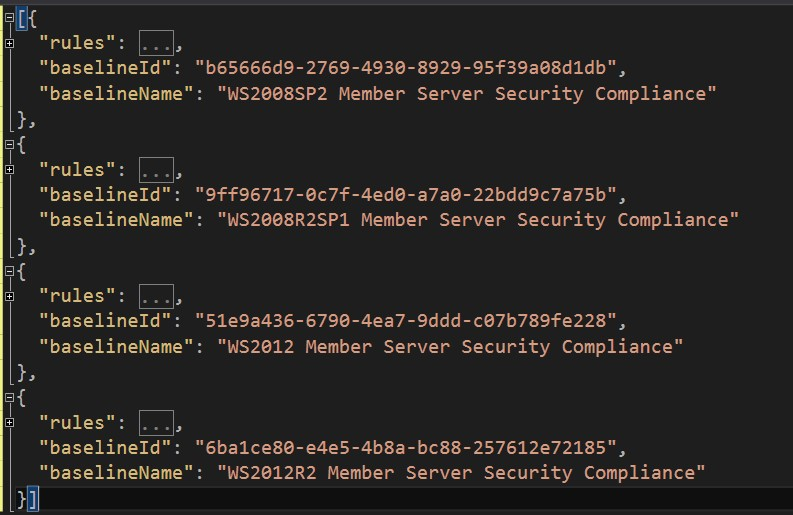
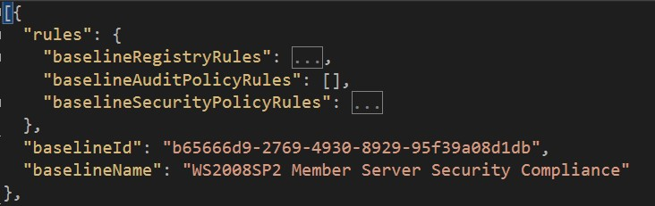
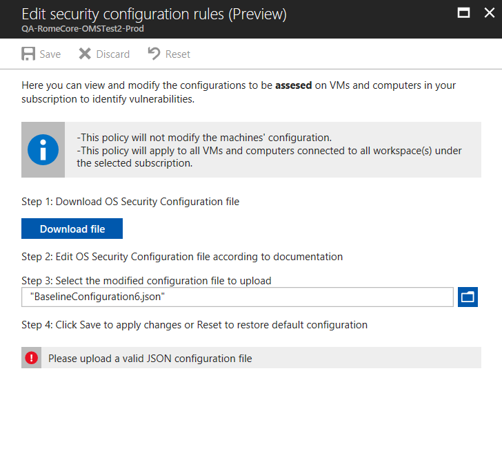
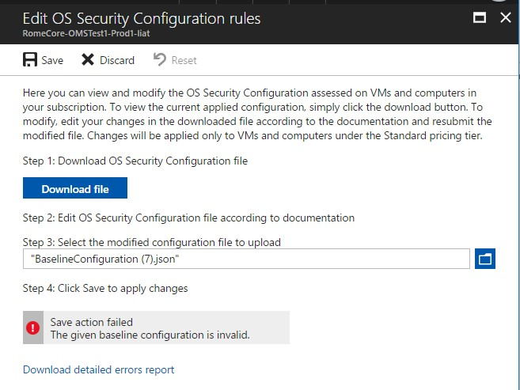
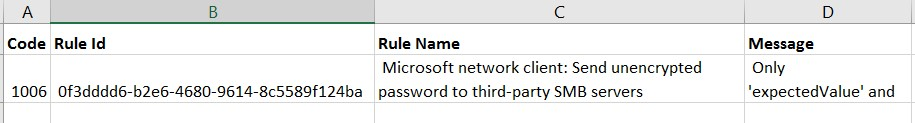
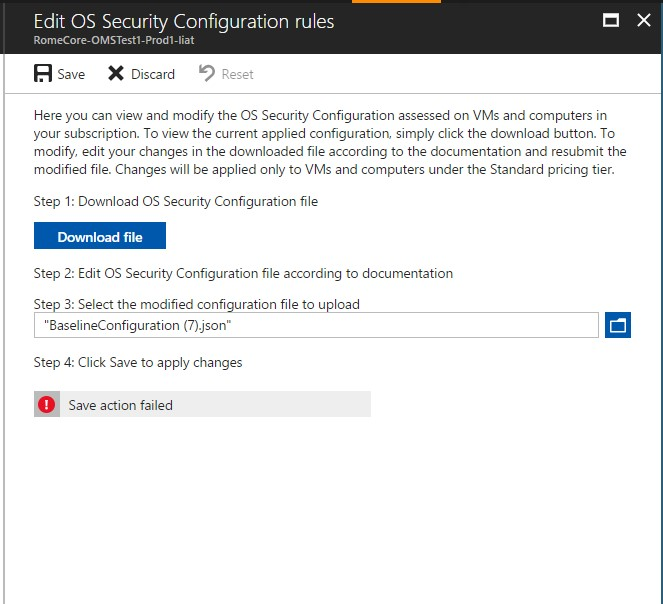

# Customizing OS Security Configurations in Azure Security Center [Preview]

Learn how to customize OS Security Configuration assessments in Azure Security Center using this walkthrough.

## What are OS Security Configurations?

Azure Security Center monitors security configurations using a set of over 150 recommended rules for hardening the OS, including rules related to firewalls, auditing, password policies, and more. If a machine is found to have a vulnerable configuration, a security recommendation is generated.

Customization of the rules can help organizations to control which configuration options are more appropriated for their environment. This feature enables users to set a customized assessment policy and apply it on all applicable machines in the subscription.

> [!NOTE]
> - Currently OS Security Configuration customization is available for Windows Server 2008, 2008R2, 2012, 2012R2 operating systems only.
- The configuration will apply to all VMs and computers connected to all workspaces under the selected subscription.
- OS Security Config customization is available for Security Center users in the Standard tier on subscription level only.
>
>

How to customize OS Security Configuration rules?

You can customize the OS Security Configuration rules by enabling and disabling a specific rule, changing the desired setting for an existing rule, and adding a new rule based on the supported rule types (registry, audit policy, security policy). Currently, the desired setting must be an exact value.

New rules have to be in the same format and structure as other existing rules of the same type.

> [!NOTE]
> To customize OS security configurations, you must be assigned the role of Subscription Owner, Subscription Contributor, or Security Admin.
>
>

## Configure OS Security Configuration customization

Follow the steps below to customize the default OS Security Configuration in Security Center:

1.  Open **Security Center** dashboard.

2.  Click **Security Policy** located under **Overview** section.

3.  Under **Security policy**, click the subscription that you want to perform the customization for, and click **Security Policy**; makes sure it is “on”.

4.  Click **Edit** option

    

5.  **Edit OS Security Configuration rules** opens. Follow the three steps highlighted in the screen to download, edit, and upload the modified file.

    

> [!NOTE]
> By default, the configuration file that you download is in *json* format. For instructions on how to modify this file, go to the next section in this article.
>
>

6.  After successfully saving the file, the configuration is applied to all VMs and computers connected to all workspace(s) under the selected subscription. This process might take some time, usually a few minutes but can it can take longer since it depends on the infrastructure size. Click **Save** to commit the change, otherwise the policy will not be stored.

    

At any point, you can reset the current policy configuration to the default policy state by selecting the **Reset** option in **Edit OS Security Configuration rules**. If you choose this option, you receive the following pop up alert. Click **Yes** to confirm.



## Customize the configuration file

In the customization file each supported OS version has a set of rules (ruleset), and each has its own name and unique ID, as shown in the following example:



> [!NOTE]
> This file was edited using Visual Studio, but you can also use Notepad++ as long as you have the JSON Viewer Plugin installed.
>
>

When editing this file, you can modify one rule or all of them. Each ruleset includes a *rules* section that contains the rules, broken down into 3 categories of rules: Registry, Audit Policy, and Security Policy, as show below:



Each category has its own set of attributes, and for existing rules you can make changes in the following ones:

-   expectedValue: this attribute’s field data type must match the supported values per each Rule Type, for example:

-   BaselineRegistryRules: the value should match the [regValueType](https://msdn.microsoft.com/library/windows/desktop/ms724884(v=vs.85).aspx) defined in that rule.

    -   BaselineAuditPolicyRules: the value should be a string value, one of the following:

        -   Success and Failure

        -   Success

    -   baselineSecurityPolicyRules: the value should be a string value, one of
        the following:

        -   “No one”

        -   List of allowed user groups, for example: “Administrators, Backup
            Operators”

-   state: string that may contain the options “Disabled” or “Enabled”. For this private preview release, the string is case sensitive.

These are the only fields that can be configured, and if you violate the file format or size you won’t be able to save the change. The example that follows has the error message that happens when the file can’t be processed:



Refer to the section below for list of potential errors.

Below you have some examples of these rules, and the attributes that can be changed in bold:

**Rules Section:** baselineRegistryRules
```
{

    "hive": "LocalMachine",
    "regValueType": "Int",
    "keyPath":
    "System\\\\CurrentControlSet\\\\Services\\\\LanManServer\\\\Parameters",
    "valueName": "restrictnullsessaccess",
    "ruleId": "f9020046-6340-451d-9548-3c45d765d06d",
    "originalId": "0f319931-aa36-4313-9320-86311c0fa623",
    "cceId": "CCE-10940-5",
    "ruleName": "Network access: Restrict anonymous access to Named Pipes and
    Shares",
    "ruleType": "Registry",
    "**expectedValue**": "1",
    "severity": "Warning",
    "analyzeOperation": "Equals",
    "source": "Microsoft",
    "**state**": "Disabled"

}
```

**Rules Section:** baselineAuditPolicyRules
```
{
"auditPolicyId": "0cce923a-69ae-11d9-bed3-505054503030",
"ruleId": "37745508-95fb-44ec-ab0f-644ec0b16995",
"originalId": "2ea0de1a-c71d-46c8-8350-a7dd4d447895",
"cceId": "CCE-11001-5",
"ruleName": "Audit Policy: Account Management: Other Account Management Events",
"ruleType": "AuditPolicy",
"**expectedValue**": "Success and Failure",
"severity": "Critical",
"analyzeOperation": "Equals",
"source": "Microsoft",
"**state**": "Enabled"
},
```

**Rules Sections:** baselineSecurityPolicyRules
```
{
"sectionName": "Privilege Rights",
"settingName": "SeIncreaseWorkingSetPrivilege",
"ruleId": "b0ec9d5e-916f-4356-83aa-c23522102b33",
"originalId": "b61bd492-74b0-40f3-909d-36b9bf54e94c",
"cceId": "CCE-10548-6",
"ruleName": "Increase a process working set",
"ruleType": "SecurityPolicy",
"**expectedValue**": "Administrators, Local Service",
"severity": "Warning",
"analyzeOperation": "Equals",
"source": "Microsoft", "**state**": "Enabled"
},
```

There are some rules that are duplicated for the different OS types. Duplicate rules have the same ‘Originald’.

## Adding a new custom rule

In the previous section you learned how to change an existing rule, but you can also create a new rule. Before creating a new rule, keep in mind the following restrictions:

-   Schema version, *baselineId* and *baselineName* can’t be changed.

-   Ruleset cannot be removed.

-   Ruleset cannot be added.

-   The max number of rules allowed (including default rules) is 1000 rules.

New custom rules are marked with a new custom Source (!= "Microsoft"). The *ruleId* field may be null or empty, if it is empty Microsoft generates one, and if it is not empty it must have a valid GUID unique across all rules (default and custom). Review the constraints below regarding the core fields:

-   *originalId* may be null or empty. In case it is not empty - should be a
    valid GUID.

-   *cceId* may be null or empty. In case it’s not it have to be unique.

-   *ruleType* - one of: Registry, AuditPolicy, SecurityPolicy.

-   *Severity* - one of: Unknown, Critical, Warning, Informational

-   *analyzeOperation*: must be Equals.

-   *auditPolicyId* - has to be valid GUID.

-   *regValueType* must be one of - Int, Long, String, MultipleString

> [!NOTE]
> Hive has to be *LocalMachine*.
>
>

Below you have an example of a new custom rule:

**Registry**:
```
    {
    "hive": "LocalMachine",
    "regValueType": "Int",
    "keyPath":
    "System\\\\CurrentControlSet\\\\Services\\\\Netlogon\\\\MyKeyName",
    "valueName": "MyValueName",
    "originalId": "",
    "cceId": "",
    "ruleName": "My new registry rule”, "baselineRuleType": "Registry",
    "expectedValue": "123", "severity": "Critical",
    "analyzeOperation": "Equals",
    "source": "MyCustomSource",
    "state": "Enabled"
   }
```
**Security Policy**:
```
{

   "sectionName": "Privilege Rights",
   "settingName": "SeDenyBatchLogonRight",
   "originalId": "",
   "cceId": "",
   "ruleName": "My new security policy rule", "baselineRuleType":
   "SecurityPolicy",
   "expectedValue": "Guests",
   "severity": "Critical",
   "analyzeOperation": "Equals", "source": " MyCustomSource ",
   "state": "Enabled"
   }
```
**Audit policy:**

   {
   "auditPolicyId": "0cce923a-69ae-11d9-bed3-505054503030",
   "originalId": "",
   "cceId": "",
   "ruleName": " My new audit policy rule ", "baselineRuleType": "AuditPolicy",
   "expectedValue": " Failure",
   "severity": "Critical",
   "analyzeOperation": "Equals", "source": " MyCustomSource ",
   "state": "Enabled"
   }

## File upload failures

If the submitted configuration file is invalid due to errors in values, formatting, etc. a failure error is shown and a link to the detailed errors csv file is available for you to download and use to remediate and fix errors before resubmitting a corrected configuration file.



Example of the errors file:



## Error codes

The list below has all potential errors:

| **Error**                                | **Description**                                                                                                                              |
|------------------------------------------|----------------------------------------------------------------------------------------------------------------------------------------------|
| BaselineConfiguratiohSchemaVersionError  | Property 'schemaVersion' was found invalid or empty. The value must be set to '{0}'.                                                         |
| BaselineInvalidStringError               | Property '{0}' cannot contain '\\n'.                                                                                                         |
| BaselineNullRuleError                    | Baseline configuration rules list contains a rule with value 'null'.                                                                         |
| BaselineRuleCceIdNotUniqueError          | CCE-ID '{0}' is not unique.                                                                                                                  |
| BaselineRuleEmptyProperty                | Property: '{0}' is missing or invalid.                                                                                                       |
| BaselineRuleIdNotInDefault               | The rule has a source property 'Microsoft' but was not found in Microsoft default ruleset.                                                   |
| BaselineRuleIdNotUniqueError             | Rule Id is not unique.                                                                                                                       |
| BaselineRuleInvalidGuid                  | Property '{0}' was found invalid. The value is not a valid Guid.                                                                             |
| BaselineRuleInvalidHive                  | Hive must be LocalMachine.                                                                                                                   |
| BaselineRuleNameNotUniqueError           | The rule name is not unique.                                                                                                                 |
| BaselineRuleNotExistInConfigError        | The rule was not found in the new configuration. Rule cannot be deleted.                                                                     |
| BaselineRuleNotFoundError                | The rule was not found in default baseline rules set.                                                                                        |
| BaselineRuleNotInPlace                   | The rule match a default rule with type {0} and is listed in {1} list.                                                                       |
| BaselineRulePropertyTooLong              | Property: '{0}' is too long. Max allowed length: {1}.                                                                                        |
| BaselineRuleRegTypeInvalidError          | The expected value '{0}' doesn't match the registry value type that is defined.                                                              |
| BaselineRulesetAdded                     | Rules set with id '{0}' was not found in the default configuration. Rules set cannot be added.                                               |
| BaselineRulesetIdMustBeUnique            | The given baseline rules set '{0}' must be unique.                                                                                           |
| BaselineRulesetNotFound                  | Rules set with id '{0}' and name '{1}' was not found in the given configuration. Rules set cannot be deleted.                                |
| BaselineRuleSourceNotMatch               | Rule with id '{0}' is already defined.                                                                                                       |
| BaselineRuleTypeDoesntMatch              | The default rule type is '{0}'.                                                                                                              |
| BaselineRuleTypeDoesntMatchError         | The actual type of the rule is: {0}, but ruleType property is: {1}.                                                                          |
| BaselineRuleUnpermittedChangesError      | Only 'expectedValue' and 'state' properties are allowed to be changed.                                                                       |
| BaselineTooManyRules                     | Maximum allowed customized rules number is {0} rules. The given configuration contains {1} rules. ({2} default rules + {3} customized rules) |
| ErrorNoConfigurationStatus               | No configuration status was found. Please state the desired configuration status - 'Default' or 'Custom'.                                    |
| ErrorNonEmptyRulesetOnDefault            | Configuration state is set to default. BaselineRulesets list must be null or empty.                                                          |
| ErrorNullRulesetsPropertyOnCustom        | The given configuration status is 'Custom' but the 'baselineRulesets' property is null or empty.                                             |
| ErrorParsingBaselineConfig               | The given configuration is invalid. One or more of the values defined have a null value or an invalid type.                                  |
| ErrorParsingIsDefaultProperty            | The given 'configurationStatus' value '{0}' is invalid. The value can be only 'Default' or 'Custom'.                                         |
| InCompatibleViewVersion                  | View version: {0} is NOT supported on this workspace type.                                                                                   |
| InvalidBaselineConfigurationGeneralError | The given baseline configuration was found with one or more type validation errors.                                                          |
| ViewConversionError                      | View is older version that workspace supported. View conversion failed : {0}                                                                 |

If you don’t have sufficient permissions, you may get a general failure error (see below).



## Next steps

TBD
