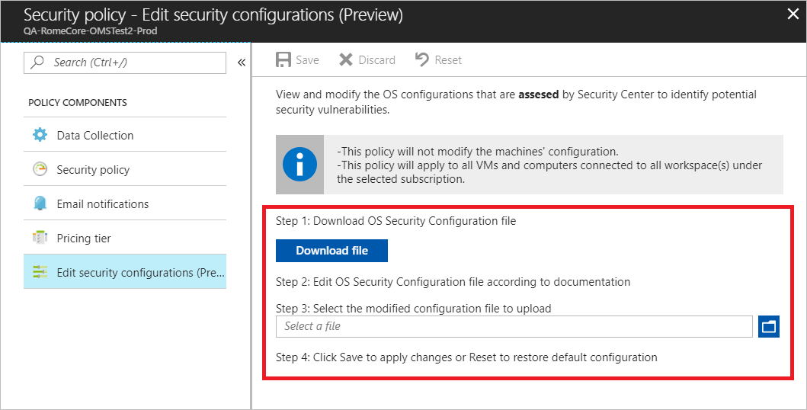
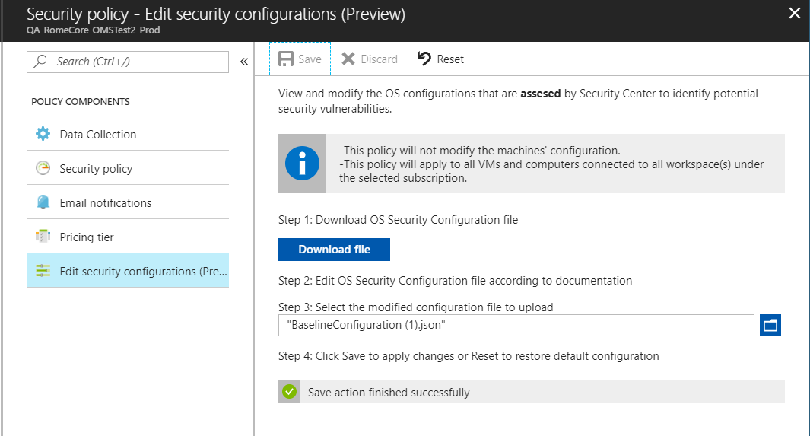
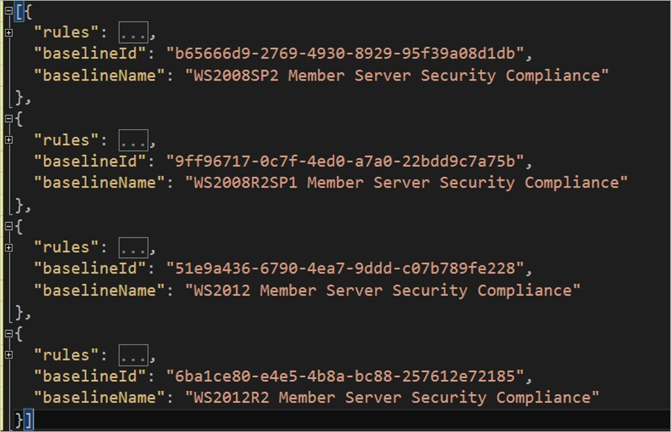
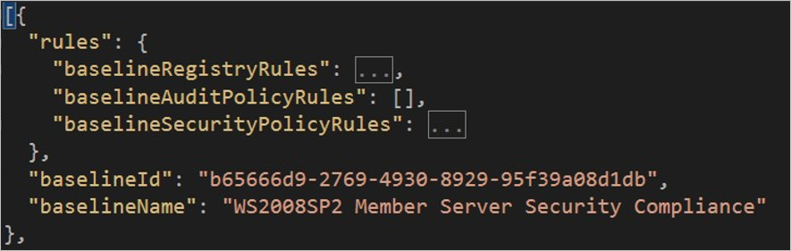
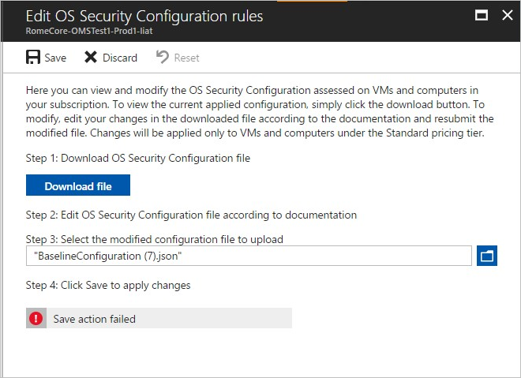

# Customize OS security configurations in Azure Security Center (Preview)

This walkthrough demonstrates how to customize OS security configuration assessments in Azure Security Center.

> [!NOTE]
> The ability to customize OS security configurations will be retired on July 31st, 2019. For more information and alternative services, see [Retirement of Security Center features (July 2019)](security-center-features-retirement-july2019.md#menu_securityconfigurations).

## What are OS security configurations?

Azure Security Center monitors security configurations by applying a set of [over 150 recommended rules](https://gallery.technet.microsoft.com/Azure-Security-Center-a789e335) for hardening the OS, including rules related to firewalls, auditing, password policies, and more. If a machine is found to have a vulnerable configuration, Security Center generates a security recommendation.

By customizing the rules, organizations can control which configuration options are more appropriate for their environment. You can set a customized assessment policy and then apply it on all applicable machines in the subscription.

> [!NOTE]
> - Currently, customization of the OS security configuration is available for Windows Server versions 2008, 2008 R2, 2012, 2012 R2, and 2016 operating systems only.
> - The configuration applies to all VMs and computers that are connected to all workspaces under the selected subscription.
> - OS security configuration customization is available only on the Security Center standard tier.
>
>

You can customize the OS security configuration rules by enabling and disabling a specific rule, changing the desired setting for an existing rule, or adding a new rule that's based on the supported rule types (registry, audit policy, and security policy). Currently, the desired setting must be an exact value.

New rules must be in the same format and structure as other existing rules of the same type.

> [!NOTE]
> To customize OS security configurations, you must be assigned the role of *Subscription Owner*, *Subscription Contributor*, or *Security Administrator*.
>
>

## Customize the default OS security configuration

To customize the default OS security configuration in Security Center, do the following:

1.  Open the **Security Center** dashboard.

2.  In the left pane, select **Pricing & settings**.

    

4. Select the applicable subscription and select **Edit security configurations**.  

    

5. Follow the steps to download, edit, and upload the modified file.

   > [!NOTE]
   > By default, the configuration file that you download is in *json* format. For instructions about modifying this file, go to [Customize the configuration file](#customize-the-configuration-file).
   >

6. To commit the change, select **Save**. Otherwise, the policy is not stored.

    

   After you've successfully saved the file, the configuration is applied to all VMs and computers that are connected to the workspaces under the subscription. The process usually takes a few minutes but can take longer, depending on the infrastructure size.

At any point, you can reset the current policy configuration to its default state. To do so, in the **Edit OS security configuration rules** window, select **Reset**. Confirm this option by selecting **Yes** in the confirmation pop-up window.


## Customize the configuration file

In the customization file, each supported OS version has a set of rules, or ruleset. Each ruleset has its own name and unique ID, as shown in the following example:



> [!NOTE]
> This example file was edited in Visual Studio, but you can also use Notepad if you have the JSON Viewer plug-in installed.
>
>

When you edit the customization file, you can modify one rule or all of them. Each ruleset includes a *rules* section that's separated into three categories: Registry, Audit Policy, and Security Policy, as shown here:



Each category has its own set of attributes. You can change the following attributes:

- **expectedValue**: This attribute’s field data type must match the supported values per *rule type*, for example:

  - **baselineRegistryRules**: The value should match the [regValueType](https://msdn.microsoft.com/library/windows/desktop/ms724884) that's defined in that rule.

  - **baselineAuditPolicyRules**: Use one of the following string values:

    - *Success and Failure*

    - *Success*

  - **baselineSecurityPolicyRules**: Use one of the following string values:

    - *No one*

    - List of allowed user groups, for example: *Administrators*, *Backup Operators*

-   **state**: The string can contain the options *Disabled* or *Enabled*. For this release, the string is case-sensitive.

These are the only fields that can be configured. If you violate the file format or size, you won’t be able to save the change. You will receive an error telling you that you need to upload a valid JSON configuration file.

For a list of other potential errors, see [Error codes](#error-codes).

The following three sections contain examples of the preceding rules. The *expectedValue* and *state* attributes can be changed.

**baselineRegistryRules**
```json
    {
    "hive": "LocalMachine",
    "regValueType": "Int",
    "keyPath":
    "System\\\\CurrentControlSet\\\\Services\\\\LanManServer\\\\Parameters",
    "valueName": "restrictnullsessaccess",
    "ruleId": "f9020046-6340-451d-9548-3c45d765d06d",
    "originalId": "0f319931-aa36-4313-9320-86311c0fa623",
    "cceId": "CCE-10940-5",
    "ruleName": "Network access: Restrict anonymous access to Named Pipes and
    Shares",
    "ruleType": "Registry",
    "expectedValue": "1",
    "severity": "Warning",
    "analyzeOperation": "Equals",
    "source": "Microsoft",
    "state": "Disabled"

    }
```

**baselineAuditPolicyRules**
```json
    {
    "auditPolicyId": "0cce923a-69ae-11d9-bed3-505054503030",
    "ruleId": "37745508-95fb-44ec-ab0f-644ec0b16995",
    "originalId": "2ea0de1a-c71d-46c8-8350-a7dd4d447895",
    "cceId": "CCE-11001-5",
    "ruleName": "Audit Policy: Account Management: Other Account Management Events",
    "ruleType": "AuditPolicy",
    "expectedValue": "Success and Failure",
    "severity": "Critical",
    "analyzeOperation": "Equals",
    "source": "Microsoft",
    "state": "Enabled"
    }
```

**baselineSecurityPolicyRules**
```json
    {
    "sectionName": "Privilege Rights",
    "settingName": "SeIncreaseWorkingSetPrivilege",
    "ruleId": "b0ec9d5e-916f-4356-83aa-c23522102b33",
    "originalId": "b61bd492-74b0-40f3-909d-36b9bf54e94c",
    "cceId": "CCE-10548-6",
    "ruleName": "Increase a process working set",
    "ruleType": "SecurityPolicy",
    "expectedValue": "Administrators, Local Service",
    "severity": "Warning",
    "analyzeOperation": "Equals",
    "source": "Microsoft",
    "state": "Enabled"
    }
```

Some rules are duplicated for the different OS types. Duplicate rules have the same *originalId* attribute.

## Create custom rules

You can also create new rules. Before you create a new rule, keep in mind the following restrictions:

-   Schema version, *baselineId* and *baselineName* can’t be changed.

-   Ruleset cannot be removed.

-   Ruleset cannot be added.

-   The maximum number of rules allowed (including default rules) is 1000.

New custom rules are marked with a new custom source (!= "Microsoft"). The *ruleId* field can be null or empty. If it is empty, Microsoft generates one. If it is not empty, it must have a valid GUID that's unique across all rules (default and custom). Review the following constraints for the core fields:

-   **originalId**: Can be null or empty. If *originalId* is not empty, it should be a valid GUID.

-   **cceId**: Can be null or empty. If *cceId* is not empty, it must be unique.

-   **ruleType**: (select one) Registry, AuditPolicy, or SecurityPolicy.

-   **Severity**: (select one) Unknown, Critical, Warning, or Informational.

-   **analyzeOperation**: Must be *Equals*.

-   **auditPolicyId**: Must be a valid GUID.

-   **regValueType**: (select one) Int, Long, String, or MultipleString.

> [!NOTE]
> Hive must be *LocalMachine*.
>
>

Example of a new custom rule:

**Registry**:
```json
    {
    "hive": "LocalMachine",
    "regValueType": "Int",
    "keyPath":
    "System\\\\CurrentControlSet\\\\Services\\\\Netlogon\\\\MyKeyName",
    "valueName": "MyValueName",
    "originalId": "",
    "cceId": "",
    "ruleName": "My new registry rule", "baselineRuleType": "Registry",
    "expectedValue": "123", "severity": "Critical",
    "analyzeOperation": "Equals",
    "source": "MyCustomSource",
    "state": "Enabled"
    }
```
**Security policy**:
```json
   {
   "sectionName": "Privilege Rights",
   "settingName": "SeDenyBatchLogonRight",
   "originalId": "",
   "cceId": "",
   "ruleName": "My new security policy rule", "baselineRuleType":
   "SecurityPolicy",
   "expectedValue": "Guests",
   "severity": "Critical",
   "analyzeOperation": "Equals", "source": " MyCustomSource ",
   "state": "Enabled"
   }
```
**Audit policy**:
```json
   {
   "auditPolicyId": "0cce923a-69ae-11d9-bed3-505054503030",
   "originalId": "",
   "cceId": "",
   "ruleName": " My new audit policy rule ", "baselineRuleType": "AuditPolicy",
   "expectedValue": " Failure",
   "severity": "Critical",
   "analyzeOperation": "Equals", "source": " MyCustomSource ",
   "state": "Enabled"
   }
```

## File upload failures

If the submitted configuration file is invalid because of errors in values or formatting, a failure error is displayed, such as **Save action failed**. You can download a detailed errors .csv report to remediate and fix the errors before you resubmit a corrected configuration file.

Example of an error file:


## Error codes

All potential errors are listed in the following table:

| **Error**                                | **Description**                                                                                                                              |
|------------------------------------------|----------------------------------------------------------------------------------------------------------------------------------------------|
| BaselineConfigurationSchemaVersionError  | The property *schemaVersion* was found invalid or empty. The value must be set to *{0}*.                                                         |
| BaselineInvalidStringError               | The property *{0}* cannot contain *\\n*.                                                                                                         |
| BaselineNullRuleError                    | The baseline configuration rules list contains a rule with value *null*.                                                                         |
| BaselineRuleCceIdNotUniqueError          | The CCE-ID *{0}* is not unique.                                                                                                                  |
| BaselineRuleEmptyProperty                | The property *{0}* is missing or invalid.                                                                                                       |
| BaselineRuleIdNotInDefault               | The rule has a source property *Microsoft* but it was not found in the Microsoft default ruleset.                                                   |
| BaselineRuleIdNotUniqueError             | The rule identifier is not unique.                                                                                                                       |
| BaselineRuleInvalidGuid                  | The property *{0}* was found invalid. The value is not a valid GUID.                                                                             |
| BaselineRuleInvalidHive                  | The hive must be LocalMachine.                                                                                                                   |
| BaselineRuleNameNotUniqueError           | The rule name is not unique.                                                                                                                 |
| BaselineRuleNotExistInConfigError        | The rule was not found in the new configuration. Rule cannot be deleted.                                                                     |
| BaselineRuleNotFoundError                | The rule was not found in default baseline ruleset.                                                                                        |
| BaselineRuleNotInPlace                   | The rule matches a default rule with type {0} and is listed in {1} list.                                                                       |
| BaselineRulePropertyTooLong              | The property *{0}* is too long. Max allowed length: {1}.                                                                                        |
| BaselineRuleRegTypeInvalidError          | The expected value *{0}* doesn't match the registry value type that is defined.                                                              |
| BaselineRulesetAdded                     | The ruleset with the identifier *{0}* was not found in the default configuration. The ruleset cannot be added.                                               |
| BaselineRulesetIdMustBeUnique            | The given baseline ruleset *{0}* must be unique.                                                                                           |
| BaselineRulesetNotFound                  | The ruleset with identifier *{0}* and name *{1}* was not found in the given configuration. The ruleset cannot be deleted.                                |
| BaselineRuleSourceNotMatch               | The rule with identifier *{0}* is already defined.                                                                                                       |
| BaselineRuleTypeDoesntMatch              | The default rule type is *{0}*.                                                                                                              |
| BaselineRuleTypeDoesntMatchError         | The actual type of the rule is *{0}*, but the *ruleType* property is *{1}*.                                                                          |
| BaselineRuleUnpermittedChangesError      | Only *expectedValue* and *state* properties are allowed to be changed.                                                                       |
| BaselineTooManyRules                     | The maximum number of allowed customized rules is {0} rules. The given configuration contains {1} rules, {2} default rules, and {3} customized rules. |
| ErrorNoConfigurationStatus               | No configuration status was found. State the desired configuration status: *Default* or *Custom*.                                    |
| ErrorNonEmptyRulesetOnDefault            | The configuration state is set to default. The *BaselineRulesets* list must be null or empty.                                                          |
| ErrorNullRulesetsPropertyOnCustom        | The given configuration status is *Custom* but the *baselineRulesets* property is null or empty.                                             |
| ErrorParsingBaselineConfig               | The given configuration is invalid. One or more of the defined values have a null value or an invalid type.                                  |
| ErrorParsingIsDefaultProperty            | The given *configurationStatus* value *{0}* is invalid. The value can be only *Default* or *Custom*.                                         |
| InCompatibleViewVersion                  | The view version *{0}* is *not* supported on this workspace type.                                                                                   |
| InvalidBaselineConfigurationGeneralError | The given baseline configuration was found with one or more type validation errors.                                                          |
| ViewConversionError                      | The view is an older version than the workspace supports. View conversion failed: {0}.                                                                 |

If you don’t have sufficient permissions, you might get a general failure error, as shown here:



## Next steps
This article discussed how to customize OS security configuration assessments in Security Center. To learn more about the configuration rules and remediation, see:

- [Security Center common configuration identifiers and baseline rules](https://gallery.technet.microsoft.com/Azure-Security-Center-a789e335).
- Security Center uses common configuration enumeration (CCE) to assign unique identifiers to configuration rules. For more information, see [CCE](https://nvd.nist.gov/config/cce/index).
- To resolve vulnerabilities when your OS configuration does not match the recommended security configuration rules, see [Remediate security configurations](security-center-remediate-os-vulnerabilities.md).
