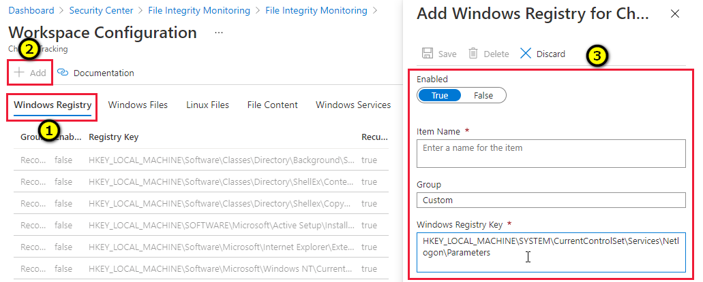
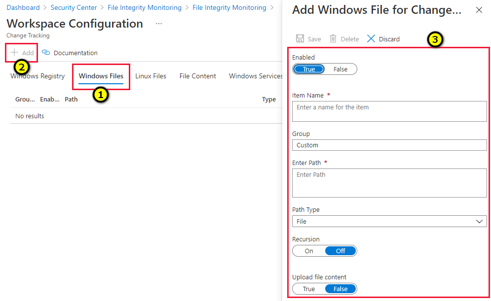
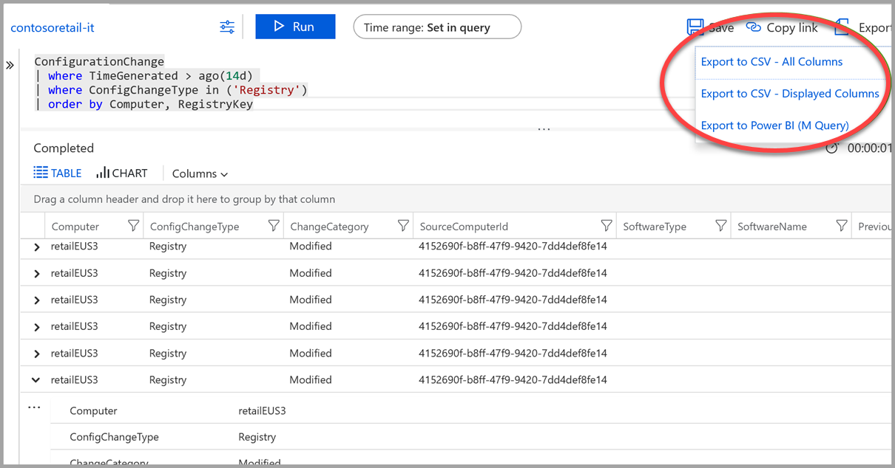

# Compare baselines using File Integrity Monitoring (FIM)

File Integrity Monitoring (FIM) informs you when changes occur to sensitive areas in your resources, so you can investigate and address unauthorized activity. FIM monitors Windows files, Windows registries, and Linux files.

This topic explains how to enable FIM on the files and registries. For more information about FIM, see [File Integrity Monitoring in Azure Security Center](security-center-file-integrity-monitoring.md).

## Why use FIM?

Operating system, applications, and associated configurations control the behavior and security state of your resources. Therefore, attackers target the files that control your resources, in order to overtake a resource's operating system and/or execute activities without being detected.

In fact, many regulatory compliance standards such as PCI-DSS & ISO 17799 require implementing FIM controls.  

## Enable built-in recursive registry checks

The FIM registry hive defaults provide a convenient way to monitor recursive changes within common security areas.  For example, an adversary may configure a script to execute in LOCAL_SYSTEM context by configuring an execution at startup or shutdown.  To monitor changes of this type, enable the built-in check.  

>[!NOTE]
> Recursive checks apply only to recommended security hives and not to custom registry paths.  

## Adding a custom registry check

FIM baselines start by identifying characteristics of a known-good state for the operating system and supporting application.  For this example, we will focus on the password policy configurations for Windows Server 2008 and higher.

|Policy Name                 | Registry Setting|
|---------------------------------------|-------------|
|Domain controller: Refuse machine account password changes| MACHINE\System\CurrentControlSet\Services  \Netlogon\Parameters\RefusePasswordChange|
|Domain member: Digitally encrypt or sign secure channel data (always)|MACHINE\System\CurrentControlSet\Services  \Netlogon\Parameters\RequireSignOrSeal|
|Domain member: Digitally encrypt secure channel data (when possible)|MACHINE\System\CurrentControlSet\Services  \Netlogon\Parameters\SealSecureChannel|
|Domain member: Digitally sign secure channel data (when possible)|MACHINE\System\CurrentControlSet\Services   \Netlogon\Parameters\SignSecureChannel|
|Domain member: Disable machine account password changes|MACHINE\System\CurrentControlSet\Services  \Netlogon\Parameters\DisablePasswordChange|
|Domain member: Maximum machine account password age|MACHINE\System\CurrentControlSet\Services  \Netlogon\Parameters\MaximumPasswordAge|
|Domain member: Require strong (Windows 2000 or later) session key|MACHINE\System\CurrentControlSet\Services  \Netlogon\Parameters\RequireStrongKey|
|Network security: Restrict NTLM:  NTLM authentication in this domain|MACHINE\System\CurrentControlSet\Services  \Netlogon\Parameters\RestrictNTLMInDomain|
|Network security: Restrict NTLM: Add server exceptions in this domain|MACHINE\System\CurrentControlSet\Services  \Netlogon\Parameters\DCAllowedNTLMServers|
|Network security: Restrict NTLM: Audit NTLM authentication in this domain|MACHINE\System\CurrentControlSet\Services  \Netlogon\Parameters\AuditNTLMInDomain|

> [!NOTE]
> To learn more about registry settings supported by various operating system versions, refer to the [Group Policy Settings reference spreadsheet](https://www.microsoft.com/download/confirmation.aspx?id=25250).

*To configure FIM to monitor registry baselines:*

1. In the **Add Windows Registry for Change Tracking** window, in the **Windows Registry Key** text box, enter the registry key.

    <code>

    HKEY_LOCAL_MACHINE\SYSTEM\CurrentControlSet\Services\Netlogon\Parameters
    </code>

      

## Tracking changes to Windows files

1. In the **Add Windows File for Change Tracking** window, in the **Enter path** text box, enter the folder which contains the files that you want to track.
In the example in the following figure, 
**Contoso Web App** resides in the D:\ drive within the **ContosWebApp** folder structure.  
1. Create a custom Windows file entry by providing a name of the setting class, enabling recursion, and specifying the top folder with a wildcard (*) suffix.

    

## Retrieving change data

File Integrity Monitoring data resides within the Azure Log Analytics / ConfigurationChange table set.  

 1. Set a time range to retrieve a summary of changes by resource.
In the following example, we are retrieving all changes in the last fourteen days in the categories of registry and files:

    <code>

    > ConfigurationChange

    > | where TimeGenerated > ago(14d)

    > | where ConfigChangeType in ('Registry', 'Files')

    > | summarize count() by Computer, ConfigChangeType

    </code>

1. To view details of the registry changes:

    1. Remove **Files** from the **where** clause, 
    1. Remove the summarization line and replace it with an ordering clause:

    <code>

    > ConfigurationChange

    > | where TimeGenerated > ago(14d)

    > | where ConfigChangeType in ('Registry')

    > | order by Computer, RegistryKey

    </code>

Reports can be exported to CSV for archival and/or channeled to a Power BI report.  

