# Advanced data security for SQL servers on Azure Virtual Machines (Public Preview)
Advanced data security for SQL Servers on Azure Virtual Machines is a unified package for advanced SQL security capabilities. It currently (in Public Preview) includes functionality for surfacing and mitigating potential database vulnerabilities and detecting anomalous activities that could indicate a threat to your database. 

This security offering for Azure VMs SQL servers is based on the same fundamental technology used in the [Azure SQL Database Advanced Data Security package](https://docs.microsoft.com/azure/sql-database/sql-database-advanced-data-security).

## Overview

Advanced data security provides a set of advanced SQL security capabilities,  consisting of Vulnerability assessment and Advanced Threat Protection.

* [Vulnerability assessment](https://docs.microsoft.com/azure/sql-database/sql-vulnerability-assessment) is an easy to configure service that can discover, track, and help you remediate potential database vulnerabilities. It provides visibility into your security state, and includes the steps to resolve security issues and enhance your database fortifications.
* [Advanced Threat Protection](https://docs.microsoft.com/azure/sql-database/sql-database-threat-detection-overview) detects anomalous activities indicating unusual and potentially harmful attempts to access or exploit your SQL server. It continuously monitors your database for suspicious activities and provides action-oriented security alerts on anomalous database access patterns. These alerts provide the suspicious activity details and recommended actions to investigate and mitigate the threat.

## Get started with Advanced Data Security for SQL on Azure VMs

The following steps get you started with Advanced Data Security for SQL on Azure VMs Public Preview.

### Set up Advanced Data Security for SQL on Azure VMs

**Before you begin**: You need a Log Analytics workspace to store the security logs being analyzed. If you do not have one, then you can create one easily, as explained in [Create a Log Analytics workspace in the Azure portal](https://docs.microsoft.com/azure/azure-monitor/learn/quick-create-workspace).

1. Connect the VM hosting the SQL server to the Log Analytics workspace. For instructions, see [Connect Windows computers to Azure Monitor](https://docs.microsoft.com/azure/azure-monitor/platform/agent-windows).

1. From Azure Marketplace, go to the [SQL Advanced Data Security solution](https://ms.portal.azure.com/#create/Microsoft.SQLAdvancedDataSecurity).
(You can find it using the marketplace search option, as see in the following image.) The **SQL Advanced Data Security** page opens.

    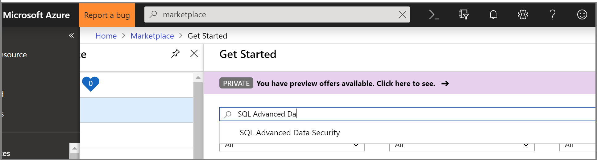

1. Click **Create**. The workplaces are displayed.

    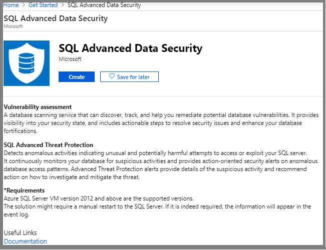

1. Select the workspace to use and click **Create**.

   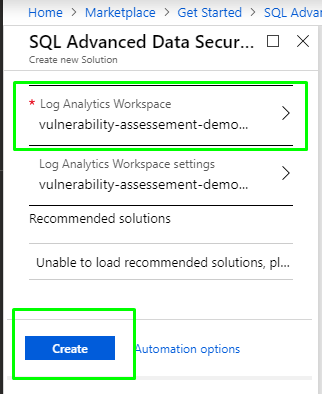

1. Restart the [VM's SQL server](https://docs.microsoft.com/sql/database-engine/configure-windows/start-stop-pause-resume-restart-sql-server-services?view=sql-server-2017).

## Explore and investigate security alerts

You can view and manage your current security alerts.

1. Click **Security Center** > **Security Alerts**, and click on an alert.

    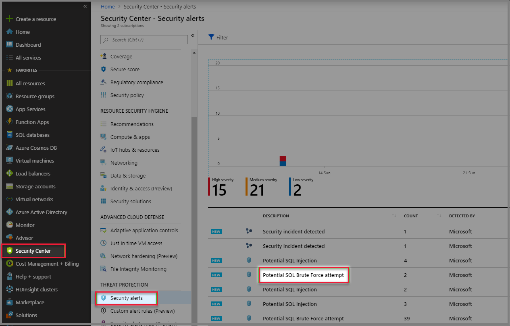

1. From the **Attacked Resource** column, click on a resource that has been attacked.

1. To view alert details and actions for investigating the current threat and addressing future threats, scroll down the **General information** page, and in the **Remediation steps** section, click on the **INVESTIGATION STEPS** link.

    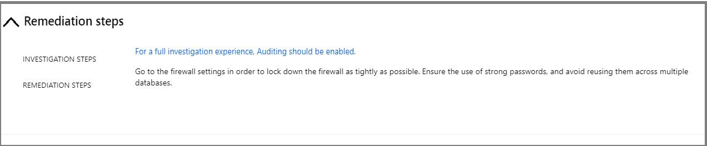

1. To view the logs that are associated with the triggering of the alert, go to **Log analytics workspaces** and do the following steps:

     > [!NOTE]
     > If **Log analytics workspaces** doesn’t appear at the left menu, click **All services**, and search for **Log analytics workspaces**.

    1. Be sure the columns are displaying the **Pricing tier** and **WorkspaceID** columns. (**Log analytics workspaces** > **Edit columns**, add **Pricing tier** and **WorkspaceID**.)

     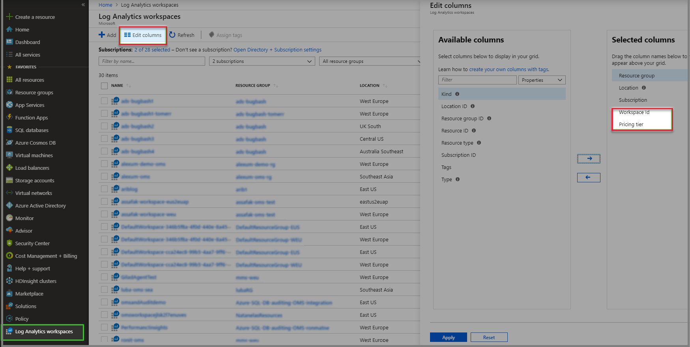

    1. Click on the workspace that has the alert logs.

    1. Under the **General** menu, click **Logs**

    1. Click the eye next to **SQLAdvancedThreatProtection** table. The logs are listed.

     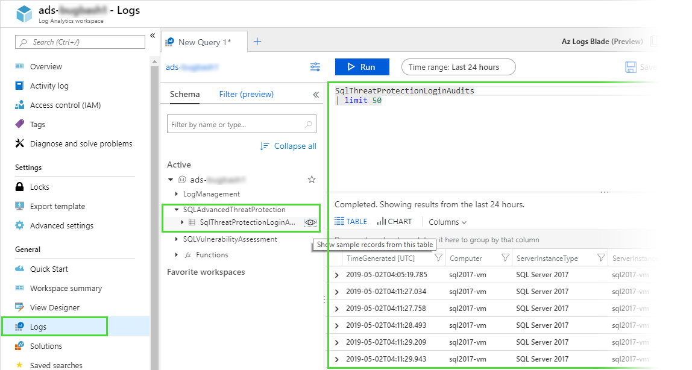

## Set Up Email Notification for ATP Alerts 

You can set a list of recipients to receive an email notification when ASC alerts are generated. The email contains a direct link to the alert in Azure Security Center with all the relevant details. 

1. Go to **Security Center** > **Pricing & settings** and click on the relevant subscription

    

1. From the **Settings** menu click **Email notifications**. 
1. In the **Email address** text box, enter the email addresses to receive the notifications. You can enter more than one email address by separating the email addresses with a comma (,).  For example   admin1@mycompany.com,admin2@mycompany.com,admin3@mycompany.com

      

1. In the **Email notification** settings, set the following options:
  
    * **Send email notification for high severity alerts**: Instead of sending emails for all alerts, send only for high severity alerts.
    * **Also send email notifications to subscription owners**:  Send notifications to the subscriptions owners too.

1. In the top of the **Email notifications** screen, click **Save**.

  > [!NOTE]
  > Be sure to click **Save** before closing the window, or the new **Email notification** settings will not be saved.

## Explore Vulnerability Assessment Reports

The Vulnerability assessment dashboard provides an overview of your assessment results across all your databases. You can view the distribution of databases according to SQL Server version, along with a summary of failing versus passing databases and an overall summary of failing checks according to risk distribution.

You can view your Vulnerability assessment results and reports directly from Log Analytics.

1. Navigate to your Log Analytics workspace with the Advanced Data Security solution.
1. Navigate to **Solutions** and select the **SQL Vulnerability Assessment** solution.
1. In the **Summary** pane, click **View Summary** and select your **SQL Vulnerability Assessment Report**.

    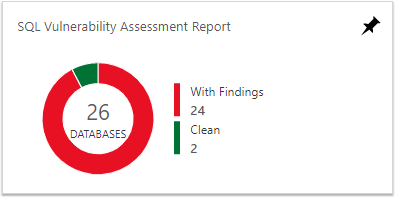

    The report dashboard loads. Make sure the time window is set to at least the **Last 7 days** since vulnerability assessment scans are run on your databases on a fixed schedule of once per 7 days.

    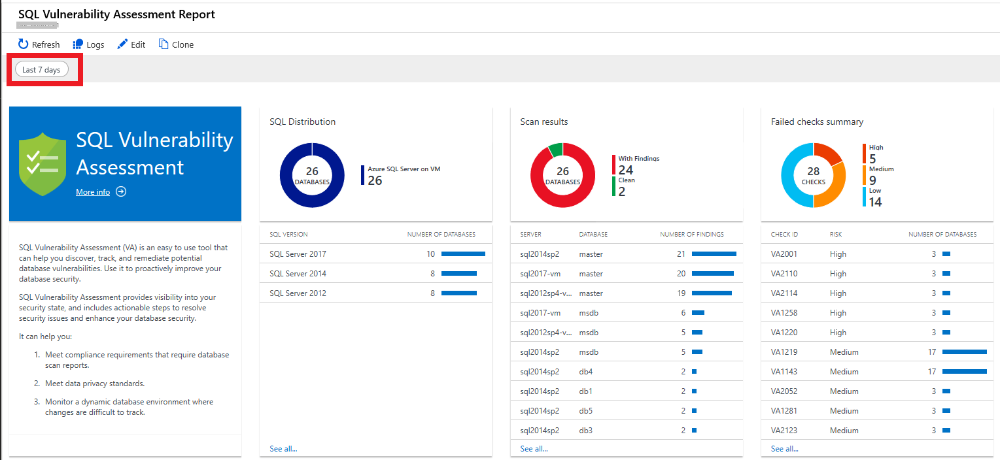

1. To drill down for more details, click on any of the dashboard elements. For example:

   1. Click on a Vulnerability check in the **Failed checks summary** section to view a Log Analytics table with the results for this check across all databases. The ones that have results are listed first.

   1. Then, click through to view details for each vulnerability, including the vulnerability description and impact, status, associated risk, and actual results on this database. You can also see the actual Query that was run to perform this check, and remediation information for resolving this vulnerability.

    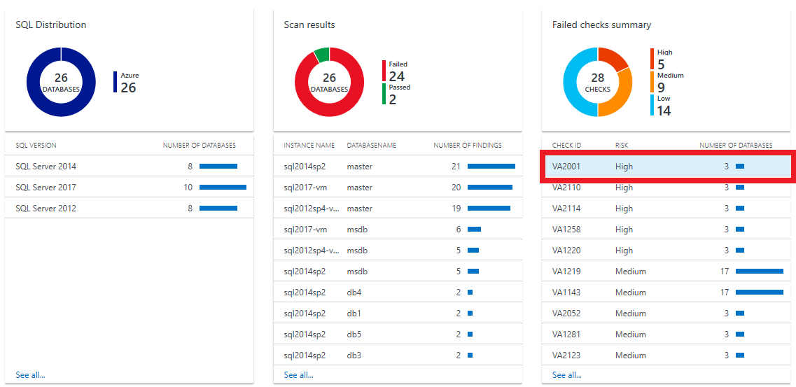

    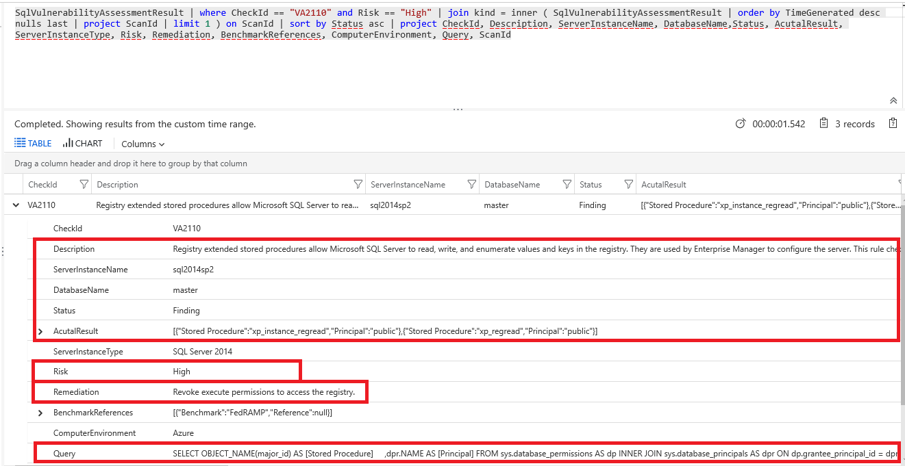

1. You can run any Log Analytics queries on your Vulnerability Assessment results data, to slice and dice the data according to your needs.

## Advanced Threat Protection for SQL Servers on Azure VMs Alerts
Alerts are generated by unusual and potentially harmful attempts to access or exploit SQL Servers. These events can trigger the following alerts:

### Anomalous access pattern alerts (supported in Public Preview)

* **Access from unusual location:** This alert is triggered when there is a change in the access pattern to SQL server, where someone has logged on to the SQL server from an unusual geographical location. Potential causes:
     * An attacker or former malicious employ has accessed your SQL Server.
     * A legitimate user has accessed your SQL Server from a new location.
* **Access from a potentially harmful application**: his alert is triggered when a potentially harmful application is used to access the database. Potential causes:
     * An attacker trying to breach your SQL using common attack tools.
     * A legitimate penetration testing in action.
* **Access from unfamiliar principal**: This alert is triggered when there is a change in the access pattern to SQL server, where someone has logged on to the SQL server using an unusual principal (SQL user). Potential causes:
     * An attacker or former malicious employ has accessed your SQL Server. 
     * A legitimate user has accessed your SQL Server from with a new principal.
* **Brute force SQL credentials**: This alert is triggered when there is an abnormal high number of failed logins with different credentials. Potential causes:
     * An attacker trying to breach your SQL using brute force.
     * A legitimate penetration testing in action.

### Potential SQL Injection attacks (coming)

* **Vulnerability to SQL injection**: This alert is triggered when an application generates a faulty SQL statement in the database. This alert may indicate a possible vulnerability to SQL injection attacks. Potential causes:
     * A defect in application code that constructs the faulty SQL statement
     * Application code or stored procedures don't sanitize user input when constructing the faulty SQL statement, which may be exploited for SQL Injection
* **Potential SQL injection**: This alert is triggered when an active exploit happens against an identified application vulnerability to SQL injection. This means the attacker is trying to inject malicious SQL statements using the vulnerable application code or stored procedures.
