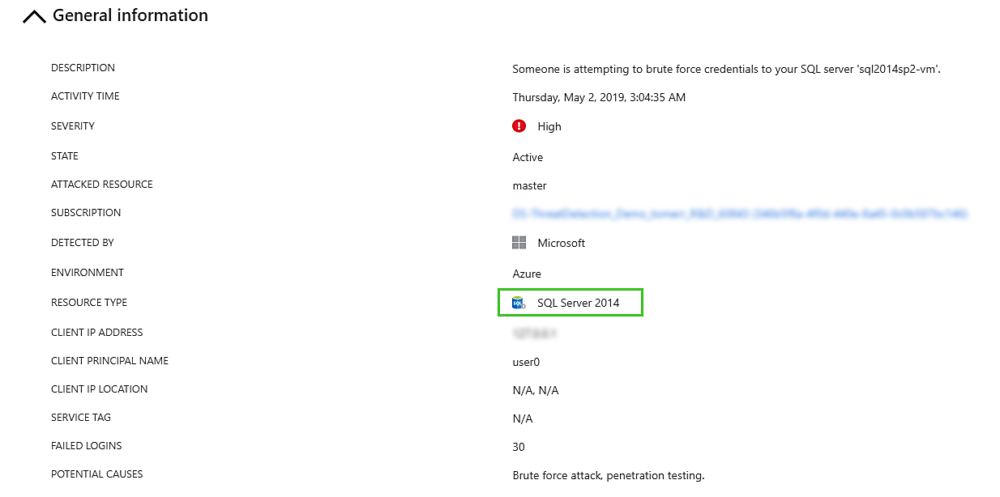

# Advanced data security for SQL servers on IaaS
Advanced data security for SQL Servers on IaaS is a unified package for advanced SQL security capabilities. It currently includes functionality for surfacing and mitigating potential database vulnerabilities and detecting anomalous activities that could indicate a threat to your database.

This security offering for IaaS SQL servers is based on the same fundamental technology used in the [Azure SQL Database Advanced Data Security package](https://docs.microsoft.com/en-us/azure/sql-database/sql-database-advanced-data-security).

## Overview

Advanced data security (ADS) provides a set of advanced SQL security capabilities,  consisting of Vulnerability assessment and Advanced Threat Protection.

* [Vulnerability assessment](https://docs.microsoft.com/en-us/azure/sql-database/sql-vulnerability-assessment) is an easy to configure service that can discover, track, and help you remediate potential database vulnerabilities. It provides visibility into your security state, and includes the steps to implement to resolve security issues and enhance your database fortifications.
* [Advanced Threat Protection](https://docs.microsoft.com/en-us/azure/sql-database/sql-database-threat-detection-overview) detects anomalous activities indicating unusual and potentially harmful attempts to access or exploit your SQL server. It continuously monitors your database for suspicious activities and provides action-oriented security alerts on anomalous database access patterns. These alerts provide the suspicious activity details and recommended actions to investigate and mitigate the threat.

## Getting Started with ADS for IaaS

The following steps get you started with ADS for IaaS.

### Set up ADS for IaaS

Before you begin: You need a Log Analytics workspace to store the security logs being analyzed. If you do not have one, then you can create one easily, as explained in [Create a Log Analytics workspace in the Azure portal](https://docs.microsoft.com/en-us/azure/azure-monitor/learn/quick-create-workspace).

1. Connect the VM hosting the SQL server to the Log Analytics workspace. For instructions, see [Connect Windows computers to Azure Monitor](https://docs.microsoft.com/en-us/azure/azure-monitor/platform/agent-windows).

1. From Azure Marketplace, go to the [SQL Advanced Data Security solution](https://ms.portal.azure.com/#create/Microsoft.SQLAdvancedDataSecurity).
(You can find it using the marketplace search option, as see in the following image.)

    

1. Click **SQL Advanced Data Security**. The **SQL Advanced Data Security** page open.

    

1. Select the workspace to use and click **Create**.

   

1. Restart the [VM's SQL server](https://docs.microsoft.com/en-us/sql/database-engine/configure-windows/start-stop-pause-resume-restart-sql-server-services?view=sql-server-2017).

## Explore and Investigate Security Alerts

You can review and manage your current security alerts.

1. Click **Security Center** > **Security Alerts**.

    

1. To view alert details and actions for investigating the current threat and addressing future threats, in the Remediation steps section, click on the alert.

    

    

1. To investigate the logs that are associated with the triggering of the alert, navigate to your Log Analytics workspace with the ADS solution. (**Log analytics workspaces** > **Edit columns**) and add **Pricing tier** and **WorkspaceID**,  The workspaceID provided in the alert is displayed in the Log Analytics workspace columns.

  > [!NOTE]
  > If **Log analytics workspaces** doesn’t appear at the left menu, click **All services**, and search for **Log analytics workspaces**.

   
   To view the logs, in the Log Analytics workspace, in the **Logs** section, click on the eye next to **SQLAdvancedThreatProtection** table.

  

## Set Up Email Notification for ATP Alerts 

You can set up a list of recipients to receive an email notification when ASC alerts are fired, an email will be sent to this list of recipients. The email contains a direct link to the alert in Azure Security Center with all the relevant details. 

1. Go to Security Center > Security policy and in the row of the relevant subscription click **Edit settings>**.

    

1. Click Email notifications, and in the Email address text box, enter the email addresses to receive the notifications.

  > [!NOTE]
  > You can enter more than one email address by separating the email addresses with a comma (,).  For example   admin1@mycompany.com,admin2@mycompany.com,admin3@mycompany.com

  

1. In the **Email notification** settings, set the following options:
  
    * **Send email notification for high severity alerts**: Instead of sending emails for all alerts, send only for high severity alerts.
    * **Also send email notifications to subscription owners**:  Send notifications for the subscriptions owners too.

1. In the top of the **Email notifications** screen, click **Save**.

  > [!NOTE]
  > Be sure to click **Save** before closing the window, or the new **Email notification** settings will not be saved.

## Explore Vulnerability Assessment Reports

The Vulnerability assessment dashboard provides an overview of your assessment results across all your databases. You can view the distribution of databases according to SQL Server version, along with a summary of failing versus passing databases and an overall summary of failing checks according to risk distribution.

You can view your Vulnerability assessment results and reports directly from Log Analytics.

1. Navigate to your Log Analytics workspace with the ADS solution.
1. Navigate to **Solutions** and select the **SQL Vulnerability Assessment** solution.
1. In the Summary pane, click View Summary and select your **SQL Vulnerability Assessment Report**.

    

    Your report dashboard should now load. Make sure the time window is set to at least the **Last 7 days**. Vulnerability assessment scans are run on your databases on a fixed schedule of once per 7 days.

    

1. To drill down for more details, click on any of the dashboard elements to drill down for more details.
For example, clicking on a Vulnerability check in the Failed checks table will lead to a Log Analytics table with the results for this check across all databases, beginning with those that have Findings for this check.

    You can click through to view details for each vulnerability, including the vulnerability description and impact,status, associated risk, and actual result on this database.

    You can also view the actual Query that was run to perform this check, and remediation information for resolving this vulnerability.

    

    

1. You can run any Log Analytics queries on your Vulnerability Assessment results data, to slice and dice the data according to your needs.

## Advanced Threat Protection for SQL Servers on IaaS Alerts
Alerts are generated by unusual and potentially harmful attempts to access or exploit SQL Servers. These events can trigger the following alerts:

### Anomalous access pattern alerts

* **Access from unusual location:** This alert is triggered when there is a change in the access pattern to SQL server, where someone has logged on to the SQL server from an unusual geographical location. Potential causes:
     * An attacker or former malicious employ has accessed your SQL Server.
     * A legitimate user has accessed your SQL Server from a new location.
* **Access from a potentially harmful application**: his alert is triggered when a potentially harmful application is used to access the database. Potential causes:
     * An attacker trying to breach your SQL using common attack tools.
     * A legitimate penetration testing in action.
* **Access from unfamiliar principal**: This alert is triggered when there is a change in the access pattern to SQL server, where someone has logged on to the SQL server using an unusual principal (SQL user). Potential causes:
     * An attacker or former malicious employ has accessed your SQL Server. 
     * A legitimate user has accessed your SQL Server from with a new principal.
* **Brute force SQL credentials**: This alert is triggered when there is an abnormal high number of failed logins with different credentials. Potential causes:
     * An attacker trying to breach your SQL using brute force.
     * A legitimate penetration testing in action.

While in preview there is only a subset of alerts in action, we are working to match the Advanced Threat Protection for Azure SQL Database alerts and more alerts are coming.

### Potential SQL Injection attacks (coming)

* **Vulnerability to SQL injection**: This alert is triggered when an application generates a faulty SQL statement in the database. This alert may indicate a possible vulnerability to SQL injection attacks. Potential causes:
     * A defect in application code that constructs the faulty SQL statement
     * Application code or stored procedures don't sanitize user input when constructing the faulty SQL statement, which may be exploited for SQL Injection
* **Potential SQL injection**: This alert is triggered when an active exploit happens against an identified application vulnerability to SQL injection. This means the attacker is trying to inject malicious SQL statements using the vulnerable application code or stored procedures.
