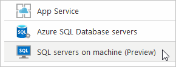
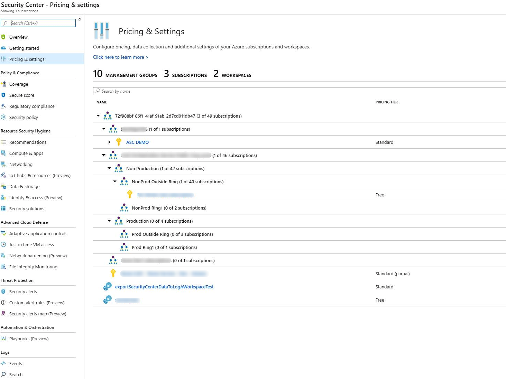
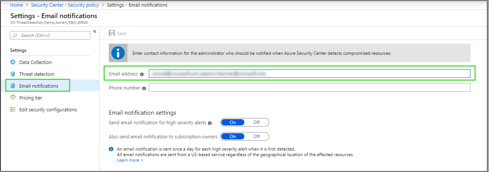
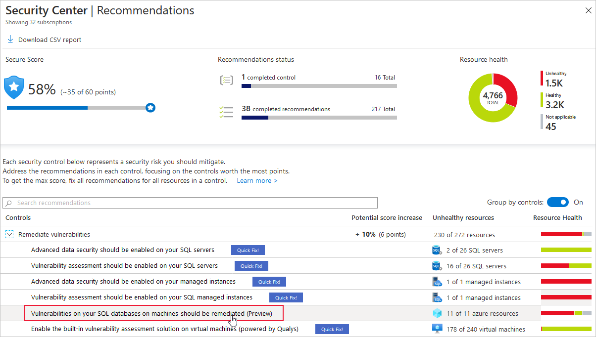
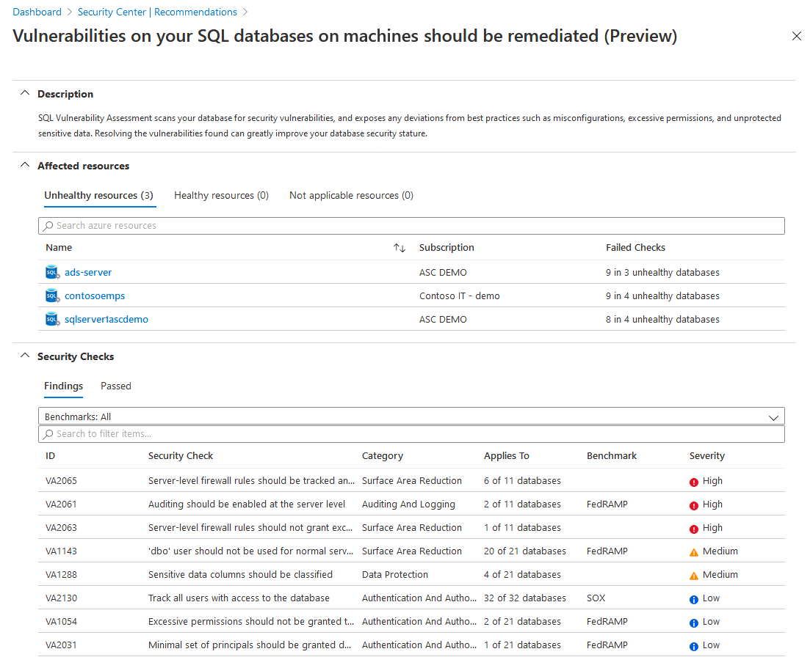
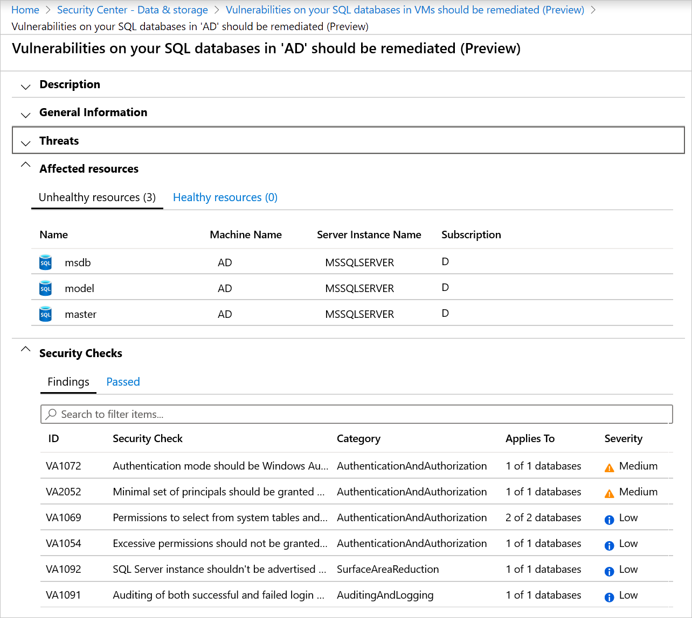
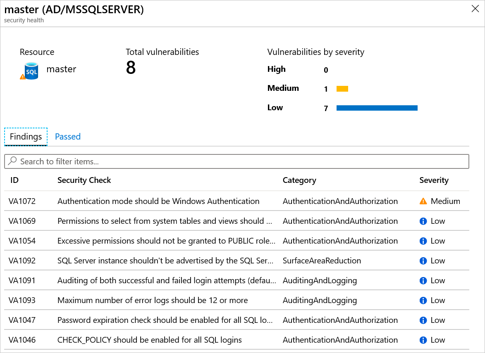

# Advanced data security for SQL servers on Azure Virtual Machines (Preview)
Advanced data security for SQL Servers on Azure Virtual Machines is a unified package for advanced SQL security capabilities. This preview feature includes functionality for identifying and mitigating potential database vulnerabilities and detecting anomalous activities that could indicate threats to your database. 

This security offering for Azure VMs SQL servers is based on the same fundamental technology used in the [Azure SQL Database Advanced Data Security package](https://docs.microsoft.com/azure/sql-database/sql-database-advanced-data-security).

## Overview

Advanced data security provides a set of advanced SQL security capabilities,  consisting of Vulnerability assessment and Advanced Threat Protection.

* [Vulnerability assessment](https://docs.microsoft.com/azure/sql-database/sql-vulnerability-assessment) is an easy to configure service that can discover, track, and help you remediate potential database vulnerabilities. It provides visibility into your security state, and includes the steps to resolve security issues and enhance your database fortifications.
* [Advanced Threat Protection](https://docs.microsoft.com/azure/sql-database/sql-database-threat-detection-overview) detects anomalous activities indicating unusual and potentially harmful attempts to access or exploit your SQL server. It continuously monitors your database for suspicious activities and provides action-oriented security alerts on anomalous database access patterns. These alerts provide the suspicious activity details and recommended actions to investigate and mitigate the threat.

## Get started with Advanced data security for SQL on Azure VMs

The following steps get you started with Advanced Data Security for SQL on Azure VMs Public Preview.

### Set up advanced data security for SQL on Azure VMs

Enable Advanced Data Security for SQL Servers on Virtual Machines at the subscription/workspace level:
 
1. From Security Center's sidebar, open the **Pricing & settings** page.

1. Select the subscription or workspace for which you want to enable Advanced Data Security for SQL on Azure VMs.

1. Toggle the option for **SQL servers on VM (Preview)** to enabled. 

    (Click the screenshot to expand)

    

    Advanced Data Security for SQL Servers will be enabled on all SQL Servers connected to the selected workspace or the default workspace of the selected subscription.

    >[!NOTE]
    > The solution will be fully active after the first restart of the SQL Server. 

To create a new workspace, follow the instructions in [Create a Log Analytics workspace](https://docs.microsoft.com/azure/azure-monitor/learn/quick-create-workspace).

To connect the SQL Server’s host to a workspace, follow the instructions in [Connect Windows computers to Azure Monitor](https://docs.microsoft.com/azure/azure-monitor/platform/agent-windows).

## Set up email notification for security alerts 

You can set a list of recipients to receive an email notification when Security Center alerts are generated. The email contains a direct link to the alert in Azure Security Center with all the relevant details. 

1. Go to **Security Center** > **Pricing & settings** and click on the relevant subscription

    

1. From the Settings menu, click **Email notifications**. 
1. In the **Email address** text box, enter the email addresses to receive the notifications. You can enter more than one email address by separating the email addresses with a comma (,).  For example   admin1@mycompany.com,admin2@mycompany.com,admin3@mycompany.com

    

1. In the **Email notification** settings, set the following options:
  
    * **Send email notification for high severity alerts**: Instead of sending emails for all alerts, send only for high severity alerts.
    * **Also send email notifications to subscription owners**:  Send notifications to the subscriptions owners too.

1. In the top of the **Email notifications** screen, click **Save**.

  > [!NOTE]
  > Be sure to click **Save** before closing the window, or the new **Email notification** settings will not be saved.

## Explore vulnerability assessment reports

The Vulnerability assessment dashboard provides an overview of your assessment results across all your databases. You can view the distribution of databases according to SQL Server version, along with a summary of failing versus passing databases and an overall summary of failing checks according to risk distribution.

You can view the vulnerability assessment results directly from Security Center.

1. From Security Center's sidebar, under RESOURCE SECURITY HYGIENE, select **Data & Storage**.

1. Select the recommendation **Vulnerabilities on your SQL databases in VMs should be remediated (Preview)**. For more information, see [Security Center Recommendations](security-center-recommendations.md). 

    

    The detailed view for this recommendation appears.

    

1. To drill down for more details:

    * For an overview of scanned resources (databases) and the list of security checks that were tested, click the server of interest.
    

    * For an overview of the vulnerabilities grouped by a specific SQL database, click the database of interest.
    

    In each view, the security checks are sorted by **Severity**. Click a specific security check to see a details pane with a **Description**, how to **Remediate** it, and other related information such as **Impact** or **Benchmark**.

## Advanced threat protection for SQL servers on Azure VMs alerts
Alerts are generated by unusual and potentially harmful attempts to access or exploit SQL Servers. These events can trigger the following alerts:

### Anomalous access pattern alerts (Preview)

* **Access from unusual location:** This alert is triggered when there is a change in the access pattern to SQL server, where someone has logged on to the SQL server from an unusual geographical location. Potential causes:
    * An attacker or former malicious employ has accessed your SQL Server.
    * A legitimate user has accessed your SQL Server from a new location.
* **Access from a potentially harmful application**: This alert is triggered when a potentially harmful application is used to access the database. Potential causes:
    * An attacker trying to breach your SQL using common attack tools.
    * A legitimate penetration testing in action.
* **Access from unfamiliar principal**: This alert is triggered when there is a change in the access pattern to SQL server, where someone has logged on to the SQL server using an unusual principal (SQL user). Potential causes:
    * An attacker or former malicious employ has accessed your SQL Server. 
    * A legitimate user has accessed your SQL Server from with a new principal.
* **Brute force SQL credentials**: This alert is triggered when there is an abnormal high number of failed logins with different credentials. Potential causes:
    * An attacker trying to breach your SQL using brute force.
    * A legitimate penetration testing in action.

### Potential SQL injection attacks (Supported in SQL Server 2019)

* **Vulnerability to SQL injection**: This alert is triggered when an application generates a faulty SQL statement in the database. This alert may indicate a possible vulnerability to SQL injection attacks. Potential causes:
    * A defect in application code that constructs the faulty SQL statement
    * Application code or stored procedures don't sanitize user input when constructing the faulty SQL statement, which may be exploited for SQL Injection
* **Potential SQL injection**: This alert is triggered when an active exploit happens against an identified application vulnerability to SQL injection. This means the attacker is trying to inject malicious SQL statements using the vulnerable application code or stored procedures.

### Unsafe command (Supported in SQL Server 2019)

* **Potentially Unsafe Action**: This alert is triggered when a highly privileged and potentially unsafe command is executed. Potential causes:
    * Command which recommended to be disabled for better security posture is enabled.
    * An attacker trying to exploit SQL access or escalate privileges.   

## Explore and investigate security alerts

Your data security alerts are available in Security Center's alerts page, the resource's security tab, or through the direct link in the alert emails.

1. To view alerts:

    * In Security Center - Click **Security alerts** from the sidebar and select an alert.
    * In the resource scope - Open the relevant resource page, and from the sidebar click **Security**. 

1. Alerts are designed to be self-contained, with detailed remediation steps and investigation information in each one. You can investigate further by using other Azure Security Center and Azure Sentinel capabilities for a broader view:

    * Enable SQL Server's auditing feature for further investigations. If you're an Azure Sentinel user, you can upload the SQL auditing logs from the Windows Security Log events to Sentinel and enjoy a rich investigation experience.
    * To improve your security posture, use Security Center's recommendations for the host machine indicated in each alert. This will reduce the risks of future attacks. 

## Next steps

For related material, see the following article:

- [How to remediate recommendations](security-center-remediate-recommendations.md)