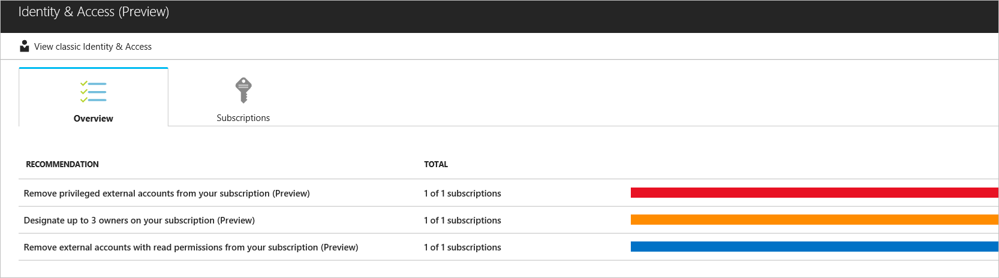
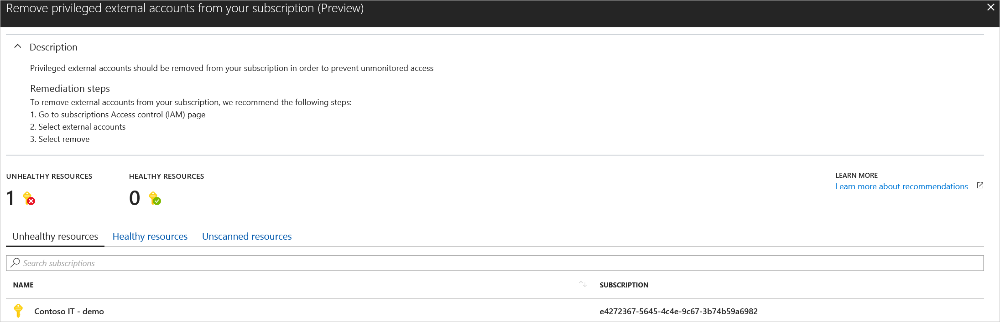
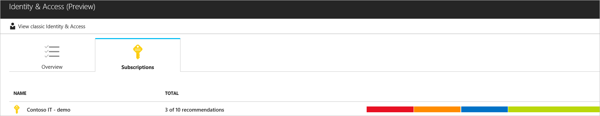
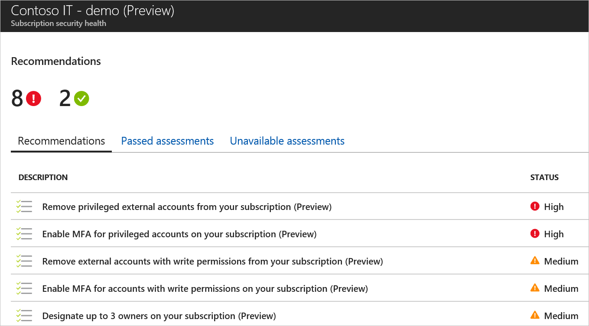
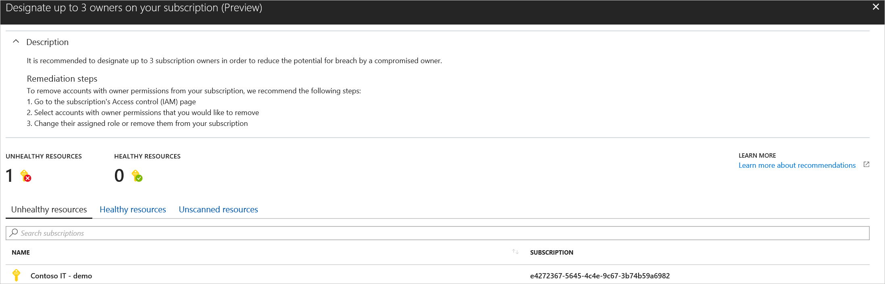
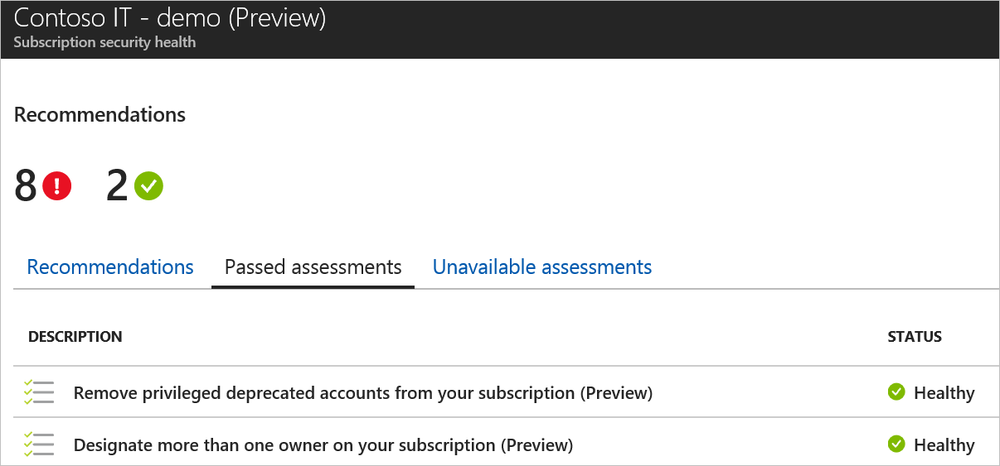
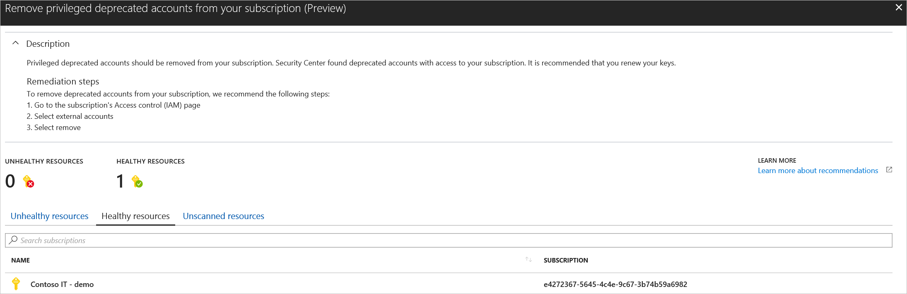

# Monitor identity and access (preview)
When Security Center identifies potential security vulnerabilities, it creates recommendations that guide you through the process of configuring the needed controls to harden and protect your resources.

This article explains the **Identity and Access** page of the resource security section of Azure Security Center.

For a full list of the recommendations you might see on this page, see [Identity and Access recommendations](recommendations-reference.md#recs-identity).

> [!NOTE]
> Monitoring identity and access is in preview and available only on the Standard tier of Security Center. See [Pricing](security-center-pricing.md) to learn more about Security Center's pricing tiers.
>

Identity should be the control plane for your enterprise, and protecting identities should be your top priority. The security perimeter has evolved from a network perimeter to an identity perimeter. Security becomes less about defending your network and more about defending your data, as well as managing the security of your apps and users. Nowadays, with more data and more apps moving to the cloud, identity becomes the new perimeter.

By monitoring identity activities, you can take proactive actions before an incident takes place or reactive actions to stop an attack attempt. The Identity & Access dashboard provides you with recommendations such as:

- Enable MFA for privileged accounts on your subscription
- Remove external accounts with write permissions from your subscription
- Remove privileged external accounts from your subscription

> [!NOTE]
> If your subscription has more than 600 accounts, Security Center is unable to run the Identity recommendations against your subscription. Recommendations that are not run are listed under “unavailable assessments” below.
Security Center is unable to run the Identity recommendations against a Cloud Solution Provider (CSP) partner's admin agents.
>

## Monitor identity and access

Open the list of identified Identity and Access issues by selecting **Identity & access** from the Security Center sidebar (under **Resources**), or from the overview page. 

Under **Identity & Access**, there are two tabs:

- **Overview**: recommendations identified by Security Center.
- **Subscriptions**: list of your subscriptions and current security state of each.

### Overview section
Under **Overview**, there is a list of recommendations. The first column lists the recommendation. The second column shows the total number of subscriptions that are affected by that recommendation. The third column shows the severity of the issue.

1. Select a recommendation. The recommendations window opens and displays:

   - Description of the recommendation
   - List of unhealthy and healthy subscriptions
   - List of resources that are unscanned due to a failed assessment or the resource is under a subscription running on the Free tier and is not assessed

    

1. Select a subscription in the list for additional detail.

### Subscriptions section
Under **Subscriptions**, there is a list of subscriptions. The first column lists the subscriptions. The second column shows the total number of recommendations for each subscription. The third column shows the severities of the issues.

1. Select a subscription. A summary view opens with three tabs:

   - **Recommendations**:  based on assessments performed by Security Center that failed.
   - **Passed assessments**: list of assessments performed by Security Center that passed.
   - **Unavailable assessments**: list of assessments that failed to run due to an error or because the subscription has more than 600 accounts.

   Under **Recommendations** is a list of the recommendations for the selected subscription and severity of each recommendation.

   

1. Select a recommendation for a description of the recommendation, a list of unhealthy and healthy subscriptions, and a list of unscanned resources.

   

   Under **Passed assessments** is a list of passed assessments.  Severity of these assessments is always green.

   

1. Select a passed assessment from the list for a description of the assessment and a list of healthy subscriptions. There is a tab for unhealthy subscriptions that lists all the subscriptions that failed.

   

> [!NOTE]
> If you created a Conditional Access policy that necessitates MFA but has exclusions set, the Security Center MFA recommendation assessment considers the policy non-compliant, because it enables some users to sign in to Azure without MFA.

## Next steps
To learn more about recommendations that apply to other Azure resource types, see the following articles:

- [Protecting your machines and applications in Azure Security Center](security-center-virtual-machine-protection.md)
- [Protecting your network in Azure Security Center](security-center-network-recommendations.md)
- [Protecting your Azure SQL service and data in Azure Security Center](security-center-sql-service-recommendations.md)