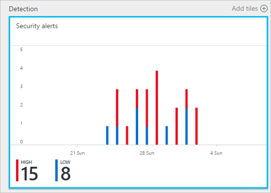
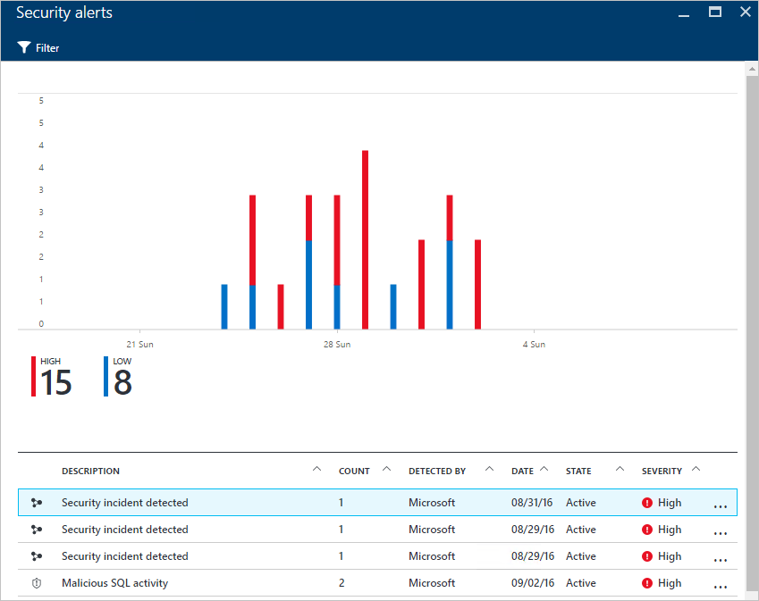
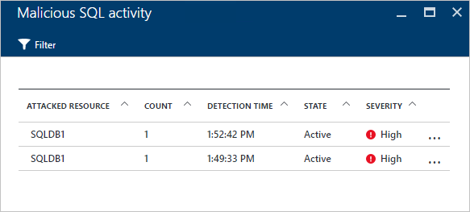
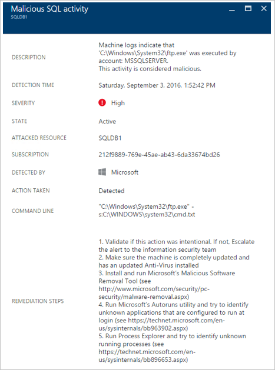

# Using Azure Security Center for an incident response
Many organizations learn how to respond to security incidents only after suffering an attack. To reduce costs and damage, it’s important to have an incident response plan in place before an attack takes place. You can use Azure Security Center in different stages of an incident response.

## Incident response planning
An effective plan depends on three core capabilities: being able to protect, detect, and respond to threats. Protection is about preventing incidents, detection is about identifying threats early, and response is about evicting the attacker and restoring systems to mitigate the impacts of a breach.

This article will use the security incident response stages from the [Microsoft Azure Security Response in the Cloud](https://gallery.technet.microsoft.com/Azure-Security-Response-in-dd18c678) article, as shown in the following diagram:

You can use Security Center during the Detect, Assess, and Diagnose stages. Here are examples of how Security Center can be useful during the three initial incident response stages:

* **Detect**: review the first indication of an event investigation.
  * Example: review the initial verification that a high-priority security alert was raised in the Security Center dashboard.
* **Assess**: perform the initial assessment to obtain more information about the suspicious activity.
  * Example: obtain more information about the security alert.
* **Diagnose**: conduct a technical investigation and identify containment, mitigation, and workaround strategies.
  * Example: follow the remediation steps described by Security Center in that particular security alert.

The scenario that follows shows you how to leverage Security Center during the Detect, Assess, and Diagnose/Respond stages of a security incident. In Security Center, a [security incident](security-center-incident.md) is an aggregation of all alerts for a resource that align with [kill chain](https://blogs.technet.microsoft.com/office365security/addressing-your-cxos-top-five-cloud-security-concerns/) patterns. Incidents appear in the [Security alerts](security-center-managing-and-responding-alerts.md) tile and blade. An incident reveals the list of related alerts, which enables you to obtain more information about each occurrence. Security Center also presents standalone security alerts that can also be used to track down a suspicious activity.

## Scenario
Contoso recently migrated some of their on-premises resources to Azure, including some virtual machine-based line-of-business workloads and SQL databases. Currently, Contoso's Core Computer Security Incident Response Team (CSIRT) has a problem investigating security issues because of security intelligence not being integrated with their current incident response tools. This lack of integration introduces a problem during the Detect stage (too many false positives), as well as during the Assess and Diagnose stages. As part of this migration, they decided to opt in for Security Center to help them address this problem.

The first phase of this migration finished after they onboarded all resources and addressed all of the security recommendations from Security Center. Contoso CSIRT is the focal point for dealing with computer security incidents. The team consists of a group of people with responsibilities for dealing with any security incident. The team members have clearly defined duties to ensure that no area of response is left uncovered.

For the purpose of this scenario, we're going to focus on the roles of the following personas that are part of Contoso CSIRT:

Judy is in security operations. Her responsibilities include:

* Monitoring and responding to security threats around the clock.
* Escalating to the cloud workload owner or security analyst as needed.

Sam is a security analyst and his responsibilities include:

* Investigating attacks.
* Remediating alerts.
* Working with workload owners to determine and apply mitigations.

As you can see, Judy and Sam have different responsibilities, and they must work together to share Security Center information.

## Recommended solution
Since Judy and Sam have different roles, they'll be using different areas of Security Center to obtain relevant information for their daily activities. Judy will use **Security alerts** as part of her daily monitoring.

Judy will use Security alerts during the Detect and Assess stages. After Judy finishes the initial assessment, she might escalate the issue to Sam if additional investigation is required. At this point, Sam will use the information that was provided by Security Center, sometimes in conjunction with other data sources, to move to the Diagnose stage.

## How to implement this solution
To see how you would use Azure Security Center in an incident response scenario, we’ll follow Judy’s steps in the Detect and Assess stages, and then see what Sam does to diagnose the issue.

### Detect and Assess incident response stages
Judy signed in to the Azure portal and is working in the Security Center console. As part of her daily monitoring activities, she started reviewing high-priority security alerts by performing the following steps:

1. Click the **Security alerts** tile and access the **Security alerts** blade.
    

   > [!NOTE]
   > For the purpose of this scenario, Judy is going to perform an assessment on the Malicious SQL activity alert, as seen in the preceding figure.
   >
   >
2. Click the **Malicious SQL activity** alert and review the attacked resources in the **Malicious SQL activity** blade:
    

    In this blade, Judy can take notes regarding the attacked resources, how many times this attack happened, and when it was detected.
3. Click the **attacked resource** to obtain more information about this attack.

After reading the description, Judy is convinced that this is not a false positive and that she should escalate this case to Sam.

### Diagnose incident response stage
Sam receives the case from Judy and starts reviewing the remediation steps that Security Center suggested.

### Additional resources
For companies that use their security information and event management (SIEM) solution during the investigation process, they can also [integrate Security Center with their solution](security-center-integrating-alerts-with-log-integration.md). You can also integrate Azure audit logs and virtual machine (VM) security events by using the [Azure log integration tool](https://azure.microsoft.com/blog/introducing-hdinsight-integration-with-azure-log-analytics/). To investigate an attack, you can use this information in conjunction with the information that Security Center provides. You can also use the [investigation](https://docs.microsoft.com/azure/security-center/security-center-investigation) feature in Security Center, to help you determine the root cause of an incident.

## Conclusion
Assembling a team before an incident occurs is very important to your organization and will positively influence how incidents are handled. Having the right tools to monitor resources can help this team to take accurate steps to remediate a security incident. Security Center [detection capabilities](security-center-detection-capabilities.md) can assist IT to quickly respond to security incidents and remediate security issues.
