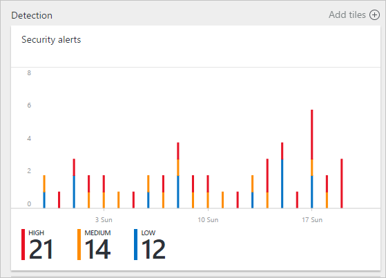
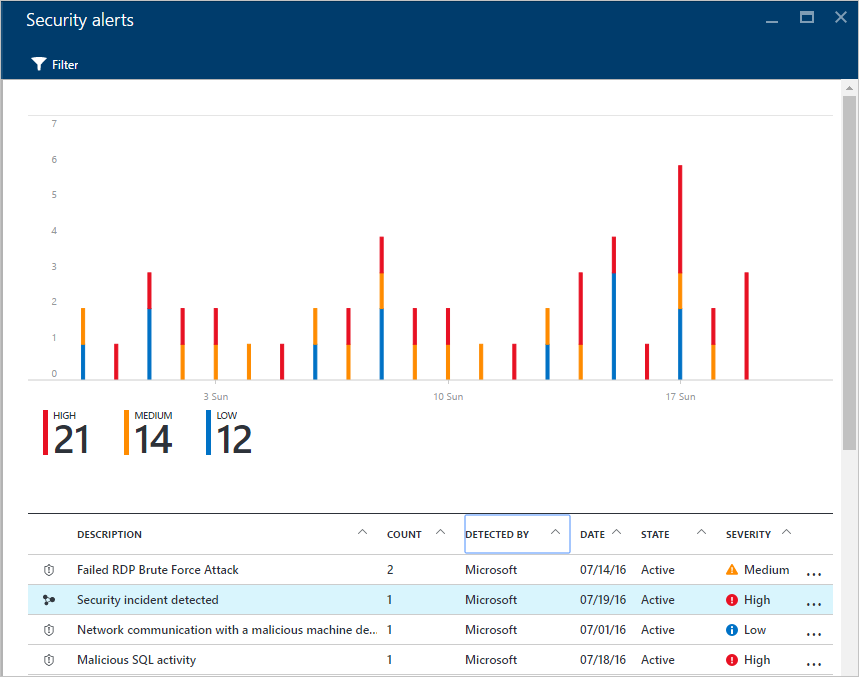
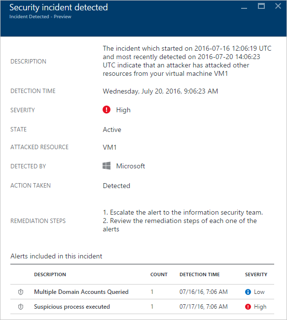
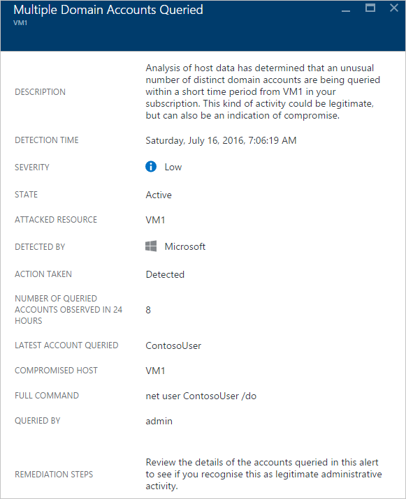

<properties
   pageTitle="Handling Security Incident in Azure Security Center | Microsoft Azure"
   description="This document helps you to use Azure Security Center capabilities to handle security incidents."
   services="security-center"
   documentationCenter="na"
   authors="YuriDio"
   manager="swadhwa"
   editor=""/>

<tags
   ms.service="security-center"
   ms.topic="hero-article"
   ms.devlang="na"
   ms.tgt_pltfrm="na"
   ms.workload="na"
   ms.date="07/20/2016"
   ms.author="yurid"/>

# Handling Security Incident in Azure Security Center 
Triaging and investigating security alerts can be time consuming for even the most skilled security analysts, and for many it is hard to even know where to begin. By using [analytics](security-center-detection-capabilities.md) to connect the information between distinct [security alerts](security-center-managing-and-responding-alerts.md), Security Center can provide you with a single view of an attack campaign and all of the related alerts – you can quickly understand what actions the attacker took and what resources were impacted.

This document discusses how to use security alert capability in Security Center to assist you handling security incidents.

## What is a security incident?

In Security Center, a security incident it is an aggregation of all alerts for a resource that align with [kill chain](https://blogs.technet.microsoft.com/office365security/addressing-your-cxos-top-five-cloud-security-concerns/) patterns. Incidents appear in the [Security Alerts](security-center-managing-and-responding-alerts.md) tile and blade. An Incident will reveal the list of related alerts, which enables you to obtain more information about each occurrence.

## Managing security incidents

You can review your current security incidents by looking at the Security alerts tile. Access the Azure Portal and follow the steps below to see more details about each security incident:

1. On the Security Center dashboard, you will see the **Security alerts** tile.

    

2.  Click on this tile to expand it and if a security incident is detected, it will appear under the security alerts graph as shown in this image.

    

3.	Notice that the security incident description has a different icon compared to other alerts. Click on it to view more details about this incident.

	

4. 	On the **Security incident detected** blade you will see more details about this security incident, which includes the full description of the incident, the severity (which in this case is high), the current state of the incident (in this case it is still *active*) the attacked resource (in this case *VM1*), the remediation steps and in the bottom you have the alerts that were included in this incident. If you want to obtain more information on each alert, just click on it and another blade will open, as shown below.

	

The information on this blade will vary according to the alert. Read [Managing and responding to security alerts in Azure Security Center](security-center-managing-and-responding-alerts.md) for more information on how to manage these alerts. Some important considerations regarding this capability:

- A new filter enables you to customize your view to Incident only, Alerts only, or both. 
- The same alert can exist as part of an Incident (if applicable), as well as to be visible as a standalone alert. 
- Dismissing an incident will not dismiss the related alerts.

## See also

In this document, you learned how to use the security incident capability in Security Center. To learn more about Security Center, see the following:

- [Azure Security Center Planning and Operations Guide](security-center-planning-and-operations-guide.md)
- [Managing and responding to security alerts in Azure Security Center](security-center-managing-and-responding-alerts.md)
- [Security health monitoring in Azure Security Center](security-center-monitoring.md)--Learn how to monitor the health of your Azure resources.
- [Monitoring partner solutions with Azure Security Center](security-center-partner-solutions.md) -- Learn how to monitor the health status of your partner solutions.
- [Azure Security Center FAQ](security-center-faq.md)--Find frequently asked questions about using the service.
- [Azure Security blog](http://blogs.msdn.com/b/azuresecurity/)--Find blog posts about Azure security and compliance.
