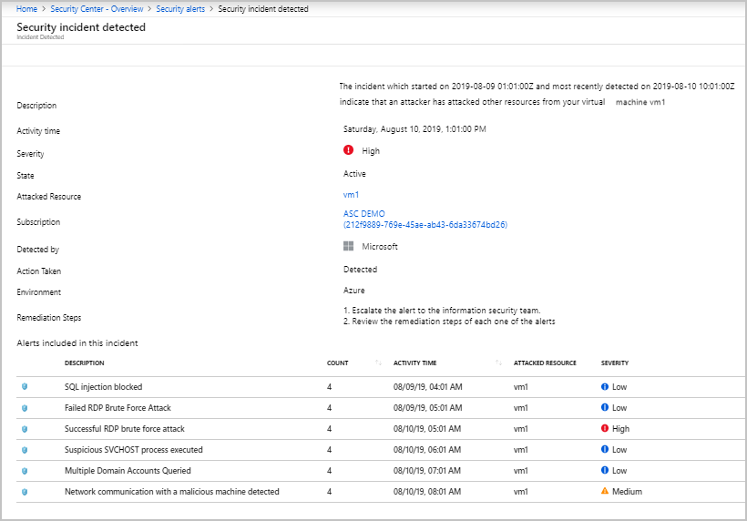
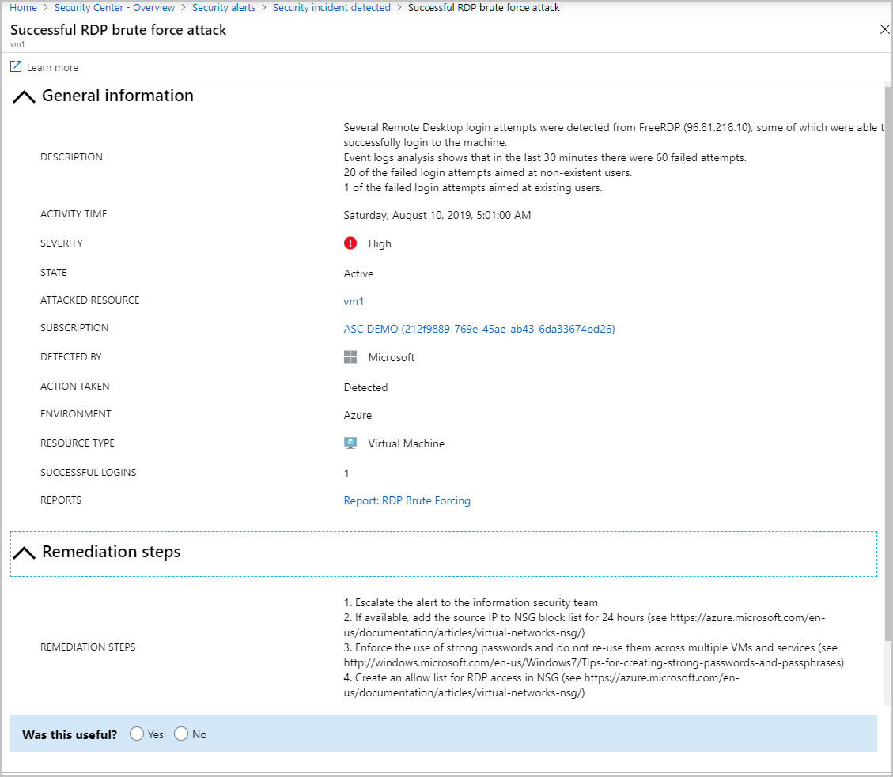

# Manage security incidents in Azure Security Center

Triage and investigating security alerts can be time consuming for even the most skilled security analysts, and for many it is hard to even know where to begin. By using [analytics](security-center-detection-capabilities.md) to connect the information between distinct [security alerts](security-center-managing-and-responding-alerts.md), Security Center can provide you with a single view of an attack campaign and all of the related alerts – you can quickly understand what actions the attacker took and what resources were impacted.

This topic explains about incidents in Security Center, and how to use remediate their alerts.

## What is a security incident?

In Security Center, a security incident is an aggregation of all alerts for a resource that align with [kill chain](alerts-reference.md#intentions) patterns. Incidents appear in the [Security Alerts](security-center-managing-and-responding-alerts.md) list. Click on an incident to view the related alerts, which enables you to obtain more information about each occurrence.

## Managing security incidents

1. On the Security Center dashboard, click the **Security alerts** tile. The incidents and alerts are listed. Notice that the security incident description has a different icon compared to other alerts.

    

1. To view details, click on an incident. The **Security incident detected** blade displays further details. The **General Information** section can offer an insight into what triggered the security alert. It displays information such as the target resource, source IP address (when applicable), if the alert is still active, and recommendations about how to remediate.  

    

1. To obtain more information on each alert, click on an alert. The remediation suggested by Security Center vary according to the security alert.

   > [!NOTE]
   > The same alert can exist as part of an incident, as well as to be visible as a standalone alert.

    

1. Follow the remediation steps given for each alert.

## See also
In this document, you learned how to use the security incident capability in Security Center. For related information, see the following:

* [Threat protection in Azure Security Center](threat-protection.md)
* [Security alerts in Azure Security Center](security-center-alerts-overview.md)
* [Manage security alerts](security-center-managing-and-responding-alerts.md)