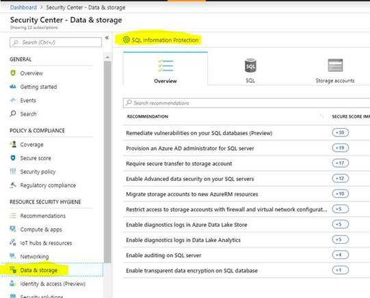
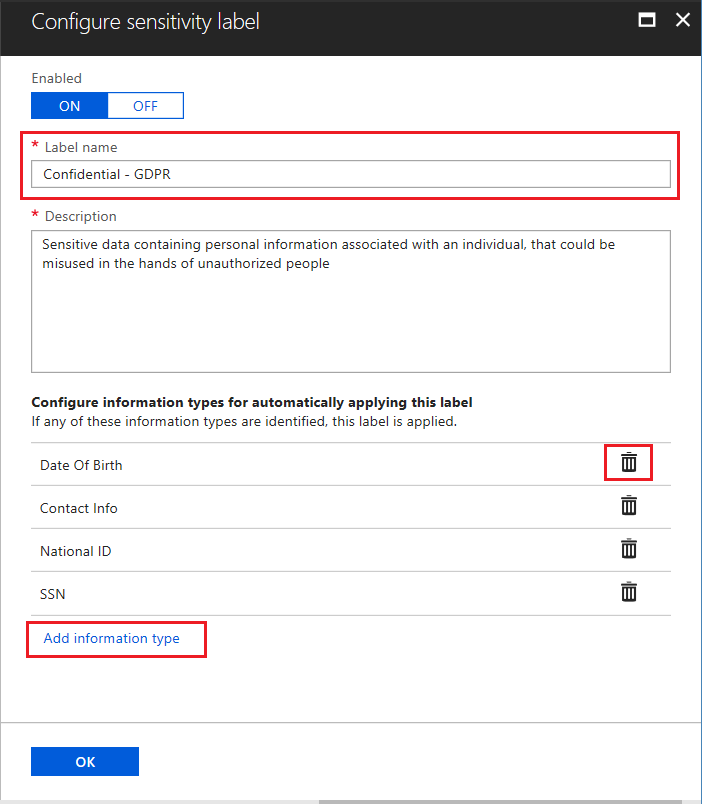
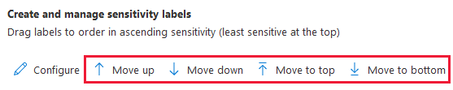
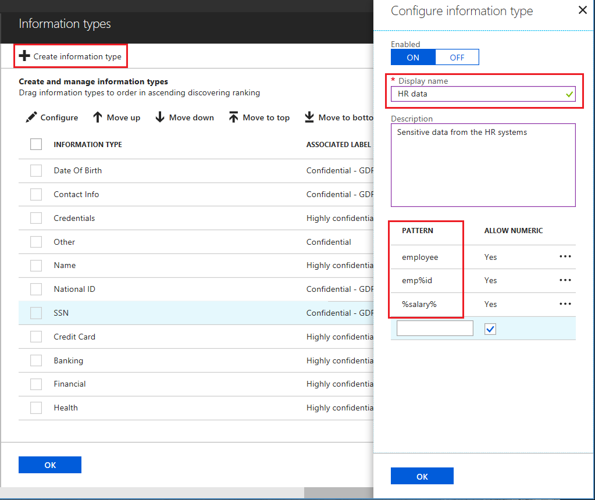

# Customize the SQL information protection policy in Azure Security Center (Preview)
 
You can define and customize an SQL information protection policy for your entire Azure tenant, in Azure Security Center.

Information protection is an advanced security capability for discovering, classifying, labeling, and reporting sensitive data in your Azure data resources. Discovering and classifying your most sensitive data (business, financial, healthcare, personal data, etc.) can play a pivotal role in your organizational information protection stature. It can serve as infrastructure for:
- Helping meet data privacy standards and regulatory compliance requirements
- Security scenarios such as monitoring (auditing) and alerting on anomalous access to sensitive data
- Controlling access to and hardening the security of data stores containing highly sensitive data
 
[SQL Information Protection](../azure-sql/database/data-discovery-and-classification-overview.md) implements this paradigm for your SQL data stores, currently supported for Azure SQL Database. SQL Information Protection automatically discovers and classifies potentially sensitive data, provides a labeling mechanism for persistently tagging the sensitive data with classification attributes, and provides a detailed dashboard showing the classification state of the database. In addition, it calculates the result set sensitivity of SQL queries, so that queries that extract sensitive data can be explicitly audited, and the data can be protected. For more information on SQL Information Protection, see [Azure SQL Database Data Discovery and Classification](../azure-sql/database/data-discovery-and-classification-overview.md).
 
The classification mechanism is based on two primary constructs that make up the classification taxonomy - **Labels** and **Information Types**.
- **Labels** – The main classification attributes, used to define the sensitivity level of the data stored in the column. 
- **Information Types** – Provides additional granularity into the type of data stored in the column.
 
Information Protection comes with a built-in set of labels and information types, which are used by default. To customize these labels and types, you can customize the information protection policy in Security Center.
 
## Customize the information protection policy
To customize the information protection policy for your Azure tenant, you need to have [administrative privileges on the tenant's root management group](security-center-management-groups.md). 
 
1. In the Security Center main menu, under **RESOURCE SECURITY HYGIENE** go to **Data & storage** and click on the **SQL Information Protection** button.

    
 
2. In the **SQL Information Protection** page, you can view your current set of labels. These are the main classification attributes that are used to categorize the sensitivity level of your data. From here, you can configure the **Information protection labels** and **Information types** for the tenant. 
 
### Customizing labels
 
1. You can edit or delete any existing label, or add a new label. To edit an existing label, select that label and then click **Configure**, either at the top or from the context menu on the right. To add a new label, click **Create label** in the top menu bar or at the bottom of the labels table.
2. In the **Configure sensitivity label** screen, you can create or alter the label name and the description. You can also set whether the label is active or disabled by toggling the **Enabled** switch on or off. Finally, you can add or remove information types associated with the label. Any data discovered that matches that information type will automatically include the associated sensitivity label in the classification recommendations.
3. Click **OK**.
 
   
 
4. Labels are listed in order of ascending sensitivity. To change the ranking between labels, drag the labels to reorder them in the table, or use the **Move up** and **Move down** buttons to change the order. 
 
    
 
5. Be sure to click **Save** at the top of the screen when you are finished.
 
 
## Adding and customizing information types
 
1. You can manage and customize information types by clicking on **Manage information types**.
2. To add a new **Information type**, select **Create information type** in the top menu. You can configure a name, description, and search pattern strings for the **Information type**. Search pattern strings can optionally use keywords with wildcard characters (using the character '%'), which the automated discovery engine uses to identify sensitive data in your databases, based on the columns' metadata.
 
    
 
3. You can also configure the built-in **Information types** by adding additional search pattern strings, disabling some of the existing strings, or by changing the description. You cannot delete built-in **Information types** or edit their names. 
4. **Information types** are listed in order of ascending discovery ranking, meaning that the types higher in the list will attempt to match first. To change the ranking between information types, drag the types to the right spot in the table, or use the **Move up** and **Move down** buttons to change the order. 
5. Click **OK** when you are done.
6. After you completed managing your information types, be sure to associate the relevant types with the relevant labels, by clicking **Configure** for a particular label, and adding or deleting information types as appropriate.
7. Be sure to click **Save** in the main **Labels** blade to apply all your changes.
 
After your Information protection policy is fully defined and saved, it will apply to the classification of data on all Azure SQL databases in your tenant.

## Manage SQL information protection using Azure PowerShell

- [Get-AzSqlInformationProtectionPolicy](https://docs.microsoft.com/powershell/module/az.security/get-azsqlinformationprotectionpolicy): Retrieves the effective tenant SQL information protection policy.
- [Set-AzSqlInformationProtectionPolicy](https://docs.microsoft.com/powershell/module/az.security/set-azsqlinformationprotectionpolicy): Sets the effective tenant SQL information protection policy.
 
## Next steps
 
In this article, you learned about defining a SQL Information Protection policy in Azure Security Center. To learn more about using SQL Information Protection to classify and protect sensitive data in your SQL databases, see [Azure SQL Database Data Discovery and Classification](../azure-sql/database/data-discovery-and-classification-overview.md). 

For more information on security policies and data security in Azure Security Center, see the following articles:
 
- [Setting security policies in Azure Security Center](tutorial-security-policy.md): Learn how to configure security policies for your Azure subscriptions and resource groups
- [Azure Security Center data security](security-center-data-security.md): Learn how Security Center manages and safeguards data
