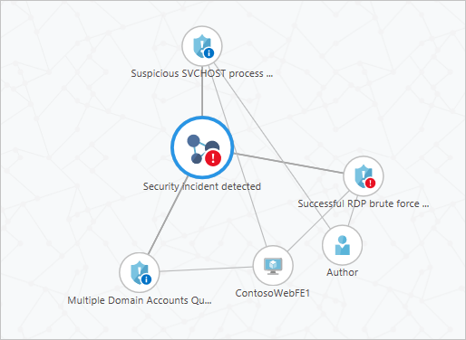
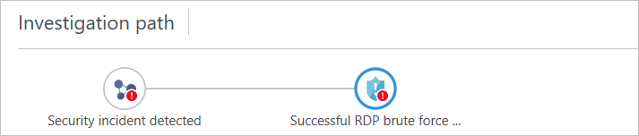
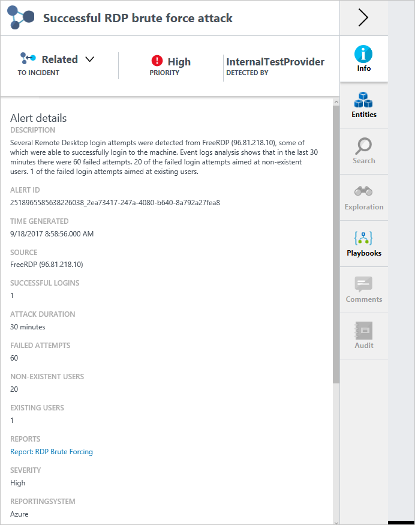
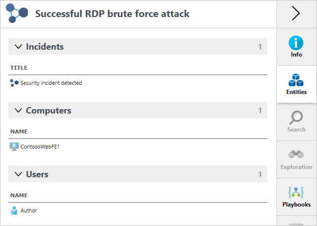
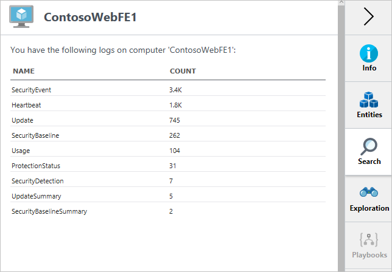
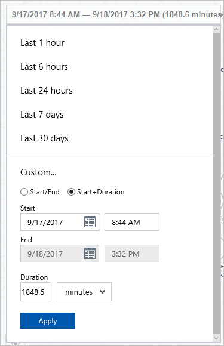
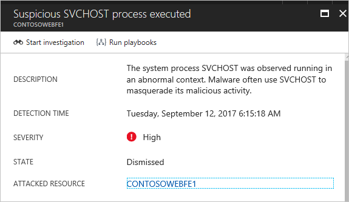
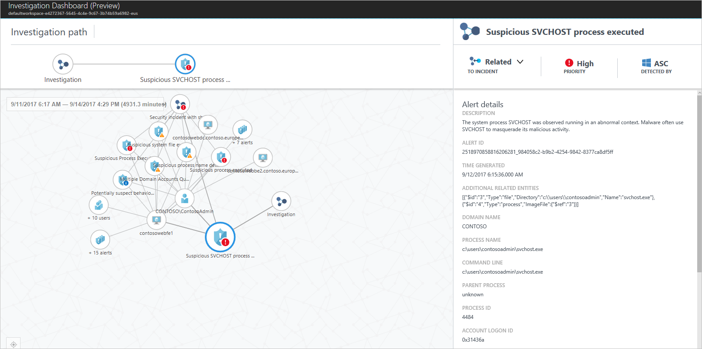

# Investigate Incidents and Alerts in Azure Security Center (Preview)
This document helps you use the investigation feature in Azure Security Center to investigate security incidents and alerts.

## What is investigation in Security Center?
The Investigation feature in Security Center allows you to triage, understand the scope, and track down the root cause of a potential [security incident](https://docs.microsoft.com/azure/security-center/security-center-incident).

The intent is to facilitate the investigation process by linking all entities ([security alerts](https://docs.microsoft.com/azure/security-center/security-center-alerts-type), users, computers and incidents) that are involved with the incident you are investigating.  Security Center can do this by correlating relevant data with any involved entities and exposing this correlation in using a live graph that helps you navigate through the objects and visualize relevant information.

> [!NOTE]
> [Custom alerts](security-center-custom-alert.md) are not supported in Security Center's investigation feature.
>
>

## How Investigation works?
The Investigation is composed by a graph that occupies the central area of the investigation dashboard. The graph is always focused on a specific entity, and presents the entities that are related to it. An entity could be a security alert, user, computer or incident.

The user can navigate from one entity to another by clicking on it in the graph. The graph automatically centralizes on the selected entity and its related entities. Entities that are not relevant anymore may be removed from the graph.

### Investigation path
While the user is navigating to different entities the investigation path helps to keep track of the investigation context and allows quick navigation. The incident that contains the investigation results is always in the left-most incident in the investigation path.

### General information
When an entity is presented in the graph, the tabs show additional information on this entity. The **Info** tab presents general information on the entity from various available information sources.

The info tab shows information relevant to the incident selected in the map. Incident is a container that includes the results of an investigation. Every investigation happens in the context of an incident.

An incident is only created when a user clicks on the **Start investigation** button for a specific alert. The basic capability available for the investigator is to mark entities such as user, computer or alert. When an entity is marked as related, a reason is provided. From this point onward, this entity appears directly under the incident in the graph and in the incident entities list.

### Entities

The **Entities** tab shows all the related entities grouped by type. It is useful in two cases: when there are too many entities to present in the graph and when the entities names are too long, and it is easier to examine them in a tabular way.

### Search

The **Search** tab presents all the log types that are available for the entity. For each log type, you can see how many records are available. Clicking on each log type takes you to the search screen. In the search screen, you can refine your search and use the various search features such as setting alerts. In the current release, the search tab is available only for users and computers entities.

### Exploration

The **Exploration** tab allows the investigator to examine data related to various issues related to the entity. For example, when a machine is investigated, the list of processes executed on it is presented in the exploration tab. In some cases, the exploration tab presents data that might indicate a suspicious issue. The investigator can examine the data within the tab or open it in the search screen to examine large sets of data and to use advanced search options such as filtering and export to Excel.

### Timeline

Most of the data that is presented in the graph and the various tabs is relevant for a specific time period. This time scope is set using the time scope selector on the top left side of the graph. The investigator has various methods to select the time scope.

The following items are sensitive to the time scope:

- User-computer relationship in the graph, only users that logged in to the computer within this time scope are presented.
- Which alerts are presented when you examine computers and users: only alerts that occur within the time scope are presented.
- The entities tab follow the same logic as the graph.

The following items are going to be presented regardless of the selected time scope:

- When an alert is presented, all the entities that are contained in it, such as users and computers, are always presented.
- If an incident contains an entity, it is going to be presented.

> [!NOTE]
> The **Search** and **Exploration** tab only show records within this time scope.

## How to perform an investigation?

You can start your investigation from a security incident, or from an alert, the option that you choose will vary according to your needs. The steps that follows are used to start a investigation from an alert:

1.	Open **Security Center** dashboard.
2.	Click on **Security Alerts**, and select the incident that you want to investigate.
3.	In the incident’s page, click on the **Start Investigation** button, and the **Investigation** dashboard appears.

	

4. From this dashboard you can select the entity in the map, and the relevant information about this entity appears on the right side of the screen.

	

From this point you can explore the entities that were involved in this incident, and explore more details about each one of them.

## See also
In this document, you learned how to use the investigation feature in Security Center. To learn more about Security Center, see the following:

* [Managing and responding to security alerts in Azure Security Center](https://docs.microsoft.com/azure/security-center/security-center-managing-and-responding-alerts). Learn how to manage alerts, and respond to security incidents in Security Center.
* [Security health monitoring in Azure Security Center](security-center-monitoring.md). Learn how to monitor the health of your Azure resources.
* [Understanding security alerts in Azure Security Center](https://docs.microsoft.com/azure/security-center/security-center-alerts-type). Learn about the different types of security alerts.
* [Azure Security Center Troubleshooting Guide](https://docs.microsoft.com/azure/security-center/security-center-troubleshooting-guide). Learn how to troubleshoot common issues in Security Center.
* [Azure Security Center FAQ](security-center-faq.md). Find frequently asked questions about using the service.
* [Azure Security Blog](http://blogs.msdn.com/b/azuresecurity/). Find blog posts about Azure security and compliance.
