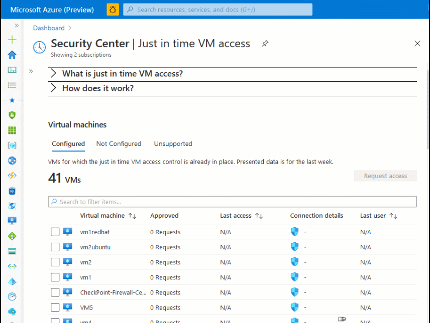
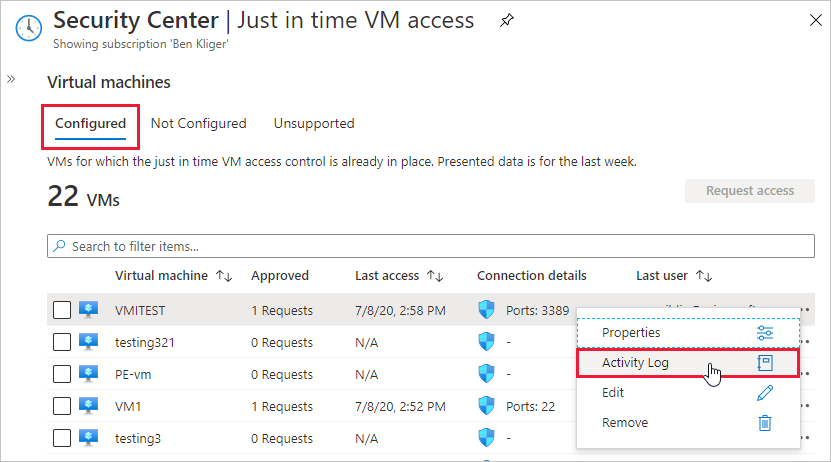

# Secure your management ports with just-in-time access

Lock down inbound traffic to your Azure Virtual Machines with Azure Security Center's just-in-time (JIT) virtual machine (VM) access feature. This reduces exposure to attacks while providing easy access when you need to connect to a VM.

For a full explanation about how JIT works and the underlying logic, see [Just-in-time explained](just-in-time-explained.md).

This page teaches you how to include JIT in your security program. You'll learn how to: 

- **Enable JIT on your VMs** - You can enable JIT with your own custom options for one or more VMs using Security Center, PowerShell, or the REST API. Alternatively, you can enable JIT with default, hard-coded parameters, from Azure virtual machines. When enabled, JIT locks down inbound traffic to your Azure VMs by creating a rule in your network security group.
- **Request access to a VM that has JIT enabled** - The goal of JIT is to ensure that even though your inbound traffic is locked down, Security Center still provides easy access to connect to VMs when needed. You can request access to a JIT-enabled VM from Security Center, Azure virtual machines, PowerShell, or the REST API.
- **Audit the activity** - To ensure your VMs are secured appropriately, review the accesses to your JIT-enabled VMs as part of your regular security checks.   


## Availability

|Aspect|Details|
|----|:----|
|Release state:|General Availability (GA)|
|Pricing:|Requires [Azure Defender for servers](defender-for-servers-introduction.md)|
|Supported VMs:| VMs deployed through Azure Resource Manager.<br> VMs deployed with classic deployment models. [Learn more about these deployment models](../azure-resource-manager/management/deployment-models.md).<br> VMs protected by Azure Firewalls controlled by [Azure Firewall Manager](../firewall-manager/overview.md)|
|Required roles and permissions:|**Reader** and **SecurityReader** roles can both view the JIT status and parameters.<br>To create custom roles that can work with JIT, see [What permissions are needed to configure and use JIT?](just-in-time-explained.md#what-permissions-are-needed-to-configure-and-use-jit).<br>To create a least-privileged role for users that need to request JIT access to a VM, and perform no other JIT operations, use the [Set-JitLeastPrivilegedRole script](https://github.com/Azure/Azure-Security-Center/tree/master/Powershell%20scripts/JIT%20Custom%20Role) from the Security Center GitHub community pages.|
|Clouds:| Commercial clouds<br> National/Sovereign (US Gov, China Gov, Other Gov)|
|||


## Enable JIT VM access <a name="jit-configure"></a>

You can enable JIT VM access with your own custom options for one or more VMs using Security Center or programmatically. 

Alternatively, you can enable JIT with default, hard-coded parameters, from Azure Virtual machines.

Each of these options is explained in a separate tab below.

### [**Azure Security Center**](#tab/jit-config-asc)

### Enable JIT on your VMs from Azure Security Center <a name="jit-asc"></a>

:::image type="content" source="./media/security-center-just-in-time/jit-config-security-center.gif" alt-text="Configuring JIT VM access in Azure Security Center":::

From Security Center, you can enable and configure the JIT VM access.

1. Open the Azure Defender dashboard and from the advanced protection area, select **Just-in-time VM access**.

    The **Just-in-time VM access** page opens with your VMs grouped into the following tabs:

    - **Configured** - VMs that have been already been configured to support just-in-time VM access. For each VM, the configured tab shows:
        - the number of approved JIT requests in the last seven days
        - the last access date and time
        - the connection details configured
        - the last user
    - **Not configured** - VMs without JIT enabled, but that can support JIT. We recommend that you enable JIT for these VMs.
    - **Unsupported** - VMs without JIT enabled and which don't support the feature. Your VM might be in this tab for the following reasons:
      - Missing network security group (NSG) - JIT requires an NSG to be configured
      - Classic VM - JIT supports VMs that are deployed through Azure Resource Manager, not 'classic deployment'. [Learn more about classic vs Azure Resource Manager deployment models](../azure-resource-manager/management/deployment-models.md).
      - Other - Your VM might be in this tab if the JIT solution is disabled in the security policy of the subscription or the resource group.

1. From the **Not configured** tab, mark the VMs to protect with JIT and select **Enable JIT on VMs**. 

    The JIT VM access page opens listing the ports that Security Center recommends protecting:
    - 22 - SSH
    - 3389 - RDP
    - 5985 - WinRM 
    - 5986 - WinRM

    To accept the default settings, select **Save**.

1. To customize the JIT options:

    - Add custom ports with the **Add** button. 
    - Modify one of the default ports, by selecting it from the list.

    For each port (custom and default) the **Add port configuration** pane offers the following options:

    - **Protocol**- The protocol that is allowed on this port when a request is approved
    - **Allowed source IPs**- The IP ranges that are allowed on this port when a request is approved
    - **Maximum request time**- The maximum time window during which a specific port can be opened

     1. Set the port security to your needs.

     1. Select **OK**.

1. Select **Save**.


### Edit the JIT configuration on a JIT-enabled VM using Security Center <a name="jit-modify"></a>

You can modify a VM's just-in-time configuration by adding and configuring a new port to protect for that VM, or by changing any other setting related to an already protected port.

To edit the existing JIT rules for a VM:

1. Open the Azure Defender dashboard and from the advanced protection area, select **Adaptive application controls**.

1. From the **Configured** tab, right-click on the VM to which you want to add a port, and select edit. 

    

1. Under **JIT VM access configuration**, you can either edit the existing settings of an already protected port or add a new custom port.

1. When you've finished editing the ports, select **Save**.
 


### [**Azure virtual machines**](#tab/jit-config-avm)

### Enable JIT on your VMs from Azure virtual machines

You can enable JIT on a VM from the Azure virtual machines pages of the Azure portal.



> [!TIP]
> If a VM already has just-in-time enabled, when you go to its configuration page you'll see that just-in-time is enabled and you can use the link to open the just-in-time VM access page in Security Center, and view and change the settings.

1. From the [Azure portal](https://ms.portal.azure.com), search for and select **Virtual machines**. 

1. Select the virtual machine you want to protect with JIT.

1. In the menu, select **Configuration**.

1. Under **Just-in-time access**, select **Enable just-in-time**. 

    This enables just-in-time access for the VM using the following default settings:

    - Windows machines:
        - RDP port 3389
        - Three hours of maximum allowed access
        - Allowed source IP addresses is set to Any
    - Linux machines:
        - SSH port 22
        - Three hours of maximum allowed access
        - Allowed source IP addresses is set to Any

1. To edit any of these values, or add more ports to your JIT configuration, use Azure Security Center's just-in-time page:

    1. From Security Center's menu, select **Just-in-time VM access**.

    1. From the **Configured** tab, right-click on the VM to which you want to add a port, and select edit. 

        

    1. Under **JIT VM access configuration**, you can either edit the existing settings of an already protected port or add a new custom port.

    1. When you've finished editing the ports, select **Save**.


### [**PowerShell**](#tab/jit-config-powershell)

### Enable JIT on your VMs using PowerShell

To enable just-in-time VM access from PowerShell, use the official Azure Security Center PowerShell cmdlet `Set-AzJitNetworkAccessPolicy`.

**Example** - Enable just-in-time VM access on a specific VM with the following rules:

* Close ports 22 and 3389
* Set a maximum time window of 3 hours for each so they can be opened per approved request
* Allow the user who is requesting access to control the source IP addresses
* Allow the user who is requesting access to establish a successful session upon an approved just-in-time access request

The following PowerShell commands create this JIT configuration:

1. Assign a variable that holds the just-in-time VM access rules for a VM:

    ```azurepowershell
    $JitPolicy = (@{
        id="/subscriptions/SUBSCRIPTIONID/resourceGroups/RESOURCEGROUP/providers/Microsoft.Compute/virtualMachines/VMNAME";
        ports=(@{
             number=22;
             protocol="*";
             allowedSourceAddressPrefix=@("*");
             maxRequestAccessDuration="PT3H"},
             @{
             number=3389;
             protocol="*";
             allowedSourceAddressPrefix=@("*");
             maxRequestAccessDuration="PT3H"})})
    ```

1. Insert the VM just-in-time VM access rules into an array:
    
    ```azurepowershell
    $JitPolicyArr=@($JitPolicy)
    ```

1. Configure the just-in-time VM access rules on the selected VM:
    
    ```azurepowershell
    Set-AzJitNetworkAccessPolicy -Kind "Basic" -Location "LOCATION" -Name "default" -ResourceGroupName "RESOURCEGROUP" -VirtualMachine $JitPolicyArr
    ```

    Use the -Name parameter to specify a VM. For example, to establish the JIT configuration for two different VMs, VM1 and VM2, use: ```Set-AzJitNetworkAccessPolicy -Name VM1``` and ```Set-AzJitNetworkAccessPolicy -Name VM2```.


### [**REST API**](#tab/jit-config-api)

### Enable JIT on your VMs using the REST API

The just-in-time VM access feature can be used via the Azure Security Center API. Use this API to get information about configured VMs, add new ones, request access to a VM, and more. 

Learn more at [JIT network access policies](/rest/api/securitycenter/jitnetworkaccesspolicies).


--- 


## Request access to a JIT-enabled VM

You can request access to a JIT-enabled VM from the Azure portal (in Security Center or Azure Virtual machines) or programmatically.

Each of these options is explained in a separate tab below.

### [**Azure Security Center**](#tab/jit-request-asc)

### Request access to a JIT-enabled VM from Azure Security Center 

When a VM has a JIT enabled, you have to request access to connect to it. You can request access in any of the supported ways, regardless of how you enabled JIT.

:::image type="content" source="./media/security-center-just-in-time/jit-request-security-center.gif" alt-text="Requesting JIT access from Security Center":::

1. From the **Just-in-time VM access** page, select the **Configured** tab.

1. Mark the VMs you want to access.

    - The icon in the **Connection Details** column indicates whether JIT is enabled on the network security group or firewall. If it's enabled on both, only the firewall icon appears.

    - The **Connection Details** column provides the information required to connect the VM, and its open ports.

1. Select **Request access**. The **Request access** window opens.

1. Under **Request access**, for each VM, configure the ports that you want to open and the source IP addresses that the port is opened on and the time window for which the port will be open. It will only be possible to request access to the configured ports. Each port has a maximum allowed time derived from the JIT configuration you've created.

1. Select **Open ports**.

> [!NOTE]
> If a user who is requesting access is behind a proxy, the option **My IP** may not work. You may need to define the full IP address range of the organization.


### [**Azure virtual machines**](#tab/jit-request-avm)

### Request access to a JIT-enabled VM from the Azure virtual machine's connect page

When a VM has a JIT enabled, you have to request access to connect to it. You can request access in any of the supported ways, regardless of how you enabled JIT.

  >


To request access from Azure virtual machines:

1. In the Azure portal, open the virtual machines pages.

1. Select the VM to which you want to connect, and open the **Connect** page.

    Azure checks to see if JIT is enabled on that VM.

    - If JIT isn't enabled for the VM, you'll be prompted to enable it.

    - If JIT's enabled, select **Request access** to pass an access request with the requesting IP, time range, and ports that were configured for that VM.

> [!NOTE]
> After a request is approved for a VM protected by Azure Firewall, Security Center provides the user with the proper connection details (the port mapping from the DNAT table) to use to connect to the VM.


### [**PowerShell**](#tab/jit-request-powershell)

### Request access to a JIT-enabled VM using PowerShell

In the following example, you can see a just-in-time VM access request to a specific VM in which port 22 is requested to be opened for a specific IP address and for a specific amount of time:

Run the following in PowerShell:

1. Configure the VM request access properties:

    ```azurepowershell
    $JitPolicyVm1 = (@{
        id="/subscriptions/SUBSCRIPTIONID/resourceGroups/RESOURCEGROUP/providers/Microsoft.Compute/virtualMachines/VMNAME";
        ports=(@{
           number=22;
           endTimeUtc="2020-07-15T17:00:00.3658798Z";
           allowedSourceAddressPrefix=@("IPV4ADDRESS")})})
    ```

1. Insert the VM access request parameters in an array:

    ```azurepowershell
    $JitPolicyArr=@($JitPolicyVm1)
    ```
        
1. Send the request access (use the resource ID from step 1)

    ```azurepowershell
    Start-AzJitNetworkAccessPolicy -ResourceId "/subscriptions/SUBSCRIPTIONID/resourceGroups/RESOURCEGROUP/providers/Microsoft.Security/locations/LOCATION/jitNetworkAccessPolicies/default" -VirtualMachine $JitPolicyArr
    ```

Learn more in the [PowerShell cmdlet documentation](/powershell/scripting/developer/cmdlet/cmdlet-overview).


### [**REST API**](#tab/jit-request-api)

### Request access to a JIT-enabled VMs using the REST API

The just-in-time VM access feature can be used via the Azure Security Center API. Use this API to get information about configured VMs, add new ones, request access to a VM, and more. 

Learn more at [JIT network access policies](/rest/api/securitycenter/jitnetworkaccesspolicies).

---


## Audit JIT access activity in Security Center

You can gain insights into VM activities using log search. To view the logs:

1. From **Just-in-time VM access**, select the **Configured** tab.

1. For the VM that you want to audit, open the ellipsis menu at the end of the row.
 
1. Select **Activity Log** from the menu.

   

   The activity log provides a filtered view of previous operations for that VM along with time, date, and subscription.

1. To download the log information, select **Download as CSV**.


## Next steps

In this article, you learned how to set up and use just-in-time VM access. To learn why JIT should be used, read the concept article explaining the threats it's defending against:

> [!div class="nextstepaction"]
> [JIT explained](just-in-time-explained.md)