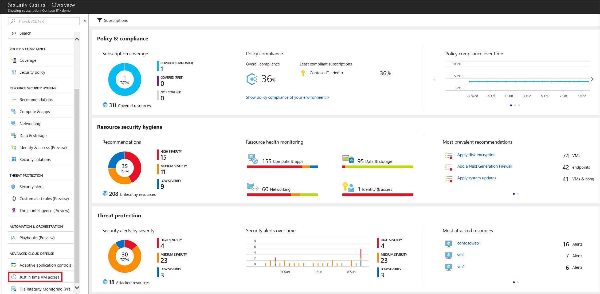
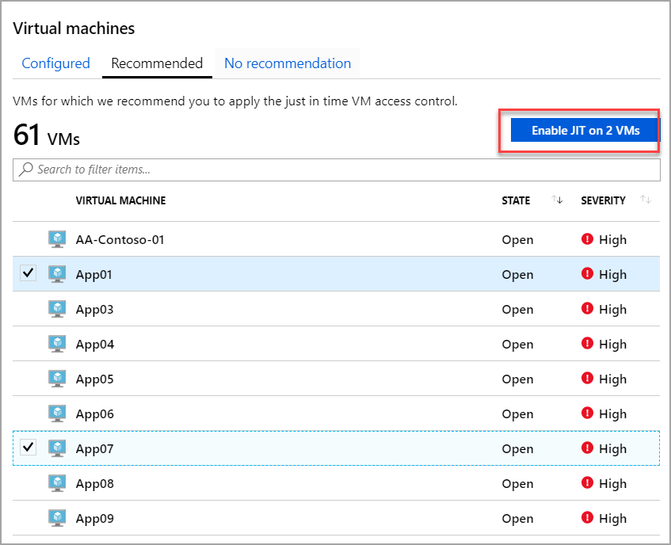
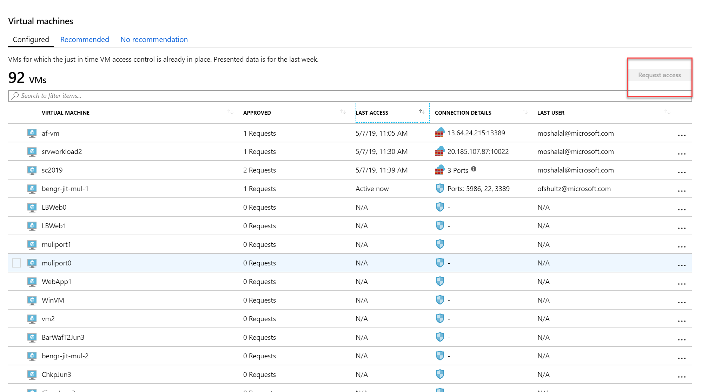
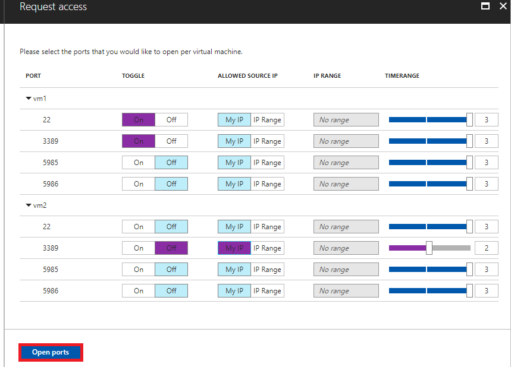
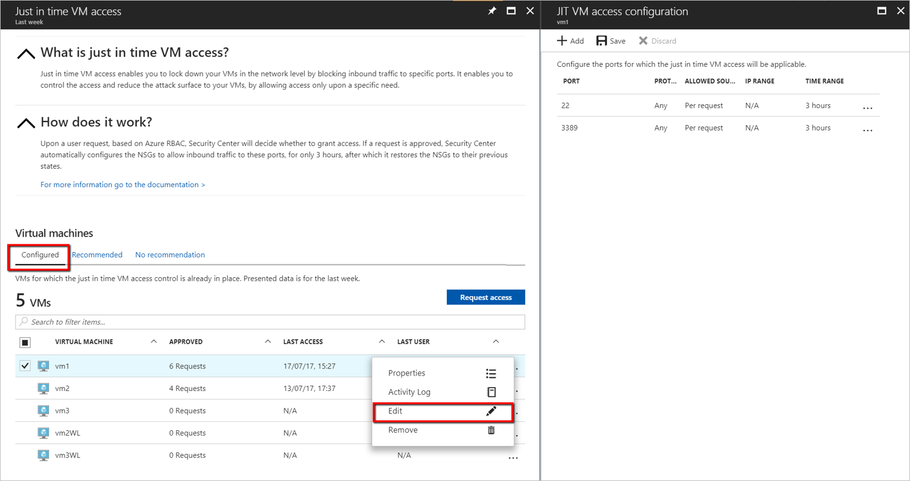
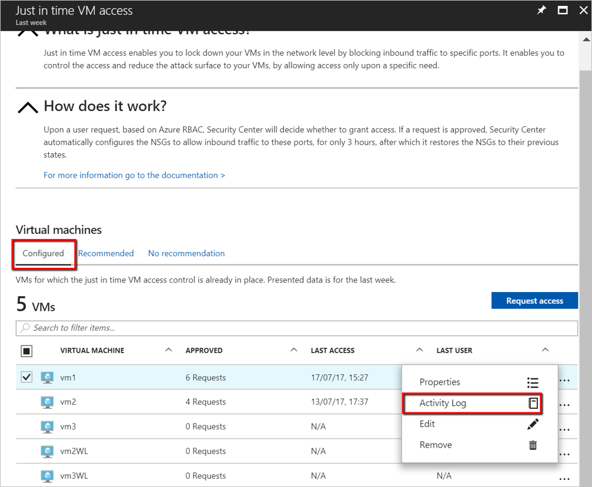
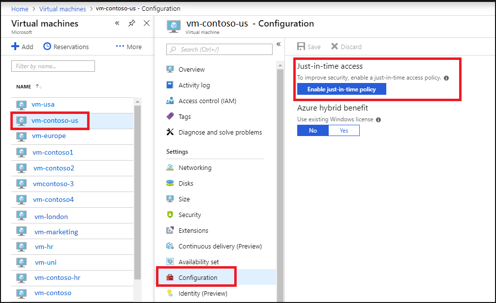
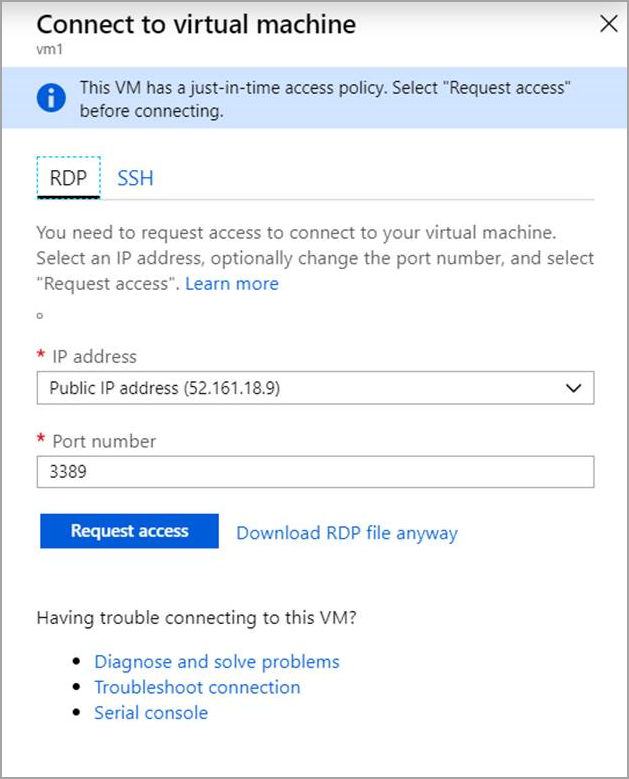
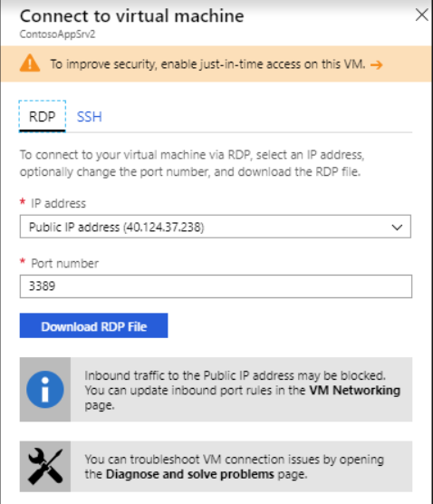

# Secure your management ports with just-in-time access

If you're on Security Center's standard pricing tier (see [pricing](/azure/security-center/security-center-pricing)), you can lock down inbound traffic to your Azure VMs with just-in-time (JIT) virtual machine (VM) access. This reduces exposure to attacks while providing easy access to connect to VMs when needed.

> [!NOTE]
> Security Center just-in-time VM access currently supports only VMs deployed through Azure Resource Manager. To learn more about the classic and Resource Manager deployment models see [Azure Resource Manager vs. classic deployment](../azure-resource-manager/management/deployment-models.md).

[!INCLUDE [security-center-jit-description](../../includes/security-center-jit-description.md)]

## Configure JIT on a VM

There are three ways to configure a JIT policy on a VM:

- [Configure JIT access in Azure Security Center](#jit-asc)
- [Configure JIT access in an Azure VM page](#jit-vm)
- [Configure a JIT policy on a VM programmatically](#jit-program)

## Configure JIT in Azure Security Center

From Security Center, you can configure a JIT policy and request access to a VM using a JIT policy

### Configure JIT access on a VM in Security Center 

1. Open the **Security Center** dashboard.

1. In the left pane, select **Just-in-time VM access**.

    

    The **Just-in-time VM access** window opens and shows information on the state of your VMs:

    - **Configured** - VMs that have been configured to support just-in-time VM access. The data presented is for the last week and includes for each VM the number of approved requests, last access date and time, and last user.
    - **Recommended** - VMs that can support just-in-time VM access but haven't been configured to. We recommend that you enable just-in-time VM access control for these VMs.
    - **No recommendation** - Reasons that can cause a VM not to be recommended are:
      - Missing NSG - The just-in-time solution requires an NSG to be in place.
      - Classic VM - Security Center just-in-time VM access currently supports only VMs deployed through Azure Resource Manager. A classic deployment is not supported by the just-in-time solution. 
      - Other - A VM is in this category if the just-in-time solution is turned off in the security policy of the subscription or the resource group, or if the VM is missing a public IP and doesn't have an NSG in place.

1. Select the **Recommended** tab.

1. Under **VIRTUAL MACHINE**, click the VMs that you want to enable. This puts a checkmark next to a VM.

      

1. Click **Enable JIT on VMs**. A pane opens displaying the default ports recommended by Azure Security Center:
    - 22 - SSH
    - 3389 - RDP
    - 5985 - WinRM 
    - 5986 - WinRM
1. Optionally, you can add custom ports to the list:

      1. Click **Add**. The **Add port configuration** window opens.
      1. For each port you choose to configure, both default and custom, you can customize the following settings:
            - **Protocol type**- The protocol that is allowed on this port when a request is approved.
            - **Allowed source IP addresses**- The IP ranges that are allowed on this port when a request is approved.
            - **Maximum request time**- The maximum time window during which a specific port can be opened.

     1. Click **OK**.

1. Click **Save**.

> [!NOTE]
>When JIT VM Access is enabled for a VM, Azure Security Center creates "deny all inbound traffic" rules for the selected ports in the network security groups associated and Azure Firewall with it. If other rules had been created for the selected ports, then the existing rules take priority over the new "deny all inbound traffic" rules. If there are no existing rules on the selected ports, then the new "deny all inbound traffic" rules take top priority in the Network Security Groups and Azure Firewall.

## Request JIT access via Security Center

To request access to a VM via Security Center:

1. Under **Just-in-time VM access**, select the **Configured** tab.

1. Under **Virtual Machine**, click the VMs that you want to request access for. This puts a checkmark next to the VM.

    - The icon in the **Connection Details** column indicates whether JIT is enabled on the NSG or FW. If it's enabled on both, only the Firewall icon appears.

    - The **Connection Details** column provides the information required to connect the VM, and its open ports.

      

1. Click **Request access**. The **Request access** window opens.

      

1. Under **Request access**, for each VM, configure the ports that you want to open and the source IP addresses that the port is opened on and the time window for which the port will be open. It will only be possible to request access to the ports that are configured in the just-in-time policy. Each port has a maximum allowed time derived from the just-in-time policy.

1. Click **Open ports**.

> [!NOTE]
> If a user who is requesting access is behind a proxy, the option **My IP** may not work. You may need to define the full IP address range of the organization.

## Edit a JIT access policy via Security Center

You can change a VM's existing just-in-time policy by adding and configuring a new port to protect for that VM, or by changing any other setting related to an already protected port.

To edit an existing just-in-time policy of a VM:

1. In the **Configured** tab, under **VMs**, select a VM to which to add a port by clicking on the three dots within the row for that VM. 

1. Select **Edit**.

1. Under **JIT VM access configuration**, you can either edit the existing settings of an already protected port or add a new custom port. 
  

## Audit JIT access activity in Security Center

You can gain insights into VM activities using log search. To view logs:

1. Under **Just-in-time VM access**, select the **Configured** tab.
2. Under **VMs**, select a VM to view information about by clicking on the three dots within the row for that VM and select **Activity Log** from the menu. The **Activity log** opens.

   

   **Activity log** provides a filtered view of previous operations for that VM along with time, date, and subscription.

You can download the log information by selecting **Click here to download all the items as CSV**.

Modify the filters and click **Apply** to create a search and log.

## Configure JIT access from an Azure VM's page 

For your convenience, you can connect to a VM using JIT directly from within the VM's page in Security Center.

### Configure JIT access on a VM via the Azure VM page

To make it easy to roll out just-in-time access across your VMs, you can set a VM to allow only just-in-time access directly from within the VM.

1. From the [Azure portal](https://ms.portal.azure.com), search for and select **Virtual machines**. 
2. Select the virtual machine you want to limit to just-in-time access.
3. In the menu, select **Configuration**.
4. Under **Just-in-time access**, select **Enable just-in-time**. 

This enables just-in-time access for the VM using the following settings:

- Windows servers:
    - RDP port 3389
    - Three hours of maximum allowed access
    - Allowed source IP addresses is set to Any
- Linux servers:
    - SSH port 22
    - Three hours of maximum allowed access
    - Allowed source IP addresses is set to Any
     
If a VM already has just-in-time enabled, when you go to its configuration page you will be able to see that just-in-time is enabled and you can use the link to open the policy in Azure Security Center to view and change the settings.

### Request JIT access to a VM via an Azure VM's page

In the Azure portal, when you try to connect to a VM, Azure checks to see if you have a just-in-time access policy configured on that VM.

- If you have a JIT policy configured on the VM, you can click **Request access** to grant access in accordance with the JIT policy set for the VM. 

  >

  Access is requested with the following default parameters:

  - **source IP**: 'Any' (*) (cannot be changed)
  - **time range**: Three hours (cannot be changed) <!--Isn't this set in the policy-->
  - **port number** RDP port 3389 for Windows / port 22 for Linux (can be changed)

    > [!NOTE]
    > After a request is approved for a VM protected by Azure Firewall, Security Center provides the user with the proper connection details (the port mapping from the DNAT table) to use to connect to the VM.

- If you do not have JIT configured on a VM, you will be prompted to configure a JIT policy on it.

  

## Configure a JIT policy on a VM programmatically 

You can set up and use just-in-time via REST APIs and via PowerShell.

### JIT VM access via REST APIs

The just-in-time VM access feature can be used via the Azure Security Center API. You can get information about configured VMs, add new ones, request access to a VM, and more, via this API. See [Jit Network Access Policies](https://docs.microsoft.com/rest/api/securitycenter/jitnetworkaccesspolicies), to learn more about the just-in-time REST API.

### JIT VM access via PowerShell

To use the just-in-time VM access solution via PowerShell, use the official Azure Security Center PowerShell cmdlets, and specifically `Set-AzJitNetworkAccessPolicy`.

The following example sets a just-in-time VM access policy on a specific VM, and sets the following:

1.    Close ports 22 and 3389.

2.    Set a maximum time window of 3 hours for each so they can be opened per approved request.
3.    Allows the user who is requesting access to control the source IP addresses and allows the user to establish a successful session upon an approved just-in-time access request.

Run the following in PowerShell to accomplish this:

1.    Assign a variable that holds the just-in-time VM access policy for a VM:

        $JitPolicy = (@{
         id="/subscriptions/SUBSCRIPTIONID/resourceGroups/RESOURCEGROUP/providers/Microsoft.Compute/virtualMachines/VMNAME";
        ports=(@{
             number=22;
             protocol="\*";
             allowedSourceAddressPrefix=@("\*");
             maxRequestAccessDuration="PT3H"},
             @{
             number=3389;
             protocol="\*";
             allowedSourceAddressPrefix=@("\*");
             maxRequestAccessDuration="PT3H"})})

2.    Insert the VM just-in-time VM access policy to an array:
    
        $JitPolicyArr=@($JitPolicy)

3.    Configure the just-in-time VM access policy on the selected VM:
    
        Set-AzJitNetworkAccessPolicy -Kind "Basic" -Location "LOCATION" -Name "default" -ResourceGroupName "RESOURCEGROUP" -VirtualMachine $JitPolicyArr 

### Request access to a VM via PowerShell

In the following example, you can see a just-in-time VM access request to a specific VM in which port 22 is requested to be opened for a specific IP address and for a specific amount of time:

Run the following in PowerShell:
1.    Configure the VM request access properties

        $JitPolicyVm1 = (@{
          id="/SUBSCRIPTIONID/resourceGroups/RESOURCEGROUP/providers/Microsoft.Compute/virtualMachines/VMNAME";
        ports=(@{
           number=22;
           endTimeUtc="2018-09-17T17:00:00.3658798Z";
           allowedSourceAddressPrefix=@("IPV4ADDRESS")})})
2.    Insert the VM access request parameters in an array:

        $JitPolicyArr=@($JitPolicyVm1)
3.    Send the request access (use the resource ID you got in step 1)

        Start-AzJitNetworkAccessPolicy -ResourceId "/subscriptions/SUBSCRIPTIONID/resourceGroups/RESOURCEGROUP/providers/Microsoft.Security/locations/LOCATION/jitNetworkAccessPolicies/default" -VirtualMachine $JitPolicyArr

For more information, see the [PowerShell cmdlet documentation](https://docs.microsoft.com/powershell/scripting/developer/cmdlet/cmdlet-overview).

## Automatic cleanup of redundant JIT rules 

Whenever you update a JIT policy, a cleanup tool automatically runs to check the validity of your entire ruleset. The tool looks for mismatches between rules in your policy and rules in the NSG. If the cleanup tool finds a mismatch, it determines the cause and, when it's safe to do so, removes built-in rules that aren't needed any more. The cleaner never deletes rules that you've created.

Examples scenarios when the cleaner might remove a built-in rule:

- When two rules with identical definitions exist and one has a higher priority than the other (meaning, the lower priority rule will never be used)
- When a rule description includes the name of a VM which doesn't match the destination IP in the rule 

## Next steps

In this article, you learned how just-in-time VM access in Security Center helps you control access to your Azure virtual machines.

To learn more about Security Center, see the following:

- The Microsoft Learn module [Protect your servers and VMs from brute-force and malware attacks with Azure Security Center](https://docs.microsoft.com/learn/modules/secure-vms-with-azure-security-center/)
- [Setting security policies](tutorial-security-policy.md) — Learn how to configure security policies for your Azure subscriptions and resource groups.
- [Managing security recommendations](security-center-recommendations.md) — Learn how recommendations help you protect your Azure resources.
- [Security health monitoring](security-center-monitoring.md) — Learn how to monitor the health of your Azure resources.
