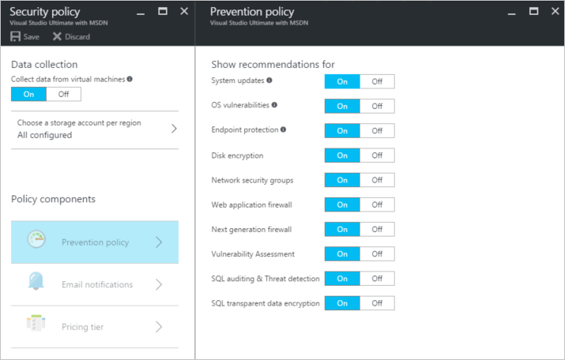
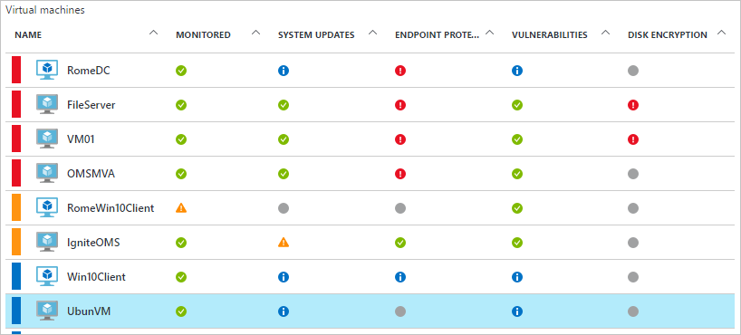
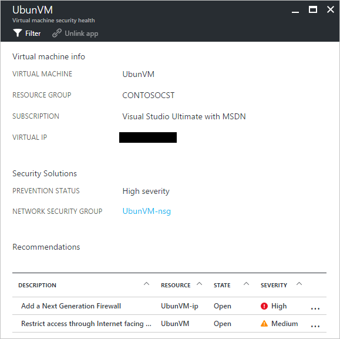

---
title: Azure Security Center and Azure Virtual Machines with Linux | Microsoft Docs
description: This document helps you to understand how Azure Security Center can safeguard you Azure Virtual Machines.
services: security-center
documentationcenter: na
author: rkarlin
manager: barbkess
editor: ''

ms.assetid: 5fe5a12c-5d25-430c-9d47-df9438b1d7c5
ms.service: security-center
ms.devlang: na
ms.topic: conceptual
ms.tgt_pltfrm: na
ms.workload: na
ms.date: 01/03/2017
ms.author: yurid

---
# Azure Security Center and Azure Virtual Machines with Linux
[Azure Security Center](https://azure.microsoft.com/services/security-center/) helps you prevent, detect, and respond to threats. It provides integrated security monitoring and policy management across your Azure subscriptions, helps detect threats that might otherwise go unnoticed, and works with a broad ecosystem of security solutions.

This article shows how Security Center can help you secure your Azure Virtual Machines (VM) running Linux operating system.

## Why use Security Center?
Security Center helps you safeguard virtual machine data in Azure by providing visibility into your virtual machine’s security settings and monitoring for threats. Security Center can monitor your virtual machines for: 

* Operating System (OS) security settings with the recommended configuration rules
* System security and critical updates that are missing
* Endpoint protection recommendations
* Disk encryption validation
* Network based attacks (only available in [standard version](https://azure.microsoft.com/pricing/details/security-center/))

In addition to helping protect your Azure VMs, Security Center also provides security monitoring and management for Cloud Services, App Services, Virtual Networks, and more. 

> [!NOTE]
> See [Introduction to Azure Security Center](security-center-intro.md) to learn more about Azure Security Center.
> 
> 

## Prerequisites
To get started with Azure Security Center, you’ll need to know and consider the following:

* You must have a subscription to Microsoft Azure. See [Security Center Pricing](https://azure.microsoft.com/pricing/details/security-center/) for more information on Security Center’s free and standard tiers.
* Plan your Security Center adoption, see [Azure Security Center planning and operations guide](security-center-planning-and-operations-guide.md) to learn more about planning and operations considerations.
* For information regarding operating system supportability, see [Azure Security Center frequently asked questions (FAQ)](security-center-faq.md). 

## Set security policy
Data collection needs to be enabled so that Azure Security Center can gather the information it needs to provide recommendations and alerts that are generated based on the security policy you configure. In the figure below, you can see that **Data collection** has been turned **On**.

A security policy defines the set of controls which are recommended for resources within the specified subscription or resource group. Before enabling security policy, you must have data collection enabled, Security Center collects data from your virtual machines in order to assess their security state, provide security recommendations, and alert you to threats. In Security Center, you define policies for your Azure subscriptions or resource groups according to your company’s security needs and the type of applications or sensitivity of the data in each subscription. 

> [!NOTE]
> To learn more about each **Prevention policy** available, see [Set security policies](tutorial-security-policy.md) article.
> 

## Manage security recommendations
Security Center analyzes the security state of your Azure resources. When Security Center identifies potential security vulnerabilities, it creates recommendations. The recommendations guide you through the process of configuring the needed controls.

After setting a security policy, Security Center analyzes the security state of your resources to identify potential vulnerabilities. The recommendations are shown in a table format where each line represents one particular recommendation. The table below provides some examples of recommendations for Azure VMs running Linux operating system and what each one will do if you apply it. When you select a recommendation, you will be provided information that shows you how to implement the recommendation in Security Center.

| Recommendation | Description |
| --- | --- |
| [Enable data collection for subscriptions](security-center-enable-data-collection.md) |Recommends that you turn on data collection in the security policy for each of your subscriptions and all virtual machines (VMs) in your subscriptions. |
| [Remediate OS vulnerabilities](security-center-remediate-os-vulnerabilities.md) |Recommends that you align your OS configurations with the recommended configuration rules, e.g. do not allow passwords to be saved. |
| [Apply system updates](security-center-apply-system-updates.md) |Recommends that you deploy missing system security and critical updates to VMs. |
| [Reboot after system updates](security-center-apply-system-updates.md#reboot-after-system-updates) |Recommends that you reboot a VM to complete the process of applying system updates. |
| [Enable VM Agent](security-center-enable-vm-agent.md) |Enables you to see which VMs require the VM Agent. The VM Agent must be installed on VMs in order to provision patch scanning, baseline scanning, and antimalware programs. The VM Agent is installed by default for VMs that are deployed from the Azure Marketplace. The article [VM Agent and Extensions – Part 2](https://azure.microsoft.com/blog/2014/04/15/vm-agent-and-extensions-part-2/) provides information on how to install the VM Agent. |
| [Apply disk encryption](security-center-apply-disk-encryption.md) |Recommends that you encrypt your VM disks using Azure Disk Encryption (Windows and Linux VMs). Encryption is recommended for both the OS and data volumes on your VM. |

> [!NOTE]
> To learn more about recommendations, see [Managing security recommendations](security-center-recommendations.md) article.
> 

## Monitor security health
After you enable [security policies](tutorial-security-policy.md) for a subscription’s resources, Security Center will analyze the security of your resources to identify potential vulnerabilities.  You can view the security state of your resources, along with any issues in the **Resource security health** blade. When you click **Virtual machines** in the **Resource security** health tile, the **Virtual machines** blade will open with recommendations for your VMs. 

## Manage and respond to security alerts
Security Center automatically collects, analyzes, and integrates log data from your Azure resources, the network, and connected partner solutions (like firewall and endpoint protection solutions), to detect real threats and reduce false positives. By leveraging a diverse aggregation of [detection capabilities](security-center-detection-capabilities.md), Security Center is able to generate prioritized security alerts to help you quickly investigate the problem and provide recommendations for how to remediate possible attacks.

Select a security alert to learn more about the event(s) that triggered the alert and what, if any, steps you need to take to remediate an attack. Security alerts are grouped by [type](security-center-alerts-type.md) and date.

## Monitor security health
After you enable [security policies](tutorial-security-policy.md) for a subscription’s resources, Security Center will analyze the security of your resources to identify potential vulnerabilities.  You can view the security state of your resources, along with any issues in the **Resource security health** blade. When you click **Virtual machines** in the **Resource security** health tile, the **Virtual machines** blade will open with recommendations for your VMs. 

If you click on this recommendation, you will see more details about the specific actions that should be taken to address those issues. The details will appear in the bottom of the blade, under **Recommendations**. 

## See also
To learn more about Security Center, see the following:

* [Setting security policies in Azure Security Center](tutorial-security-policy.md) -- Learn how to configure security policies for your Azure subscriptions and resource groups.
* [Managing and responding to security alerts in Azure Security Center](security-center-managing-and-responding-alerts.md) -- Learn how to manage and respond to security alerts.
* [Azure Security Center FAQ](security-center-faq.md) -- Find frequently asked questions about using the service.

