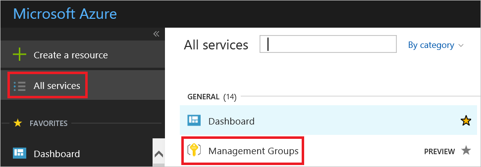

# Gain tenant-wide visibility
This article helps you get started by doing several actions that maximize the benefits Azure Security Center provides. Performing these actions enables you to gain visibility on all the Azure subscriptions that are linked to your Azure Active Directory tenant and effectively manage your organization’s security posture at scale by applying security policies across multiple subscriptions in an aggregative manner.

## Management groups
Azure management groups provide the ability to efficiently manage access, policies, and reporting on groups of subscriptions, as well as effectively manage the entire Azure estate by performing actions on the root management group. Each AAD tenant is given a single top-level management group called the root management group. This root management group is built into the hierarchy to have all management groups and subscriptions fold up to it; allowing global policies and RBAC assignments to be applied at the directory level. 

The root management group is created automatically when you do any of the following actions: 
1. Opt in to use Azure management groups by navigating to **Management Groups** in the [Azure portal](https://portal.azure.com).
2. Create a management group via an API call.
3. Create a management group with PowerShell.

For a detailed overview of management groups, see the [Organize your resources with Azure management groups](../azure-resource-manager/management-groups-overview.md) article.

### Create a management group in the Azure Portal
You can organize subscriptions into management groups and apply your governance policies to the management groups. All subscriptions within a management group automatically inherit the policies applied to the management group. While management groups are not required to onboard Security Center, it’s highly recommended that you create at least one management group so the root management group is created. After the root management group is created, all subscriptions under your AAD tenant will be linked to it. For more information, see [Create management groups for resource and organization management](../azure-resource-manager/management-groups-create.md).

1. Sign in to the [Azure portal](https://portal.azure.com).
2. Under the Azure main menu, select **All services**.
3. Under **General**, select **Management Groups**.
	
4. 

