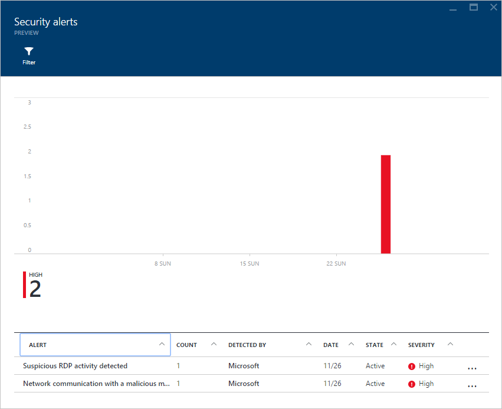
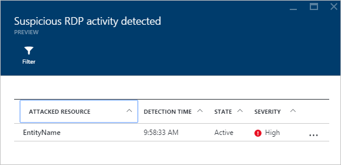
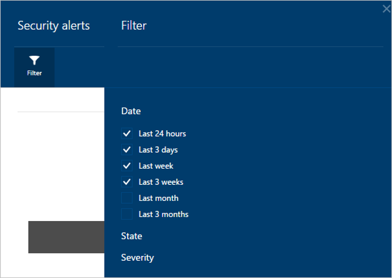
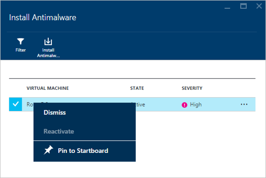

<properties
   pageTitle="Managing and responding to security alerts in Azure Security Center | Microsoft Azure"
   description="This document helps you to use Azure Security Center capabilities to manage and respond to security alerts."
   services="security-center"
   documentationCenter="na"
   authors="YuriDio"
   manager="swadhwa"
   editor=""/>

<tags
   ms.service="security-center"
   ms.devlang="na"
   ms.topic="article"
   ms.tgt_pltfrm="na"
   ms.workload="na"
   ms.date="12/16/2015"
   ms.author="yurid"/>

# Managing and responding to security alerts in Azure Security Center
This document helps you to use Azure Security Center capabilities to manage and respond to security alerts.

> [AZURE.NOTE] The information in this document applies to the preview release of Azure Security Center.

## What is Azure Security Center?
Azure Security Center helps you prevent, detect, and respond to threats with increased visibility into and control over the security of your Azure resources. It provides integrated security monitoring and policy management across your subscriptions, helps detect threats that might otherwise go unnoticed, and works with a broad ecosystem of security solutions.

## How does Azure Security Center manage security alerts?
Azure Security Center automatically collects, analyzes and integrates log data from your Azure resources, the network, and partner solutions like antimalware and firewalls to detect real threats and reduce false positives. A list of prioritized alerts is surfaced as Security Alerts.  

You can review the current alerts by looking at the Security Alerts tile. Follow the steps below to see more details about each alert:

1. From the **Azure Security Center** dashboard you will see the **Security Alerts** tile. 

    

2.  Click the security alert occurrence in the graphic and the **Security Alerts** blade will open with more details about this alert as shown below:
    
    

In the bottom part of this blade you have the details for each alert. You can sort it for each column by clicking on the desire column. The definition for each column is shown below:

- **Alert**: a brief explanation about the alert.
- **Count**: represents the number of all alerts of this specific type that were detected in a specific day.
- **Detected by**: the service responsible for triggering the alert.
- **Date**: when the event occurred.
- **State**: it shows the current state for that alert. There are three types of state:
    - **Active**: the security alert has been detected.
    - **Dismissed**: the security alert has been dismissed by the user. This status would typically be used for alerts that have been investigated but found not to be an actual attack or investigated and mitigated

- **Severity**: shows the severity level, which can be high, medium or low.
  

### Responding to a security alert
Many activities could indicate a possible attack on your organization. For example, a network administrator performing a legitimate network capture might appear similar to someone launching some form of attack. In other cases, a badly configured system might lead to a number of false positives in an intrusion detection system, which could make it more difficult to spot genuine incidents. After you review the security alerts using Azure Security Center, you can start to take actions based on the alert’s severity.

To take an action, select the alert that you want to respond and a new blade will open on the right with more details as shown below: 

In this case, the alerts that was triggered refers to suspicious Remote Desktop Protocol (RDP) activity. The first column shows which resources were attacked, followed by the time that this attack was detected, the state of the alert and the severity. After reviewing this information, you should click the resource that was attacked and a new blade will open up with more suggestions of what you should do next as shown the example below:

  
> [AZURE.NOTE] The remediation suggested by Azure Security Center will vary according to the security alert and in some cases, you may have to use other Azure capabilities in order to implement the recommended remediation. For example, the remediation for this attack is to blacklist the IP address that is generating this attack by using [Network ACL](virtual-networks-acl.md) or a [Network Security Group](virtual-networks-nsg.md) rule.

### Additional tasks
You can filter alerts based on date, state and severity. Under the Security Alerts blade, click Filter and enable the options that you want as shown below:

Filtering alerts can be useful for scenarios where you need to narrow the scope of what you view in the dashboard. For example, you want to verify security alerts that occurred in the last 24 hours because you are investigating a potential breach in the system. 
While the majority of the security alerts will have recommendations that should be applied, in some circumstances you may need to ignore an alert because for your environment it's a false positive or an expected behavior for a particular resource. Whatever the case may be, you can hide recommendations for a particular resource by using the **Dismiss** option.  

To dismiss a task, click on the resource to apply the view additional information or apply the recommended configuration. Right click on the task to dismiss it and you see the **Dismiss** option similar to the image below:

### Alerts

In a collection of alerts, each one will have very specific description and remediation. The alerts you see in Azure Security Center are based on the attack scenario. The attack scenarios that follow are triggered by the Microsoft engine: 

- **Brute Force Detection over Network Data**: These detections are based on machine learning models that learn from network traffic data. 
- **Brute Force Detection over Endpoint Data**: These detections are based on Azure Security Center queries of machine logs; this enables differentiation between failed and a successful attempts. 
- **VMs Communicating with Malicious IPs**: These detections are based on Azure Security Center discovering machines that are compromised with bots and communicating with their Command and Control (C&C) Servers (and vice versa). 

## Next steps
In this document, you learned how to configure security policies in Azure Security Center. To learn more about Azure Security Center, see the following:

- [Security health monitoring in Azure Security Center](security-center-monitoring.md) – Learn how to monitor the health of your Azure resources
- [Azure Security Center FAQ](security-center-faq.md) – Find frequently asked questions about using the service
- [Azure Security Blog](http://blogs.msdn.com/b/azuresecurity/) – Find blog posts about Azure security and compliance

