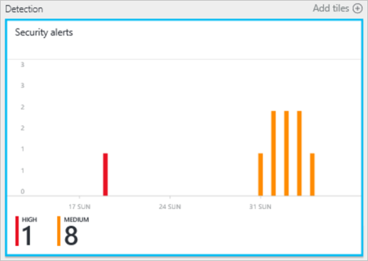
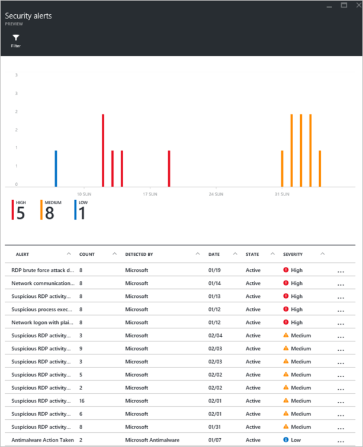
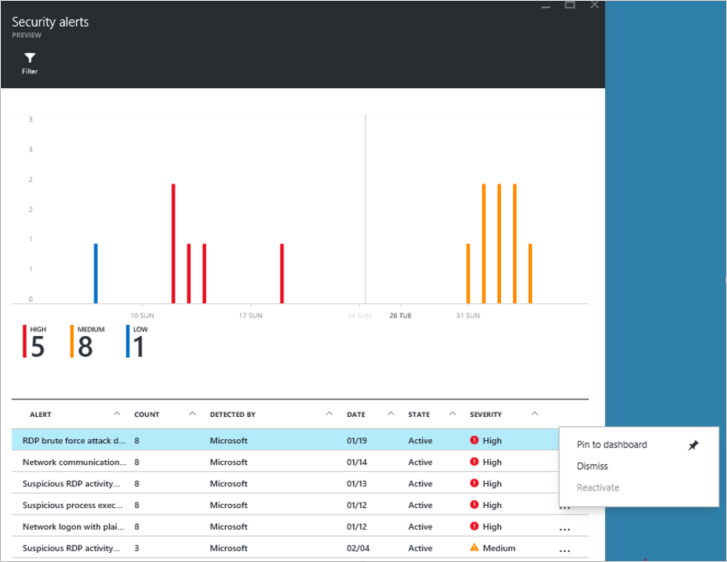
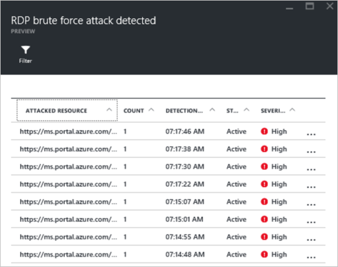
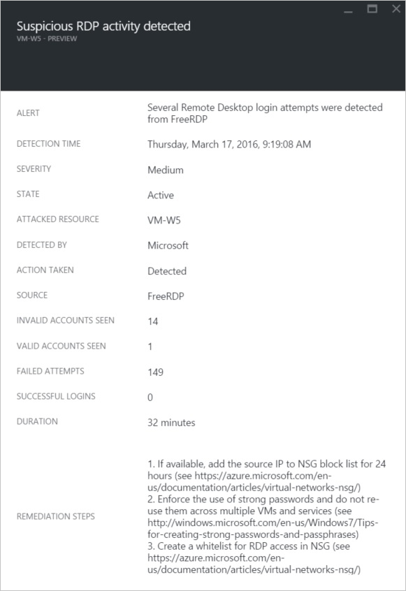

<properties
   pageTitle="Managing and responding to security alerts in Azure Security Center | Microsoft Azure"
   description="This document helps you to use Azure Security Center capabilities to manage and respond to security alerts."
   services="security-center"
   documentationCenter="na"
   authors="YuriDio"
   manager="swadhwa"
   editor=""/>

<tags
   ms.service="security-center"
   ms.topic="hero-article" 
   ms.devlang="na"
   ms.tgt_pltfrm="na"
   ms.workload="na"
   ms.date="03/22/2016"
   ms.author="yurid"/>
 
# Managing and responding to security alerts in Azure Security Center
This document helps you use Azure Security Center capabilities to manage and respond to security alerts.

> [AZURE.NOTE] The information in this document applies to the preview release of Azure Security Center.

## What is Azure Security Center?
 Security Center helps you prevent, detect, and respond to threats with increased visibility into and control over the security of your Azure resources. It provides integrated security monitoring and policy management across your subscriptions, helps detect threats that might otherwise go unnoticed, and works with a broad ecosystem of security solutions.

## What are security alerts?
Security Center automatically collects, analyzes, and integrates log data from your Azure resources, the network, and integrated antimalware and firewalls to detect real threats and reduce false positives. A list of prioritized security alerts, including alerts from integrated partner solutions, is shown in Security Center along with the information you need to quickly investigate and recommendations on how to remediate an attack.
 
Microsoft security researchers are constantly analyzing emerging threats across the globe, including new attack patterns and trends seen across its consumer and enterprise products and online services. As a result, Security Center can update its detection algorithms as new vulnerabilities and exploits are discovered – helping customers keep pace with evolving threats. Examples of some of the types of threats Security Center can detect include:

- **Brute force detection over network data**: Uses machine-learning models that understand typical network traffic patterns for your applications, enables more effective detection of access attempts being executed by bad actors instead of legitimate users.
- **Brute force detection over endpoint data**: Based on analysis of machine logs; enables differentiation between failed and successful attempts.
- **VMs communicating with malicious IPs**: Compares network traffic to Microsoft global threat intelligence, discovers machines that are compromised and communicating with Command and Control (C&C) servers and vice-versa.
- **Compromised VMs**: Based on behavioral analysis of machine logs and correlation with other signals, identifies anomalous events that are likely the results of machine compromise and exploitation.

## Managing security alerts 

You can review your current alerts by looking at the **Security alerts** tile. Follow the steps below to see more details about each alert:

1. On the Security Center dashboard, you will see the **Security alerts** tile.

    

2.  Click the tile to open the **Security alerts** blade that contains more details about the alerts as shown below.

    

In the bottom part of this blade are the details for each alert. To sort, click the column that you want to sort by. The definition for each column is given below:

- **Alert**: A brief explanation of the alert.
- **Count**: A list of all alerts of this specific type that were detected on a specific day.
- **Detected by**: The service that was responsible for triggering the alert.
- **Date**: The date that the event occurred.
- **State**: The current state for that alert. There are three types of states:
    - **Active**: The security alert has been detected.
    - **Dismissed**: The security alert has been dismissed by the user. This status is typically used for alerts that have been investigated but either mitigated or found not to be an actual attack.

- **Severity**: The severity level, which can be high, medium or low.

You can filter alerts based on date, state, and severity. Filtering alerts can be useful for scenarios where you need to narrow the scope of security alerts show. For example, you might you want to address security alerts that occurred in the last 24 hours because you are investigating a potential breach in the system.

1. Click **Filter** on the **Security Alerts** blade. The **Filter** blade opens and you select the date, state, and severity values you wish to see.

	

2. 	After investigating a security alert, you may find that it is a false positive for your environment or indicates an expected behavior for a particular resource. Whatever the case may be, if you determine that a security alert is not applicable, you can dismiss the alert and then filter it out of your view. There are two ways to dismiss a security alert. Right click an alert and select **Dismiss** or hover over an item, click the three dots that appear to the right, and select **Dismiss**. You can view dismissed security alerts by clicking **Filter** and selecting **Dismissed**.

	

### Respond to security alerts
Select a security alert to learn more about the event(s) that triggered the alert and what, if any, steps you need to take to remediate an attack. Security alerts are grouped by type and date. Clicking a security alert will open a blade containing a list of the grouped alerts. 

In this case, the alerts that were triggered refer to suspicious Remote Desktop Protocol (RDP) activity. The first column shows which resources were attacked; the second shows the time that this attack was detected; the third shows the state of the alert; and the fourth shows the severity of the attack. After reviewing this information, click the resource that was attacked. A new blade will open with more suggestions about what to do next, as shown in the example below.

In the **Alert** field of this blade you will find more details about this event. These additional details offer insight into what triggered the security alert, the target resource, when applicable the source IP address, and recommendations about how to remediate.  In some instances, the source IP address will be empty (not available) because not all Windows security events logs include the IP address.

> [AZURE.NOTE] The remediation suggested by
 Security Center will vary according to the security alert. In some cases, you may have to use other Azure capabilities to implement the recommended remediation. For example, the remediation for this attack is to blacklist the IP address that is generating this attack by using a [network ACL](../virtual-network/virtual-networks-acl.md) or a [network security group](../virtual-network/virtual-networks-nsg.md) rule.

## Next steps
In this document, you learned how to configure security policies in Security Center. To learn more about Security Center, see the following:

- [Security health monitoring in Azure Security Center](security-center-monitoring.md)--Learn how to monitor the health of your Azure resources.
- [Azure Security Center FAQ](security-center-faq.md)--Find frequently asked questions about using the service.
- [Azure Security blog](http://blogs.msdn.com/b/azuresecurity/)--Find blog posts about Azure security and compliance.
