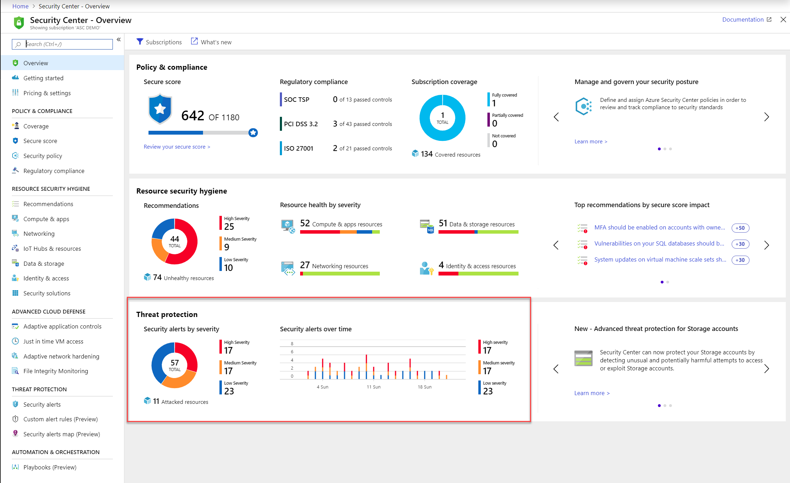
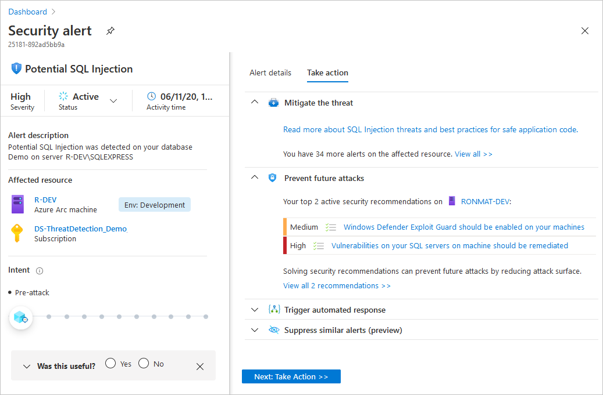

# Manage and respond to security alerts in Azure Security Center

This topic shows you how to view and process the alerts that you have received in order to protect your resources. 

* To learn about the different types of alerts, see [Security alert types](alerts-reference.md).
* For an overview of how Security Center generates alerts, see [How Azure Security Center detects and responds to threats](security-center-alerts-overview.md).

> [!NOTE]
> To enable advanced detections, upgrade to Azure Security Center Standard. A free trial is available. To upgrade, select Pricing Tier in the [Security Policy](tutorial-security-policy.md). See [Azure Security Center pricing](security-center-pricing.md) to learn more.

## What are security alerts?
Security Center automatically collects, analyzes, and integrates log data from your Azure resources, the network, and connected partner solutions, like firewall and endpoint protection solutions, to detect real threats and reduce false positives. A list of prioritized security alerts is shown in Security Center along with the information you need to quickly investigate the problem and recommendations for how to remediate an attack.

> [!NOTE]
> For more information about how Security Center detection capabilities work, see [How Azure Security Center detects and responds to threats](security-center-alerts-overview.md#detect-threats).

## Manage your security alerts

1. From the Security Center dashboard, see the  **Threat protection** tile to view and overview of the alerts.

    

1. To see more details about the alerts, click the tile.

   

1. To filter the alerts shown, click **Filter**, and from the **Filter** blade that opens, select the filter options that you want to apply. The list updates according to the selected filter. Filtering can be very helpful. For example, you might you want to address security alerts that occurred in the last 24 hours because you are investigating a potential breach in the system.

    

## Respond to security alerts

1. From the **Security alerts** list, click a security alert. The resources involved and the steps you need to take to remediate an attack is shown.

    

1. After reviewing the information, click a resource that was attacked.

    The left pane of the security alert page shows high-level information regarding the security alert: title, severity, status, activity time, description of the suspicious activity, and the affected resource. Alongside the affected resource are the Azure tags relevant to the resource. Use these to infer the organizational context of the resource when investigating the alert.

    The right pane includes the **Alert details** tab containing further details of the alert to help you investigate the issue: IP addresses, files, processes, and more.
     
    

    Also in the right pane is the **Take action** tab. Use this tab to take further actions regarding the security alert. Actions such as:
    - *Mitigate the threat* - provides manual remediation steps for this security alert
    - *Prevent future attacks* - provides security recommendations to help reduce the attack surface, increase security posture, and thus prevent future attacks
    - *Trigger automated response* - provides the option to trigger a logic app as a response to this security alert
    - *Suppress similar alerts* - provides the option to suppress future alerts with similar characteristics if the alert isn’t relevant for your organization

    

## See also

In this document, you learned how to view security alerts. See the following pages for related material:

- [Configure alert suppression rules](alerts-suppression-rules.md)
- [Automate responses to alerts and recommendations with workflow automation](workflow-automation.md)
