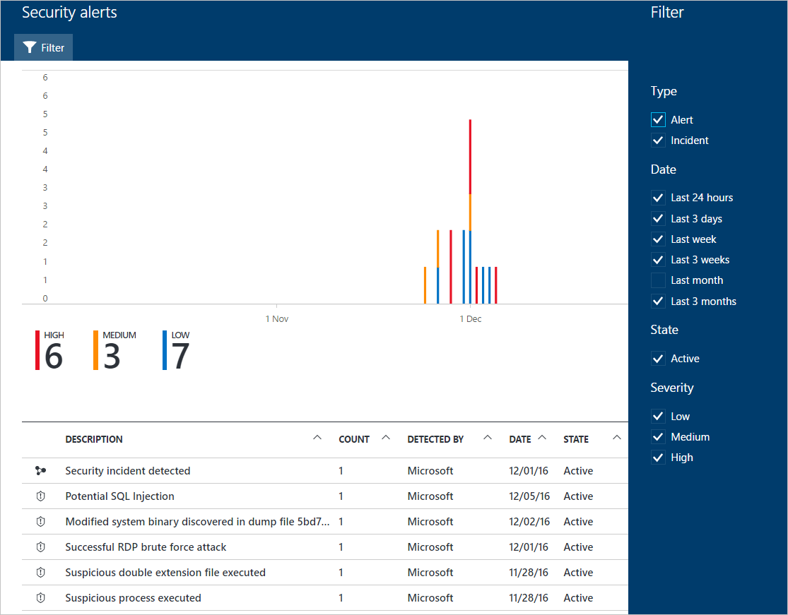

# Managing and responding to security alerts in Azure Security Center
This document helps you use Azure Security Center to manage and respond to security alerts.

> [!NOTE]
> To enable advanced detections, upgrade to Azure Security Center Standard. A free 60-day trial is available. To upgrade, select Pricing Tier in the [Security Policy](security-center-policies.md). See [Azure Security Center pricing](security-center-pricing.md) to learn more.
>
>

## What are security alerts?
Security Center automatically collects, analyzes, and integrates log data from your Azure resources, the network, and connected partner solutions, like firewall and endpoint protection solutions, to detect real threats and reduce false positives. A list of prioritized security alerts is shown in Security Center along with the information you need to quickly investigate the problem and recommendations for how to remediate an attack.

> [!NOTE]
> For more information about how Security Center detection capabilities work, read [Azure Security Center Detection Capabilities](security-center-detection-capabilities.md).
>
>

## Managing security alerts
You can review your current alerts by looking at the **Security alerts** tile. Follow the steps below to see more details about each alert:

1. On the Security Center dashboard, you see the **Security alerts** tile.

    

2. Click the tile to open the **Security alerts** to see more details about the alerts.

   

In the bottom part of this page are the details for each alert. To sort, click the column that you want to sort by. The definition for each column is given below:

* **Description**: A brief explanation of the alert.
* **Count**: A list of all alerts of this specific type that were detected on a specific day.
* **Detected by**: The service that was responsible for triggering the alert.
* **Date**: The date that the event occurred.
* **State**: The current state for that alert. There are two types of states:
  * **Active**: The security alert has been detected.
  * **Dismissed**: The security alert has been dismissed by the user. This status is typically used for alerts that were investigated and either mitigated or found not to be an actual attack.
* **Severity**: The severity level, which can be high, medium or low.

> [!NOTE]
> Security alerts generated by Security Center will also appear under Azure Activity Log. For more information about how to access Azure Activity Log, read [View activity logs to audit actions on resources](https://docs.microsoft.com/azure/azure-resource-manager/resource-group-audit).
>

### Filtering alerts
You can filter alerts based on date, state, and severity. Filtering alerts can be useful for scenarios where you need to narrow the scope of security alerts show. For example, you might you want to address security alerts that occurred in the last 24 hours because you are investigating a potential breach in the system.

1. Click **Filter** on the **Security Alerts**. The **Filter** opens and you select the date, state, and severity values you wish to see.

    

### Respond to security alerts
Select a security alert to learn more about the event(s) that triggered the alert and what, if any, steps you need to take to remediate an attack. Security alerts are grouped by type and date. Clicking a security alert opens a page containing a list of the grouped alerts.

In this case, the alerts that were triggered refer to suspicious Remote Desktop Protocol (RDP) activity. The first column shows which resources were attacked; the second shows how many times the resource was attacked; the third shows the time of the attack; the fourth shows state of the alert; and the fifth shows the severity of the attack. After reviewing this information, click the resource that was attacked.

In the **Description** field you find more details about this event. These additional details offer insight into what triggered the security alert, the target resource, when applicable the source IP address, and recommendations about how to remediate.  In some instances, the source IP address is empty (not available) because not all Windows security events logs include the IP address.

The remediation suggested by Security Center vary according to the security alert. In some cases, you may have to use other Azure capabilities to implement the recommended remediation. For example, the remediation for this attack is to blacklist the IP address that is generating this attack by using a [network ACL](../virtual-network/virtual-networks-acl.md) or a [network security group](../virtual-network/security-overview.md#security-rules) rule. For more information on the different types of alerts, read [Security Alerts by Type in Azure Security Center](security-center-alerts-type.md).

> [!NOTE]
> Security Center has released to limited preview a new set of detections that leverage auditd records, a common auditing framework, to detect malicious behaviors on Linux machines. Please send an email 
> with your subscription IDs to [us](mailto:ASC_linuxdetections@microsoft.com) to join the preview.

## See also
In this document, you learned how to configure security policies in Security Center. To learn more about Security Center, see the following:

* [Handling Security Incident in Azure Security Center](security-center-incident.md)
* [Azure Security Center Detection Capabilities](security-center-detection-capabilities.md)
* [Azure Security Center Planning and Operations Guide](security-center-planning-and-operations-guide.md)
* [Azure Security Center FAQ](security-center-faq.md) — Find frequently asked questions about using the service.
* [Azure Security blog](http://blogs.msdn.com/b/azuresecurity/) — Find blog posts about Azure security and compliance.
