<properties
   pageTitle="Security health monitoring in Azure Security Center | Microsoft Azure"
   description="This document helps you to get started with monitoring capabilities in Azure Security Center."
   services="security-center"
   documentationCenter="na"
   authors="YuriDio"
   manager="swadhwa"
   editor=""/>

<tags
   ms.service="security-center"
   ms.devlang="na"
   ms.topic="hero-article"
   ms.tgt_pltfrm="na"
   ms.workload="na"
   ms.date="07/19/2016"
   ms.author="yurid"/>

#Security health monitoring in Azure Security Center
This document helps you use monitoring capabilities in Azure Security Center to monitor compliance with policies.

> [AZURE.NOTE] The information in this document applies to the preview release of Azure Security Center.

##What is security health monitoring?
We often think of monitoring as watching and waiting for an event to occur so that we can react to the situation. Security monitoring refers to having a proactive strategy that audits your resources to identify systems that do not meet organizational standards or best practices.

##Monitoring security health
After you enable [security policies](security-center-policies.md) for a subscription’s resources, Security Center will analyze the security of your resources to identify potential vulnerabilities.  Information about your network configuration is available instantly, it may take an hour or more for information about virtual machine configuration - such as security update status and OS configuration - to become available. You can view the security state of your resources, along with any issues in the **Resource Security Health** blade. You can also view a list of those issues on the **Recommendations** blade.

For more information on how to apply recommendations read [Implementing security recommendations in Azure Security Center](security-center-recommendations.md).

On the **Resources security health** tile you can to monitor the security state of your resources. In the example below, you can see a number of issues with high and medium severity that require attention. The security policies that are enabled will impact the types of controls that are monitored.

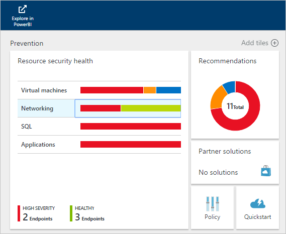

If Security Center identifies a vulnerability that needs to addressed, such as a VM with missing security updates or a subnet without a [network security group](../virtual-network/virtual-networks-nsg.md), it will be listed here.

###Monitor virtual machines
When you click on **Virtual machines** in the **Resources security health** tile, the **Virtual machines** blade will open with more details about onboarding and prevention steps as well as a list of all VMs that are monitored by Security Center as shown below.

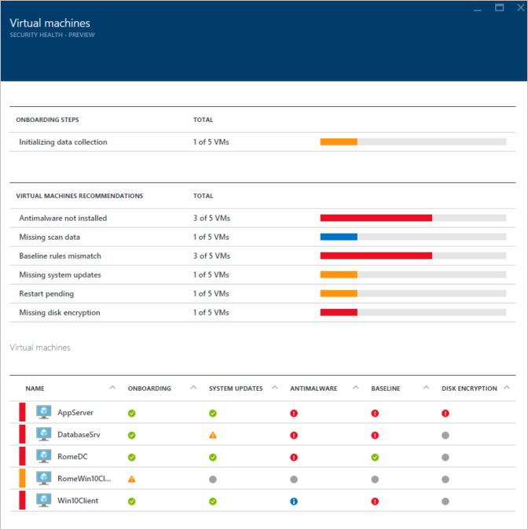

- Onboarding steps
- Virtual machine recommendations
- Virtual machines

In each section you can select an individual option to see more details regarding the recommended step to address that issue. The sections below will cover these areas in more detail.

####Onboarding steps
This section shows the total number of VMs that were initialized for data collection and their current status. Once all VM have data collection initialized, they will be ready to receive Security Center security policies. When you click in this entry, the **Initializing data collection** blade opens and you will be able to see the names of the VMs and the current status of data collection in the **INSTALLATION STATUS** column as shown below.

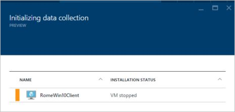

####Virtual machine recommendations
This section has a set of recommendations for each VM monitored by Azure Security Center. The first column lists the recommendation, the second column the total number of VMs that are affected by that recommendation and the third column shows the severity of the issue as illustrated below.

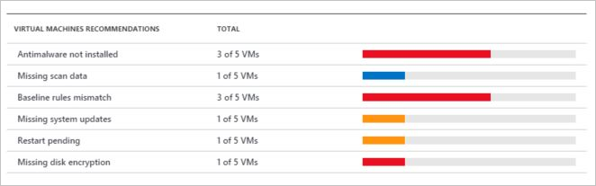

> [AZURE.NOTE] Only VMs with at least one public endpoint are shown in the Networking Health blade in the Network topology list.

Each recommendation has a set of actions that can be performed once you click on it. For example, if you click **Missing system updates**, the **Missing system updates** blade will open. It lists the VMs that are missing patches and the severity of the missing update as shown below.

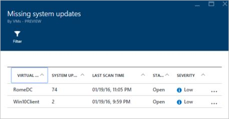

The **Missing system updates** blade will show a table with the following information:

- **VIRTUAL MACHINE**: The name of the virtual machine that is missing updates.
- **SYSTEM UPDATES**: The number of system updates that are missing.
- **LAST SCAN TIME**: The time that Security Center last scanned the VM for updates.
- **STATE**: The current state of the recommendation:
	- **Open**: The recommendation has not been addressed yet
	- **In Progress**: The recommendation is currently being applied to those resources, no action is required by you
	- **Resolved**: The recommendation was already completed (when the issue has been resolved, the entry is grayed out).
- **SEVERITY**: Describes the severity of that particular recommendation:
	- **High**: A vulnerability exists with a meaningful resource (application, VM, network security group) and requires attention
	- **Medium**: Non-critical or additional steps required to complete a process or eliminate a vulnerability
	- **Low**: A vulnerability should be addressed but does not require immediate attention. (By default, low recommendations are not presented, but you can filter on low recommendations if you want to view them.)

To view the recommendation details, click the VM’s name. A new blade for that VM opens up with the list of updates as shown below.

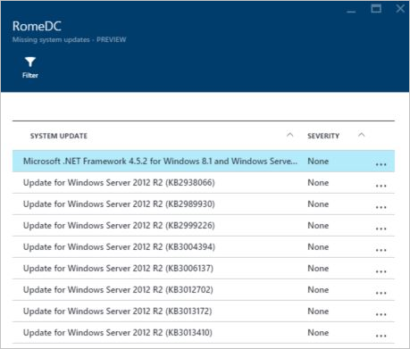

> [AZURE.NOTE] The security recommendations here are the same as those in the Recommendations blade. See the article [Implementing security recommendations in Azure Security Center](security-center-recommendations.md) for more information on resolving recommendations. This is applicable not only for VMs, but for all resources that are available in the Resource Health tile.

####Virtual machines section
The virtual machines section gives you an overview of all VMs and recommendations. Each column represents one set of recommendations as shown below:

The icon that appears under each recommendation helps you to quickly identify which VMs need attention and what type of recommendation.

In the example above, one VM has a critical recommendation regarding antimalware programs. To obtain more information about the VM, click on it. A new blade open that represents this VM as shown below.

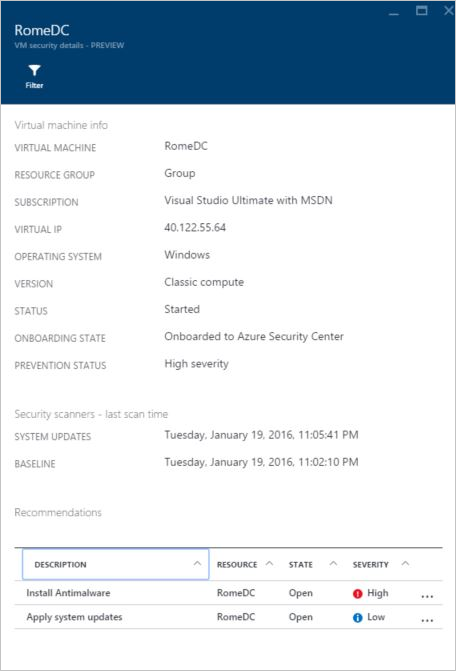

This blade has the security details for the VM. At the bottom of this blade you can see the recommended action and the severity of each issue.

#### Cloud services (Preview) section
Health status for cloud services is included in the virtual machines security health tile. A recommendation is created when the OS version is out of date as shown below: 

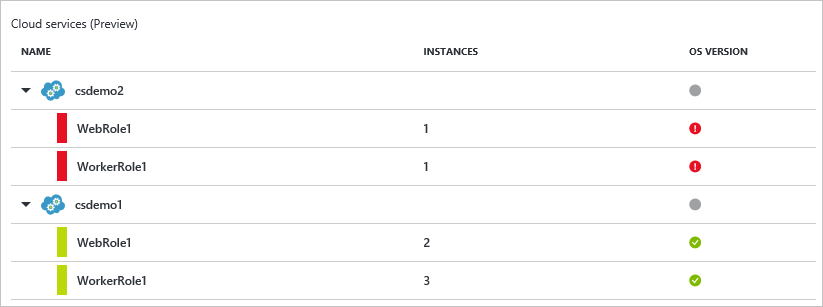

You will have to follow the steps in the recommendation to update the OS version. For example, if you click in the red alert in one of the Web role (runs Windows Server with your web app automatically deployed to IIS) or Worker role (runs Windows Server with your web app automatically deployed to IIS) a new blade will open up with more details about this recommendation as shown below:

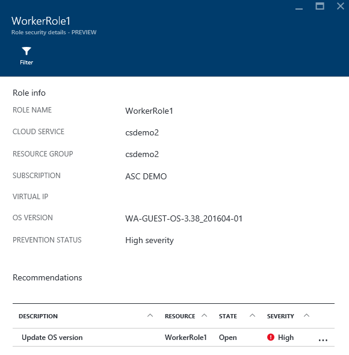 

To see the a more prescriptive explanation regarding this recommendation, click Update **OS version** under **DESCRIPTION **column. The **Update OS version (Preview)** blade will open with more details.

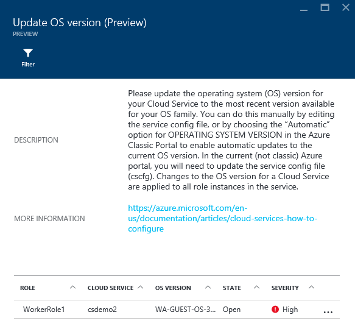  

### Monitor virtual networks
When you click on **Networking** in the **Resources security health** tile, the **Networking** blade will open with more details as shown below:

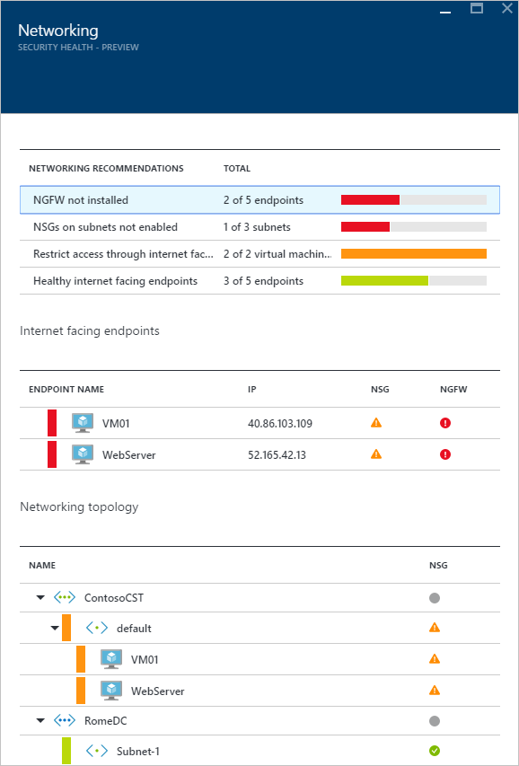

####Networking recommendations

Similar to the virtual machines resource health information, this blade provides a summarized list of issues at the top of the blade and a list of monitored networks on the bottom.

The networking status breakdown section lists potential security issues and offers recommendations. Possible issues can include:

- Next Generation Firewall (NGFW) not installed
- Network Security Groups (NSGs) on subnets not enabled
- NSGs on VMs not enabled
- Restrict external access through public external endpoint
- Healthy internet facing endpoints

When you click in one of those recommendations a new blade will open with more details regarding the recommendation as shown in the example below.

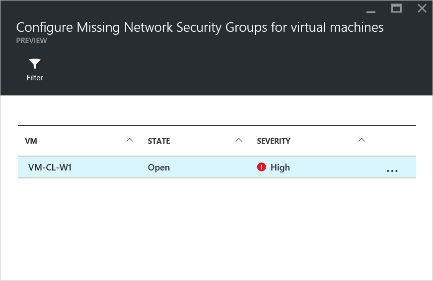

In this example the **Configure Missing Network Security Groups for Subnets** blade has a list of subnets and virtual machines with which are missing NSG protection. If you click on the subnet that you want to apply the NSG, another blade will open.

In the **Choose network security group** blade you will select the most appropriate Network Security Group for the subnet or your can create a new Network Security Group. 

####Internet facing endpoints section

In the **Internet facing endpoints** section, you will be able to see the VMs that are currently configured with an Internet facing endpoint and its current status.

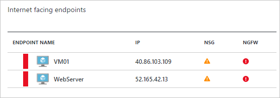

This table has the endpoint name that represents the VM, the Internet facing IP address, the current severity status of the NSG and the NGFW. The table is sorted by severity, as described below:
- Red (on top): high priority and should be addressed immediately 
- Orange: medium priority and should be addressed as soon as possible
- Green (last one): health state

####Networking topology section

In the **Networking topology** section, there is a hierarchical view of the resources as shown below:

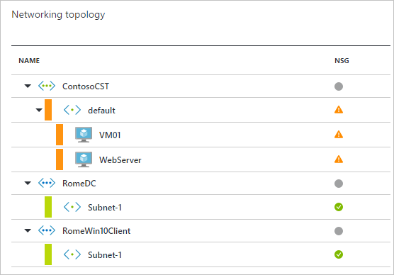

This table is sorted (VMs and Subnets) by severity, as described below:
- Red (on top): high priority and should be addressed immediately 
- Orange: medium priority and should be addressed as soon as possible
- Green (last one): health state

In this topology view, the first level has [Virtual Networks](../virtual-network/virtual-networks-overview.md), [Virtual Network Gateways](../vpn-gateway/vpn-gateway-site-to-site-create.md) and [Virtual Network (classic)](../virtual-network/virtual-networks-create-vnet-classic-pportal.md). The second level has subnets and the third level has the VMs that belongs to those subnets. The right column has the current status of the Network Security Group (NSG) for those resources. The example below is the result of selecting the VM VM-CL-W1:

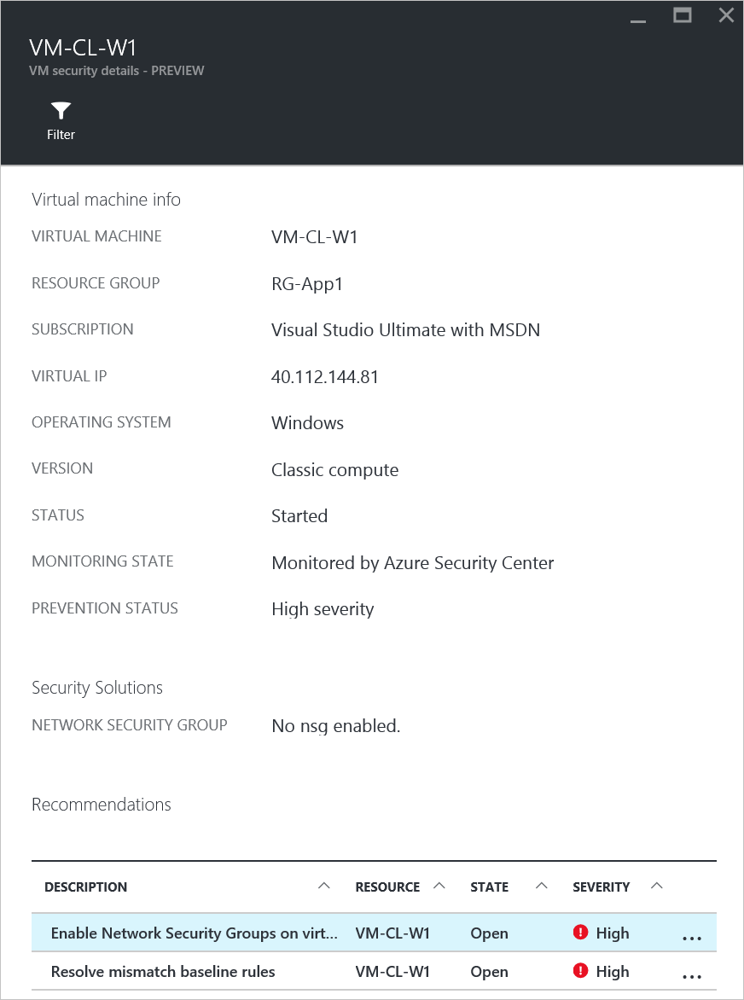

The bottom part of this blade has the recommendations for this VM, similar to what is described above. You can click on a recommendation to learn more or apply the needed security control/configuration.

###Monitor SQL resources
When you click **SQL** in the **Resources security health** tile, the SQL blade will open with recommendations for issues such as auditing, transparent data encryption not being enabled. It also has recommendations for the general health state of the database.

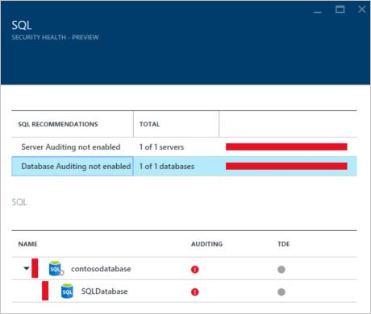

You can click on any one of these recommendations and get more details about further action for resolving issue. The example below shows the expansion of the **Database Auditing not enabled** recommendation.

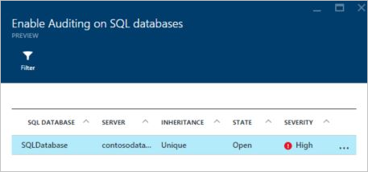

The **Enable Auditing on SQL databases** blade has the following information:

- A list of SQL databases
- The server on which they are located
- Information about whether this setting was inherited from the server or if it is unique in this database
- The current state
- The severity of the issue

When you click on the database to address this recommendation, the **Auditing & Threat detection** blade will open as shown below.

To enable the auditing, simply select **ON** under the **Auditing** option and then click **Save**.

###Monitor applications
If your Azure workload has applications located in [resource manager VMs](../resource-manager-deployment-model.md) with exposed web ports (TCP ports 80 and 443), Security Center can monitor those to identify potential security issues and recommend remediation steps. When you click in the **Applications** tile, the **Applications** blade will open up with a series of recommendations in the prevention steps section. It also shows the application breakdown per host/virtual IP as shown below.

Just like you did with the other recommendations, you can click on it to see more details about the issue and how to remediate. The example shown in figure below is an application that was identified as an unsecure web application. When you select the application that was considered not secure, another blade will open with the following option available:

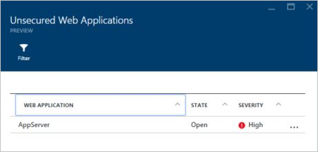

The **Unsecured Web Applications** blade will have a list of all VMs that contain applications that are not considered secure. The list shows the VM name, the current state of the issue and severity of the issue. If you click on this web application, the **Add a Web Application Firewall** blade will open with options for you to install a third party WAF (web application firewall) as shown below.

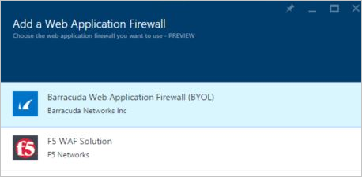

## See also
In this document, you learned how to use monitoring capabilities in Azure Security Center. To learn more about Azure Security Center, see the following:

- [Setting security policies in Azure Security Center](security-center-policies.md)
– Learn how to configure security settings in Azure Security Center
- [Managing and responding to security alerts in Azure Security Center](security-center-managing-and-responding-alerts.md) - Learn how to manage and respond to security alerts
- [Monitoring partner solutions with Azure Security Center](security-center-partner-solutions.md) -- Learn how to monitor the health status of your partner solutions.
- [Azure Security Center FAQ](security-center-faq.md) – Find frequently asked questions about using the service
- [Azure Security Blog](http://blogs.msdn.com/b/azuresecurity/) – Find blog posts about Azure security and compliance
