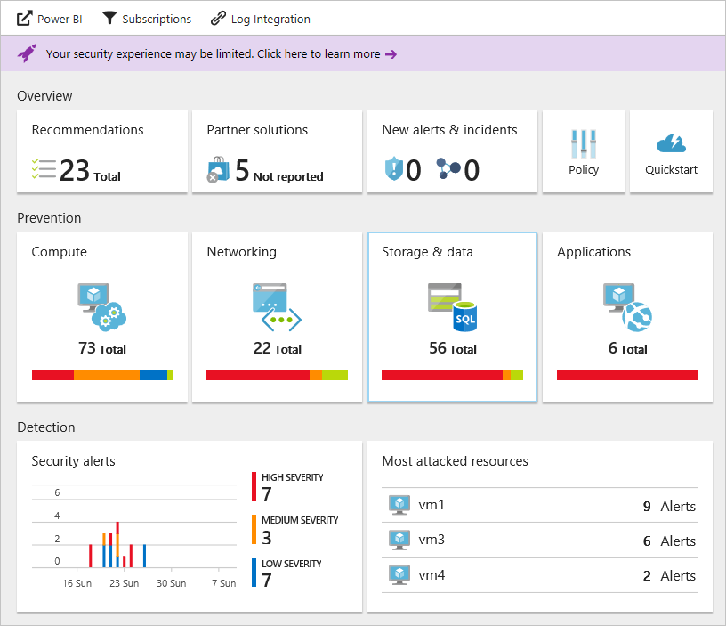

# Strengthen your security posture with Azure Security Center
This article helps you strengthen your security posture. Use the monitoring capabilities in Azure Security Center to make sure your resource security is as tight as possible and monitor compliance with policies.

## How do you strengthen your security posture?
We often think of monitoring as watching and waiting for an event to occur so that we can react to the situation. Strengthening your security posture refers to having a proactive strategy that audits your resources to identify systems that do not meet organizational standards or best practices.

After you enable [security policies](tutorial-security-policy.md) for a subscription’s resources, Security Center analyzes the security of your resources to identify potential vulnerabilities. Information about your network configuration is available instantly. Depending on the number of VMs and computers that you have with the agent installed, it may take an hour or more to collect information about VMs and computer's configuration, such as security update status and operating system configuration, to become available. You can view a full list of issues and ways to harden your network and remediate risk in the **Recommendations** tile.

You can view the security state of your resources and any issues per resource type:

- To monitor the health of your computer resources and your apps, and receive recommendations for improving their security, see [Protecting your machines and applications in Azure Security Center](security-center-virtual-machine-protection.md)
- To monitor your network resources, such as virtual machines, network security groups and endpoints, and receive recommendations for improving their security, see [Protecting your network in Azure Security Center](security-center-network-recommendations.md) for more information. 
- To monitor your data and storage resources, such as SQL servers and storage accounts, and receive recommendations for improving their security, see [Protecting Azure SQL service and data in Azure Security Center](security-center-sql-service-recommendations.md) for more information. 
- To monitor your identity and access resources, including MFA and account permissions, and receive recommendations for improving their security, see [Monitor identity and access in Azure Security Center](security-center-identity-access.md) for more information. 
- To monitor just-in-time access to your resources, see [Manage virtual machine access using just-in-time](security-center-just-in-time.md) for more information.

For more information about how to apply recommendations, read [Implementing security recommendations in Azure Security Center](security-center-recommendations.md).

## See also
In this article, you learned how to use monitoring capabilities in Azure Security Center. To learn more about Azure Security Center, see the following:

* [Setting security policies in Azure Security Center](tutorial-security-policy.md): Learn how to configure security settings in Azure Security Center.
* [Managing and responding to security alerts in Azure Security Center](security-center-managing-and-responding-alerts.md): Learn how to manage and respond to security alerts.
* [Monitoring partner solutions with Azure Security Center](security-center-partner-solutions.md): Learn how to monitor the health status of your partner solutions.