# Security health monitoring in Azure Security Center
This article helps you use the monitoring capabilities in Azure Security Center to monitor compliance with policies.

## What is security health monitoring?
We often think of monitoring as watching and waiting for an event to occur so that we can react to the situation. Security monitoring refers to having a proactive strategy that audits your resources to identify systems that do not meet organizational standards or best practices.

## Monitoring security health
After you enable [security policies](security-center-policies.md) for a subscription’s resources, Security Center analyzes the security of your resources to identify potential vulnerabilities. Information about your network configuration is available instantly. It may take an hour or more for information about virtual machine configuration, such as security update status and operating system configuration, to become available. You can view the security state of your resources and any issues in the **Prevention** section. You can also view a list of those issues on the **Recommendations** tile.

For more information about how to apply recommendations, read [Implementing security recommendations in Azure Security Center](security-center-recommendations.md).

Under the **Prevention** section, you can monitor the security state of your resources. In the following example, you can see that in each resource's tile (Compute, Networking, Storage & data, and Application) has the total number of issues that were identified.

### Monitor compute
When you click **Compute** tile, the **Compute** blade that opens shows three tabs:

- **Overview**: monitoring and virtual machine recommendations.
- **Virtual Machines**: list all all virtual machines and its current security state.
- **Cloud Services**: list of all web and worker roles monitored by Security Center.

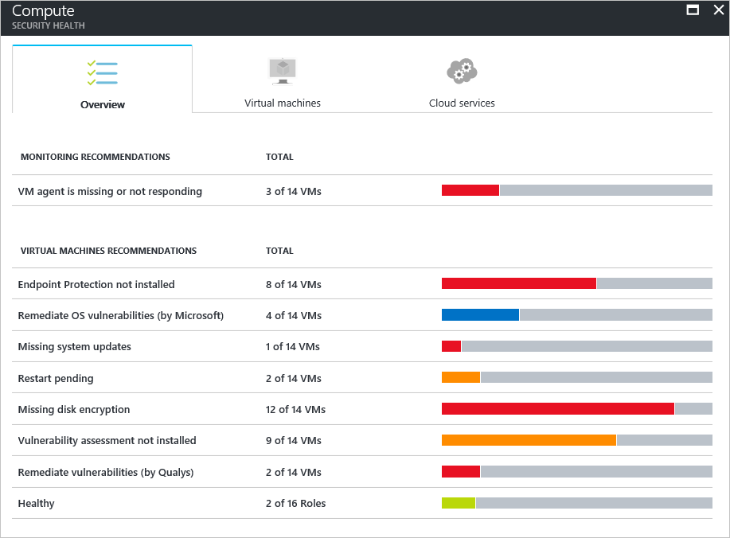

In each tab you can have multiple sections, and in each section, you can select an individual option to see more details about the recommended steps to address that particular issue. 

#### Monitoring recommendations
This section shows the total number of virtual machines that were initialized for data collection and their current statuses. After all virtual machines have data collection initialized, they will be ready to receive Security Center security policies. When you click this entry, the **VM Agent is missing or not responding** blade opens. 

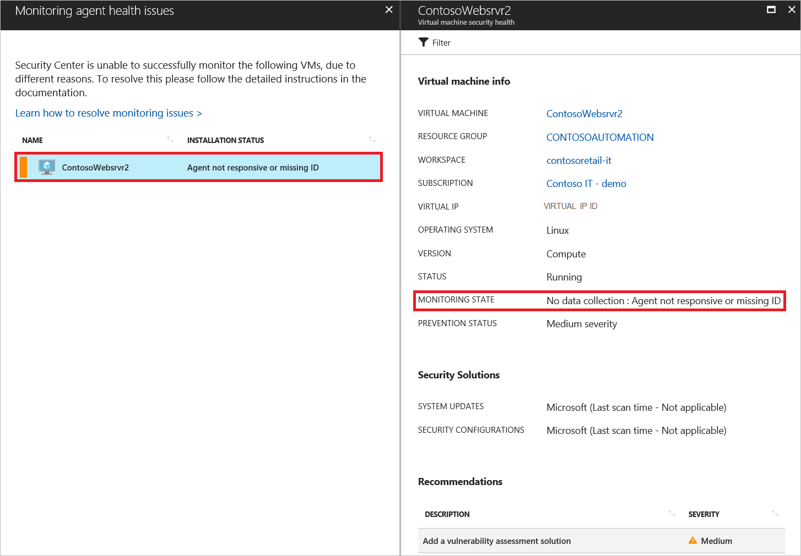

#### Virtual machine recommendations
This section has a set of [recommendations for each virtual machine](security-center-virtual-machine-recommendations.md) that Azure Security Center monitors. The first column lists the recommendation. The second column shows the total number of virtual machines that are affected by that recommendation. The third column shows the severity of the issue as illustrated in the following screenshot.

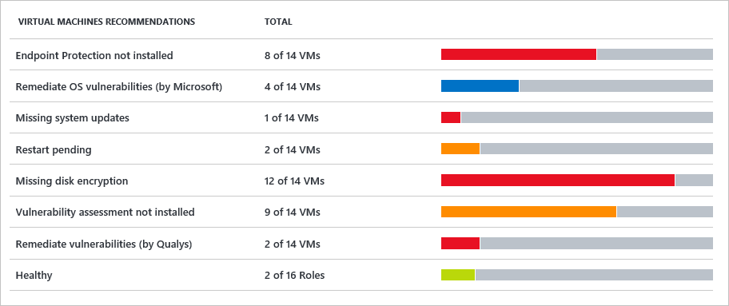

> [!NOTE]
> Only virtual machines that have at least one public endpoint are shown in the **Networking Health** blade in the **Network topology** list.
>
>

Each recommendation has a set of actions that you can perform after you click it. For example, if you click **Missing system updates**, the **Missing system updates** blade opens. It lists the virtual machines that are missing patches and the severity of the missing update as shown in the following screenshot.

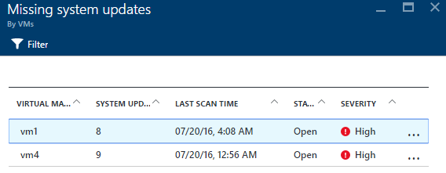

The **Missing system updates** blade shows a table with the following information:

* **VIRTUAL MACHINE**: The name of the virtual machine that is missing updates.
* **SYSTEM UPDATES**: The number of system updates that are missing.
* **LAST SCAN TIME**: The time that Security Center last scanned the virtual machine for updates.
* **STATE**: The current state of the recommendation:
  * **Open**: The recommendation has not been addressed yet.
  * **In Progress**: The recommendation is currently being applied to those resources, and no action is required by you.
  * **Resolved**: The recommendation was already finished. (When the issue has been resolved, the entry is dimmed).
* **SEVERITY**: Describes the severity of that particular recommendation:
  * **High**: A vulnerability exists with a meaningful resource (application, virtual machine, or network security group) and requires attention.
  * **Medium**: Non-critical or additional steps are required to complete a process or eliminate a vulnerability.
  * **Low**: A vulnerability should be addressed but does not require immediate attention. (By default, low recommendations are not presented, but you can filter on low recommendations if you want to view them.)

To view the recommendation details, click the name of the virtual machine. A new blade for that virtual machine opens with the list of updates as shown in the following screenshot.

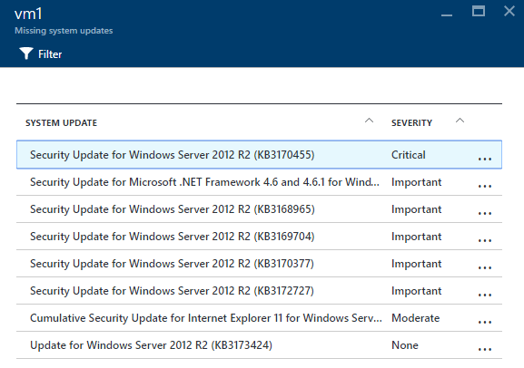

> [!NOTE]
> The security recommendations here are the same as those in the **Recommendations** blade. See the [Implementing security recommendations in Azure Security Center](security-center-recommendations.md) article for more information about how to resolve recommendations. This is applicable not only for virtual machines but also for all resources that are available in the **Resource Health** tile.
>
>

#### Virtual machines section
The virtual machines section gives you an overview of all virtual machines and recommendations. Each column represents one set of recommendations as shown in the following screenshot:

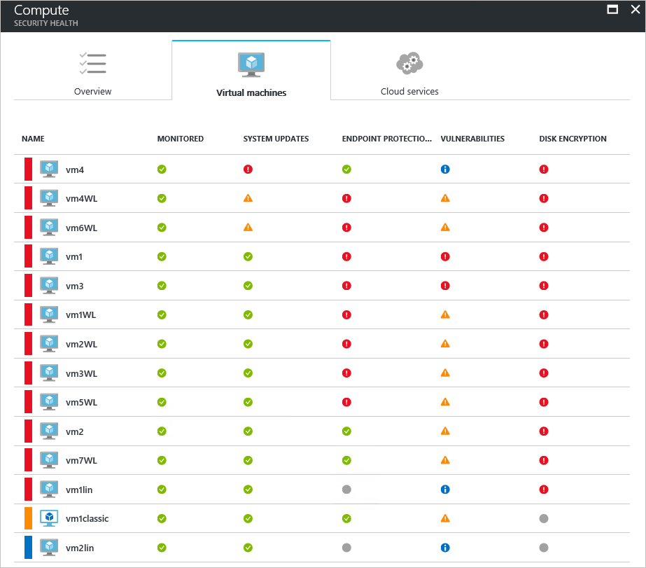

The icon that appears under each recommendation helps you to quickly identify the virtual machines that need attention and the type of recommendation.

In the previous example, one virtual machine has a critical recommendation regarding endpoint protection. To get more information about the virtual machine, click it. A new blade that opens represents this virtual machine as shown in the following screenshot.

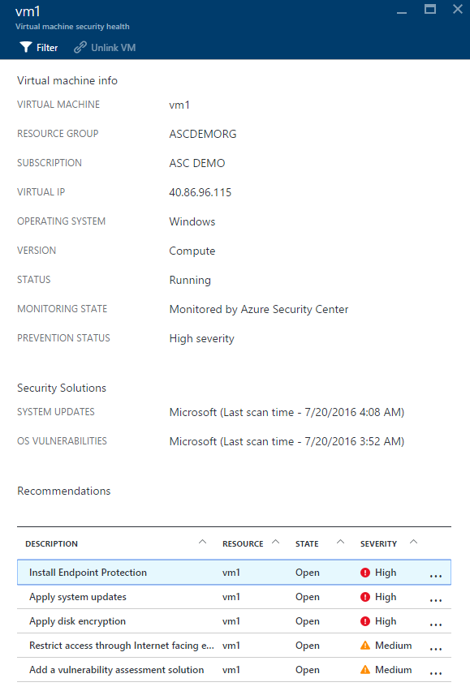

This blade has the security details for the virtual machine. At the bottom of this blade, you can see the recommended action and the severity of each issue.

#### Cloud services section
For cloud services, a recommendation is created when the operating system version is out of date as shown in the following screenshot:

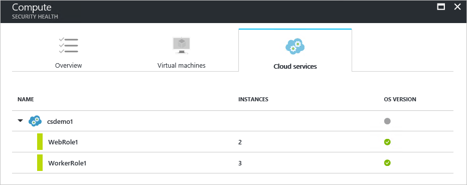

In a scenario where you do have recommendation (which is not the case for the previous example), you need to follow the steps in the recommendation to update the operating system version. When an update is available, you will have an alert (red or orange - depends on the severity of the issue). When you click on this alert in the WebRole1 (runs Windows Server with your web app automatically deployed to IIS) or WorkerRole1 (runs Windows Server with your web app automatically deployed to IIS) rows, a new blade opens with more details about this recommendation as shown in the following screenshot:

To see a more prescriptive explanation about this recommendation, click **Update OS version** under the **DESCRIPTION** column. The **Update OS version (Preview)** blade opens with more details.

  

### Monitor virtual networks
When you click **Networking** tile, the **Networking** blade opens with more details as shown in the following screenshot:

#### Networking recommendations
Like the virtual machine's resource health information, this blade provides a summarized list of issues at the top of the blade and a list of monitored networks on the bottom.

The networking status breakdown section lists potential security issues and offers [recommendations](security-center-network-recommendations.md). Possible issues can include:

* Next-Generation Firewall (NGFW) not installed
* Network security groups on subnets not enabled
* Network security groups on virtual machines not enabled
* Restrict external access through public external endpoint
* Healthy Internet facing endpoints

When you click a recommendation, a new blade opens with more details about the recommendation as shown in the following example.

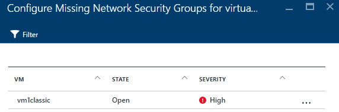

In this example, the **Configure Missing Network Security Groups for Subnets** blade has a list of subnets and virtual machines that are missing network security group protection. If you click the subnet to which you want to apply the network security group, another blade opens.

In the **Choose network security group** blade, you can select the most appropriate network security group for the subnet, or you can create a new network security group.

#### Internet facing endpoints section
In the **Internet facing endpoints** section, you can see the virtual machines that are currently configured with an Internet facing endpoint and its current status.

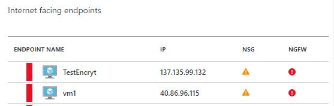

This table has the endpoint name that represents the virtual machine, the Internet facing IP address, and the current severity status of the network security group and the NGFW. The table is sorted by severity:

* Red (on top): High priority and should be addressed immediately
* Orange: Medium priority and should be addressed as soon as possible
* Green (last one): Healthy state

#### Networking topology section
The **Networking topology** section has a hierarchical view of the resources as shown in the following screenshot:

This table is sorted (virtual machines and subnets) by severity:

* Red (on top): High priority and should be addressed immediately
* Orange: Medium priority and should be addressed as soon as possible
* Green (last one): Healthy state

In this topology view, the first level has [virtual networks](../virtual-network/virtual-networks-overview.md), [virtual network gateways](/vpn-gateway/vpn-gateway-site-to-site-create.md), and [virtual networks (classic)](/virtual-network/virtual-networks-create-vnet-classic-pportal.md). The second level has subnets, and the third level has the virtual machines that belong to those subnets. The right column has the current status of the network security group for those resources, as shown in the following example:

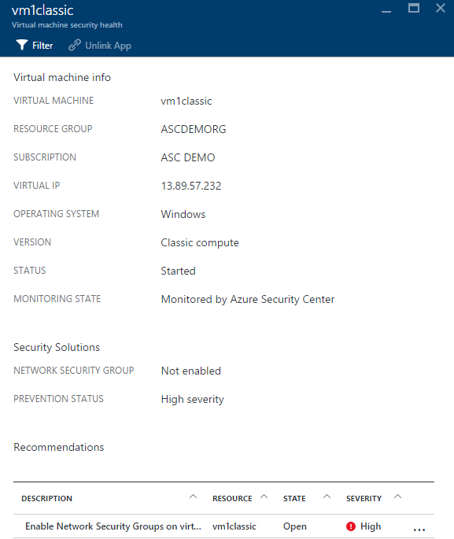

The bottom part of this blade has the recommendations for this virtual machine, which is similar to what is described previously. You can click a recommendation to learn more or apply the needed security control or configuration.

### Monitor Storage & data

When you click **Storage & data** in the **Prevention** section, the **Data Resources** blade opens with recommendations for SQL and Storage. It also has [recommendations](security-center-sql-service-recommendations.md) for the general health state of the database. For more information about storage encryption, read [Enable encryption for Azure storage account in Azure Security Center](security-center-enable-encryption-for-storage-account.md).

Under **SQL Recommendations**, You can click any recommendation and get more details about further action to resolve an issue. The following example shows the expansion of the **Database Auditing & Threat detection on SQL databases** recommendation.

The **Enable Auditing & Threat detection on SQL databases** blade has the following information:

* A list of SQL databases
* The server on which they are located
* Information about whether this setting was inherited from the server or if it is unique in this database
* The current state
* The severity of the issue

When you click the database to address this recommendation, the **Auditing & Threat detection** blade opens as shown in the following screen.

To enable auditing, select **ON** under the **Auditing** option.

### Monitor applications

If your Azure workload has applications located in [virtual machines (created through Azure Resource Manager)](../azure-resource-manager/resource-manager-deployment-model.md) with exposed web ports (TCP ports 80 and 443), Security Center can monitor those to identify potential security issues and recommend remediation steps. When you click the **Applications** tile, the **Applications** blade opens with a series of recommendations in the **Application recommendations** section. It also shows the application breakdown per host/virtual IP as shown in the following screenshot.

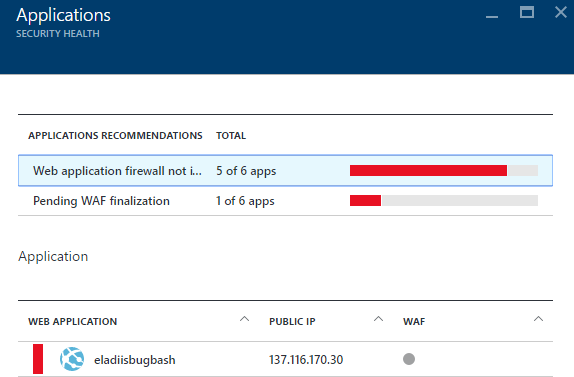

Just like you did with the other recommendations, you can click a recommendation to see more details about the issue and how to remediate. The example shown in the following figure is an application that was identified as an unsecure web application. When you select the application that was considered not secure, another blade opens with the following option available:

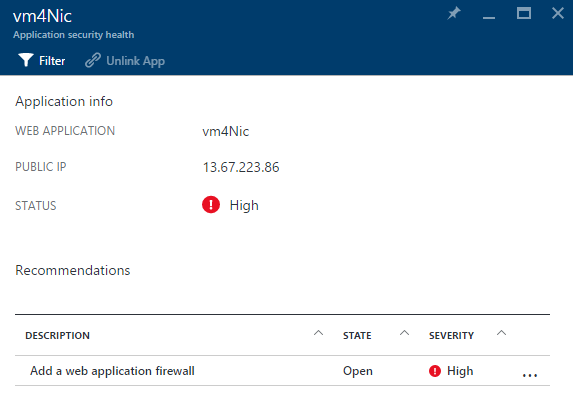

This blade will have a list of all recommendations for this application. When you click the **Add a web application firewall** recommendation, the **Add a Web Application Firewall** blade opens with options for you to install a web application firewall (WAF) from a partner as shown in the following screenshot.

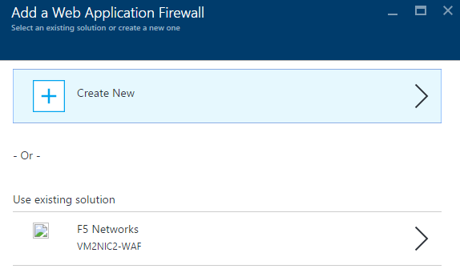

## See also
In this article, you learned how to use monitoring capabilities in Azure Security Center. To learn more about Azure Security Center, see the following:

* [Setting security policies in Azure Security Center](security-center-policies.md): Learn how to configure security settings in Azure Security Center.
* [Managing and responding to security alerts in Azure Security Center](security-center-managing-and-responding-alerts.md): Learn how to manage and respond to security alerts.
* [Monitoring partner solutions with Azure Security Center](security-center-partner-solutions.md): Learn how to monitor the health status of your partner solutions.
* [Azure Security Center FAQ](security-center-faq.md): Find frequently asked questions about using the service.
* [Azure Security Blog](http://blogs.msdn.com/b/azuresecurity/): Find blog posts about Azure security and compliance.
