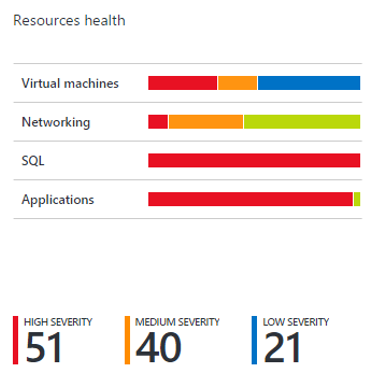
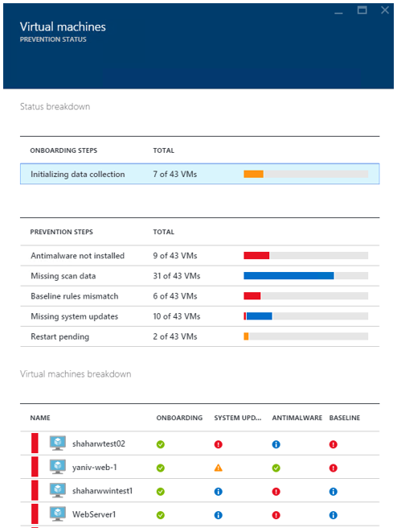
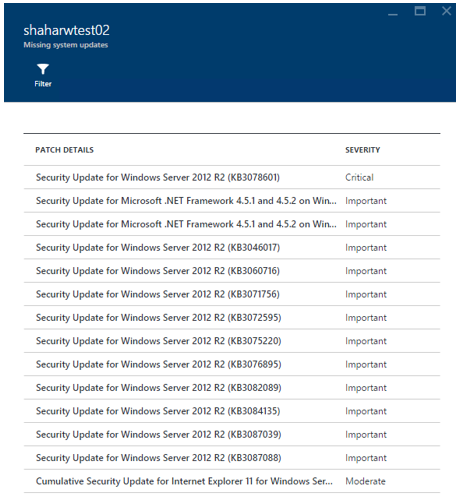
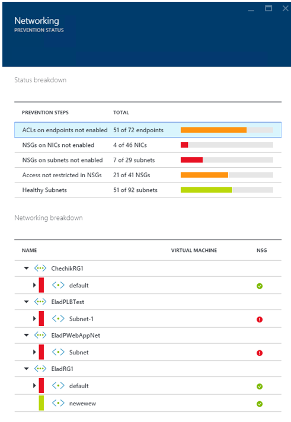
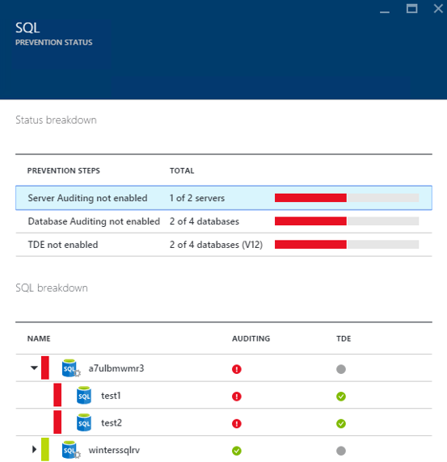
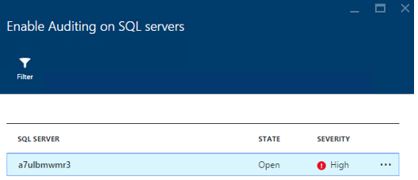
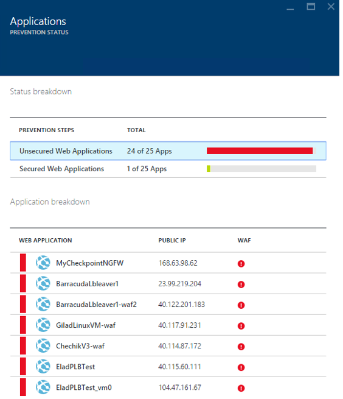
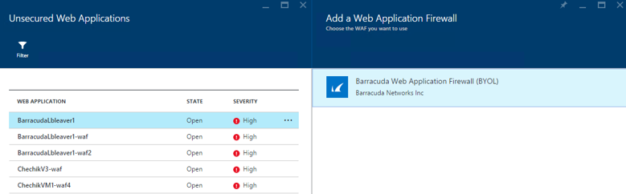

<properties
   pageTitle="Security health monitoring in Azure Security Center | Microsoft Azure"
   description="This document helps you to get started with monitoring capabilities in Azure Security Center."
   services="security-center"
   documentationCenter="na"
   authors="YuriDio"
   manager="swadhwa"
   editor=""/>

<tags
   ms.service="security-center"
   ms.devlang="na"
   ms.topic="article"
   ms.tgt_pltfrm="na"
   ms.workload="na"
   ms.date="12/01/2015"
   ms.author="yurid"/>

#Security health monitoring in Azure Security Center
Learn how to use monitoring capabilities in Azure Security Center using this walkthrough.

> [AZURE.NOTE] The information in this document applies to the preview release of Azure Security Center.

##What is security health monitoring?
We often think of monitoring as watching and waiting for an event to occur so that we can react to the situation. Security monitoring refers to having a proactive strategy that audits your resources to identify systems that do not meet organizational standards or best practices. 

##Monitor compliance with policies
After enabling [security policies](security-center-policies.md) for the subscription’s resources, Azure Security Center will analyze the security of your resources to identify potential vulnerabilities.  While information about your network configuration is available instantly, it may take an hour or more for information about virtual machine configuration, such as security update status and OS configuration, to be available. You can view the security state of your resources, along with any issues in the Resource Security Health blades. You can also view a list of those issues on the Recommendations blades.

For more information on how to apply recommendations read [Implementing security recommendations in Azure Security Center](security-center-recommendations.md).

##Resource health
The **Resources health** tile allows you to monitor the security state of your resources. You will see a number of issues with high and medium severity that require attention as shown below:

The security policies that are enabled will impact the types of controls being monitored here. If Azure Security Center identifies a vulnerability which needs to addressed, such as a VM with missing security updates or a subnet without a [Network Security Group](virtual-networks-nsg.md), it will be identified here. 

###Virtual machine
When you click on **Virtual Machines** in the **Resources health** tile, the **Virtual Machines** blade will open with more details about the onboarding and prevention steps as well as a list of all VMs monitored by Azure Security Center as shown below:

Once you open this blade you will see three sections. For each section you can select an individual option to see more details regarding the recommended step to address that issue. 

For example, if you click **Missing system updates** under **Prevention Steps**, the **Missing system updates** blade will open with the list of VMs that are missing patches and the severity level for each one as shown below: 

To view the recommended updates details, click the VM’s name. A new blade for that VM opens up with the list of updates that are missing:

> [AZURE.NOTE] The security recommendations here are the same as those in the Recommendations blade. See the article [Implementing security recommendations in Azure Security Center](security-center-recommendations.md) for more information on resolving recommendations. This is applicable not only for VMs, but for all resources that are available in the Resource Health tile.

###Networking
The prevention status for networking shows the virtual networks monitored by Azure Security Center. When you click on **Networking** in the Resources health tile, the **Networking** blade will open with more details as shown below:

Similar to the virtual machines resource health information, this blade provides a summarized list of issues on the top of the blade and a list of monitored networks on the bottom.

In the networking status breakdown section, prevention steps such as [ACLs on endpoints](virtual-machines-set-up-endpoints.md) not enabled, [Network Security Groups](virtual-networks-nsg.md) not enabled and Healthy Subnets are listed. You can click on any of these and get more details and to take further actions to resolve the issue. 

An example of this will be the **NSGs on subnets not enabled** alert. If you click on this alert, the **Configure Missing Network Security Groups for Subnets** blade will open up. There you will see a description of a subnet that doesn’t have the Network Security Group enabled on it and the list of network interface cards that belong to this subnet. Select the subnet in which you want to apply the security group and click **Configure NSG** option. The **Choose network security** group blade will open up as shown below:

###SQL
When you click in **SQL** in the **Resources health** tile, the **SQL** blade will open with recommendations related to issues such as auditing not enabled, transparent data encryption not enabled and the database’s general health state. The lower part of the blade has the SQL Server breakdown and for each server the databases that belongs to it as shown below:

You can click on any one of these recommendations and get more details and to take further actions to resolve the issue. The example shown below has the expansion of the enable auditing on SQL servers.

###Applications
If your Azure workload has applications located in [resource manager VMs](resource-manager-deployment-model.md) with exposed web ports (TCP ports 80 and 443), Azure Security Center can monitor those to identify potential security issues and recommend remediation steps. When you click in the **Applications** tile, the **Applications** blade will open up with a series of recommendations in the prevention steps section and it also shows the application breakdown per host/virtual IP as shown below:

Just like any of the other recommendations for the previous resources, you can click on it to see more details about the issue and how to remediate. The example shown in figure below is an application that was identified as **Unsecure Web Application**. When you select the application that was considered not secure, another blade will open with the option available, which in this case is to enable the Web Application Firewall.

## Next steps
In this document, you learned how to use monitoring capabilities in Azure Security Center. To learn more about Azure Security Center, see the following:

- [Setting security policies in Azure Security Center](security-center-policies.md)
– Learn how to configure security settings in Azure Security Center
- [Managing and responding to security alerts in Azure Security Center](security-center-managing-and-responding-alerts.md) - Learn how to manage and respond to security alerts
- [Azure Security Center FAQ](security-center-faq.md) – Find frequently asked questions about using the service
- [Azure Security Blog](http://blogs.msdn.com/b/azuresecurity/) – Find blog posts about Azure security and compliance
