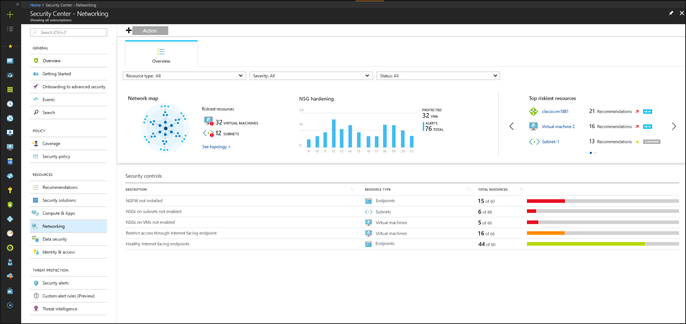
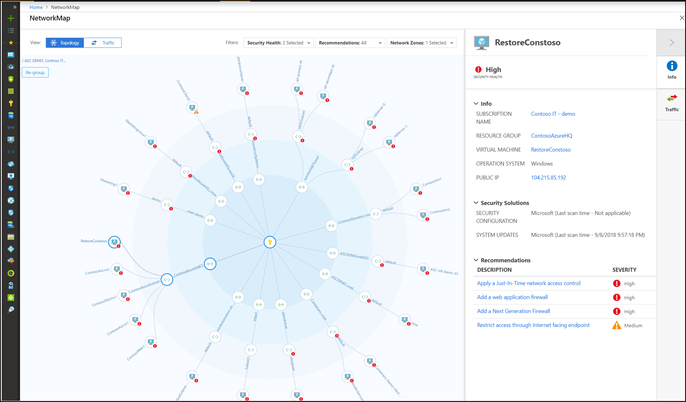
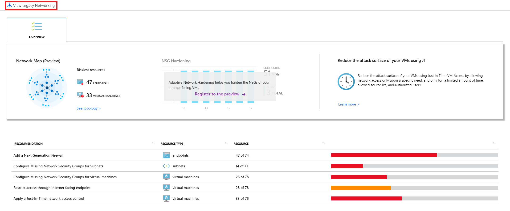

# Protect your network resources in Azure Security Center
Azure Security Center continuously analyzes the security state of your Azure resources for network security best practices. When Security Center identifies potential security vulnerabilities, it creates recommendations that guide you through the process of configuring the needed controls to harden and protect your resources.

This article addresses recommendations that apply to your Azure resources from a network security perspective. Networking recommendations center around next generation firewalls, Network Security Groups, JIT VM access overly permissive inbound traffic rules, and more. For a list of networking recommendations and remediation actions, see [Managing security recommendations in Azure Security Center](security-center-recommendations.md).

> [!NOTE]
> The **Networking** page lets you deep dive into your Azure resource health from a network perspective. The Network map and Adaptive Network Controls are available for the Azure Security Center standard tier only. [If you use the free tier, you can click the button to **View legacy networking** and receive networking resource recommendations](#legacy-networking).
>

The **Networking** page provides an overview of the sections you can deep dive into, to get more information about the health of your network resources:

- Network map (Azure Security Center Standard tier only)
- Adaptive Network Hardening
- Networking security recommendations.
- Legacy **Networking** blade (the previous networking blade) 
 

## Network map
The interactive network map provides a graphical view with security overlays giving you recommendations and insights for hardening your network resources. Using the map you can see the network topology of your Azure workloads, connections between your virtual machines and subnets, and the capability to drill down from the map into specific resources and the recommendations for those resources.

To open the Network map:

1. In Security Center, under Resource Security Hygiene, select **Networking**.
2. Under **Network map** click **See topology**.
 
The default view of the topology map displays:
- Subscriptions you selected in Azure. The map supports multiple subscriptions.
- VMs, subnets, and VNets of the Resource Manager resource type (Classic Azure resources are not supported)
- Peered VNets
- Only resources that have [network recommendations](security-center-recommendations.md) with a high or medium severity  
- Internet facing resources
- The map is optimized for the subscriptions you selected in Azure. If you modify your selection, the map is recalculated and re-optimized based on your new settings.  

## Understanding the Network map

The Network map can show you your Azure resources in a **Topology** view and a **Traffic** view.

### The topology view

In the **Topology** view of the networking map, you can view the following insights about your networking resources:
- In the inner circle, you can see all the Vnets within your selected subscriptions, the next circle is all the subnets, the outer circle is all the virtual machines.
- The lines connecting the resources in the map let you know which resources are associated with each other, and how your Azure network is structured. 
- Use the severity indicators to quickly get an overview of which resources have open recommendations from Security Center.
- You can click any of the resources to drill down into them and view the details of that resource and its recommendations directly, and in the context of the Network map.  
- If there are too many resources being displayed on the map, Azure Security Center uses its proprietary algorithm to smart cluster your resources, highlighting the resources that are in the most critical state, and have the most high severity recommendations. 

Because the map is interactive and dynamic, every node is clickable, and the view can change based on the filters:

1. You can modify what you see on the network map by using the filters at the top. You can focus the map based on:
   -  **Security health**: You can filter the map based on Severity (High, Medium, Low) of your Azure resources.
   - **Recommendations**: You can select which resources are displayed based on which recommendations are active on those resources. For example, you can view only resources for which Security Center recommends you enable Network Security Groups.
   - **Network zones**: By default, the map displays only Internet facing resources, you can select internal VMs as well.
 
2. You can click **Reset** in top left corner at any time to return the map to its default state.

To drill down into a resource:
1. When you select a specific resource on the map, the right pane opens and gives you general information about the resource, connected security solutions if there are any, and the recommendations relevant to the resource. It's the same type of behavior for each type of resource you select. 
2. When you hover over a node in the map, you can view general information about the resource, including subscription, resource type, and resource group.
3. Use the link to zoom into the tool tip and refocus the map on that specific node. 
4. To refocus the map away from a specific node, zoom out.

### The Traffic view

The **Traffic** view provides you with a map of all the possible traffic between your resources. This provides you with a visual map of all the rules you configured that define which resources can communicate with whom. This enables you to see the existing configuration of the network security groups as well as quickly identify possible risky configurations within your workloads.

### Uncover unwanted connections

The strength of this view is in its ability to show you these allowed connections together with the vulnerabilities that exist, so you can use this cross-section of data to perform the necessary hardening on your resources. 

For example, you might detect two machines that you weren’t aware could communicate, enabling you to better isolate the workloads and subnets.

### Investigate resources

To drill down into a resource:
1. When you select a specific resource on the map, the right pane opens and gives you general information about the resource, connected security solutions if there are any, and the recommendations relevant to the resource. It's the same type of behavior for each type of resource you select. 
2. Click **Traffic** to see the list of possible outbound and inbound traffic on the resource - this is a comprehensive list of who can communicate with the resource and who it can communicate with, and through which protocols and ports. For example, when you select a VM, all the VMs it can communicate with are shown, and when you select a subnet, all the subnets which it can communicate with are shown.

**This data is based on analysis of the Network Security Groups as well as advanced machine learning algorithms that analyze multiple rules to understand their crossovers and interactions.** 

## Legacy networking 

If you don't have Security Center Standard tier, this section explains how to view free Networking recommendations.

To access this information, in the Networking blade, click **View legacy networking**. 

### Internet facing endpoints section
In the **Internet facing endpoints** section, you can see the virtual machines that are currently configured with an Internet facing endpoint and its status.

This table has the endpoint name, the Internet facing IP address, and the current severity status of the network security group and the NGFW recommendations. The table is sorted by severity.

### Networking topology section
The **Networking topology** section has a hierarchical view of the resources.

This table is sorted (virtual machines and subnets) by severity.

In this topology view, the first level displays Vnets. The second displays has subnets, and the third level displays the virtual machines that belong to those subnets. The right column shows the current status of the network security group recommendations for those resources.

The third level displays virtual machines, which is similar to what is described previously. You can click any resource to learn more or apply the needed security control or configuration.

## Network recommendations

|Resource type|Secure score|Recommendation|Description|
|----|----|----|----|
|Machine|40|Network Security Groups for virtual machines should be enabled|Enable Network Security Groups to control network access of your virtual machines.|
|Subnet|35|Network Security Groups on the subnet level should be enabled|Enable network  security groups to control network access of resources deployed in your subnets.|
|Machine|30|Just-In-Time network access control should be applied on virtual machines|Apply just in time VM access control to permanently lock down access to selected ports, and enable authorized users to open them via the same mechanism and for a limited amount of time.|
|Machine|20|Restrict access through Internet facing endpoint|Harden the network security groups of your Internet facing VMs by restricting the access of your existing allow rules.|
|Machine|10|Add a next generation firewall|Add a Next Generation Firewall (NGFW) solution to better protect your internet facing VMs.|
|Machine|5|Route traffic through network gateway firewall only|In order to complete the deployment of your next generation firewall solution, traffic to your protected internet facing VMs should be routed only via the next generation firewall solution.|
|VNet|5|Enable DDoS protection standard|Applications with public IPs in these virtual networks are not protected with the DDOS protection service standard. It is advised to enable it to enable mitigation of network volumetric and protocol attacks.|

## See also
To learn more about recommendations that apply to other Azure resource types, see the following:

* [Protecting your virtual machines in Azure Security Center](security-center-virtual-machine-recommendations.md)
* [Protecting your applications in Azure Security Center](security-center-application-recommendations.md)
* [Protecting your Azure SQL service in Azure Security Center](security-center-sql-service-recommendations.md)

To learn more about Security Center, see the following:

* [Setting security policies in Azure Security Center](tutorial-security-policy.md) -- Learn how to configure security policies for your Azure subscriptions and resource groups.
* [Managing and responding to security alerts in Azure Security Center](security-center-managing-and-responding-alerts.md) -- Learn how to manage and respond to security alerts.
* [Azure Security Center FAQ](security-center-faq.md) -- Find frequently asked questions about using the service.
