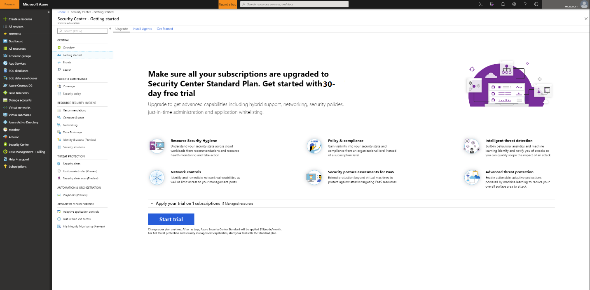
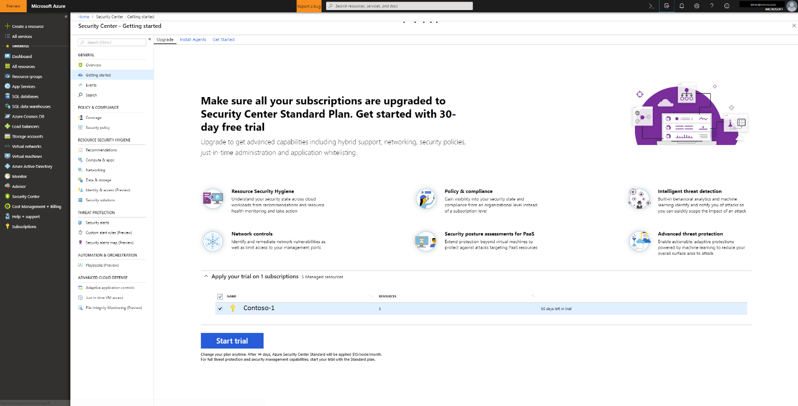

# Onboarding to Azure Security Center Standard for enhanced security
Upgrade to Security Center Standard to take advantage of enhanced security management and threat protection for your hybrid cloud workloads. You can try Standard free. See the Security Center [pricing page](https://azure.microsoft.com/pricing/details/security-center/) for more information.

Security Center standard tier includes:

- **Hybrid security** – Get a unified view of security across all of your on-premises and cloud workloads. Apply security policies and continuously assess the security of your hybrid cloud workloads to ensure compliance with security standards. Collect, search, and analyze security data from a variety of sources, including firewalls and other partner solutions.
- **Security alerts** - Use advanced analytics and the Microsoft Intelligent Security Graph to get an edge over evolving cyber-attacks. Leverage built-in behavioral analytics and machine learning to identify attacks and zero-day exploits. Monitor networks, machines, and cloud services for incoming attacks and post-breach activity. Streamline investigation with interactive tools and contextual threat intelligence.
- **Access and application controls** - Block malware and other unwanted applications by applying whitelisting recommendations adapted to your specific workloads and powered by machine learning. Reduce the network attack surface with just-in-time, controlled access to management ports on Azure VMs, drastically reducing exposure to brute force and other network attacks.

## Detecting unprotected resources
Security Center automatically detects any Azure subscriptions or workspaces not enabled for Security Center Standard. This includes Azure subscriptions using Security Center Free and workspaces that do not have the Security solution enabled.

You can upgrade an entire Azure subscription to the Standard tier, which is inherited by all supported resources within the subscription. Applying the Standard tier to a workspace applies to all resources reporting to the workspace.

> [!NOTE]
> You may want to manage your costs and limit the amount of data collected for a solution by limiting it to a particular set of agents. [Solution targeting](../operations-management-suite/operations-management-suite-solution-targeting.md) allows you to apply a scope to the solution and target a subset of computers in the workspace. If you are using solution targeting, Security Center lists the workspace as not having a solution.
>
>

## Upgrade an Azure subscription or workspace
To upgrade a subscription or workspace to standard:
1. Under the Security Center main menu, select **Getting started**.
  
2. Under **Upgrade**, Security Center lists subscriptions and workspaces eligible for onboarding. 
   - You can click on the expandable **Apply your trial** to see a list of all subscriptions and workspaces with their trial eligibility status.
   -	You can upgrade subscriptions and workspaces that are not eligible for trial.
   -	You can select eligible workspaces and subscriptions to start your trial.
3.	Click **Start trial** to start your trial on the selected subscriptions.
  

   > [!NOTE]
   > Security Center’s Free capabilities are applied to your Azure VMs and VMSS only. The Free capabilities are not applied to your non-Azure computers. If you select Standard, the Standard capabilities are applied to all Azure VMs, VM scale sets, and non-Azure computers reporting to the workspace. We recommend that you apply Standard to provide advanced security for your Azure and non-Azure resources.
   >

## Onboard non-Azure computers
Security Center can monitor the security posture of your non-Azure computers but you need to first onboard these resources. You can add non-Azure computers from the **Getting started** blade or from the **Compute** blade. We’ll walk through both methods.

### Add new non-Azure computers from **Getting started**

1. Return to **Getting started**.
2. Select the **Get started** tab.

   

3. Click **Configure** under **Add new non-Azure computers**. A list of your Log Analytics workspaces is shown. The list includes, if applicable, the default workspace created for you by Security Center when automatic provisioning was enabled. Select this workspace or another workspace you want to use.

   ![Add non-Azure computer][7]

If you have existing workspaces, they are listed under **Add new Non-Azure computers**. You can add computers to an existing workspace or create a new workspace. To create a new workspace, select the link **add a new workspace**.

### Add new non-Azure computers from **Compute**

**Create a new workspace and add computer**

1. Under **Add new non-Azure computers**, select **add a new workspace**.

   ![Add a new workspace][4]

2. Under **Security and Audit**, select **OMS Workspace** to create a new workspace.
   > [!NOTE]
   > OMS workspaces are now referred to as Log Analytics workspaces.
3. Under **OMS Workspace**, enter the information for your workspace.
4. Under **OMS Workspace**, select **OK**. After you select OK, you will get a link for downloading a Windows or Linux agent and keys for your workspace ID to use in configuring the agent.
5. Under **Security and Audit**, select **OK**.

**Select an existing workspace and add computer**

You can add a computer by following the workflow from **Onboarding**, as shown above. You can also add a computer by following the workflow from **Compute**. In this example, we use **Compute**.

1. Return to Security Center’s main menu and **Overview** dashboard.

   ![Overview][5]

2. Select **Compute & apps**.
3. Under **Compute & apps**, select **Add computers**.

   ![Compute blade][6]

4. Under **Add new non-Azure computers**, select a workspace to connect your computer to and click **Add Computers**.

   ![Add computers][7]

   The **Direct Agent** blade provides a link for downloading a Windows or Linux agent as well as the workspace ID and keys to use in configuring the agent.

## Next steps
In this article you learned how to onboard Azure and non-Azure resources in order to benefit from Security Center’s advanced security. To do more with your onboarded resources, see

- [Enable data collection](security-center-enable-data-collection.md)
- [Threat intelligence report](security-center-threat-report.md)
- [Just-in-time VM access](security-center-just-in-time.md)

<!--Image references-->
[1]: ./media/security-center-onboarding/onboard.png
[2]: ./media/security-center-onboarding/onboard-subscription.png
[3]: ./media/security-center-onboarding/get-started.png
[4]: ./media/security-center-onboarding/create-workspace.png
[5]: ./media/security-center-onboarding/overview.png
[6]: ./media/security-center-onboarding/compute-blade.png
[7]: ./media/security-center-onboarding/add-computer.png
[8]: ./media/security-center-onboarding/onboard-workspace.png
