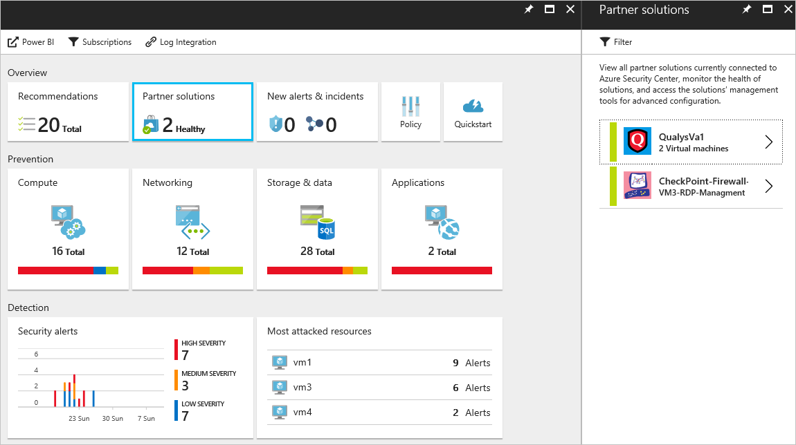

# Partner integration in Azure Security Center

In this article, we describe how Azure Security Center integrates with partners to enhance overall security. Security Center offers an integrated experience in Azure, and takes advantage of the Azure Marketplace for partner certification and billing.

> [!NOTE] 
> As of June 2017, Security Center uses the Microsoft Monitoring Agent to collect and store data. For more information, see [Azure Security Center platform migration](security-center-platform-migration.md). The information in this article represents Security Center functionality after transition to the Microsoft Monitoring Agent.
>

## Why deploy partner solutions from Security Center

The four main reasons to leverage partner integration in Security Center are:

- **Ease of deployment**. Deploying a partner solution by following the Security Center recommendation is much easier. The deployment process can be fully automated by using a default configuration and network topology. Alternatively, customers can choose a semi-automated option for more flexibility and customization.
- **Integrated detections**. Security events from partner solutions are automatically collected, aggregated, and displayed as part of Security Center alerts and incidents. These events also are fused with detections from other sources to provide advanced threat-detection capabilities.
- **Unified health monitoring and management**. Customers can use integrated health events to monitor all partner solutions at a glance. Basic management is available, with easy access to advanced setup by using the partner solution.
- **Export to SIEM**. Customers can export all Security Center and partner alerts in Common Event Format (CEF) to on-premises Security Information and Event Management (SIEM) systems by using Azure log integration (preview).

## Partners that integrate with Security Center

Currently, Security Center integrates with these solutions:

- Endpoint protection ([Trend Micro](https://help.deepsecurity.trendmicro.com/azure-marketplace-getting-started-with-deep-security.html), Symantec, [Microsoft Antimalware for Azure Cloud Services and Virtual Machines](https://docs.microsoft.com/azure/security/azure-security-antimalware)) 
- Web application firewall ([Barracuda](https://www.barracuda.com/products/webapplicationfirewall), [F5](https://support.f5.com/kb/en-us/products/big-ip_asm/manuals/product/bigip-ve-web-application-firewall-microsoft-azure-12-0-0.html), [Imperva](https://www.imperva.com/Products/WebApplicationFirewall-WAF), [Fortinet](https://www.fortinet.com/resources.html?limit=10&search=&document-type=data-sheets), [Azure Application Gateway](https://azure.microsoft.com/blog/azure-web-application-firewall-waf-generally-available/)) 
- Next-generation firewall ([Check Point](https://www.checkpoint.com/products/vsec-microsoft-azure/), [Barracuda](https://campus.barracuda.com/product/nextgenfirewallf/article/NGF/AzureDeployment/), [Fortinet](http://docs.fortinet.com/d/fortigate-fortios-handbook-the-complete-guide-to-fortios-5.2), and [Cisco](http://www.cisco.com/c/en/us/td/docs/security/firepower/quick_start/azure/ftdv-azure-qsg.html)) 
- Vulnerability assessment ([Qualys](https://www.qualys.com/public-clouds/microsoft-azure/))  

Over time, Security Center will expand the number of partners within these categories, and add new categories. 

## Deploy a partner solution

Based on the configuration of your Azure environment and the security policy you defined, Security Center might recommend that you deploy a partner solution. The Security Center recommendation guides you through the process of selecting and installing a partner solution. The overall deployment experience can vary, depending on the type of solution and partner you are using. For more information, see the following articles:

- [Add a web application firewall](security-center-add-web-application-firewall.md)
- [Add a next-generation firewall](security-center-add-next-generation-firewall.md)
- [Install endpoint protection](security-center-install-endpoint-protection.md)
- [Vulnerability assessment not installed](security-center-vulnerability-assessment-recommendations.md)

## Manage partner solutions

After deployment, to view information about the health of the solution and perform basic management tasks, on the **Security Center** blade, select **Partner solutions**. For more information about managing partner solutions in Security Center, see [Monitoring partner solutions with Azure Security Center](security-center-partner-solutions.md).

> [!NOTE]
> Symantec endpoint protection support is limited to discovery. No health alerts are available.
>

## See also

In this article, you learned how to integrate partner solutions in Azure Security Center. To learn more about Security Center, see the following articles:

* [Security Center planning and operations guide](security-center-planning-and-operations-guide.md)
* [Manage and respond to security alerts in Security Center](security-center-managing-and-responding-alerts.md)
* [Security alerts by type in Security Center](security-center-alerts-type.md)
* [Security health monitoring in Security Center](security-center-monitoring.md). Learn how to monitor the health of your Azure resources.
* [Monitoring partner solutions with Security Center](security-center-partner-solutions.md). Learn how to monitor the health status of your partner solutions.
* [Azure Security Center FAQs](security-center-faq.md). Get answers to frequently asked questions about using the service.
* [Azure Security blog](http://blogs.msdn.com/b/azuresecurity/). Find blog posts about Azure security and compliance.
