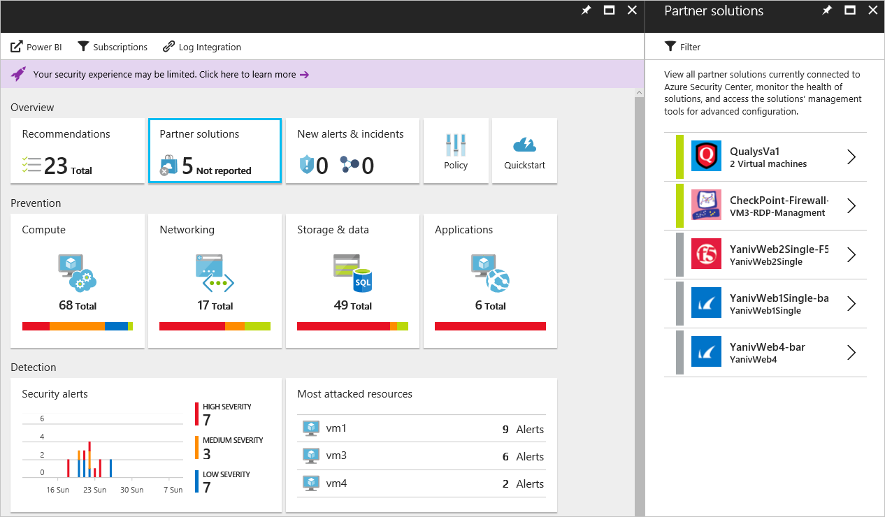

# Partner Integration in Azure Security Center
This document explains how Azure Security Center integrates with partners to enhance overall security and provide an integrated experience in Azure, while taking advantage of the Azure Marketplace for partner certification and billing.

## Why deploy partner’s solutions from Security Center?

The four main reasons to leverage the partner integration in Security Center are:

- **Ease of deployment**: Deploying a partner solution by following the Security Center recommendation is much easier. The deployment process can be fully automated using a default configuration and network topology, or customers can choose a semi-automated option to allow more flexibility and customization of the configuration.
- **Integrated Detections**: Security events from partner solutions are automatically collected, aggregated and displayed as part of Security Center alerts and incidents. These events are also fused with detections from other sources to provide advanced threat detection capabilities.
- **Unified Health Monitoring and Management**: Integrated health events allow customers to monitor all partner solutions at a glance. Basic management is available with easy access to advanced configuration using the partner solution.
- **Export to SIEM**: Customers can now export all Security Center and partners’ alerts in CEF format to on-premise SIEM systems using Microsoft Azure Log Integration (preview)

## What partners are integrated with Security Center?
Security Center currently integrates with the following partners:

- Endpoint Protection ([Trend Micro](https://help.deepsecurity.trendmicro.com/azure-marketplace-getting-started-with-deep-security.html)) 
- Web Application Firewall ([Barracuda](https://www.barracuda.com/products/webapplicationfirewall), [F5](https://support.f5.com/kb/en-us/products/big-ip_asm/manuals/product/bigip-ve-web-application-firewall-microsoft-azure-12-0-0.html), [Imperva](https://www.imperva.com/Products/WebApplicationFirewall-WAF), [Fortinet](https://www.fortinet.com/resources.html?limit=10&search=&document-type=data-sheets), [App Gateway WAF](https://azure.microsoft.com/en-us/blog/azure-web-application-firewall-waf-generally-available/)) 
- Next Generation Firewall ([Check Point](https://www.checkpoint.com/products/vsec-microsoft-azure/), [Barracuda](https://campus.barracuda.com/product/nextgenfirewallf/article/NGF/AzureDeployment/), [Fortinet](http://docs.fortinet.com/d/fortigate-fortios-handbook-the-complete-guide-to-fortios-5.2) and [Cisco](http://www.cisco.com/c/en/us/td/docs/security/firepower/quick_start/azure/ftdv-azure-qsg.html)) 
- Vulnerability Assessment ([Qualys](https://www.qualys.com/public-clouds/microsoft-azure/) - preview)  

Over time, Security Center will expand the number of partners within these existing categories and add new categories. 

## How to deploy a partner solution?

Based on the configuration of your Azure environment and the security policy you defined, Security Center may recommend that a partner solution be deployed. The recommendation will guide you through the process of selecting and installing a partner solution. The overall deployment experience at this point can vary according to the type of solution and partner. See the links below for more information:

- [Add a web application firewall](security-center-add-web-application-firewall.md)
- [Add a Next Generation Firewall](security-center-add-next-generation-firewall.md)
- [Install Endpoint Protection](security-center-install-endpoint-protection.md)
- [Vulnerability assessment not installed](security-center-vulnerability-assessment-recommendations.md)

## How to manage partner solutions?

Once a partner solution has been deployed, you can view information about the health of the solution and perform basic management tasks from the Partner solution tile in the main Security Center dashboard. For more information about managing partner solutions in Security Center, read [Monitoring partner solutions with Azure Security Center](security-center-partner-solutions.md).

## See also
In this document, you learned how to integrate partner's solution in Azure Security Center. To learn more about Security Center, see the following:

* [Azure Security Center Planning and Operations Guide](security-center-planning-and-operations-guide.md)
* [Managing and responding to security alerts in Azure Security Center](security-center-managing-and-responding-alerts.md)
* [Security Alerts by Type in Azure Security Center](security-center-alerts-type.md)
* [Security health monitoring in Azure Security Center](security-center-monitoring.md) — Learn how to monitor the health of your Azure resources.
* [Monitoring partner solutions with Azure Security Center](security-center-partner-solutions.md) — Learn how to monitor the health status of your partner solutions.
* [Azure Security Center FAQ](security-center-faq.md) — Find frequently asked questions about using the service.
* [Azure Security blog](http://blogs.msdn.com/b/azuresecurity/) — Find blog posts about Azure security and compliance.
