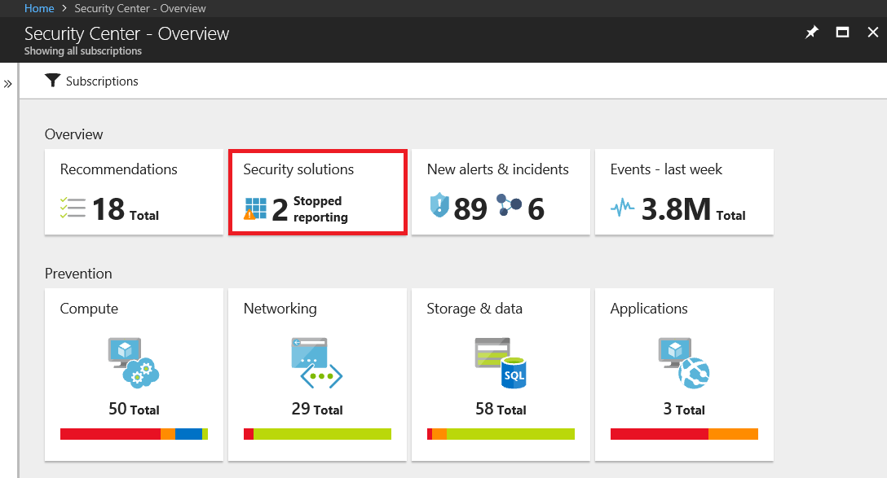
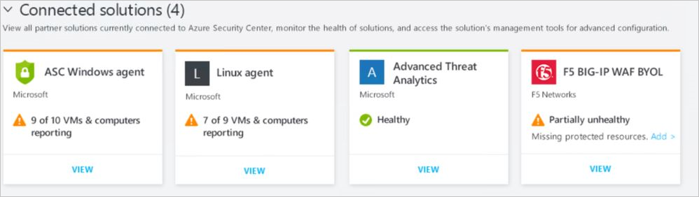
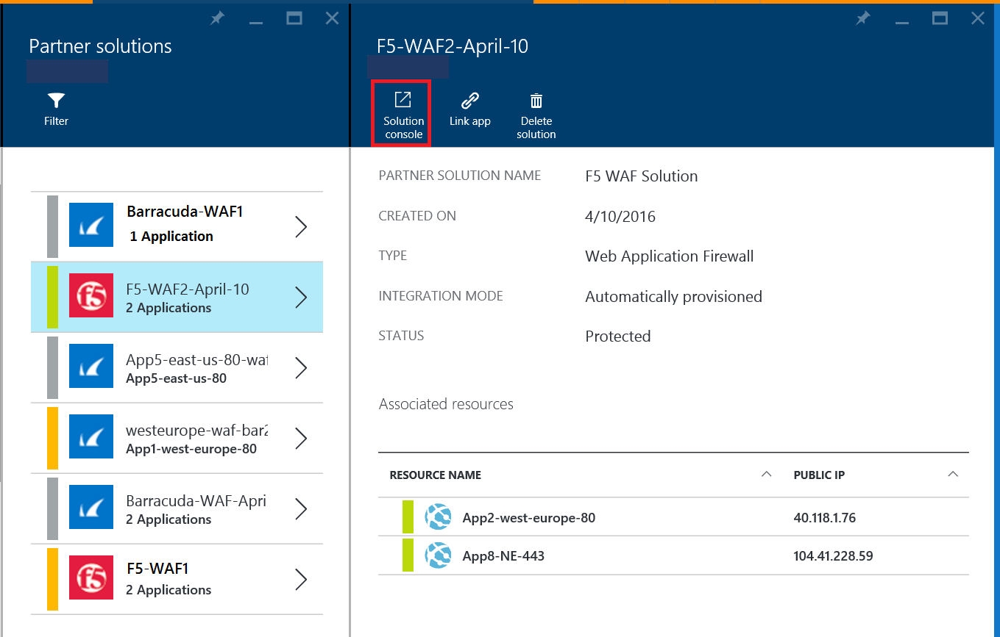
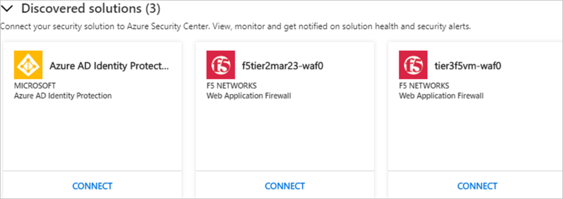
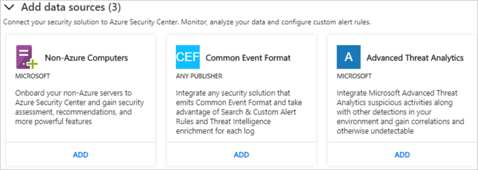

# Integrate security solutions in Azure Security Center
This document helps you to manage security solutions already connected to Azure Security Center and add new ones.

> [!NOTE]
> A subset of security solutions will be retired on July 31st, 2019. For more information and alternative services, see [Retirement of Security Center features (July 2019)](security-center-features-retirement-july2019.md#menu_solutions).

## Integrated Azure security solutions
Security Center makes it easy to enable integrated security solutions in Azure. Benefits include:

- **Simplified deployment**: Security Center offers streamlined provisioning of integrated partner solutions. For solutions like antimalware and vulnerability assessment, Security Center can provision the needed agent on your virtual machines, and for firewall appliances, Security Center can take care of much of the network configuration required.
- **Integrated detections**: Security events from partner solutions are automatically collected, aggregated, and displayed as part of Security Center alerts and incidents. These events also are fused with detections from other sources to provide advanced threat-detection capabilities.
- **Unified health monitoring and management**: Customers can use integrated health events to monitor all partner solutions at a glance. Basic management is available, with easy access to advanced setup by using the partner solution.

Currently, integrated security solutions include Vulnerability assessment by [Qualys](https://www.qualys.com/public-clouds/microsoft-azure/) and [Rapid7](https://www.rapid7.com/products/insightvm/) and Microsoft Application Gateway Web application firewall.

> [!NOTE]
> Security Center does not install the Microsoft Monitoring Agent on partner virtual appliances because most security vendors prohibit external agents running on their appliance.
>
>

## How security solutions are integrated
Azure security solutions that are deployed from Security Center are automatically connected. You can also connect other security data sources, including computers running on-premises or in other clouds.

## Manage integrated Azure security solutions and other data sources

1. Sign in to the [Azure portal](https://azure.microsoft.com/features/azure-portal/).

2. On the **Microsoft Azure menu**, select **Security Center**. **Security Center - Overview** opens.

3. Under the Security Center menu, select **Security solutions**.

   

Under **Security solutions**, you can view information about the health of integrated Azure security solutions and perform basic management tasks. You can also connect other types of security data sources, such as Azure Active Directory Identity Protection alerts and firewall logs in Common Event Format (CEF).

### Connected solutions

The **Connected solutions** section includes security solutions that are currently connected to Security Center and information about the health status of each solution.  

The status of a partner solution can be:

* Healthy (green) - there is no health issue.
* Unhealthy (red) - there is a health issue that requires immediate attention.
* Health issues (orange) - the solution has stopped reporting its health.
* Not reported (gray) - the solution has not reported anything yet, a solution's status may be unreported if it has recently been connected and is still deploying, or no health data is available.

> [!NOTE]
> If health status data is not available, Security Center shows the date and time of the last event received to indicate whether the solution is reporting or not. If no health data is available and no alerts are received within the last 14 days, Security Center indicates that the solution is unhealthy or not reporting.
>
>

1. Select **VIEW** for additional information and options, which includes:

   - **Solution console**. Opens the management experience for this solution.
   - **Link VM**. Opens the Link Applications blade. Here you can connect resources to the partner solution.
   - **Delete solution**.
   - **Configure**.

   

### Discovered solutions

Security Center automatically discovers security solutions running in Azure but are not connected to Security Center and displays the solutions in the **Discovered solutions** section. This includes Azure solutions, such as [Azure AD Identity Protection](https://docs.microsoft.com/azure/active-directory/active-directory-identityprotection), as well as partner solutions.

> [!NOTE]
> The Standard tier of Security Center is required at the subscription level for the discovered solutions feature. See [Pricing](security-center-pricing.md) to learn more about Security's pricing tiers.
>
>

Select **CONNECT** under a solution to integrate with Security Center and be notified on security alerts.

Security Center also discovers solutions deployed in the subscription that are able to forward Common Event Format (CEF) logs. Learn how to [connect a security solution](quick-security-solutions.md) that uses CEF logs to Security Center.

### Add data sources

The **Add data sources** section includes other available data sources that can be connected. For instructions on adding data from any of these sources, click **ADD**.

## Exporting data to a SIEM

Processed events produced by Azure Security Center are published to the Azure [Activity log](../monitoring-and-diagnostics/monitoring-overview-activity-logs.md), one of the log types available through Azure Monitor. Azure Monitor offers a consolidated pipeline for routing any of your monitoring data into a SIEM tool. This is done by streaming that data to an Event Hub where it can then be pulled into a partner tool.

This pipe uses the [Azure Monitoring single pipeline](../azure-monitor/platform/stream-monitoring-data-event-hubs.md) for getting access to the monitoring data from your Azure environment. This enables you to easily set up SIEMs and monitoring tools to consume the data.

The next sections describe how you can configure data to be streamed to an event hub. The steps assume that you already have Azure Security Center configured in your Azure subscription.

High-level overview

### What is the Azure security data exposed to SIEM?

In this version we expose the [security alerts.](../security-center/security-center-managing-and-responding-alerts.md) In upcoming releases, we will enrich the data set with security recommendations.

### How to setup the pipeline

#### Create an Event Hub

Before you begin, you need to [create an Event Hubs namespace](../event-hubs/event-hubs-create.md). This namespace and Event Hub is the destination for all your monitoring data.

#### Stream the Azure Activity Log to Event Hubs

Please refer to the following article [stream activity log to Event Hubs](../azure-monitor/platform/activity-logs-stream-event-hubs.md)

#### Install a partner SIEM connector 

Routing your monitoring data to an Event Hub with Azure Monitor enables you to easily integrate with partner SIEM and monitoring tools.

Refer to the following link to see the list of [supported SIEMs](../azure-monitor/platform/stream-monitoring-data-event-hubs.md#what-can-i-do-with-the-monitoring-data-being-sent-to-my-event-hub)

### Example for Querying data 

Here is a couple of Splunk queries that you can use to pull alert data:

| **Description of Query** | **Query** |
|----|----|
| All Alerts| index=main Microsoft.Security/locations/alerts|
| Summarize count of operations by their name| index=main sourcetype="amal:security" \| table operationName \| stats count by operationName|
| Get Alerts info: Time, Name, State, ID, and Subscription | index=main Microsoft.Security/locations/alerts \| table \_time, properties.eventName, State, properties.operationId, am_subscriptionId |

## Next steps

In this article, you learned how to integrate partner solutions in Security Center. To learn more about Security Center, see the following articles:

* [Security health monitoring in Security Center](security-center-monitoring.md). Learn how to monitor the health of your Azure resources.
* [Azure Security Center FAQs](security-center-faq.md). Get answers to frequently asked questions about using Security Center.
* [Azure Security blog](https://blogs.msdn.com/b/azuresecurity/). Find blog posts about Azure security and compliance.
