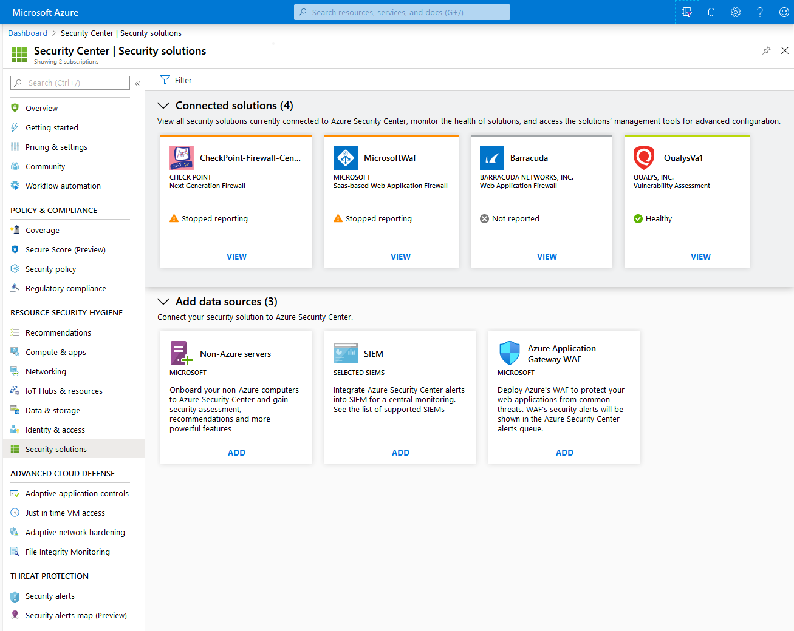
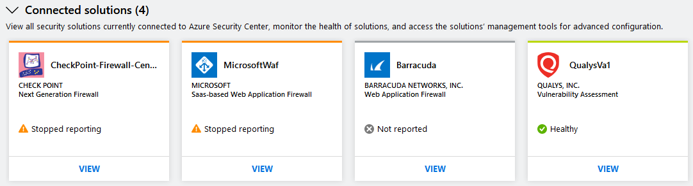
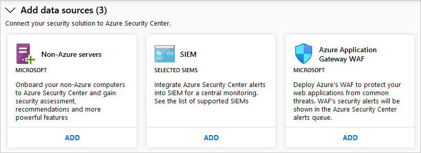

# Integrate security solutions in Azure Security Center
This document helps you to manage security solutions already connected to Azure Security Center and add new ones.

## Integrated Azure security solutions
Security Center makes it easy to enable integrated security solutions in Azure. Benefits include:

- **Simplified deployment**: Security Center offers streamlined provisioning of integrated partner solutions. For solutions like antimalware and vulnerability assessment, Security Center can provision the agent on your virtual machines. For firewall appliances, Security Center can take care of much of the network configuration required.
- **Integrated detections**: Security events from partner solutions are automatically collected, aggregated, and displayed as part of Security Center alerts and incidents. These events also are fused with detections from other sources to provide advanced threat-detection capabilities.
- **Unified health monitoring and management**: Customers can use integrated health events to monitor all partner solutions at a glance. Basic management is available, with easy access to advanced setup by using the partner solution.

Currently, integrated security solutions include vulnerability assessment by [Qualys](https://www.qualys.com/public-cloud/#azure) and [Rapid7](https://www.rapid7.com/products/insightvm/) and Microsoft Application Gateway Web application firewall.

> [!NOTE]
> Security Center does not install the Log Analytics agent on partner virtual appliances because most security vendors prohibit external agents running on their appliances.

To learn more about the integration of vulnerability scanning tools from Qualys, including a built-in scanner available to standard tier customers, see: 

- [Integrated vulnerability scanner for virtual machines](built-in-vulnerability-assessment.md).
- [Deploying a partner vulnerability scanning solution](partner-vulnerability-assessment.md).

Security Center also offers vulnerability analysis for your:

* SQL databases - see [Explore vulnerability assessment reports in the vulnerability assessment dashboard](security-center-iaas-advanced-data.md#explore-vulnerability-assessment-reports)
* Azure Container Registry images - see [Azure Container Registry integration with Security Center (Preview)](azure-container-registry-integration.md)

## How security solutions are integrated
Azure security solutions that are deployed from Security Center are automatically connected. You can also connect other security data sources, including computers running on-premises or in other clouds.

## Manage integrated Azure security solutions and other data sources

1. From the [Azure portal](https://azure.microsoft.com/features/azure-portal/), open **Security Center**.

1. From Security Center's menu, select **Security solutions**.

From the **Security solutions** page, you can see the health of integrated Azure security solutions and run basic management tasks.

### Connected solutions

The **Connected solutions** section includes security solutions that are currently connected to Security Center. It also shows the health status of each solution.  

The status of a partner solution can be:

* **Healthy** (green) - no health issues.
* **Unhealthy** (red) - there's a health issue that requires immediate attention.
* **Stopped reporting** (orange) - the solution has stopped reporting its health.
* **Not reported** (gray) - the solution hasn't reported anything yet and no health data is available. A solution's status may be unreported if it was connected recently and is still deploying.

> [!NOTE]
> If health status data is not available, Security Center shows the date and time of the last event received to indicate whether the solution is reporting or not. If no health data is available and no alerts were received within the last 14 days, Security Center indicates that the solution is unhealthy or not reporting.
>
>

Select **VIEW** for additional information and options such as:

   - **Solution console** - Opens the management experience for this solution.
   - **Link VM** - Opens the Link Applications page. Here you can connect resources to the partner solution.
   - **Delete solution**
   - **Configure**

   

### Discovered solutions

Security Center automatically discovers security solutions running in Azure but not connected to Security Center and displays the solutions in the **Discovered solutions** section. These  solutions include Azure solutions, like [Azure AD Identity Protection](https://docs.microsoft.com/azure/active-directory/active-directory-identityprotection), and partner solutions.

> [!NOTE]
> The Standard tier of Security Center is required at the subscription level for the discovered solutions feature. See [Pricing](security-center-pricing.md) to learn more about the pricing tiers.
>

Select **CONNECT** under a solution to integrate with Security Center and be notified of security alerts.

### Add data sources

The **Add data sources** section includes other available data sources that can be connected. For instructions on adding data from any of these sources, click **ADD**.

## Next steps

In this article, you learned how to integrate partner solutions in Security Center. For related information, see the following articles:

* [Export security alerts and recommendations](continuous-export.md). Learn how to setup an integration with Azure Sentinel, or any other SIEM.
* [Security health monitoring in Security Center](security-center-monitoring.md). Learn how to monitor the health of your Azure resources.