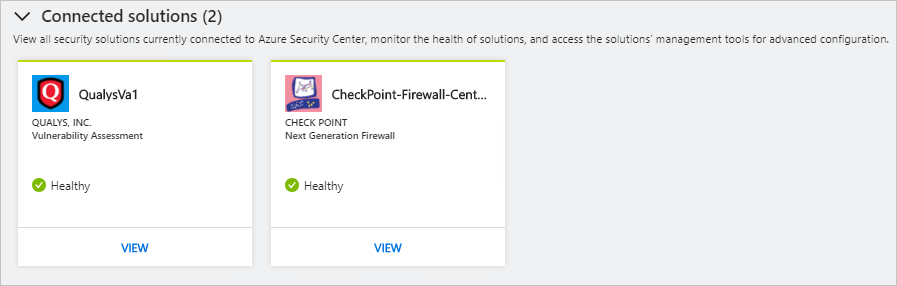
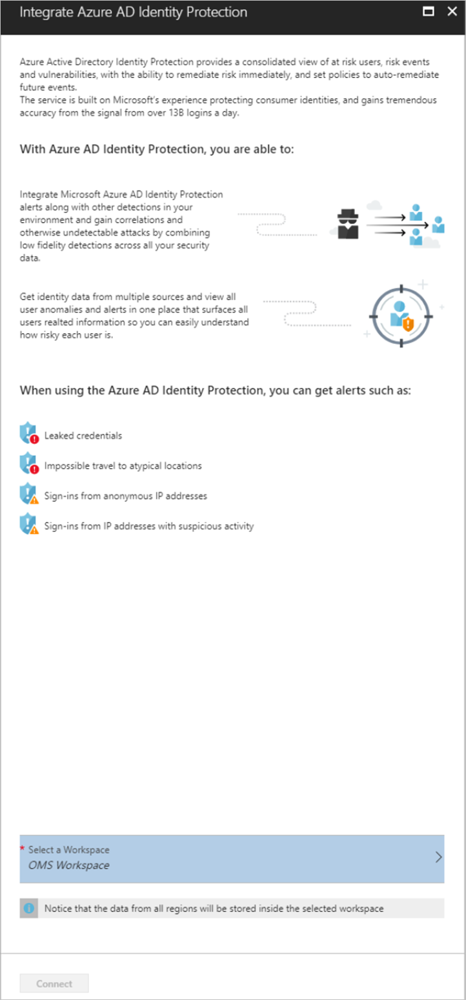
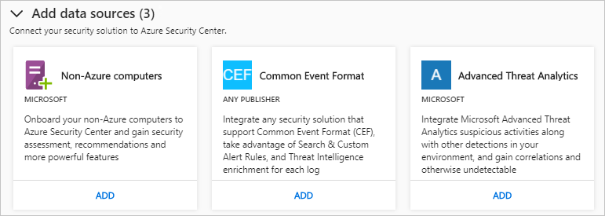

# Partner and solutions integration in Azure Security Center

In this article, we describe how Azure Security Center integrates with partners to help you enhance overall security. Security Center offers an integrated experience in Azure and takes advantage of the Azure Marketplace for partner certification and billing.

## Deploy partner solutions from Security Center

There are four main reasons to use partner integration in Security Center:

- **Ease of deployment**. Deploying a partner solution by following the Security Center recommendation is much easier. The deployment process can be fully automated by using a default setup and network topology. Alternatively, customers can choose a semi-automated option for more flexibility and customization.
- **Integrated detections**. Security events from partner solutions are automatically collected, aggregated, and displayed as part of Security Center alerts and incidents. These events also are fused with detections from other sources to provide advanced threat-detection capabilities.
- **Unified health monitoring and management**. Customers can use integrated health events to monitor all partner solutions at a glance. Basic management is available, with easy access to advanced setup by using the partner solution.
- **Export to SIEM**. Customers can export all Security Center and partner alerts in Common Event Format (CEF) to on-premises Security Information and Event Management (SIEM) systems by using Azure log integration (preview).

## Partners that integrate with Security Center

Currently, the native integration of partners' solutions that are available in Azure Marketplace with Security Center are:

- Endpoint protection ([Trend Micro](https://help.deepsecurity.trendmicro.com/azure-marketplace-getting-started-with-deep-security.html), Symantec, and [Microsoft Antimalware for Azure Cloud Services and Virtual Machines](https://docs.microsoft.com/azure/security/azure-security-antimalware)) 
- Web application firewall ([Barracuda](https://www.barracuda.com/products/webapplicationfirewall), [F5](https://support.f5.com/kb/en-us/products/big-ip_asm/manuals/product/bigip-ve-web-application-firewall-microsoft-azure-12-0-0.html), [Imperva](https://www.imperva.com/Products/WebApplicationFirewall-WAF), [Fortinet](https://www.fortinet.com/resources.html?limit=10&search=&document-type=data-sheets), and [Azure Application Gateway](https://azure.microsoft.com/blog/azure-web-application-firewall-waf-generally-available/)) 
- Next-generation firewall ([Check Point](https://www.checkpoint.com/products/vsec-microsoft-azure/), [Barracuda](https://campus.barracuda.com/product/nextgenfirewallf/article/NGF/AzureDeployment/), [Fortinet](http://docs.fortinet.com/d/fortigate-fortios-handbook-the-complete-guide-to-fortios-5.2), and [Cisco](http://www.cisco.com/c/en/us/td/docs/security/firepower/quick_start/azure/ftdv-azure-qsg.html)) 
- Vulnerability assessment ([Qualys](https://www.qualys.com/public-clouds/microsoft-azure/))  

Over time, Security Center will expand the number of partners within these categories and add new categories. 

## Deploy a partner solution

Based on the setup of your Azure environment and the security policy you defined, Security Center might recommend that you deploy a partner solution. The Security Center recommendation guides you through the process of selecting and installing a partner solution. The overall deployment experience might vary, depending on the type of solution and partner you use. For more information, see the following articles:

- [Install endpoint protection](security-center-install-endpoint-protection.md)
- [Add a web application firewall](security-center-add-web-application-firewall.md)
- [Add a next-generation firewall](security-center-add-next-generation-firewall.md)
- [Vulnerability assessment not installed](security-center-vulnerability-assessment-recommendations.md)

## Manage partner solutions

After deployment, to view information about the health of the solution and perform basic management tasks, on the **Security Center** dashboard, select the **Partner solutions** option.

The content that you see when you open Security Solutions might vary according to your infrastructure. Using the previous image as an example, this page has three sections:

- **Connected solutions**. Displays solutions connected to Security Center.
- **Discovered solutions**. Displays solutions that aren't connected to Security Center. You can connect these solutions, and they then display under **Connected solutions**. If Security Center doesn't detect any unconnected solutions, this section is hidden.
- **Add data sources**. Displays Azure and non-Azure data sources that you can add to Security Center.

### Connected solutions

The **Connected solutions** section shows all security solutions that are currently connected with Security Center. 

The information that you see might vary according to the solution. Some information available on each tile might include:

- **Company icon for the partner**. If Security Center doesn't have the company icon, the first characters of the partner name are displayed.
- **Solution type**.
- **Computer name**.The computer name might be displayed.
- **Health status**. If a health indicator isn't sent, Security Center shows the date and time of the last received event to indicate whether the appliance is reporting or not. If Security Center doesn't receive the health indicator from a particular solution, the solution's tile won't appear in this section.

> [!NOTE]
> Security Center shows the date and time of the last received event to indicate whether the appliance is reporting or not. Solutions that aren't sending health indicators are displayed as connected if alert or if events were sent in the last 14 days.
>  

Some of these solutions might be fully integrated in Azure; others might be on-premises. Because Security Center supports [Common Event Format (CEF)](https://docs.microsoft.com/azure/operations-management-suite/oms-security-connect-products#what-is-cef), it can connect with solutions that use CEF, such as a Firewall that supports CEF. After this solution is added to Security Center, Firewall sends logs in CEF format to Security Center, which handles it to [Azure Log Analytics](https://docs.microsoft.com/azure/log-analytics/log-analytics-overview). Firewall is a non-Azure resource that sends events but not health indicators. The only information that Security Center has about health is the last time this appliance sent an event. For all non-Azure resources, in the health area of the tile, Security Center displays the date and time that the last event was received. This information indicates that the non-Azure resource is still reporting.

### Discovered solutions

The **Discovered solutions** section shows all solutions that were added via Azure, and Security Center is suggesting to connect to it.

Security Center can integrate with built-in Azure solutions, such as [Azure AD Identity Protection](https://docs.microsoft.com/azure/active-directory/active-directory-identityprotection). If you have a license for Azure AD Identity Protection, but it is not connected to Security Center, then Azure AD Identity Protection will be listed under **Discovered solutions**. To integrate this solution with Security Center, click **CONNECT** on **Azure AD Identity Protection** tile, and the following page appears:

To finish connecting Azure AD Identity Protection you need to select a workspace that the data is saved in. All data from Azure AD Identity Protection will flow from the workspace region that was selected in this step.  You will go through workspace selector to select the workspace and data will start to flow there.

In order to connect to Security Center you must be a global admin or a security admin.  The **Connect** button will be disabled if you don’t have permissions, and if you don’t have permissions there will be a message explaining why the button is disabled.

Azure AD Identity Protection alerts go through Security Center’s detection pipe, this will enable you to get alerts from Security Center, and Azure Active Directory Identity Protection. Security Center will merge all alerts that seem relevant to create a [security incident](https://docs.microsoft.com/azure/security-center/security-center-incident). The security incident description will give you more intelligence about suspicious activity.

### Add data sources

You can add Azure and non-Azure computers to integrate with Security Center.  Adding non-Azure computers means that you can add on-premises computer, or an appliance that supports CEF. 

## See also

In this article, you learned how to integrate partner solutions in Azure Security Center. To learn more about Security Center, see the following articles:

* [Security Center planning and operations guide](security-center-planning-and-operations-guide.md)
* [Manage and respond to security alerts in Security Center](security-center-managing-and-responding-alerts.md)
* [Security alerts by type in Security Center](security-center-alerts-type.md)
* [Security health monitoring in Security Center](security-center-monitoring.md). Learn how to monitor the health of your Azure resources.
* [Monitoring partner solutions with Security Center](security-center-partner-solutions.md). Learn how to monitor the health status of your partner solutions.
* [Azure Security Center FAQs](security-center-faq.md). Get answers to frequently asked questions about using the service.
* [Azure Security blog](http://blogs.msdn.com/b/azuresecurity/). Find blog posts about Azure security and compliance.
