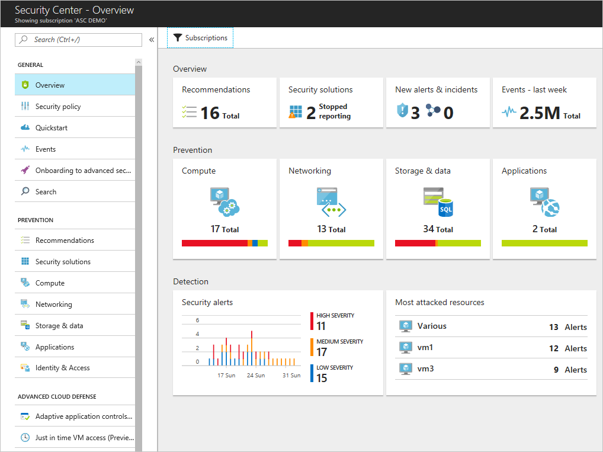
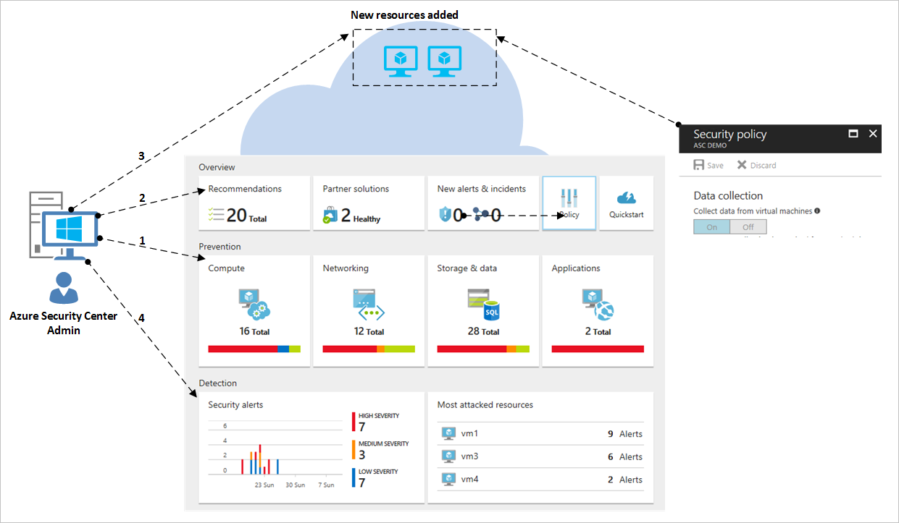
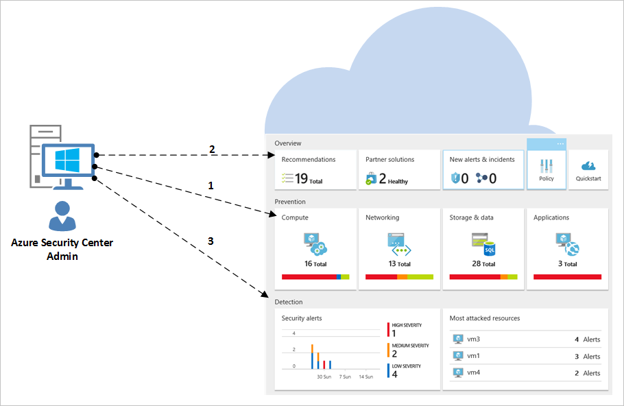

# Azure Security Center planning and operations guide
This guide is for information technology (IT) professionals, IT architects, information security analysts, and cloud administrators planning to use Azure Security Center.

## Planning guide
This guide covers tasks that you can follow to optimize your use of Security Center based on your organization’s security requirements and cloud management model. To take full advantage of Security Center, it is important to understand how different individuals or teams in your organization use the service to meet secure development and operations, monitoring, governance, and incident response needs. The key areas to consider when planning to use Security Center are:

* Security Roles and Access Controls
* Security Policies and Recommendations
* Data Collection and Storage
* Ongoing non-Azure resources
* Ongoing Security Monitoring
* Incident Response

In the next section, you will learn how to plan for each one of those areas and apply those recommendations based on your requirements.

> [!NOTE]
> Read [Azure Security Center frequently asked questions (FAQ)](security-center-faq.md) for a list of common questions that can also be useful during the designing and planning phase.
>

## Security roles and access controls
Depending on the size and structure of your organization, multiple individuals and teams may use Security Center to perform different security-related tasks. In the following diagram, you have an example of fictitious personas and their respective roles and security responsibilities:

Security Center enables these individuals to meet these various responsibilities. For example:

**Jeff (Workload Owner)**

* Manage a cloud workload and its related resources
* Responsible for implementing and maintaining protections in accordance with company security policy

**Ellen (CISO/CIO)**

* Responsible for all aspects of security for the company
* Wants to understand the company's security posture across cloud workloads
* Needs to be informed of major attacks and risks

**David (IT Security)**

* Sets company security policies to ensure the appropriate protections are in place
* Monitors compliance with policies
* Generates reports for leadership or auditors

**Judy (Security Operations)**

* Monitors and responds to security alerts 24/7
* Escalates to Cloud Workload Owner or IT Security Analyst

**Sam (Security Analyst)**

* Investigate attacks
* Work with Cloud Workload Owner to apply remediation

Security Center uses [Role-Based Access Control (RBAC)](../role-based-access-control/role-assignments-portal.md), which provides [built-in roles](../role-based-access-control/built-in-roles.md) that can be assigned to users, groups, and services in Azure. When a user opens Security Center, they only see information related to resources they have access to. Which means the user is assigned the role of Owner, Contributor, or Reader to the subscription or resource group that a resource belongs to. In addition to these roles, there are two specific Security Center roles:

- **Security reader**: a user that belongs to this role is able to view only Security Center configurations, which include recommendations, alerts, policy, and health, but it won't be able to make changes.
- **Security admin**: same as security reader but it can also update the security policy, dismiss recommendations and alerts.

The Security Center roles described above do not have access to other service areas of Azure such as Storage, Web & Mobile, or Internet of Things.

Using the personas explained in the previous diagram, the following RBAC would be needed:

**Jeff (Workload Owner)**

* Resource Group Owner/Contributor

**Ellen (CISO/CIO)**

* Subscription Owner/Contributor or Security Admin

**David (IT Security)**

* Subscription Owner/Contributor or Security Admin

**Judy (Security Operations)**

* Subscription Reader or Security Reader to view Alerts
* Subscription Owner/Contributor or Security Admin required to dismiss Alerts

**Sam (Security Analyst)**

* Subscription Reader to view Alerts
* Subscription Owner/Contributor required to dismiss Alerts
* Access to the workspace may be required

Some other important information to consider:

* Only subscription Owners/Contributors and Security Admins can edit a security policy.
* Only subscription and resource group Owners and Contributors can apply security recommendations for a resource.

When planning access control using RBAC for Security Center, be sure to understand who in your organization will be using Security Center. Also, what types of tasks they will be performing and then configure RBAC accordingly.

> [!NOTE]
> We recommend that you assign the least permissive role needed for users to complete their tasks. For example, users who only need to view information about the security state of resources but not take action, such as applying recommendations or editing policies, should be assigned the Reader role.
>
>

## Security policies and recommendations
A security policy defines the desired configuration of your workloads and helps ensure compliance with company or regulatory security requirements. In Security Center, you can define policies for your Azure subscriptions, which can be tailored to the type of workload or the sensitivity of data.

Security Center policies contain the following components:
- [Data collection](https://docs.microsoft.com/azure/security-center/security-center-enable-data-collection): agent provisioning and data collection settings.
- [Security policy](https://docs.microsoft.com/azure/security-center/security-center-policies): an [Azure Policy](../governance/policy/overview.md) that determines which controls are monitored and recommended by Security Center, or use Azure Policy to create new definitions, define additional policies, and assign policies across management groups.
- [Email notifications](https://docs.microsoft.com/azure/security-center/security-center-provide-security-contact-details): security contacts and notification settings.
- [Pricing tier](https://docs.microsoft.com/azure/security-center/security-center-pricing): free or standard pricing selection, which determine which Security Center features are available for resources in scope (can be specified for subscriptions, resource groups and workspaces).

> [!NOTE]
> Specifying a security contact will ensure that Azure can reach the right person in your organization if a security incident occurs. Read [Provide security contact details in Azure Security Center](https://docs.microsoft.com/azure/security-center/security-center-provide-security-contact-details) for more information on how to enable this recommendation.

### Security policies definitions and recommendations
Security Center automatically creates a default security policy for each of your Azure subscriptions. You can edit the policy in Security Center or use Azure Policy to create new definitions, define additional policies, and assign policies across Management Groups (which can represent the entire organization, a business unit in it etc.), and monitor compliance to these policies across these scopes.

Before configuring security policies, review each of the [security recommendations](https://docs.microsoft.com/azure/security-center/security-center-recommendations), and determine whether these policies are appropriate for your various subscriptions and resource groups. It is also important to understand what action should be taken to address Security Recommendations and who in your organization will be responsible for monitoring for new recommendations and taking the needed steps.

## Data collection and storage
Azure Security Center uses the Microsoft Monitoring Agent – this is the same agent used by the Azure Monitor service – to collect security data from your virtual machines. [Data collected](https://docs.microsoft.com/azure/security-center/security-center-enable-data-collection) from this agent will be stored in your Log Analytics workspace(s).

### Agent

When automatic provisioning is enabled in the security policy, the Microsoft Monitoring Agent (for [Windows](https://docs.microsoft.com/azure/log-analytics/log-analytics-windows-agents) or [Linux](https://docs.microsoft.com/azure/log-analytics/log-analytics-linux-agents)) is installed on all supported Azure VMs, and any new ones that are created. If the VM or computer already has the Microsoft Monitoring Agent installed, Azure Security Center will leverage the current installed agent. The agent’s process is designed to be non-invasive and have very minimal impact on VM performance.

The Microsoft Monitoring Agent for Windows requires use TCP port 443. See the [Troubleshooting article](security-center-troubleshooting-guide.md) for additional details.

If at some point you want to disable Data Collection, you can turn it off in the security policy. However, because the Microsoft Monitoring Agent may be used by other Azure management and monitoring services, the agent will not be uninstalled automatically when you turn off data collection in Security Center. You can manually uninstall the agent if needed.

> [!NOTE]
> To find a list of supported VMs, read the [Azure Security Center frequently asked questions (FAQ)](security-center-faq.md).
>

### Workspace

A workspace is an Azure resource that serves as a container for data. You or other members of your organization might use multiple workspaces to manage different sets of data that is collected from all or portions of your IT infrastructure.

Data collected from the Microsoft Monitoring Agent (on behalf of Azure Security Center) will be stored in either an existing Log Analytics workspace(s) associated with your Azure subscription or a new workspace(s), taking into account the Geo of the VM.

In the Azure portal, you can browse to see a list of your Log Analytics workspaces, including any created by Azure Security Center. A related resource group will be created for new workspaces. Both will follow this naming convention:

* Workspace: *DefaultWorkspace-[subscription-ID]-[geo]*
* Resource Group: *DefaultResourceGroup-[geo]*

For workspaces created by Azure Security Center, data is retained for 30 days. For existing workspaces, retention is based on the workspace pricing tier. If you want, you can also use an existing workspace.

> [!NOTE]
> Microsoft makes strong commitment to protect the privacy and security of this data. Microsoft adheres to strict compliance and security guidelines—from coding to operating a service. For more information about data handling and privacy, read [Azure Security Center Data Security](security-center-data-security.md).
>

## Onboarding non-Azure resources

Security Center can monitor the security posture of your non-Azure computers but you need to first onboard these resources. Read [Onboarding to Azure Security Center Standard for enhanced security](https://docs.microsoft.com/azure/security-center/security-center-onboarding#onboard-non-azure-computers) for more information on how to onboarding non-Azure resources.

## Ongoing security monitoring
After initial configuration and application of Security Center recommendations, the next step is considering Security Center operational processes.

The Security Center Overview provides a unified view of security across all your Azure resources and any non-Azure resources you have connected. The example below shows an environment with many issues to be addressed:

> [!NOTE]
> Security Center will not interfere with your normal operational procedures, it will passively monitor your deployments and provide recommendations based on the security policies you enabled.

When you first opt in to use Security Center for your current Azure environment, make sure that you review all recommendations, which can be done in the **Recommendations** tile or per resource (**Compute**, **Networking**, **Storage & data**, **Application**).

Once you address all recommendations, the **Prevention** section should be green for all resources that were addressed. Ongoing monitoring at this point becomes easier since you will only take actions based on changes in the resource security health and recommendations tiles.

The **Detection** section is more reactive, these are alerts regarding issues that are either taking place now, or occurred in the past and were detected by Security Center controls and 3rd party systems. The Security Alerts tile will show bar graphs that represent the number of threat detection alerts that were found in each day, and their distribution among the different severity categories (low, medium, high). For more information about Security Alerts, read [Managing and responding to security alerts in Azure Security Center](security-center-managing-and-responding-alerts.md).

Plan to visit the [threat intelligence](https://docs.microsoft.com/azure/security-center/security-center-threat-intel) option as part of your daily security operations. There you can identify security threats against the environment, such as identify if a particular computer is part of a botnet.

### Monitoring for new or changed resources
Most Azure environments are dynamic, with resources regularly being created, spun up or down, reconfigured, and changed. Security Center helps ensure that you have visibility into the security state of these new resources.

When you add new resources (VMs, SQL DBs) to your Azure Environment, Security Center will automatically discover these resources and begin to monitor their security. This also includes PaaS web roles and worker roles. If Data Collection is enabled in the [Security Policy](tutorial-security-policy.md), additional monitoring capabilities will be enabled automatically for your virtual machines.

1. For virtual machines, click **Compute & apps**, under the **Resource Security Hygiene** section. Any issues with enabling data or related recommendations will be surfaced in the **Overview** tab, and **Monitoring Recommendations** section.
2. View the **Recommendations** to see what, if any, security risks were identified for the new resource.
3. It is very common that when new VMs are added to your environment, only the operating system is initially installed. The resource owner might need some time to deploy other apps that will be used by these VMs.  Ideally, you should know the final intent of this workload. Is it going to be an Application Server? Based on what this new workload is going to be, you can enable the appropriate **Security Policy**, which is the third step in this workflow.
4. As new resources are added to your Azure environment, new alerts may appear in the **Security Alerts** tile. Look for new alerts in this tile and follow the recommendations.

You should also regularly monitor existing resources for configuration changes that could have created security risks, drift from recommended baselines, and security alerts. Start at the Security Center dashboard. From there, you have three major areas to review on a consistent basis.

1. The **Prevention** section panel provides you quick access to your key resources. Use this option to monitor Compute, Networking, Storage & data and Applications.
2. The **Recommendations** panel enables you to review Security Center recommendations. During your ongoing monitoring, you may find that you don’t have recommendations on a daily basis, which is normal since you addressed all recommendations on the initial Security Center setup. For this reason, you may not have new information in this section every day and will just need to access it as needed.
3. The **Detection** section might change on either a very frequent or very infrequent basis. Always review your security alerts and take actions based on Security Center recommendations.

### Hardening access and applications

As part of your security operations, you should also adopt preventative measures to restrict access to VMs, and control the applications that are running on VMs. By locking down inbound traffic to your Azure VMs, you are reducing the exposure to attacks, and at the same time providing easy access to connect to VMs when needed. Use [just-in-time VM](https://docs.microsoft.com/azure/security-center/security-center-just-in-time) access feature to hardening access to your VMs.

You can use [Adaptive Application Controls](https://docs.microsoft.com/azure/security-center/security-center-adaptive-application) to limit which applications can run on your VMs located in Azure. Among other benefits, this helps harden your VMs against malware. Using machine learning, Security Center analyzes processes running in the VM to help you create whitelisting rules.

## Incident response
Security Center detects and alerts you to threats as they occur. Organizations should monitor for new security alerts and take action as needed to investigate further or remediate the attack. For more information on how Security Center threat detection works, read [How Azure Security Center detects and responds to threats](security-center-alerts-overview.md#detect-threats).

While this article doesn’t have the intent to assist you creating your own Incident Response plan, we are going to use Microsoft Azure Security Response in the Cloud lifecycle as the foundation for incident response stages. The stages are shown in the following diagram:

> [!NOTE]
> You can use the National Institute of Standards and Technology (NIST) [Computer Security Incident Handling Guide](https://nvlpubs.nist.gov/nistpubs/SpecialPublications/NIST.SP.800-61r2.pdf) as a reference to assist you building your own.
>

You can use Security Center Alerts during the following stages:

* **Detect**: identify a suspicious activity in one or more resources.
* **Assess**: perform the initial assessment to obtain more information about the suspicious activity.
* **Diagnose**: use the remediation steps to conduct the technical procedure to address the issue.

Each Security Alert provides information that can be used to better understand the nature of the attack and suggest possible mitigations. Some alerts also provide links to either more information or to other sources of information within Azure. You can use the information provided for further research and to begin mitigation, and you can also search security-related data that is stored in your workspace.

The following example shows a suspicious RDP activity taking place:

This page shows the details regarding the time that the attack took place, the source hostname, the target VM and also gives recommendation steps. In some circumstances, the source information of the attack may be empty. Read [Missing Source Information in Azure Security Center Alerts](https://blogs.msdn.microsoft.com/azuresecurity/2016/03/25/missing-source-information-in-azure-security-center-alerts/) for more information about this type of behavior.

From this page, you can also start an [investigation](https://docs.microsoft.com/azure/security-center/security-center-investigation) to better understand the timeline of the attack, how the attack took place, which systems were potentially compromised, which credentials were used, and see a graphical representation of the entire attack chain.

Once you identify the compromised system, you can run a [Workflow Automation](workflow-automation.md) that was previously created. These are a collection of procedures that can be executed from Security Center once triggered by an alert.

In the [How to Leverage the Azure Security Center & Microsoft Operations Management Suite for an Incident Response](https://channel9.msdn.com/Blogs/Taste-of-Premier/ToP1703) video, you can see some demonstrations that can help you to understand how Security Center can be used in each one of those stages.

> [!NOTE]
> Read [Managing and responding to security alerts in Azure Security Center](security-center-managing-and-responding-alerts.md) for more information on how to use Security Center capabilities to assist you during your Incident Response process.
>
>

## Next steps
In this document, you learned how to plan for Security Center adoption. To learn more about Security Center, see the following:

* [Managing and responding to security alerts in Azure Security Center](security-center-managing-and-responding-alerts.md)
* [Security health monitoring in Azure Security Center](security-center-monitoring.md) — Learn how to monitor the health of your Azure resources.
* [Monitoring partner solutions with Azure Security Center](security-center-partner-solutions.md) — Learn how to monitor the health status of your partner solutions.
* [Azure Security Center FAQ](security-center-faq.md) — Find frequently asked questions about using the service.
* [Azure Security blog](https://blogs.msdn.com/b/azuresecurity/) — Find blog posts about Azure security and compliance.
