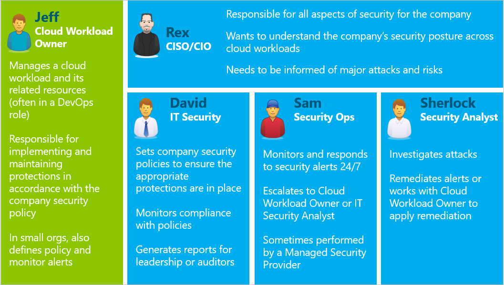
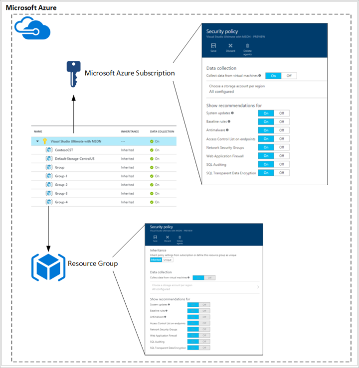
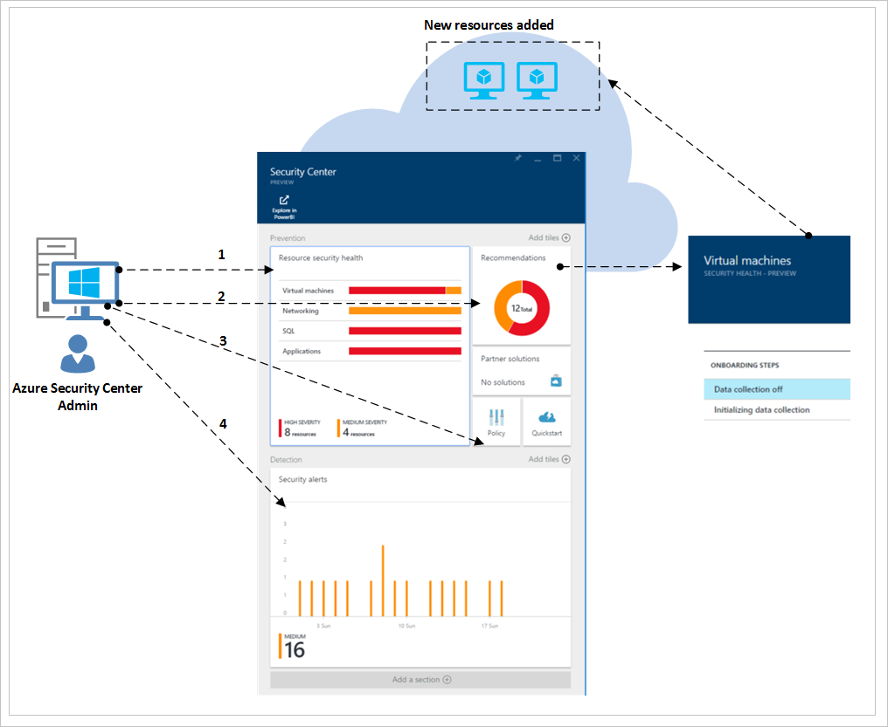
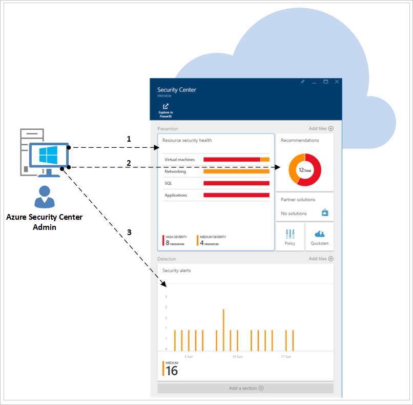
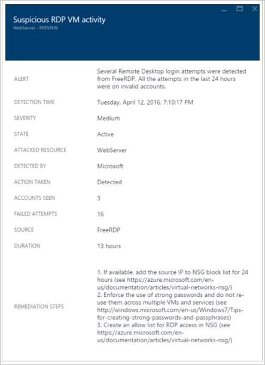

<properties
   pageTitle="Security Center Planning and Operations Guide | Microsoft Azure"
   description="This document helps you to plan before adopting Azure Security Center and considerations regarding daily operations."
   services="security-center"
   documentationCenter="na"
   authors="YuriDio"
   manager="swadhwa"
   editor=""/>

<tags
   ms.service="security-center"
   ms.topic="hero-article"
   ms.devlang="na"
   ms.tgt_pltfrm="na"
   ms.workload="na"
   ms.date="07/19/2016"
   ms.author="yurid"/>

# Azure Security Center planning and operations guide
This guide is for information technology (IT) professionals, IT architects, information security analysts and cloud administrators whose organizations are planning to use Azure Security Center.

> [AZURE.NOTE] The information in this document applies to the preview release of Azure Security Center.

Read [Azure Security Center frequently asked questions (FAQ)](security-center-faq.md) for a list of common questions that can also be useful during the designing and planning phase.

## Planning guide
This guide covers a set of steps and tasks that you can follow to optimize your use of Security Center based on your organization’s security requirements and cloud management model. In order to take full advantage of Security Center, it is important to understand how different individuals or teams in your organization will use the service to meet secure development and operations, monitoring, governance, and incident response needs. The key areas to consider when planning to use Security Center are:

- Security Roles and Access Controls
- Security Policies and Recommendations
- Data Collection and Storage
- Ongoing Security Monitoring
- Incident Response

In the next section you will learn how to plan for each one of those areas and apply those recommendations based on your requirements.

## Security roles and access controls
Depending on the size and structure of your organization, multiple individuals and teams may use Security Center to perform different security-related tasks. Below you have an example of fictitious personas and their respective roles and security responsibilities:

Security Center enables these individuals to meet these various responsibilities. For example:

**Jeff (Cloud Workload Owner)**

- Views and Completes Security Center Recommendations in the Azure Portal
- May Also Use a Ticketing System to Track Changes (populates recommendations using [API](https://msdn.microsoft.com/library/mt704034.aspx))

**Rex (CISO/CIO)**

- Views Security Center Reports from Power BI or Excel

**David (IT Security)**

- Sets Security Policy and Views Security Health in Azure Portal
- Analyzes Data and Generates Reports in Power BI

**Sam (Security Operations)**

- Views and Triages Security Center Alerts in the Azure Portal
- May Use an Existing Dashboard (populates alerts using [API](https://msdn.microsoft.com/library/mt704034.aspx))

**Sherlock (Security Analyst)**

- Views Security Center Alerts in the Azure Portal
- May Use an Existing Dashboard (populates alerts using [API](https://msdn.microsoft.com/library/mt704034.aspx))
- Analyzes Alert Trends in Power BI
- Reviews Event Logs from Storage

Security Center uses [Role-Based Access Control (RBAC)](../active-directory/role-based-access-control-configure.md), which provides [built-in roles](../active-directory/role-based-access-built-in-roles.md) that can be assigned to users, groups, and services in Azure. When a user opens Security Center, they will only see information related to resources they have access to, meaning the user is assigned the role of Owner, Contributor, or Reader to the subscription or resource group that a resource belongs to. Using the personas above, the following RBAC would be needed:

**Jeff (Cloud Workload Owner)**

- Resource Group Owner/Collaborator

**David (IT Security)**

- Subscription Owner/Collaborator

**Sam (Security Operations)**

- Subscription Reader to View Alerts
- Subscription Owner/Collaborator Required to Dismiss Alerts

**Sherlock (Security Analyst)**

- Subscription Reader to View Alerts
- Subscription Owner/Collaborator Required to Remediate or Dismiss Alerts
- Access to Storage May Be Required

Some other important information to consider:

- Only subscription Owners and Contributors can edit a security policy
- Only subscription and resource group Owners and Contributors can apply security recommendations for a resource

When planning access control using RBAC for Security Center, be sure to understand who in your organization will be using Security Center and what types of tasks they will be performing. Then configure RBAC accordingly.

> [AZURE.NOTE] We recommend that you assign the least permissive role needed for users to complete their tasks. For example, users who only need to view information about the security state of resources but not take action, such as applying recommendations or editing policies, should be assigned the Reader role.

## Security policies and recommendations
A security policy defines the set of controls which are recommended for resources within the specified subscription or resource group. In Security Center, you define policies according to your company's security requirements and the type of applications or sensitivity of the data.

Policies that are enabled in the subscription level will automatically propagate to all resources groups within the subscription as shown in the diagram below:

As shown in the above figure, security policies for resource groups can be inherited from the subscription level.

In some scenarios where you may have resources in a resource group that require a different set of policies, you can disable inheritance and apply custom policies to a specific Resource Group.

If you need custom policies in specific resource groups, you should disable inheritance in the resource group and change the security policies. For example, if you have some workloads that do not require the SQL Transparent Data Encryption policy, turn off the policy at the subscription level and enable it only in the resources groups where SQL TDE is required.

When you start creating custom policies for different resource groups, you should plan your policy deployment knowing that in case of a policy conflict (subscription versus resource group), the resource group policy prevails.

> [AZURE.NOTE] If you need to review which policies were changed, you can use [Azure Audit Logs](https://blogs.msdn.microsoft.com/cloud_solution_architect/2015/03/10/audit-logs-for-azure-events/). Policy changes are always logged in Azure Audit Logs.

### Security recommendations

Before configuring security policies, you should review each of the [security recommendations](security-center-recommendations.md), and determine whether these are appropriate for your various subscriptions and resource groups. It is also important to understand what action will be taken to address Security Recommendations.

**Endpoint Protection**: If a virtual machine does not have an endpoint protection solution enabled, Security Center will recommend that you install one. If you have a preferred endpoint protection solution that you’ve already adopted on-premises, you will need to decide if you will use the same antimalware for your Azure VMs. Azure Security Center provides you with several endpoint protection options.  You can use the free Microsoft Antimalware or choose among a list of endpoint protection solutions from integrated partners. For more information on how to deploy antimalware using Azure Security Center, read [Install Endpoint Protection in Azure Security Center](security-center-install-endpoint-protection.md).

**System Updates**: Azure Security Center will identify find virtual machines that are missing security or critical operating system updates for IaaS and Cloud Services (PaaS). Consider who will be responsible for applying updates when needed and how they will be applied. Many organizations use WSUS, Windows Update, or another tool.

**Baseline Configurations**: If virtual machine operating system configurations do not match the recommended baselines, a recommendation will be surfaced. You should review the set of baselines [here](https://gallery.technet.microsoft.com/Azure-Security-Center-a789e335) and consider how operating system configurations will be applied.

**Disk Encryption**: If you have virtual machine disks that are not encrypted, Azure Security Center will recommend that you apply Azure Disk Encryption, which leverages BitLocker for Windows and DM-Crypt for Linux to provide volume encryption for the OS and data disks. This recommendation will redirect you to a [step by step guide](security-center-disk-encryption.md) that has the instructions on how to perform this encryption.

Be aware that there are several encryption scenarios that you need to address. You will need to plan for the unique requirements for each of these scenarios:

- Encryption of new Azure Virtual Machines from VHDs that you have encrypted using your own encryption keys
- Encryption of new Azure Virtual Machines that were created from the Azure Gallery
- Encryption of Azure Virtual Machines that are already running in Azure

Planning requirements will be different for each of these scenarios. Please refer to the [Azure Disk Encryption white paper](https://gallery.technet.microsoft.com/Azure-Disk-Encryption-for-a0018eb0) for details of each of these scenarios.

**Web Application Firewall**: Azure Security Center will identify virtual machines running web applications and recommend that you install a Web Application Firewall (WAF). Evaluate the available partner solutions to determine which is the best fit for your organization and determine how the solution will be licensed (partners may support Bring Your Own License and/or Pay As You Go models). For more information on how to deploy a web application firewall in your Azure VMs using Azure Security Center, read [Add a web application firewall in Azure Security Center](security-center-add-web-application-firewall.md).

**Next Generation Firewall**: Enable you to provision a virtual appliance from leading vendors, including Check Point and soon after Cisco and Fortinet. This extends network protections beyond Network Security Groups, which are built-in to Azure. Security Center will discover deployments for which a Next Generation Firewall is recommended, and enable you to provision a virtual appliance.

**Virtual Networking**: Azure Security Center will evaluate your [Azure Virtual Network](https://azure.microsoft.com/documentation/services/virtual-network/) infrastructure and configuration to check that [Network Security Group](../virtual-network/virtual-networks-nsg.md) are applied and properly configured with inbound traffic rules. You should consider what traffic rules should be defined and communicate this to the individuals who will be applying the related security recommendations.

Security Center will recommend that you provide security contact details for your Azure subscription. This information will be used by Microsoft to contact you if the Microsoft Security Response Center (MSRC) discovers that your customer data has been accessed by an unlawful or unauthorized party. Read [Provide security contact details in Azure Security Center](security-center-provide-security-contact-details.md) for more information on how to enable this recommendation.

## Data collection and storage

We strongly recommend that you turn data collection on for each of your subscriptions as this will ensure that security monitoring is available for all your VMs. Data collection is enabled via the Azure Monitoring Agent (ASMAgentLauncher.exe) and the Azure Security Monitoring extension (ASMMonitoringAgent.exe).

The Azure Security Monitoring extension scans for various security relevant configuration and collects security logs from the virtual machine. This data is sent to a Storage account you specify. The scan manager (ASMSoftwareScanner.exe) will be also installed in the virtual machine and be used as a patch scanner.

After data collection is enabled in the security policy, the monitoring agent and extensions are installed automatically on all existing and any new supported virtual machines that are provisioned in Azure.  The agent’s process is non-invasive and doesn’t affect the VM’s performance.

> [AZURE.NOTE] To troubleshoot Azure Security Monitoring Agent related issues, read [Azure Security Center Troubleshooting Guide](security-center-troubleshooting-guide.md).

If at some point you want to disable Data Collection, you can turn it off in the security policy. To delete monitoring agents previously deployed, select the Delete Agents menu option.

> [AZURE.NOTE] to find a list of supported VMs, read the [Azure Security Center frequently asked questions (FAQ)](security-center-faq.md).

For each region in which you have virtual machines running, you choose the storage account where data collected from those virtual machines is stored. If you do not choose a storage account for each region, one will be created for you. You can choose the storage location per region or store all information in a central location. While security policies can be set at the Azure subscription level and resource group level, the region for your storage account can only be selected at the subscription level.

If you are using a storage account shared among different Azure resources, ensure that you read [Azure Storage Scalability and Performance Targets](../storage/storage-scalability-targets.md) article for more information about size limits and constraints. Your subscription also has storage account limits, review [Azure subscription and service limits, quotas, and constraints](../azure-subscription-service-limits.md) to better understand these limits.

> [AZURE.NOTE] Costs associated with this storage are not included in the price of the Azure Security Center service and will be charged separately at regular [Azure storage rates](https://azure.microsoft.com/pricing/details/storage/).

Performance and scalability considerations should also be planned according to your Azure environment size and the resources that are consuming your storage account. Review [Microsoft Azure Storage Performance and Scalability Checklist](../storage/storage-performance-checklist.md) for more information.

## Ongoing security monitoring

After initial configuration and application of Security Center recommendations, the next step is considering Security Center operational processes.

To access Security Center from the Azure Portal you can click **Browse** and type **Security Center** in the **Filter** field. The views that the user gets are according to these applied filters.

Azure Security Center will not interfere with your normal operational procedures, it will passively monitor your deployments and provide recommendations based on the security policies you enabled.

The Azure Security Center dashboard is divided into two major parts:

- Prevention
- Detection

When you first enable data collection in Azure Security Center for your current Azure environment, make sure that you review all recommendations, which can be done in the **Recommendations** blade or per resource (**Virtual Machine**, **Networking**, **SQL** and **Application**).

Once you address all recommendations, the **Prevention** section should be green for all resources that were addressed. Ongoing monitoring at this point becomes easier since you will only take actions based on changes in the resource security health and recommendations tiles.

The **Detection** section is more reactive, these are alerts regarding issues that are either taking place now, or occurred in the past and were detected by Azure Security Center controls and 3rd party systems. The Security Alerts tile will show bar graphs that represent the number of threat detection alerts that were found in each day, and their distribution among the different severity categories (low, medium, high). For more information about Security Alerts, read [Managing and responding to security alerts in Azure Security Center](security-center-managing-and-responding-alerts.md).

> [AZURE.NOTE] You can also leverage Microsoft Power BI to visualize your Azure Security Center data. Read [Get insights from Azure Security Center data with Power BI](security-center-powerbi.md).

### Monitoring for new or changed resources

Most Azure environments are dynamic, with new resources being spun up and down on a regular basis, configurations or changes, etc. Azure Security Center helps ensure that you have visibility into the security state of these new resources.

When you add new resources (VMs, SQL DBs) to your Azure Environment, Security Center will automatically discover these resources and begin to monitor their security. This also includes PaaS web roles and worker roles. If Data Collection is enabled in the [Security Policy](security-center-policies.md), additional monitoring capabilities will be enabled automatically for your virtual machines.

1.	For virtual machines, access the **Resource security health** tile, click **Virtual Machines**. Any issues with enabling data collection or related recommendations will be surfaced in the **Monitoring Recommendations** section.
2.	View the **Recommendations** to see what, if any, security risks were identified for the new resource.
3.	It is very common that when new VMs are added to your environment, only the operating system is initially installed. The resource owner might need some time to deploy other apps that will be used by these VMs.  Ideally, you should know the final intent of this workload. Is it going to be an Application Server? Based on what this new workload is going to be, you can enable the appropriate **Security Policy**, which is the third step in this workflow.
4.	As new resources are added to your Azure environment, it is possible that new alerts appear in the **Security Alerts** tile. Always verify if there are new alerts in this tile and take actions according to Security Center recommendations.

You will also want to regularly monitor the state of existing resources to identify configuration changes that have created security risks, drift from recommended baselines, and security alerts. Start at the Security Center dashboard. From there you have three major areas to review on a consistent basis.

1.	The **Resource security health** panel provides you quick access to your key resources. Use this option to monitor your Virtual Machines, Networks, SQL and Applications.
2.	The **Recommendations** panel enables you to review Security Center recommendations. During your ongoing monitoring you may find that you don’t have recommendations on a daily basis, which is normal since you addressed all recommendations on the initial Security Center set up. For this reason, you may not have new information in this section every day and will just need to access it as needed.
3.	The **Detection** panel might change on either a very frequent or very infrequent basis. Always review your security alerts and take actions based on Security Center recommendations.

## Incident response

Security Center detects and alerts you to threats as they occur. Organizations should monitor for new security alerts and take action as needed to investigate further or remediate the attack. For more information on how Security Center threat detection works, read [Azure Security Center detection capabilities](security-center-detection-capabilities.md).

While this article doesn’t have the intent to assist you creating your own Incident Response plan, we are going to use Microsoft Azure Security Response in the Cloud lifecycle as the foundation for incident response stages. The stages are shown in the following diagram:

> [AZURE.NOTE] You can use the National Institute of Standards and Technology (NIST) [Computer Security Incident Handling Guide](http://nvlpubs.nist.gov/nistpubs/SpecialPublications/NIST.SP.800-61r2.pdf) as a reference to assist you building your own.

You can use Security Center Alerts during the following stages:

- **Detect**: identify a suspicious activity in one or more resources. 
- **Assess**: perform the initial assessment to obtain more information about the suspicious activity.
- **Diagnose**: use the remediation steps to conduct the technical procedure to address the issue.

Each Security Alert provides information that can be used to better understand the nature of the attack and suggest possible mitigations. Some alerts also provide links to either more information or to other sources of information within Azure. You can use the information provided, to inform further research and to begin mitigation.

The example below shows a suspicious RDP activity taking place:

As you can see, this blade shows details regarding the time that the attack took place, the source hostname, the target VM and also gives recommendation steps. In some circumstances the source information of the attack may be empty. Read [Missing Source Information in Azure Security Center Alerts](https://blogs.msdn.microsoft.com/azuresecurity/2016/03/25/missing-source-information-in-azure-security-center-alerts/) for more information about this type of behavior.

## See also
In this document, you learned how to plan for Security Center adoption. To learn more about Security Center, see the following:

- [Managing and responding to security alerts in Azure Security Center](security-center-managing-and-responding-alerts.md)
- [Security health monitoring in Azure Security Center](security-center-monitoring.md)--Learn how to monitor the health of your Azure resources.
- [Monitoring partner solutions with Azure Security Center](security-center-partner-solutions.md) -- Learn how to monitor the health status of your partner solutions.
- [Azure Security Center FAQ](security-center-faq.md)--Find frequently asked questions about using the service.
- [Azure Security blog](http://blogs.msdn.com/b/azuresecurity/)--Find blog posts about Azure security and compliance.
