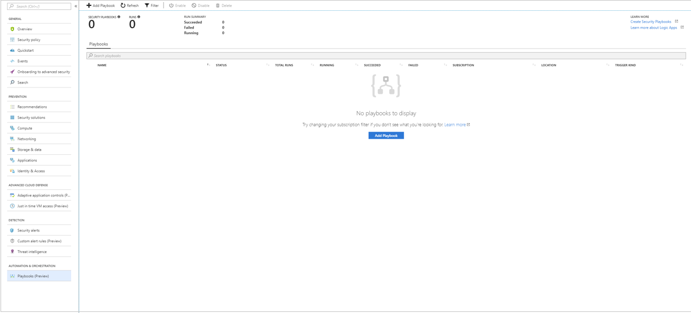
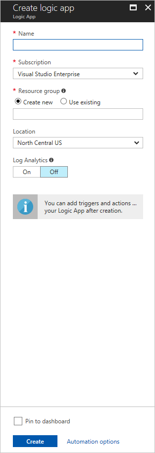
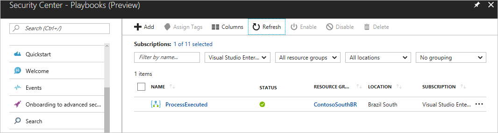
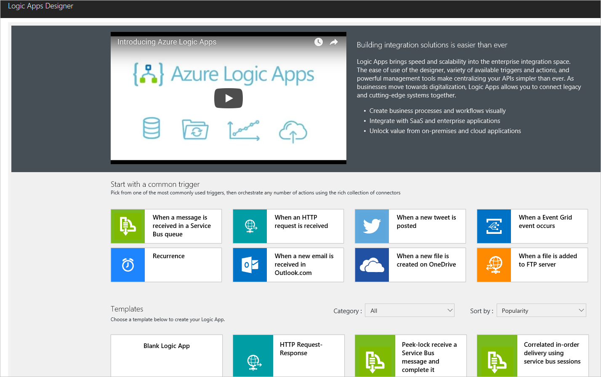
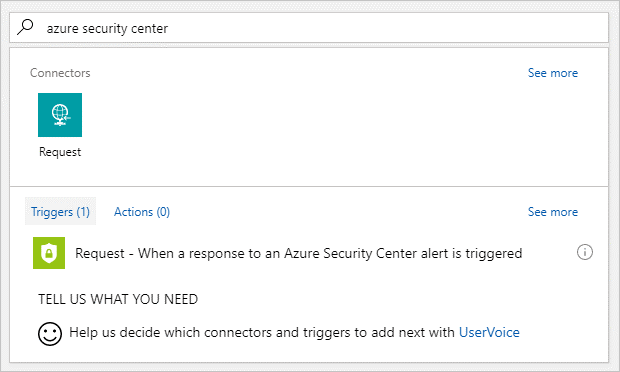
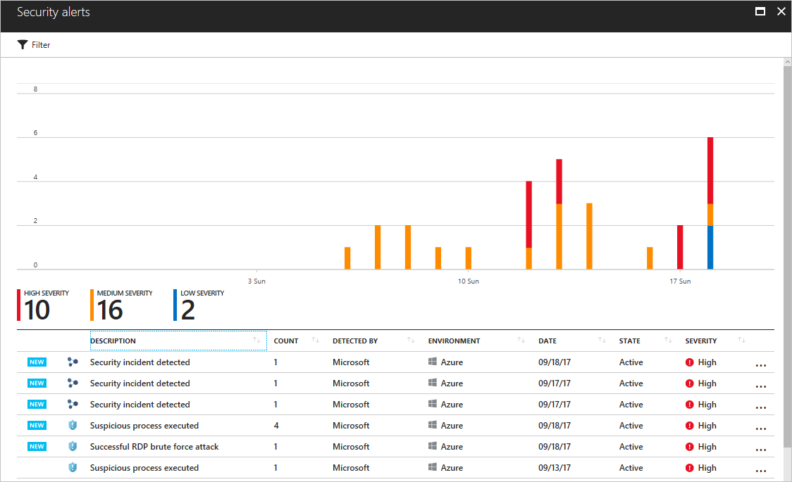
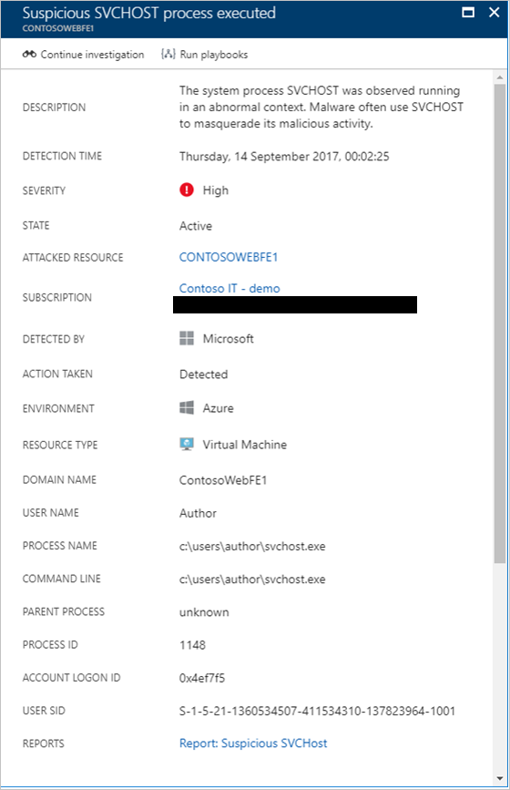
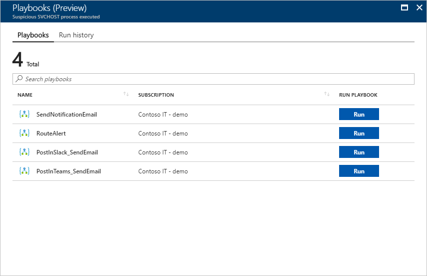
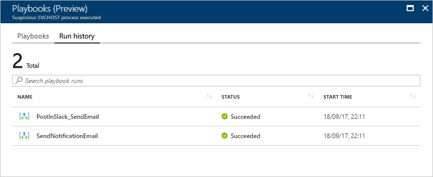
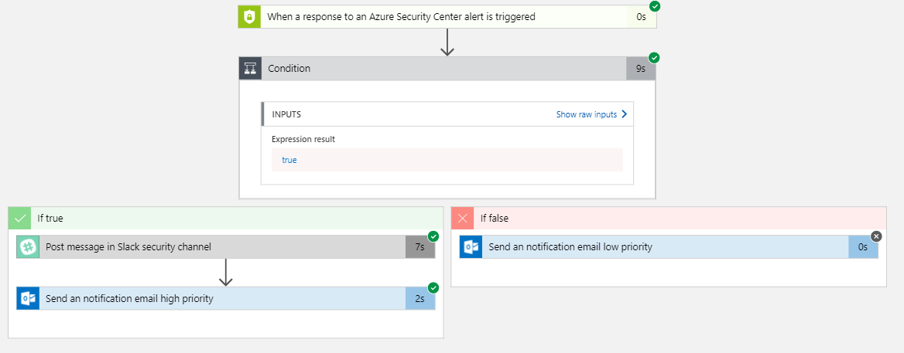

# Security Playbook in Azure Security Center (Preview)
This document helps you to use security playbooks in Azure Security Center to respond to security-related issues.

## What is security playbook in Security Center?
Security playbook is a collection of procedures that can be executed from Security Center once a certain playbook is triggered from selected alert. Security playbook can help to automate and orchestrate your response to a specific security alert detected by Security Center. Security Playbooks in Security Center are based on [Azure Logic Apps](https://docs.microsoft.com/azure/logic-apps/logic-apps-what-are-logic-apps), which means you can use the templates that are provided under the security category in Logic Apps templates, you can modify them based on your needs, or you can create new playbooks using [Azure Logic Apps workflow](https://docs.microsoft.com/azure/logic-apps/logic-apps-create-a-logic-app), and using Security Center as your trigger. 

> [!NOTE]
> Playbook leverages Azure Logic Apps, therefore charges apply. Visit [Azure Logic Apps](https://azure.microsoft.com/pricing/details/logic-apps/) pricing page for more details. 

## How to create a security playbook from Security Center?
Follow these steps to create a new security playbook from Security Center:

1.	Open **Security Center** dashboard.
2.	Under **Automation & Orchestration** section in the left pane, click **Playbooks (Preview)**.

	
 
3. In the **Security Center - Playbooks (Preview)** page, click **Add** button.

	

4. In the **Create Logic app** page, type the requested information to create your new logic app, and click **Create** button. Once it finishes creating, the new playbook will appear in the list. If it doesn’t appear, click **Refresh** button. Once you see it, click on it to start editing this playbook.

	

5. The **Logic App Designer** appears. Click **Blank Logic App** to create a new playbook. You can also select **Security** under the categories and use one of the templates.
 	
	

6. In the **Search all connectors and triggers** field, type *Azure Security Center*, and select **When a response to an Azure Security Center alert is triggered**.

	

7. Now you can define what happens when you trigger the playbook. You can add an action, logical condition, switch case conditions or loops.

	
	 
## How to run a security playbook in Security Center?

You can run a security playbook in Security Center when you would like to orchestrate, obtain more information from other services, or when you would like to remediate. To access the playbooks follow these steps:

1.	Open **Security Center** dashboard.
2.	In the left pane, under **Threat Detection** click **Security incidents & alerts**.

	

3.	Click the alert that you want to investigate.
4.	In the top of the alert’s page click **Run playbooks** button.

	

5. In the Playbooks page, select the playbook that you want to run, and click **Run** button. If you wish to see the playbook before triggering, you can click on it, and the designer will open.

	

### History

After running the playbook, you can also access previous executions, and steps that contains more information about the status of previously executed playbooks. The history is contextualized per alert, which means that the playbook history that you see in this page is correlated to the alert that triggered this playbook. 

To see more details about the execution of a particular playbook, click on the playbook itself, and the Logic App run page appears with the entire workflow.

In this workflow you can see the time that each task took it to be executed, and you can expand each task to see the result. 

### Changing an existing playbook

You can change an existing playbook in Security Center to add an action, or conditions. To do that you just need to click on the name of the playbook that you want to change, in the Playbooks tab, and Logic App Designer opens up.

> [!NOTE]
> For more information on how to create your own playbook using Azure Logic App, read [Create your first logic app workflow to automate processes between cloud apps and cloud services](https://docs.microsoft.com/azure/logic-apps/logic-apps-create-a-logic-app#add-an-action-that-responds-to-your-trigger).

## See also
In this document, you learned how to use playbooks in Azure Security Center. To learn more about Azure Security Center, see the following:

* [Managing and responding to security alerts in Azure Security Center](https://docs.microsoft.com/azure/security-center/security-center-managing-and-responding-alerts). Learn how to manage alerts, and respond to security incidents in Security Center.
* [Security health monitoring in Azure Security Center](security-center-monitoring.md). Learn how to monitor the health of your Azure resources.
* [Understanding security alerts in Azure Security Center](https://docs.microsoft.com/azure/security-center/security-center-alerts-type). Learn about the different types of security alerts.
* [Azure Security Center Troubleshooting Guide](https://docs.microsoft.com/azure/security-center/security-center-troubleshooting-guide). Learn how to troubleshoot common issues in Security Center. 
* [Azure Security Center FAQ](security-center-faq.md). Find frequently asked questions about using the service.
* [Azure Security Blog](http://blogs.msdn.com/b/azuresecurity/). Find blog posts about Azure security and compliance.

