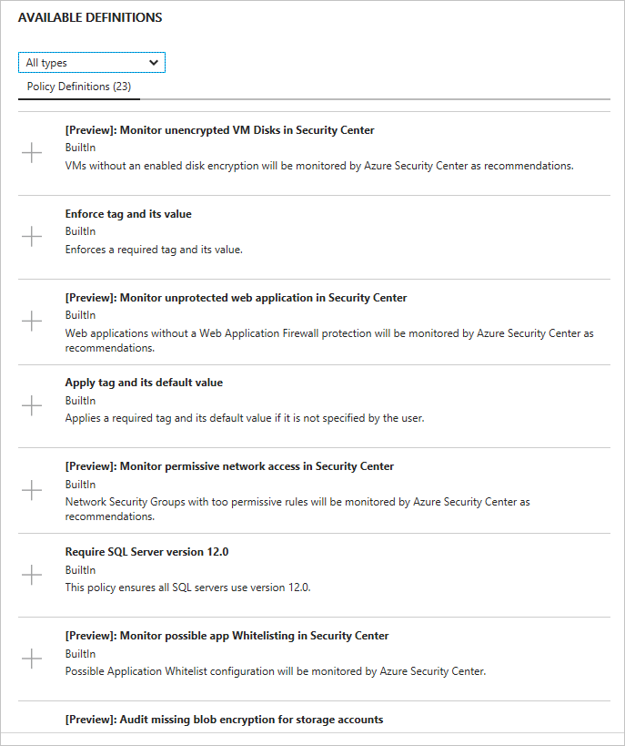
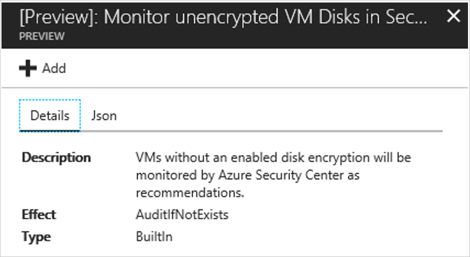

# Set security policies in Azure Security Center
This document helps you to configure security policies in Security Center by guiding you through the necessary steps to perform this task.

## How security policies work?
Security Center automatically creates a default security policy for each of your Azure subscriptions. You can edit the policy in Security Center or use [Azure Policy](http://docs.microsoft.com/azure/azure-policy/azure-policy-introduction) to create new definitions, define additional policies, and assign policies across Management Groups (which can represent the entire organization, a business unit in it etc.), and monitor compliance to these policies across these scopes.

> [!NOTE]
> Azure Policy is in limited preview. Click [here](https://aka.ms/getpolicy) to join. For more information about Azure Policies read [Create and manage policies to enforce compliance](http://docs.microsoft.com/en-us/azure/azure-policy/create-manage-policy).

## How to change security policies in Security Center?
You can edit the default security policy for each of your Azure subscriptions in Security Center. To modify a security policy, you must be an owner, contributor or Security Admin of that subscription or the containing Management Group. Sign in to the Azure portal and follow the succeeding steps to view your security polices in Security Center:

1. In the **Security Center** dashboard, under **General**, click **Security Policy**.
2. Select the subscription on which you want to enable the security policy.

	

3. In the **POLICY COMPONENTS** section, click **Security policy**.

	

4. This is the default policy assigned to Security Center via Azure Policy. You can delete items that are under **POLICIES AND PARAMETERS**, or you can add other policy definitions that are under **AVAILABLE OPTIONS**. To do that, just click in the plus sign besides the definition’s name.

	

5. If you want more detailed explanation about the policy, click on it and another page will open with the details, and the JSON code that has the [policy definition(https://docs.microsoft.com/azure/azure-resource-manager/resource-manager-policy#policy-definition-structure) structure:

	

6. When you finish editing, click **Save**.

## See also
In this document, you learned how to configure security policies in Azure Security Center. To learn more about Azure Security Center, see the following:

* [Azure Security Center planning and operations guide](security-center-planning-and-operations-guide.md). Learn how to plan and understand the design considerations to adopt Azure Security Center.
* [Security health monitoring in Azure Security Center](security-center-monitoring.md). Learn how to monitor the health of your Azure resources.
* [Managing and responding to security alerts in Azure Security Center](security-center-managing-and-responding-alerts.md). Learn how to manage and respond to security alerts.
* [Monitoring partner solutions with Azure Security Center](security-center-partner-solutions.md). Learn how to monitor the health status of your partner solutions.
* [Azure Security Center FAQ](security-center-faq.md). Find frequently asked questions about using the service.
* [Azure Security Blog](http://blogs.msdn.com/b/azuresecurity/). Find blog posts about Azure security and compliance.
