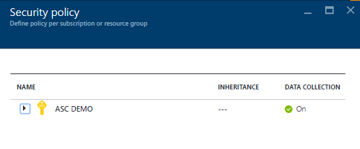
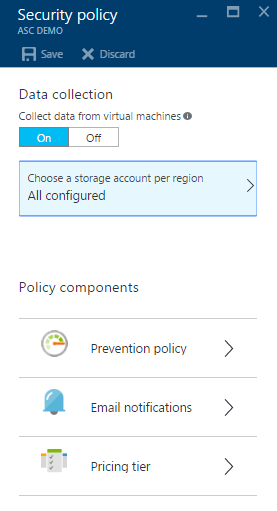
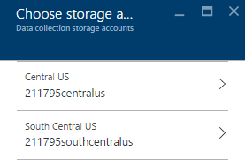
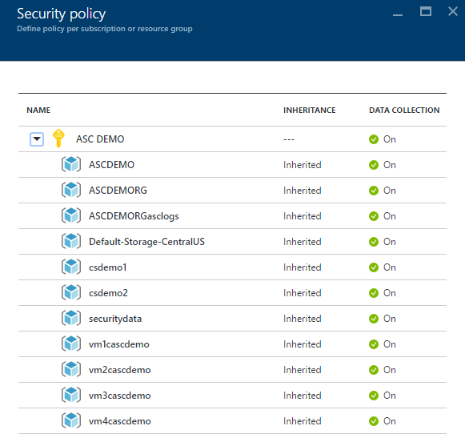
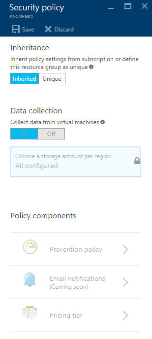

<properties
   pageTitle="Setting security policies in Azure Security Center | Microsoft Azure"
   description="This document helps you to configure security policies in Azure Security Center."
   services="security-center"
   documentationCenter="na"
   authors="YuriDio"
   manager="swadhwa"
   editor=""/>

<tags
   ms.service="security-center"
   ms.devlang="na"
   ms.topic="hero-article"
   ms.tgt_pltfrm="na"
   ms.workload="na"
   ms.date="07/21/2016"
   ms.author="yurid"/>

# Setting security policies in Azure Security Center
This document helps you to configure security policies in Security Center by guiding you through the necessary steps to perform this task.

## What are security policies?
A security policy defines the set of controls which are recommended for resources within the specified subscription or resource group. In Security Center, you define policies for your Azure subscriptions or resource group according to your company security needs and the type of applications or sensitivity of the data in each subscription.

For example, resources used for development or test may have different security requirements than those used for production applications. Likewise, applications with regulated data like PII (Personally Identifiable Information) may require a higher level of security. The security policies enabled in Azure Security Center will drive security recommendations and monitoring to help you identify potential vulnerabilities and mitigate threats. Read [Azure Security Center Planning and Operations Guide](security-center-planning-and-operations-guide.md) for more information on how to decide which option is more appropriate for you.

## Setting security policies for subscriptions

Security policies can be configured for each subscription or resource group. To modify a security policy, you must be an Owner or Contributor of that subscription. Access Azure portal and follow the steps below to configure security polices in Security Center:

1. Click on the **Policy** tile in the Security Center dashboard.

2. In the **Security Policy - Define policy per subscription or resource group** blade that opens up on the right side, select the subscription that you want to enable the security policy. If you prefer to enable the Security Policy for a Resource Group instead of for the entire subscription, scroll down to the next section were we talk about setting up security policies for Resource Groups.

    

3. The **Security policy**  blade for that subscription will open with a set of options similar to the one shown below:

    

4. Make sure **Collect data from virtual machines** options is **On**. This option enables automatic log collection for existing and new resources. 

    >[AZURE.NOTE] It is strongly recommended that you turn data collection on for each of your subscriptions as this will ensure that security monitoring is available for all existing and new VMs. Enabling data collection installs the monitoring agent. If you don't want to turn on data collection now from this location, you can do it later from the health and recommendations views. You can also enable data collection for the subscription only, or for select VMs. Refer to the [Azure Security Center FAQ](security-center-faq.md) to know more about the supported VMs.

5. If your storage account is not configured yet, you may see a similar warning showed in the figure below when you open the **Security Policy**:

    

6. If you see this warning, click this option and select the region as shown in the figure below:

    

7. For each region in which you have virtual machines running, choose the storage account where data collected from those virtual machines is stored. This makes it easy for you to keep data in the same geographic area for privacy and data sovereignty purposes. Once you decide which region you will use, select the region and then select the storage account.

8. In the **Choose storage accounts** blade click **OK**.

    > [AZURE.NOTE] If you prefer, you can aggregate data from virtual machines in various regions in one central storage account. Refer to the [Azure Security Center FAQ](security-center-faq.md) for more information.

9. In the **Security Policy** blade click **On** to enable the security recommendations that you want to use on this subscription. Click **Prevention policy** option. The **Security Policy** blade will open as shown below. 

	

Use the table below as a reference to understand what each option will do:

| Policy | When State is On |
|----- |-----|
| System Updates | Daily, retrieves a list of available security and critical updates from Windows Update or WSUS, depending on which service is configured for that virtual machine, and recommends that the missing updates be applied. It checks for the latest updates in Linux systems using distro provided package management system to determine which packages have updates available. It also check for security and critical updates from [Cloud Services](./cloud-services/cloud-services-how-to-configure.md) virtual machines. |
| OS Vulnerabilities | Daily, analyzes OS configurations that could make the virtual machine more vulnerable to attack and recommends configuration changes to address these vulnerabilities. See the [list of recommended baselines](https://gallery.technet.microsoft.com/Azure-Security-Center-a789e335) for more information on the specific configurations being monitored. |
| Endpoint Protection | Recommends endpoint protection to be provisioned for all Windows virtual machines to help identify and remove viruses, spyware, and other malicious software. specific configurations being monitored. |
| Disk Encryption | Recommends to enable disk encryption in all virtual machines to enhance data protection at rest. 
| Network Security Groups | Recommends that [Network Security Groups](../virtual-network/virtual-networks-nsg.md) (NSGs) be configured to control inbound and outbound traffic to VM's with public endpoints. NSGs configured for a subnet will be inherited by all virtual machine network interfaces unless otherwise specified. In addition to checking that an NSG has been configured, this option assesses inbound security rules to identify if there are any that allow incoming traffic. |
| Web Application Firewall | Recommends a Web Application Firewall be provisioned on virtual machines when: [Instance Level Public IP](../virtual-network/virtual-networks-instance-level-public-ip.md) (ILPIP) is used and the associated NSG Inbound Security Rules are configured to allow access to port 80/443. Load Balanced IP (VIP) is used and the associated load balancing and inbound NAT rules are configured to allow access to port 80/443 (for more information, see [Azure Resource Manager Support for Load Balancer](../load-balancer/load-balancer-arm.md)) |
| Next Generation Firewall | This extends network protections beyond Network Security Groups, which are built-in to Azure. Security Center will discover deployments for which a Next Generation Firewall is recommended, and enable you to provision a virtual appliance. |
| SQL Auditing | Recommends that auditing of access to Azure SQL Servers and Databases be enabled for compliance, advanced detection and investigation purposes. |
| SQL Transparent Data Encryption | Recommends that encryption at rest be enabled for your Azure SQL databases, associated backups and transaction log files so that even if your data is breached, it will not be readable. |
	
Once you finish configuring all options, click **OK** in the **Security Policy** blade that has the recommendations and click **Save** in the **Security Policy** blade that  has the initial settings.

## Setting security policies for resource groups

If you prefer to configure your security policies per resource group, the steps are similar to those you use for setting up security policies for subscriptions. The main difference is that you will need to expand the subscription name and select the resource group that you want to configure the unique security policy:

After you select the resource group, the **Security policy** blade will open. By default, the option **Inheritance** is enabled, which means all security policies for this resource group are inherited from the subscription level. You can change this configuration in case you want a custom security policy per resource group. If that's the case, you need to select **Unique** and make the changes under **Prevention policy** option.

> [AZURE.NOTE] In case of a conflict between subscription level policy and resource group level policy, the resource level policy takes precedence.

## See also

In this document, you learned how to configure security policies in Azure Security Center. To learn more about Azure Security Center, see the following:

- [Azure Security Center Planning and Operations Guide](security-center-planning-and-operations-guide.md) — Learn how to plan and understand the design considerations to adopt Azure Security Center.
- [Security health monitoring in Azure Security Center](security-center-monitoring.md) — Learn how to monitor the health of your Azure resources
- [Managing and responding to security alerts in Azure Security Center](security-center-managing-and-responding-alerts.md) — Learn how to manage and respond to security alerts
- [Monitoring partner solutions with Azure Security Center](security-center-partner-solutions.md) — Learn how to monitor the health status of your partner solutions.
- [Azure Security Center FAQ](security-center-faq.md) — Find frequently asked questions about using the service
- [Azure Security Blog](http://blogs.msdn.com/b/azuresecurity/) — Find blog posts about Azure security and compliance
