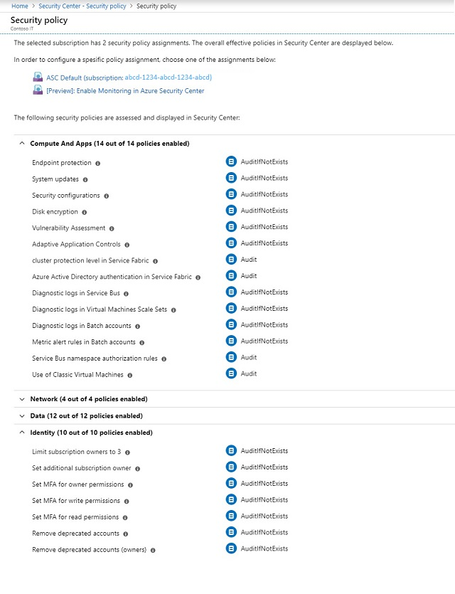

# Set security policies in Azure Security Center
This article helps you configure security policies in Security Center.

For instructions on how to set policies using PowerShell, see [Quickstart: Create a policy assignment to identify non-compliant resources using the Azure RM PowerShell module](../azure-policy/assign-policy-definition-ps.md).

## How security policies work
Security Center automatically creates a default security policy for each of your Azure subscriptions. In Security Center, you can edit the policies and monitor policy compliance.

> [!NOTE]
> You can now extend Security Center policies by using [Azure Policy](../azure-policy/azure-policy-introduction.md). For more information, see [Integrate Security Center security policies with Azure Policy](security-center-azure-policy.md).

The security requirements for resources that are used for development or test might vary from the requirements for resources that are used for production applications. Applications that use regulated data, such as personally identifiable information, might require a higher level of security. Security policies that are enabled in Azure Security Center drive security recommendations and monitoring to help you identify potential vulnerabilities and mitigate threats. For more information about how to determine the option that is appropriate for you, see [Azure Security Center planning and operations guide](security-center-planning-and-operations-guide.md).

## Edit security policies
You can edit the default security policy for each of your Azure subscriptions in Security Center. To modify a security policy, you must be an owner, contributor, or security administrator of the subscription. To configure security policies in Security Center, do the following:

1. Sign in to the Azure portal.

2. On the **Security Center** dashboard, under **POLICY & COMPLIANCE**, select **Security policy**.

3. Select the subscription that you want to enable a security policy for.

4. Turn on the policies you want to enable for the subscription. You will get recommendations based on each policy you select. 
  
5. When you finish editing, select **Save**.

## Available security policy definitions

To understand the policy definitions that are available in the default security policy, refer to the following table:

| Policy | What the policy does |
| --- | --- |
| System updates |Retrieves a daily list of available security and critical updates from Windows Update or Windows Server Update Services. The retrieved list depends on the service that's configured for your virtual machines, and it recommends that missing updates be applied. For Linux systems, the policy uses the distro-provided package-management system to determine packages that have available updates. It also checks for security and critical updates from [Azure Cloud Services](../cloud-services/cloud-services-how-to-configure-portal.md) virtual machines. |
| Security configurations |Analyzes operating system configurations daily to determine issues that could make the virtual machine vulnerable to attack. The policy also recommends configuration changes to address these vulnerabilities. For more information about the specific configurations that are being monitored, see the [list of recommended baselines](https://gallery.technet.microsoft.com/Azure-Security-Center-a789e335). (At this time, Windows Server 2016 is not fully supported.) |
| Endpoint protection |Recommends that endpoint protection be set up for all Windows virtual machines (VMs) to help identify and remove viruses, spyware, and other malicious software. |
| Disk encryption |Recommends enabling disk encryption in all virtual machines to enhance data protection at rest. |
| Network security groups |Recommends that [network security groups](../virtual-network/security-overview.md) be configured to control inbound and outbound traffic to VMs that have public endpoints. Network security groups that are configured for a subnet are inherited by all virtual-machine network interfaces unless otherwise specified. In addition to checking to see whether a network security group has been configured, this policy assesses inbound security rules to identify rules that allow incoming traffic. |
| Web application firewall |Recommends that a web application firewall be set up on virtual machines when either of the following is true: <ul><li>An [instance-level public IP](../virtual-network/virtual-networks-instance-level-public-ip.md) is used, and the inbound security rules for the associated network security group are configured to allow access to port 80/443.</li><li>A load-balanced IP is used, and the associated load balancing and inbound network address translation (NAT) rules are configured to allow access to port 80/443. For more information, see [Azure Resource Manager support for Load Balancer](../load-balancer/load-balancer-arm.md).</li> |
| Next generation firewall |Extends network protections beyond network security groups, which are built into Azure. Security Center discovers deployments for which a next generation firewall is recommended, and then you can set up a virtual appliance. |
| SQL auditing and threat detection |Recommends that auditing of access to your SQL database be enabled for both compliance and advanced threat detection, for investigation purposes. |
| SQL encryption |Recommends that encryption at rest be enabled for your SQL database, associated backups, and transaction log files. Even if your data is breached, it is not readable. |
| Vulnerability assessment |Recommends that you install a vulnerability assessment solution on your VM. |
| Storage encryption |Currently, this feature is available for blobs and Azure Files. After you enable Storage Service Encryption, only new data is encrypted, and any existing files in this storage account remain unencrypted. |
| JIT network access |When just-in-time network access is enabled, Security Center locks down inbound traffic to your Azure VMs by creating a network security group rule. You select the ports on the VM to which inbound traffic should be locked down. For more information, see [Manage virtual machine access using just in time](https://docs.microsoft.com/azure/security-center/security-center-just-in-time). |

## Next steps
In this article, you learned how to configure security policies in Security Center. To learn more about Security Center, see the following articles:

* [Azure Security Center planning and operations guide](security-center-planning-and-operations-guide.md): Learn how to plan and understand the design considerations about Azure Security Center.
* [Security health monitoring in Azure Security Center](security-center-monitoring.md): Learn how to monitor the health of your Azure resources.
* [Manage and respond to security alerts in Azure Security Center](security-center-managing-and-responding-alerts.md): Learn how to manage and respond to security alerts.
* [Monitor partner solutions with Azure Security Center](security-center-partner-solutions.md): Learn how to monitor the health status of your partner solutions.
* [Azure Security Center FAQ](security-center-faq.md): Get answers to frequently asked questions about using the service.
* [Azure Security Blog](http://blogs.msdn.com/b/azuresecurity/): Find blog posts about Azure security and compliance.

To learn more about Azure Policy, see [What is Azure Policy?](../azure-policy/azure-policy-introduction.md)
