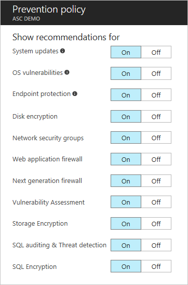

# Set security policies in Azure Security Center
This document helps you to configure security policies in Security Center by guiding you through the necessary steps to perform this task.

## What are security policies?
A security policy defines the set of controls, which are recommended for resources within the specified subscription or resource group. In Security Center, you define policies for your Azure subscriptions or resource group according to your company security needs and the type of applications or sensitivity of the data in each subscription.

For example, resources that are used for development or test might have different security requirements from resources that are used for production applications. Likewise, applications that use regulated data like personally identifiable information might require a higher level of security. Security policies that are enabled in Azure Security Center drive security recommendations and monitoring to help you identify potential vulnerabilities and mitigate threats. Read [Azure Security Center Planning and Operations Guide](security-center-planning-and-operations-guide.md) for more information about how to determine the option that is appropriate for you.

## Set security policies for subscriptions
You can configure security policies for each subscription or resource group. To modify a security policy, you must be an owner or contributor of that subscription. Sign in to the Azure portal and follow the succeeding steps to configure security polices in Security Center:

1. Click the **Policy** tile in the Security Center dashboard.
2. In the **Security Policy - Define policy per subscription or resource group** blade that opens, select the subscription on which you want to enable the security policy. If you prefer to enable the security policy for a resource group instead of the entire subscription, scroll down to the next section that talks about how to set up security policies for resource groups.

    
3. The **Security policy** blade for the selected subscription opens with a set of options like the options in the following screenshot:

    

    The available options in this blade are:

   * **Prevention policy**: Use this option to configure policies per subscription or resource group.  
   * **Email notification**: Use this option to configure an email notification that's sent on the first daily occurrence of an alert and for high severity alerts. Email preferences can be configured only for subscription policies. Read [Provide security contact details in Azure Security Center](security-center-provide-security-contact-details.md) for more information about how to configure an email notification.
   * **Pricing tier**: Use this option to upgrade the pricing tier selection. See [Security Center pricing](security-center-pricing.md) to learn more about pricing options.
4. Make sure that **Collect data from virtual machines** options is **On**. This option enables automatic log collection for existing and new resources.

   > [!NOTE]
   > We recommend that you turn on data collection for each of your subscriptions to ensure that security monitoring is available for all existing and new VMs. Enabling data collection installs the monitoring agent. If you don't want to turn on data collection now from this location, you can do it later from the **Health** and **Recommendations** views. You can also enable data collection for only the subscription or for select VMs. Refer to the [Azure Security Center FAQ](security-center-faq.md) to know more about the supported VMs.
   >
   >
5. If your storage account is not configured yet, you might see a warning like the one in the following screenshot when you open **Security Policy**. If you do not choose a storage account for each region, it is created for you.

    
6. If you see this warning, click this option and select the region as shown in the following screenshot:

    
7. For each region in which you have running virtual machines, choose the storage account where data that's collected from those virtual machines is stored. This makes it easy to keep data in the same geographic area for privacy and data sovereignty purposes. After you decide the region that you will use, select the region, and then select the storage account.
8. In the **Choose storage accounts** blade, click **OK**.

   > [!NOTE]
   > If you prefer, you can aggregate data in one central storage account for virtual machines that are in various regions. Refer to the [Azure Security Center FAQ](security-center-faq.md) for more information.
   >
   >
9. In the **Security Policy** blade, click **On** to enable the security recommendations that you want to use on this subscription. Click **Prevention policy** to see options like those in the following screenshot:

    

Use the following table as a reference to understand each option:

| Policy | When state is on |
| --- | --- |
| System updates |Retrieves a daily list of available security and critical updates from Windows Update or Windows Server Update Services. The retrieved list depends on the service that's configured for that virtual machine and recommends that the missing updates be applied. For Linux systems, the policy uses the distro-provided package management system to determine packages that have available updates. It also checks for security and critical updates from [Azure Cloud Services](../cloud-services/cloud-services-how-to-configure.md) virtual machines. |
| OS vulnerabilities |Analyzes operating system configurations daily to determine issues that could make the virtual machine vulnerable to attack. The policy also recommends configuration changes to address these vulnerabilities. See the [list of recommended baselines](https://gallery.technet.microsoft.com/Azure-Security-Center-a789e335) for more information about the specific configurations that are being monitored. (At this time, Windows Server 2016 is not fully supported.) |
| Endpoint protection |Recommends endpoint protection to be provisioned for all Windows virtual machines to help identify and remove viruses, spyware, and other malicious software. |
| Disk encryption |Recommends enabling disk encryption in all virtual machines to enhance data protection at rest. |
| Network security groups |Recommends that [network security groups](../virtual-network/virtual-networks-nsg.md) be configured to control inbound and outbound traffic to VMs that have public endpoints. Network security groups that are configured for a subnet will be inherited by all virtual machine network interfaces unless otherwise specified. In addition to checking that a network security group has been configured, this policy assesses inbound security rules to identify rules that allow incoming traffic. |
| Web application firewall |Recommends that a web application firewall be provisioned on virtual machines when either of the following is true:  [Instance-level public IP](../virtual-network/virtual-networks-instance-level-public-ip.md) (ILPIP) is used and the inbound security rules for the associated network security group are configured to allow access to port 80/443.  Load-balanced IP is used and the associated load balancing and inbound network address translation (NAT) rules are configured to allow access to port 80/443. (For more information, see [Azure Resource Manager support for Load Balancer](../load-balancer/load-balancer-arm.md). |
| Next generation firewall |Extends network protections beyond network security groups, which are built into Azure. Security Center will discover deployments for which a next generation firewall is recommended and enable you to provision a virtual appliance. |
| SQL auditing & Threat detection |Recommends that auditing of access to Azure Database be enabled for compliance and also advanced threat detection, for investigation purposes. |
| SQL transparent data encryption |Recommends that encryption at rest be enabled for your Azure SQL Database, associated backups, and transaction log files. Even if your data is breached, it will not be readable. |
| Vulnerability assessment |Recommends that you install a vulnerability assessment solution on your VM. |
| Storage Encryption |Currently, this feature is available for Azure Blobs and Files. Note that after enabling Storage Service Encryption, only new data will be encrypted, and any existing files in this storage account will remain unencrypted. |

After you configure all options, click **OK** in the **Security Policy** blade that has the recommendations, and then click **Save** in the **Security Policy** blade that  has the initial settings.

## Set security policies for resource groups
If you prefer to configure your security policies per resource group, the steps are like those that you use to set up security policies for subscriptions. The main difference is that you will need to expand the subscription name and select the resource group for which you want to configure the unique security policy:

After you select the resource group, the **Security policy** blade opens. By default, the **Inheritance** option is enabled. This means that all security policies for this resource group are inherited from the subscription level. You can change this configuration in case you want a custom security policy for a resource group. If that's the case, you need to select **Unique** and make the changes under the **Prevention policy** option.

> [!NOTE]
> In case of a conflict between subscription-level policy and resource group-level policy, the resource group-level policy takes precedence.
>
>

## See also
In this document, you learned how to configure security policies in Azure Security Center. To learn more about Azure Security Center, see the following:

* [Azure Security Center planning and operations guide](security-center-planning-and-operations-guide.md). Learn how to plan and understand the design considerations to adopt Azure Security Center.
* [Security health monitoring in Azure Security Center](security-center-monitoring.md). Learn how to monitor the health of your Azure resources.
* [Managing and responding to security alerts in Azure Security Center](security-center-managing-and-responding-alerts.md). Learn how to manage and respond to security alerts.
* [Monitoring partner solutions with Azure Security Center](security-center-partner-solutions.md). Learn how to monitor the health status of your partner solutions.
* [Azure Security Center FAQ](security-center-faq.md). Find frequently asked questions about using the service.
* [Azure Security Blog](http://blogs.msdn.com/b/azuresecurity/). Find blog posts about Azure security and compliance.
