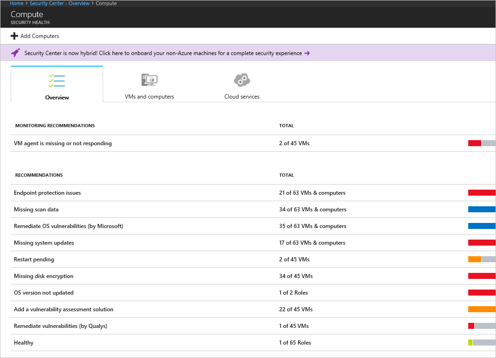
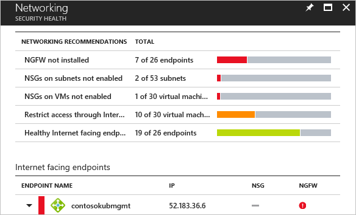
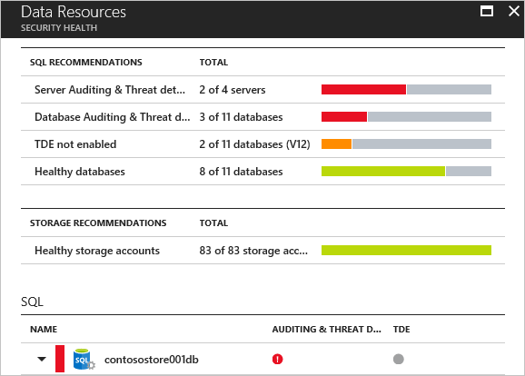
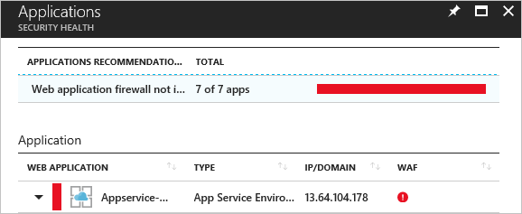

# Tutorial: Define and assess security policies
Security Center helps you view the status of security policies and how they are applied across your workloads. Azure Security Center automatically assigns its [built-in security policies](security-center-policy-definitions.md) on each subscription that is onboarded. You can configure them in [Azure Policy](../azure-policy/azure-policy-introduction.md), or using the REST API, which also enables you to set policies across Management groups and across multiple subscriptions. For more information, see [Integrate Security Center security policies with Azure Policy](security-center-azure-policy.md). In this tutorial, you will learn how to:

> [!div class="checklist"]
> * Configure a security policy using the REST API
> * Assess the security of your resources

If you don’t have an Azure subscription, create a  [free account](https://azure.microsoft.com/pricing/free-trial/) before you begin.

## Prerequisites
To step through the features covered in this tutorial, you must be on Security Center’s Standard pricing tier. You can try Security Center Standard at no cost for the first 60 days. The quickstart [Onboard your Azure subscription to Security Center Standard](security-center-get-started.md) walks you through how to upgrade to Standard.

## Configure a security policy using the REST API

As part of the native integration with Azure Policy, Azure Security Center enables you to take advantage Azure Policy’s REST API to create policy assignments. The following instructions walk you through creation of policy assignments, as well as customization of existing assignments. 

Important concepts in Azure Policy: 

- A **policy definition** is a rule 

- An **initiative** is a collection of policy definitions (rules) 

- An **assignment** is an application of an initiative or a policy to a specific scope (management group, subscription, etc.) 

Security Center has a built-in initiative that includes all of its security policies. In order to assess Security Center’s policies on your Azure resources, you should create an assignment on the management group, or subscription you want to assess.  

The built-in initiative has all of Security Center’s policies enabled by default. You can choose to disable certain policies from the built-in initiative, for example you can apply all of Security Center’s policies except **web application firewall**, by changing the value of the policy’s effect parameter to **Disabled**. 

### API examples

In the following examples, replace these variables:

- **{scope}** enter the name of the management group or subscription you are applying the policy to.
- **{poicyAssignmentName}** enter the name of the relevant policy assignment.
- **{name}** enter your name, or the name of the administrator who approved the policy change.

|Policy name in Security Center|Policy name displayed in Azure Policy |Policy effect parameter name|
|----|----|----|
|SQL Encryption |Monitor unencrypted SQL database in Azure Security Center |sqlEncryptionMonitoringEffect| 
|SQL Auditing |Monitor unaudited SQL database in Azure Security Center |sqlAuditingMonitoringEffect|
|System updates |Monitor missing system updates in Azure Security Center |systemUpdatesMonitoringEffect|
|Storage encryption |Audit missing blob encryption for storage accounts |storageEncryptionMonitoringEffect|
|JIT Network access |Monitor possible network Just In Time (JIT) access in Azure Security Center |jitNetworkAccessMonitoringEffect |
|Adaptive application controls |Monitor possible app Whitelisting in Azure Security Center |adaptiveApplicationControlsMonitoringEffect|
|Network security groups |Monitor permissive network access in Azure Security Center |networkSecurityGroupsMonitoringEffect| 
|Security configurations |Monitor OS vulnerabilities in Azure Security Center |systemConfigurationsMonitoringEffect| 
|Endpoint protection |Monitor missing Endpoint Protection in Azure Security Center |endpointProtectionMonitoringEffect |
|Disk encryption |Monitor unencrypted VM Disks in Azure Security Center |diskEncryptionMonitoringEffect|
|Vulnerability assessment |Monitor VM Vulnerabilities in Azure Security Center |vulnerabilityAssesmentMonitoringEffect|
|Web application firewall |Monitor unprotected web application in Azure Security Center |webApplicationFirewallMonitoringEffect |
|Next generation firewall |Monitor unprotected network endpoints in Azure Security Center| |

This example shows you how to assign the built-in Security Center initiative on a subscription or management group
 
    PUT  
    https://management.azure.com/{scope}/providers/Microsoft.Authorization/policyAssignments/{policyAssignmentName}?api-version=2018-05-01 

    Request Body (JSON) 

    { 

      "properties":{ 

    "displayName":"Enable Monitoring in Azure Security Center", 

    "metadata":{ 

    "assignedBy":"{Name}" 

    }, 

    "policyDefinitionId":"/providers/Microsoft.Authorization/policySetDefinitions/1f3afdf9-d0c9-4c3d-847f-89da613e70a8", 

    "parameters":{}, 

    } 

    } 

This example shows you how to assign the built-in Security Center initiative on a subscription, with the following policies disabled: 

- System updates (“systemUpdatesMonitoringEffect”) 

- Security configurations ("systemConfigurationsMonitoringEffect") 

- Endpoint protection ("endpointProtectionMonitoringEffect") 

 
      PUT https://management.azure.com/{scope}/providers/Microsoft.Authorization/policyAssignments/{policyAssignmentName}?api-version=2018-05-01 

      Request Body (JSON) 

      { 

        "properties":{ 

      "displayName":"Enable Monitoring in Azure Security Center", 

      "metadata":{ 

      "assignedBy":"{Name}" 

      }, 

      "policyDefinitionId":"/providers/Microsoft.Authorization/policySetDefinitions/1f3afdf9-d0c9-4c3d-847f-89da613e70a8", 

      "parameters":{ 

      "systemUpdatesMonitoringEffect":{"value":"Disabled"}, 

      "systemConfigurationsMonitoringEffect":{"value":"Disabled"}, 

      "endpointProtectionMonitoringEffect":{"value":"Disabled"}, 

      }, 

       } 

      } 

This example shows you how to remove an assignment :

    DELETE   
    https://management.azure.com/{scope}/providers/Microsoft.Authorization/policyAssignments/{policyAssignmentName}?api-version=2018-05-01 

## Assess resource security
1. After you finish fine tuning your policies and assigning them as necessary, Security Center will provide a set of correlating security recommendations. You should start by reviewing the virtual machine and computers recommendations. On the Security Center dashboard, select **Overview**, and select **Compute & apps**.

  

  Review each recommendation by prioritizing recommendations in red (high priority). Some of these recommendations have remediation that can be implemented directly from Security Center, such as the [endpoint protection issues](https://docs.microsoft.com/azure/security-center/security-center-install-endpoint-protection). Other recommendations have only guidelines to apply the remediation, such as the missing disk encryption recommendation.

2. After you address all relevant compute recommendations, you should move on to the next workload: networking. On the Security Center dashboard, click **Overview**, and click **Networking**.

  

  The networking recommendations page has a list of security issues for network configuration, internet facing endpoints, and network topology. Just like **Compute & apps**, some networking recommendations will provide integrated remediation, and some others will not.

3. After you address all relevant networking recommendations, you should move on to the next workload: storage & data. On the Security Center dashboard, click **Overview**, and click **Data & storage**.

  

  The **Data Resources** page contains recommendations around enabling auditing for Azure SQL servers and databases, enabling encryption for SQL databases, and enabling encryption of your Azure storage account. If you don’t have these workloads, you will not see any recommendation. Just like **Compute & apps**, some data & storage recommendations will provide integrated remediation, and some others will not.

4. AFter you address all relevant data & storage recommendations, you should move on to the next workload: Identity & access. On the Security Center dashboard, click **Overview**, and click **Identity & access**.

  

  The **Identity & Access** page contains recommendations such as:

   - Enable MFA for privileged accounts on your subscription
   - Remove external accounts with write permissions from your subscription
   - Remove privileged external accounts from your subscription
5. To understand how your security policies are actually being applied across your resources, you can view your security policies in Security Center.

  1. In the **Security Center** dashboard, select **Security policy**.

  In the **Policy management** screen, you can see the number of management groups, subscriptions, and workspaces as well as your management group structure.

   > [!NOTE]
    > The Security Center dashboard may show a higher number of subscriptions under **Subscription coverage** than the number of subscriptions shown under **Policy management**. Subscription coverage shows the number of Standard, Free, and “not covered” subscriptions. The “not covered” subscriptions do not have Security Center enabled and are not displayed under **Policy management**.
    >
    >

  The columns in the table display:

   - **Policy initiative assignment** – Security Center [built-in policies](security-center-policy-definitions.md) and initiatives that are assigned to a subscription or management group.
     - **Compliance** – Overall compliance score for a management group, subscription, or workspace. The score is the weighted average of the assignments. The weighted average factors in the number of policies in a single assignment and the number of resources the assignment applies to.

     For example, if your subscription has two VMs and an initiative with five policies assigned to it, then you have 10 assessments in your subscription. If one of the VMs doesn't comply to two of the policies, then the overall compliance score of your subscription’s assignment is 80%.

     - **Coverage** – Identifies the pricing tier, Free or Standard, that the management group, subscription, or workspace is running on.  See [Pricing](security-center-pricing.md) to learn more about Security Center's pricing tiers.
     - **Settings** – Subscriptions have the link **Edit settings**. Selecting **Edit settings** lets you update your [Security Center settings](security-center-policies-overview.md) for each subscription or management group.

  2. Select the subscription or management group whose policies you want to view.

     - The **Security policy** screen reflects the action taken by the policies running on the subscription or management group you selected. 
     - At the top, use the links provided to open each policy assignment that applies on the subscription or management group. From there you can configure the policies, create more assignments, etc. For example, if you see that a particular policy is effectively denying endpoint protection, you can use the link to access the policy and edit or disable it.
     - In the list of policies, you can see the effective application of the policy on your subscription or management group. This means that the settings of each policy that apply to the scope are taken into consideration and you are provided with the cumulative outcome of what action is taken by the policy. For example, if you have an initiative that includes the **disk encryption policy** and it has one assignment on a subscription, but it is disabled on the management group level, it will display the effect of the policy. The policy action will take precedence, because Security Center always applies the more active policy.
     - The policies' effect can be: Append, Audit, AuditIfNotExists, Deny, DeployIfNotExists, Disabled. For more information on how effects are applied, see [Understand Policy effects](../governance/policy/concepts/effects.md).

     

## Clean up resources
Other quickstarts and tutorials in this collection build upon this quickstart. If you plan to continue on to work with subsequent quickstarts and tutorials, continue running the Standard tier and keep automatic provisioning enabled. If you do not plan to continue or wish to return to the Free tier:

1. Return to the Security Center main menu and select **Security Policy**.
2. Select the subscription or policy that you want to return to Free. **Security policy** opens.
3. Under **POLICY COMPONENTS**, select **Pricing tier**.
4. Select **Free** to change subscription from Standard tier to Free tier.
5. Select **Save**.

If you want to disable automatic provisioning:

1. Return to the Security Center main menu and select **Security policy**.
2. Select the subscription that you wish to disable automatic provisioning.
3. Under **Security policy – Data Collection**, select **Off** under **Onboarding** to disable automatic provisioning.
4. Select **Save**.

>[!NOTE]
> Disabling automatic provisioning does not remove the Microsoft Monitoring Agent from Azure VMs where the agent has been provisioned. Disabling automatic provisioning limits security monitoring for your resources.
>

## Next steps
In this tutorial, you learned about basic policy definition and security assessment of your workload with Security Center, such as:

> [!div class="checklist"]
> * Security policy configuration to ensure compliance with your company or regulatory security requirements
> * Security assessment for your compute, networking, SQL & storage, and application resources

Advance to the next tutorial to learn how to use Security Center to protect your resources.

> [!div class="nextstepaction"]
> [Protect your resources](tutorial-protect-resources.md)
