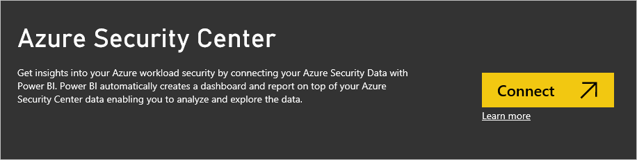
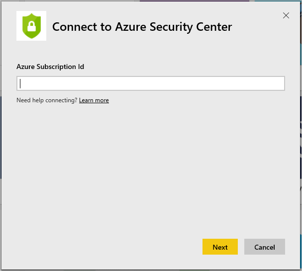
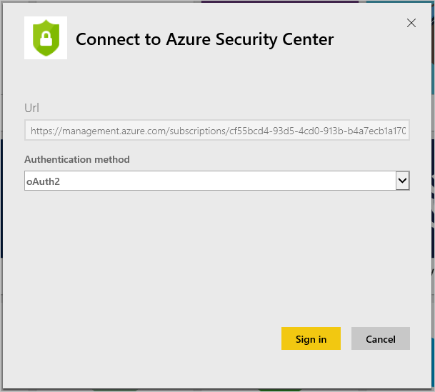
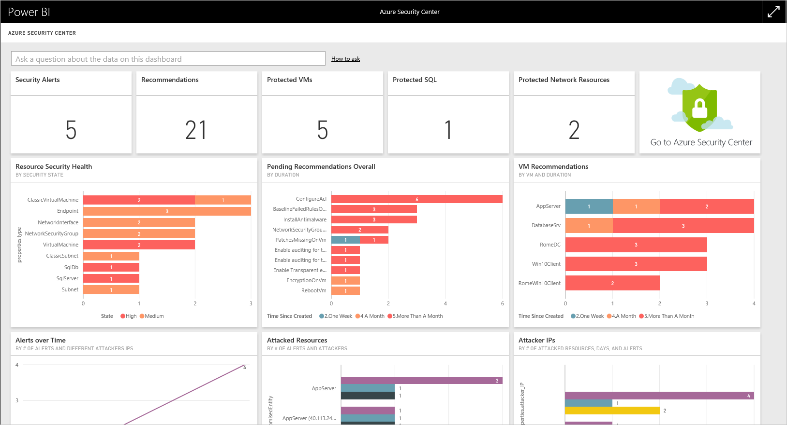
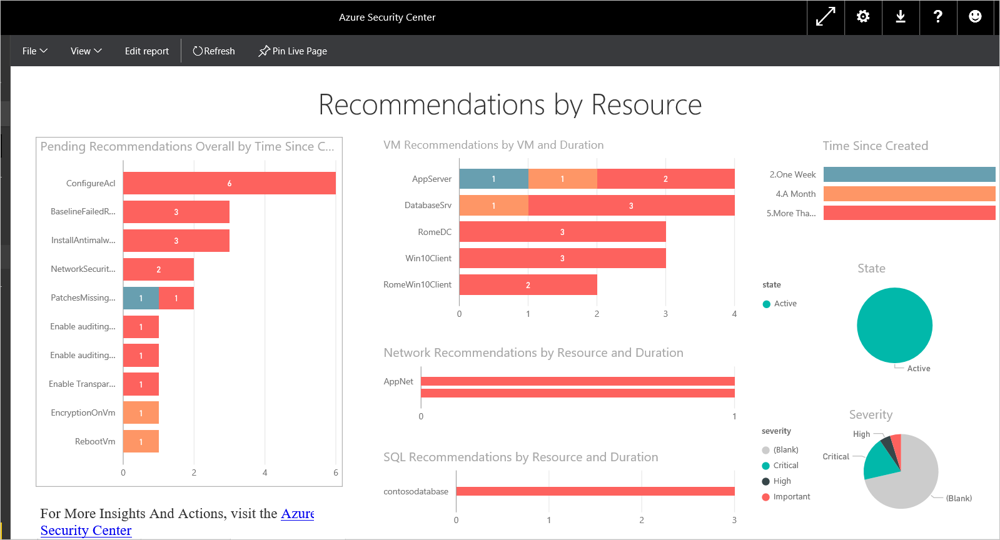
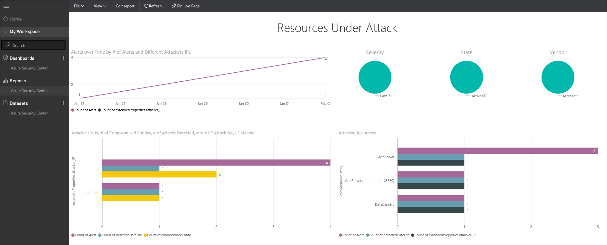
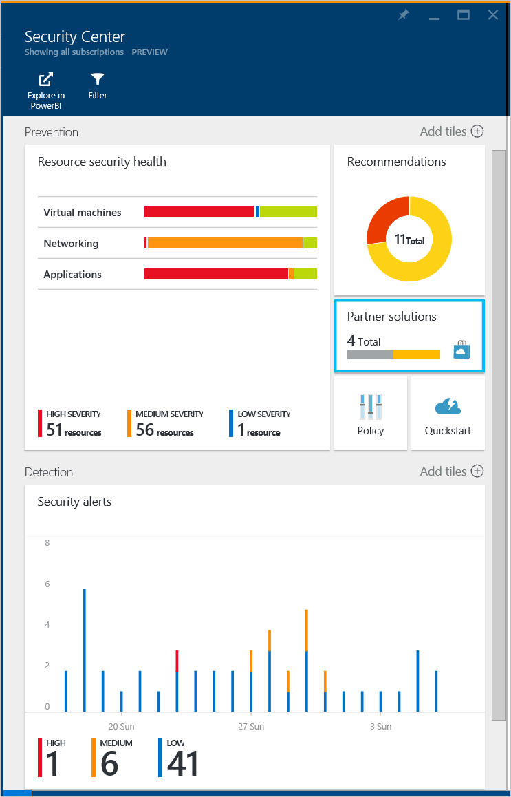
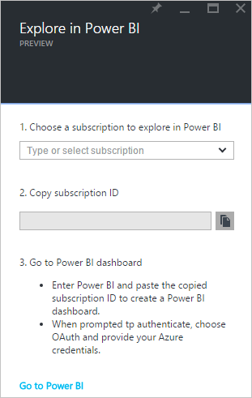

<properties
   pageTitle="Get insights from Azure Security Center data with Power BI| Microsoft Azure"
   description="The Azure Security Center Power BI content pack makes it easy to find  security alerts, recommendations, attacked resources and trends, based on a dataset that has been created for your reporting."
   services="security-center"
   documentationCenter="na"
   authors="YuriDio"
   manager="swadhwa"
   editor=""/>

<tags
   ms.service="security-center"
   ms.devlang="na"
   ms.topic="hero-article"
   ms.tgt_pltfrm="na"
   ms.workload="na"
   ms.date="04/11/2016"
   ms.author="yurid"/>

# Get insights from Azure Security Center data with Power BI
The [Power BI Dashboard](http://aka.ms/azure-security-center-power-bi) for Azure Security Center enables you to visualize, analyze, and filter recommendations and security alerts from anywhere, including your mobile device. Use the Power BI dashboard to reveal trends and attack patterns - view security alerts by resource or source IP address and unaddressed security risks by resource or age. You can also mash up Security Center recommendations and security alerts with other data in interesting ways, for example with [Azure Audit Logs](https://powerbi.microsoft.com/blog/monitor-azure-audit-logs-with-power-bi/) and [Azure SQL Database Auditing](https://powerbi.microsoft.com/blog/monitor-your-azure-sql-database-auditing-activity-with-power-bi/), which both offer Power BI Dashboards, or you can export this data to Excel for easy reporting on the security state of your cloud resources.

> [AZURE.NOTE] The information in this document applies to the preview release of Azure Security Center.

## Exploring your Azure Security Center data with Power BI services
Connect to the [Azure Security Center content pack](https://app.powerbi.com/groups/me/getdata/services/azure-security-center) in Power BI and follow the steps below:

1.Click **Connect** in the Azure Security Center tile to continue.

2.The **Connect to Azure Security Center** window opens up. In the **Azure Subscription Id** field, type your Azure subscription and click **Next**.

3.In the **Authentication method** drop down list, select **oAuth2** and click **Sign In**.

4.You will be redirected to an authentication page where you should type the credentials that you are using to connect to Azure Security Center. After the authentication process is done, Power BI will start importing data to build your reports. During this time you may see the following message on the right corner of your browser:

5.Once the process is finished, your Azure Security Center Power BI dashboard will load with the reports as shown below:

At a glance you can see the number of security alerts and recommendations as well as the number of VMs, Azure SQL databases and network resources being monitored by Azure Security Center. 

A link to Azure Security Center redirects you to the Azure portal. The charts make it easy to visualize information about security recommendations and alerts, including: 

- Resource Security Health
- Pending Recommendations Overall
- VM Recommendations
- Alerts over Time
- Attacked Resources
- Attacked IPs

Behind each chart there are additional insights. Select a tile to see more information, for example the Resource Security Health tile shows you additional details about pending recommendations by resources as shown below:

If you click on any line of this graph, the others will be gray out and you focus only on the one you selected. To return to the dashboard, click **Azure Security Center** under the **Dashboards** option on the left pane of this page. 

> [AZURE.NOTE] If you’d like to customize your reports, by adding additional fields or changing existing visuals, you can edit the report. Read [Interact with a report in Editing View in Power BI](https://powerbi.microsoft.com/documentation/powerbi-service-interact-with-a-report-in-editing-view/) for more information.

The **Alerts over Time**, **Attacked Resources** and **Attacker IPs** tiles will have the similar output when you click on each one of it. This happens because the report aggregates information regarding all those three variables and calls it **Resources under Attack** as shown below:

At this point you can also save a copy of this report, print it or publish it on the web by using the options available in the **File** menu.

##Using Azure Security Center dashboard to access Power BI
You can also use the Azure Security Center dashboard to access Power BI reports. Follow the steps below to perform this task: 

1.In the **Azure Security Center** dashboard click **Explore in Power BI** button.

 

2.The **Explore in Power BI** blade opens on the right side as shown below:

3.Under **Choose a subscription to explore in Power BI** drop down list, select the subscription that you want to use.

4.In **Copy subscription ID** field, click copy button.
5.Click **Go to Power BI** button.
6.The **Connect to Azure Security Center** window opens up. In the **Azure Subscription Id** field, type your Azure subscription and click **Next**.

7.In the **Authentication method** drop down list, select **oAuth2** and click **Sign In**.

 

8.You will be redirected to an authentication page where you should type the credentials that you are using to connect to Azure Security Center. After the authentication process is done, Power BI will start importing data to build your reports.

> [AZURE.NOTE] A refresh of the report is scheduled to take place on a daily basis, if you experience a failure on this refresh, read [Potential Refresh Issues with the Azure Security Center Power BI](https://blogs.msdn.microsoft.com/azuresecurity/2016/04/07/azure-security-center-power-bi-refresh-fails/), for more information on how to troubleshoot.

## Next steps
In this document, you learned how to use Power BI in Azure Security Center. To learn more about Azure Security Center, see the following:

- [Setting security policies in Azure Security Center](security-center-policies.md)
– Learn how to configure security settings in Azure Security Center
- [Managing and responding to security alerts in Azure Security Center](security-center-managing-and-responding-alerts.md) - Learn how to manage and respond to security alerts
- [Azure Security Center FAQ](security-center-faq.md) – Find frequently asked questions about using the service
- [Azure Security Blog](http://blogs.msdn.com/b/azuresecurity/) – Find blog posts about Azure security and compliance
