<properties
   pageTitle="Get insights from Azure Security Center data with Power BI| Microsoft Azure"
   description="The Azure Security Center Power BI content pack makes it easy to find  security alerts, recommendations, attacked resources and trends, based on a dataset that has been created for your reporting."
   services="security-center"
   documentationCenter="na"
   authors="YuriDio"
   manager="swadhwa"
   editor=""/>

<tags
   ms.service="security-center"
   ms.devlang="na"
   ms.topic="hero-article"
   ms.tgt_pltfrm="na"
   ms.workload="na"
   ms.date="08/11/2016"
   ms.author="yurid"/>

# Get insights from Azure Security Center data with Power BI
The [Power BI Dashboard](http://aka.ms/azure-security-center-power-bi) for Azure Security Center enables you to visualize, analyze, and filter recommendations and security alerts from anywhere, including your mobile device. Use the Power BI dashboard to reveal trends and attack patterns - view security alerts by resource or source IP address and unaddressed security risks by resource or age. 

You can also mash up Security Center recommendations and security alerts with other data in interesting ways, for example using data from [Azure Audit Logs](https://powerbi.microsoft.com/blog/monitor-azure-audit-logs-with-power-bi/) and [Azure SQL Database Auditing](https://powerbi.microsoft.com/blog/monitor-your-azure-sql-database-auditing-activity-with-power-bi/). Both offer Power BI Dashboards, and you can also export this data to Excel for easy reporting on the security state of your cloud resources.

##Using Azure Security Center dashboard to access Power BI
You can also use the Azure Security Center dashboard to access Power BI reports. Follow the steps to perform this task: 

1. In the **Azure Security Center** dashboard, click **Explore in Power BI** button.

	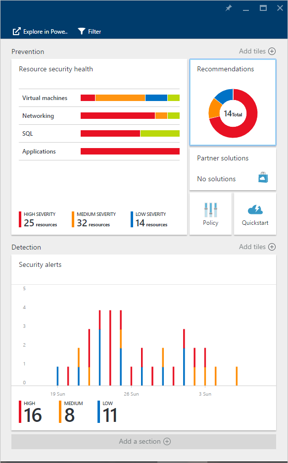 

2. The **Explore in Power BI** blade opens on the right side as shown in the following screen:

	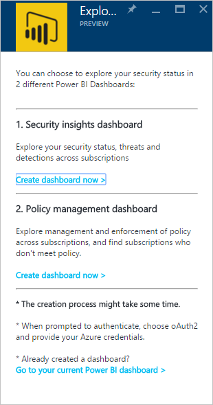

3. If you are creating the Power BI dashboard for the first time, you can choose one of the following options in the **Explore in Power BI** blade: 

	- **Security insights dashboard**: choose this option if you want to create a dashboard that includes security status, threads, and detections. This option is a more common for DevOps role that is responsible for analyzing their protection status and detected alerts across subscriptions.
	- **Policy management dashboard**: choose this option if you want to explore management and enforcement policy.  This option is a more common for Central IT who are more focused on governance. They can use this dashboard to gain visibility and insights on security policy adherence across their organization.
	- If you already have a Power BI dashboard, click **Go to your current Power BI dashboard**.

4. For this example, click **Security insights dashboard** option. If this is the first time, you are creating a Power BI dashboard for Security Center you are prompted to install the content pack. Click **Get** button in the **Content packs for Power BI** window as shown in the following screen:

	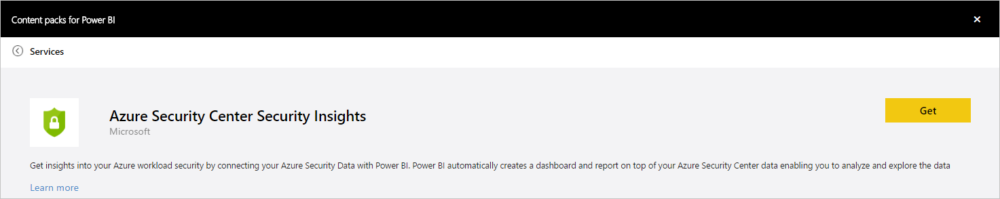

5. The **Connect to Azure Security Center Security Insights** window appear. Make sure the **Authentication** method is **oAuth2** as shown below and click **Sign in** button.
	
	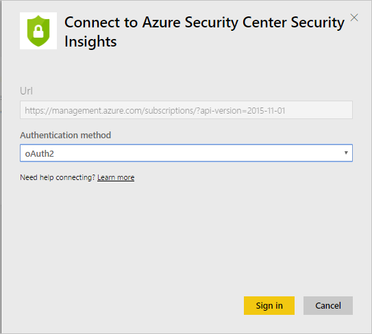

6. You may be asked to authenticate again with your Azure credentials. After authenticating your dashboard will be created. Once the dashboard is created you see a report with the similar structure as shown in the following screen:

	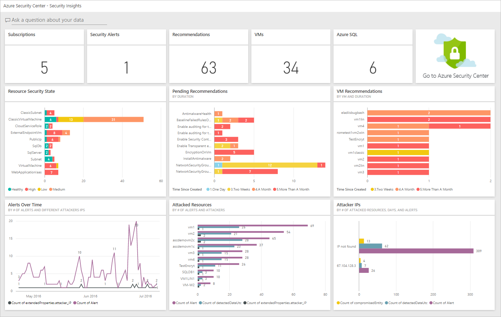

> [AZURE.NOTE] A refresh of the report is scheduled to take place on a daily basis. In case you experience a failure on this refresh, read [Potential Refresh Issues with the Azure Security Center Power BI](https://blogs.msdn.microsoft.com/azuresecurity/2016/04/07/azure-security-center-power-bi-refresh-fails/), for more information on how to troubleshoot.

Here you can see the number of security alerts and recommendations, as well as the number of VMs, Azure SQL databases, and network resources being monitored by Azure Security Center.

A link to Azure Security Center redirects you to the Azure portal. The charts make it easy to visualize information about security recommendations and alerts, including:

- Resource Security State
- Pending Recommendations
- VM Recommendations
- Alerts over Time
- Attacked Resources
- Attacked IPs

Behind each chart, there are additional insights. Select a tile to see more information. For example, the **Resource Security State** tile shows you additional details about pending recommendations by resources as shown in the following screen:

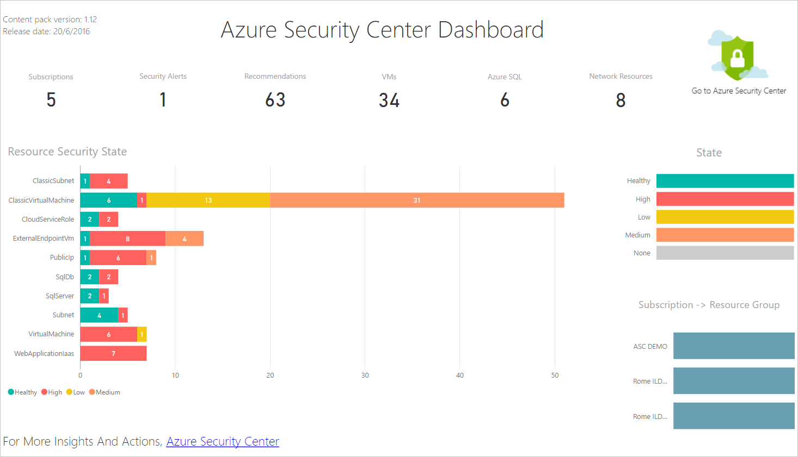

If you click on any line of this graph, the others are going to gray out and you focus only on the one you selected. To return to the dashboard, click **Azure Security Center** under the **Dashboards** option on the left pane of this page.

> [AZURE.NOTE] If you’d like to customize your reports by adding additional fields or changing existing visuals, you can edit the report. Read [Interact with a report in Editing View in Power BI](https://powerbi.microsoft.com/documentation/powerbi-service-interact-with-a-report-in-editing-view/) for more information.

The **Alerts over Time, Attacked Resources** and **Attacker IPs** tiles will have the similar output when you click on each one of it. This happens because the report aggregates information regarding all those three variables and calls it **Resources under Attack** as shown in the following screen:

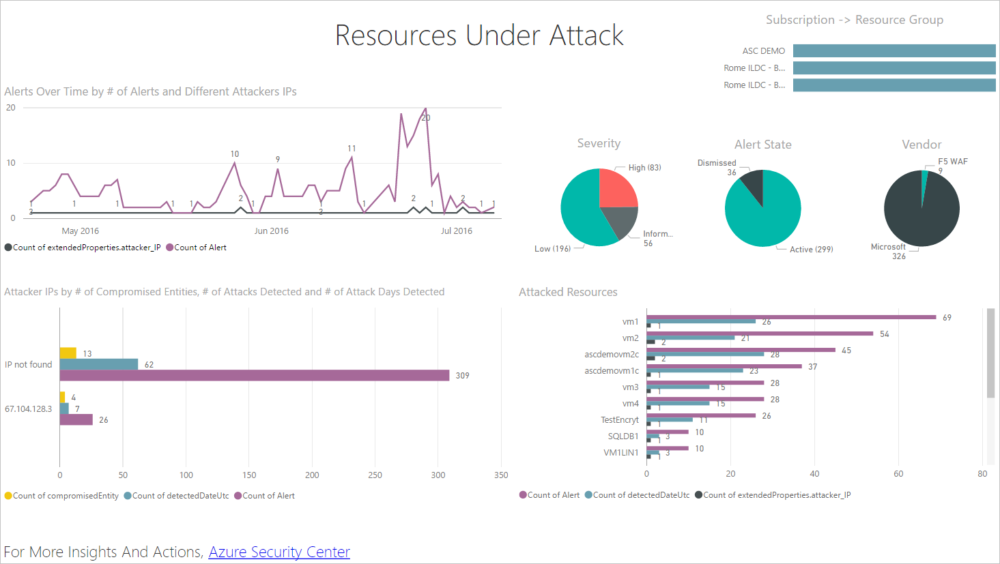

At this point you can also save a copy of this report, print it or publish it on the web by using the options available in the **File** menu.

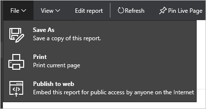

## Exploring your Azure Security Center data with Power BI services

Connect to the [Power BI Content Pack Services](https://msit.powerbi.com/groups/me/getdata/services) in Power BI and execute the following steps:

1. In the **Content Pack for Power BI** window you will see two options as shown below.

	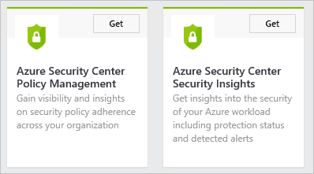

	>[AZURE.NOTE] If already executed the first part of this article you will see only one option, which is Azure Security Center Policy Management.

2. For the purpose of this example, click **Get** in the **Azure Security Center Policy Management** tile.

3. In the **Connect to Azure Security Center Policy Management** window, make sure to select **oAuth2** under **Authentication Method** drop down as shown below and click **Sign in** button.

	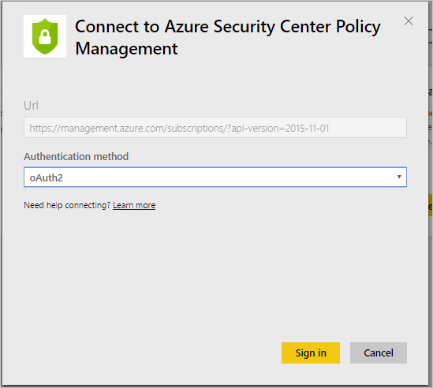

4. You will be redirected to an authentication page where you should type the credentials that you are using to connect to Azure Security Center. After the authentication process is complete, Power BI will start importing data to build your reports. During this time you may see the following message on the right corner of your browser:

	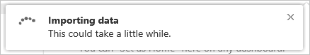

	>[AZURE.NOTE] when the dashboard is being created for the first time it can take longer than usual, mainly for scenarios where you have multiple subscriptions. 

5. Once the process is finished, your Azure Security Center Power BI dashboard will load with the **Policy Management** report similar to the one shown below:

	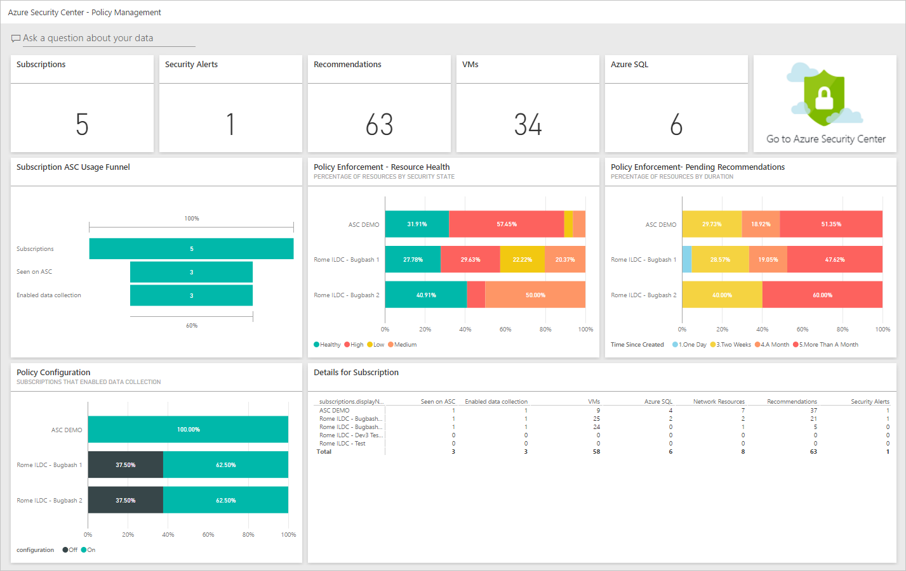

## See also
In this document, you learned how to use Power BI in Azure Security Center. To learn more about Azure Security Center, see the following:

- [Azure Security Center Planning and Operations Guide](security-center-planning-and-operations-guide.md) — Learn how to plan Azure Security Center adoption.
- [Setting security policies in Azure Security Center](security-center-policies.md) — Learn how to configure security settings in Azure Security Center
- [Managing and responding to security alerts in Azure Security Center](security-center-managing-and-responding-alerts.md) — Learn how to manage and respond to security alerts
- [Azure Security Center FAQ](security-center-faq.md) — Find frequently asked questions about using the service
- [Azure Security Blog](http://blogs.msdn.com/b/azuresecurity/) — Find blog posts about Azure security and compliance
