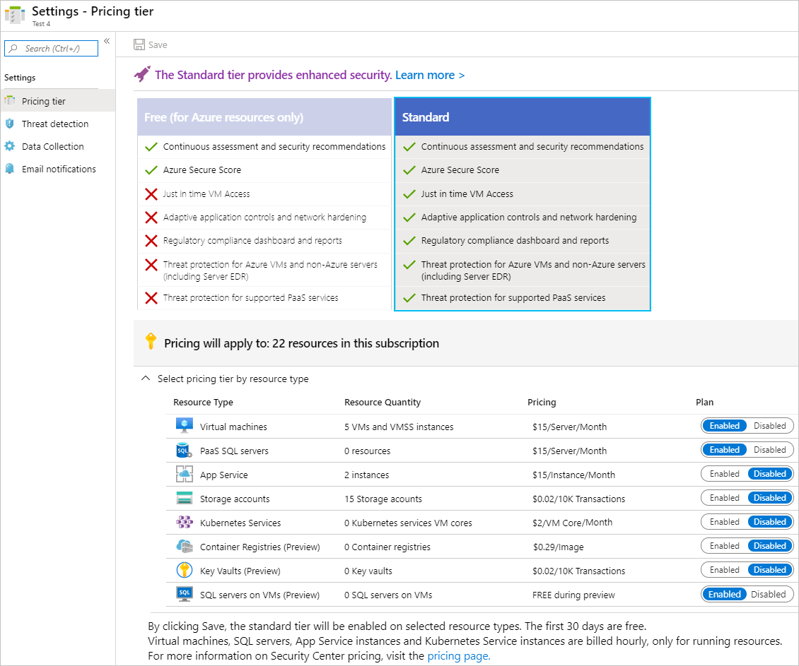

# Enable Azure Defender for enhanced security

Azure Security Center provides unified security management and advanced threat protection for workloads running in Azure, on-premises, and in other clouds. It delivers visibility and control over hybrid cloud workloads, active defenses that reduce your exposure to threats, and intelligent detection to help you keep pace with rapidly evolving cyber attacks.

## Pricing tiers
Security Center is offered in two modes:

- **Azure Defender OFF** - Security Center without Azure Defender is enabled for free on all your Azure subscriptions when you visit the Azure Security Center dashboard in the Azure portal for the first time, or if enabled programmatically via API. Using this free mode provides security policy, continuous security assessment, and actionable security recommendations to help you protect your Azure resources.

- **Azure Defender ON** - Enabling Azure Defender extends the capabilities of the free mode to workloads running in private and other public clouds, providing unified security management and threat protection across your hybrid cloud workloads. Azure Defender also adds threat protection capabilities, which use built-in behavioral analytics and machine learning to identify attacks and zero-day exploits, access and application controls to reduce exposure to network attacks and malware, and more. In addition, Azure Defender adds vulnerability scanning for your virtual machines and container registries. You can try the Azue Defender for 30-days for free.
- 
Most of the free security assessments for VMs, as well many of the Azure Defender security alerts, require the installation of the Log Analytics agent. You can enable auto provisioning to automatically deploy the agent on your Azure VMs.

## Try Azure Defender free for 30 days

Azure Defender is free for the first 30 days. At the end of 30 days, should you choose to continue using the service, we will automatically start charging for usage.

You can protect an entire Azure subscription with Azure Defender and the protections will be inherited by all resources within the subscription.

To enable Azure Defender:

1. From Security Center's main menu, select **Pricing & settings**.
 
1. Select the subscription that you want to upgrade.

1. Select **Azure Defender on** to upgrade.

1. Select **Save**.

> [!NOTE]
> To enable all Security Center features including threat protection capabilities, you must enable Azure Defender on the subscription containing the applicable workloads. Configuring pricing for a workspace does not enable just-in-time VM access, adaptive application controls, and network detections for Azure resources. 
>
> You can enable threat protection for **Azure Storage accounts** at either the subscription level or resource level.
> You can enable threat protection for **Azure SQL Database SQL servers** at either the subscription level or resource level.
> You can enable threat protection for **Azure Database for MariaDB/ MySQL/ PostgreSQL** at the resource level only.

## Why upgrade to Azure Defender?

Azure Defender brings enhanced security and threat protection for your hybrid cloud workloads, including:

- **Hybrid security** – Get a unified view of security across all of your on-premises and cloud workloads. Apply security policies and continuously assess the security of your hybrid cloud workloads to ensure compliance with security standards. Collect, search, and analyze security data from multiple sources, including firewalls and other partner solutions.
- **Security alerts** - Use advanced analytics and the Microsoft Intelligent Security Graph to get an edge over evolving cyber-attacks. Leverage built-in behavioral analytics and machine learning to identify attacks and zero-day exploits. Monitor networks, machines, and cloud services for incoming attacks and post-breach activity. Streamline investigation with interactive tools and contextual threat intelligence.
- **Vulnerability scanning for virtual machines** - Easily deploy a scanner to all of your virtual machines that provides the industry's most advanced solution for vulnerability management. View, investigate, and remediate the findings directly within Security Center. 
- **Access and application controls** - Block malware and other unwanted applications by applying machine learning powered whitelisting recommendations adapted to your specific workloads. Reduce the network attack surface with just-in-time, controlled access to management ports on Azure VMs. This drastically reduces exposure to brute force and other network attacks.
- **Container security features** - Benefit from vulnerability management and real-time threat protection on your containerized environments. When enabling the container registries resource, it may take up to 12hrs until all the features are enabled. Charges are based on the number of unique container images pushed to your connected registry. After an image has been scanned once, it will not be charged for again unless it's modified and pushed once more. 

## Next steps
In this article, you were introduced to pricing for Security Center. For related material see:

- [How to optimize your Azure workload costs](https://azure.microsoft.com/blog/how-to-optimize-your-azure-workload-costs/)
- [Pricing details in your currency of choice, and according to your region](https://azure.microsoft.com/pricing/details/security-center/)