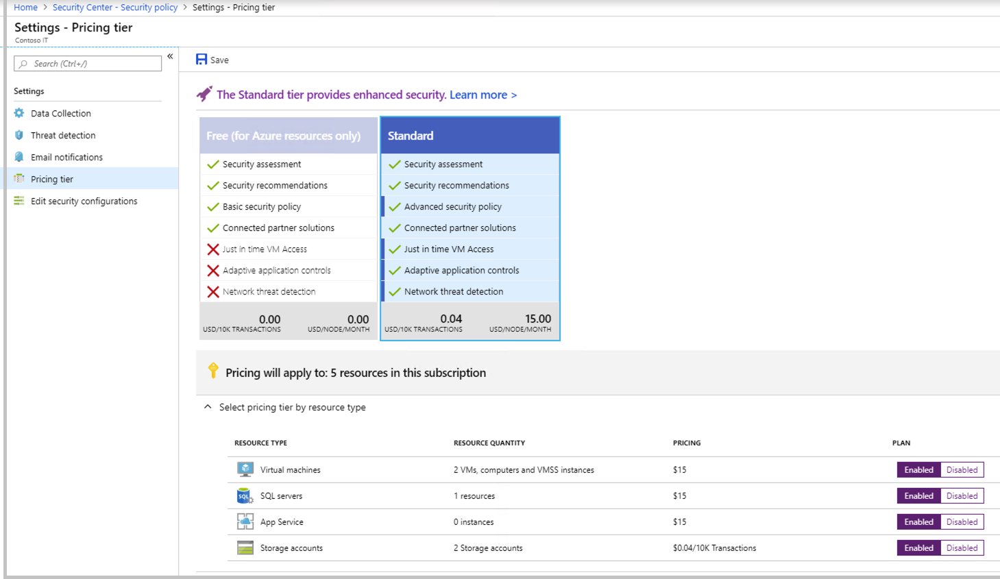

# Upgrade to Security Center's Standard tier for enhanced security
Azure Security Center provides unified security management and advanced threat protection for workloads running in Azure, on-premises, and in other clouds. It delivers visibility and control over hybrid cloud workloads, active defenses that reduce your exposure to threats, and intelligent detection to help you keep pace with rapidly evolving cyber attacks.

## Pricing tiers
Security Center is offered in two tiers:

- The **Free** tier is automatically enabled on all Azure subscriptions, and provides security policy, continuous security assessment, and actionable security recommendations to help you protect your Azure resources.
- The **Standard** tier extends the capabilities of the Free tier to workloads running in private and other public clouds, providing unified security management and threat protection across your hybrid cloud workloads. The Standard tier also adds advanced threat detection capabilities, which uses built-in behavioral analytics and machine learning to identify attacks and zero-day exploits, access and application controls to reduce exposure to network attacks and malware, and more. You can try the Standard tier for free. Security Center Standard supports Azure resources including VMs, Virtual machine scale sets, App Service, SQL servers, and Storage accounts. If you have Azure Security Center Standard you can opt out of support based on resource type. 

For more information, see the Security Center [pricing page](https://azure.microsoft.com/pricing/details/security-center/).

## Try Standard free for 30 days
The Standard tier is offered free for the first 30 days. At the end of 30 days, should you choose to continue using the service, we will automatically start charging for usage.

You can upgrade an entire Azure subscription to the Standard tier, which is inherited by all resources within the subscription.

To get the Standard tier:

1. Select **Pricing & settings** on the **Security Center** main menu.
2. Select the subscription that you want to upgrade to Standard.
3. select **Pricing tier**.
4. Select **Standard** to upgrade.
5. Click **Save**.

(Prices in the image are for example purposes only.)

> [!NOTE]
> To enable all Security Center features, you must apply the Standard pricing tier to the subscription containing the applicable virtual machines. Configuring pricing for a workspace does not enable just in time VM access, adaptive application controls, and network detections for Azure resources.
>
>

## Why upgrade to Standard?
Security Center offers enhanced security and threat protection for your hybrid cloud workloads, including:

- **Hybrid security** – Get a unified view of security across all of your on-premises and cloud workloads. Apply security policies and continuously assess the security of your hybrid cloud workloads to ensure compliance with security standards. Collect, search, and analyze security data from a variety of sources, including firewalls and other partner solutions.
- **Advanced threat detection** - Use advanced analytics and the Microsoft Intelligent Security Graph to get an edge over evolving cyber-attacks.  Leverage built-in behavioral analytics and machine learning to identify attacks and zero-day exploits. Monitor networks, machines, and cloud services for incoming attacks and post-breach activity. Streamline investigation with interactive tools and contextual threat intelligence.
- **Access and application controls** - Block malware and other unwanted applications by applying whitelisting recommendations adapted to your specific workloads and powered by machine learning. Reduce the network attack surface with just-in-time, controlled access to management ports on Azure VMs, drastically reducing exposure to brute force and other network attacks.

## Next steps
In this article, you were introduced to pricing for Security Center. To learn more about the Standard tier’s enhanced security and advanced threat protection, see:

- [Advanced threat detection](security-center-threat-report.md)
- [Just in time VM access control](security-center-just-in-time.md)

<!--Image references-->
[1]: ./media/security-center-pricing/get-standard.png
