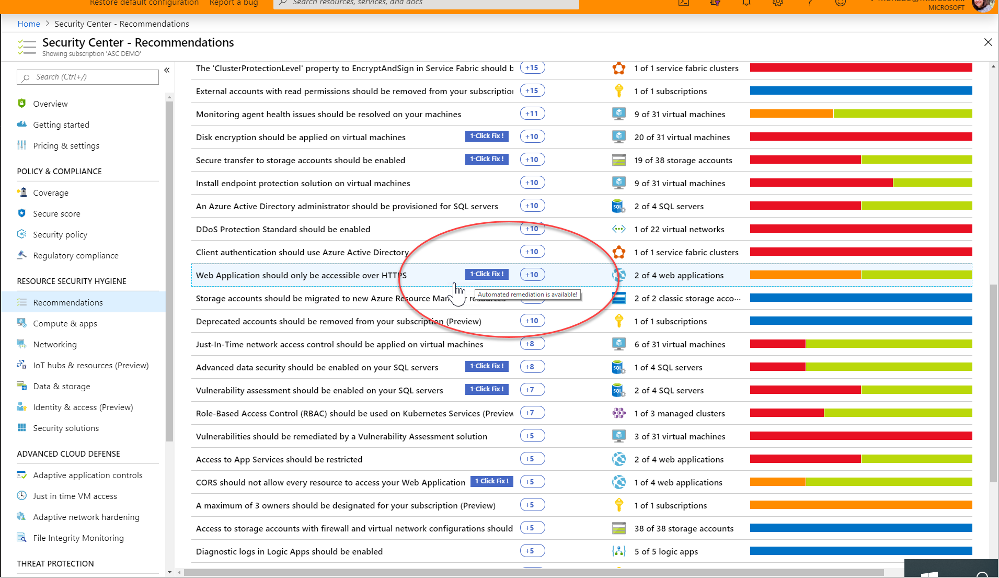
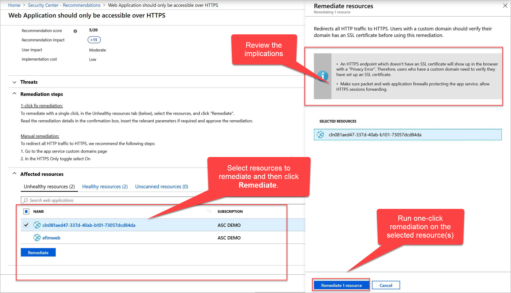

# Remediate recommendations in Azure Security Center

Recommendations give you suggestions on how to better secure your resources.  You implement a recommendation by following the [remediation steps](#remediation-steps) provided in the recommendation. For several recommendations, Security Center provides a ["One-click fix" option](#one-click) that automatically runs some of the steps for you.

## Remediation steps 

After reviewing all the recommendations, decide which one to remediate first. We recommend that you use the [secure score impact](security-center-recommendations.md#monitor-recommendations) to help prioritize the recommendations.

1. From the list, click on the recommendation.
1. Follow the instructions in the **Remediation steps** section. Each recommendation has its own set of instructions. The following shows remediation steps for configuring applications to only allow traffic over HTTPS.

    

5. Once completed, a notification appears informing you if the remediation succeeded.

## One-click fix remediation 

One-click fix enables you to remediate a recommendation on a bulk of resources, with a single click. It is an option only available for specific recommendations. One-click fix simplifies remediation and enables you to quickly improve your secure score and increase the security in your environment.

To implement one-click remediation:

1. From the list of recommendations that have the **1-Click-fix** label, click on the recommendation.  

   

2. From the **Unhealthy resources** tab, select the resources that you want to implement the recommendation on, and click **Remediate**. 

    > [!NOTE]
    > Some of the listed resources might be disabled, because you do not have the appropriate permissions to modify them.

3. In the confirmation box, read the remediation details and implications. 

   

    > [!NOTE]
    > The implications are listed in the grey box in the **Remediate resources** window that opens after clicking **Remediate**. They list what changes happen when proceeding with the 1-click remediation.

4. Insert the relevant parameters if necessary, and approve the remediation.

    > [!NOTE]
    > -It can take several minutes after remediation completes to see the resources in the **Healthy resources** tab. To view the the remediation actions, check the activity log where they are logged.

5. Once completed, a notification appears informing you if the remediation succeeded.

## Next steps

In this document, you were shown how to remediate recommendations in Security Center. To learn more about Security Center, see the following topics:

* [Setting security policies in Azure Security Center](tutorial-security-policy.md) — Learn how to configure security policies for your Azure subscriptions and resource groups.
* [Security health monitoring in Azure Security Center](security-center-monitoring.md) — Learn how to monitor the health of your Azure resources.
