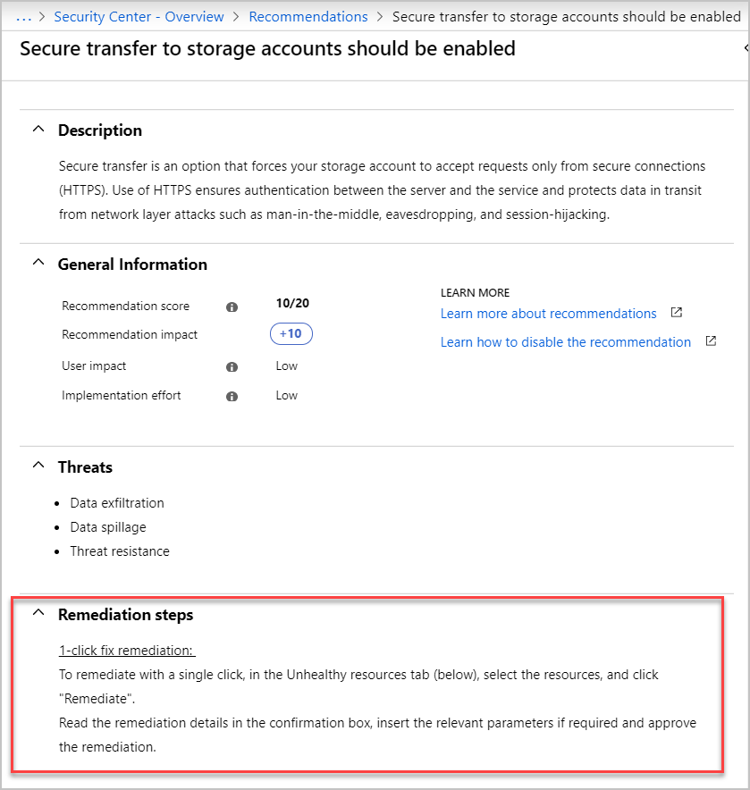
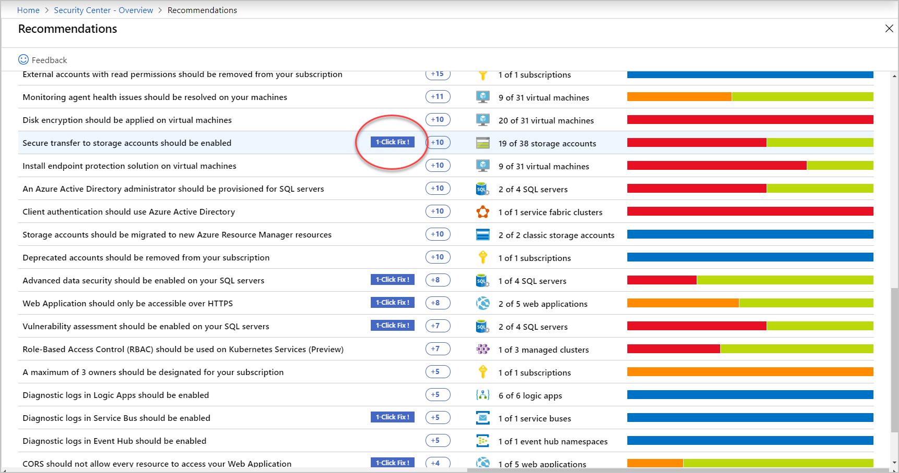

# Remediate recommendations in Azure Security Center

Recommendations give you suggestions on how to better secure your resources. You implement a recommendation by following the remediation steps provided in the recommendation.

## Remediation steps 

After reviewing all the recommendations, decide which one to remediate first. We recommend that you use the [secure score impact](security-center-recommendations.md#monitor-recommendations) to help prioritize what to do first.

1. From the list, click the recommendation.

1. Follow the instructions in the **Remediation steps** section. Each recommendation has its own set of instructions. The following screenshot shows remediation steps for configuring applications to only allow traffic over HTTPS.

    

1. Once completed, a notification appears informing you if the remediation succeeded.

## Quick Fix remediation

Quick Fix enables you to quickly remediate a recommendation on multiple resources. It's only available for specific recommendations. Quick Fix simplifies remediation and enables you to quickly increase your secure score, improving your environment's security.

To implement Quick Fix remediation:

1. From the list of recommendations that have the **Quick Fix!** label, click on the recommendation.

    

1. From the **Unhealthy resources** tab, select the resources that you want to implement the recommendation on, and click **Remediate**.

    > [!NOTE]
    > Some of the listed resources might be disabled, because you don't have the appropriate permissions to modify them.

1. In the confirmation box, read the remediation details and implications.

    

    > [!NOTE]
    > The implications are listed in the grey box in the **Remediate resources** window that opens after clicking **Remediate**. They list what changes happen when proceeding with the Quick Fix remediation.

1. Insert the relevant parameters if necessary, and approve the remediation.

    > [!NOTE]
    > It can take several minutes after remediation completes to see the resources in the **Healthy resources** tab. To view the remediation actions, check the [activity log](#activity-log).

1. Once completed, a notification appears informing you if the remediation succeeded.

## Quick Fix remediation logging in the activity log 

The remediation operation uses a template deployment or REST PATCH API call to apply the configuration on the resource. These operations are logged in [Azure activity log](../azure-resource-manager/management/view-activity-logs.md).

## Recommendations with Quick Fix remediation

|Recommendation|Implication|
|---|---|
|Auditing on SQL servers should be enabled|This action will enable SQL auditing on these servers and their databases.  **Note**: <ul><li>For each region of the selected SQL servers, a storage account for saving audit logs will be created and shared by all the servers in that region.</li><li>To ensure proper auditing, do not delete or rename the resource group or the storage accounts.</li></ul>|
|Advanced data security should be enabled on your SQL managed instances|This action will enable SQL Advanced Data Security (ADS) on the selected SQL managed instances.  **Note**: <ul><li>For each region and resource group of the selected SQL managed instances, a storage account for saving scan results will be created and shared by all the instances in that region.</li><li> ADS is charged at $15 per SQL managed instance.</li></ul>|
|Vulnerability assessment should be enabled on your SQL managed instances|This action will enable SQL Vulnerability Assessment on the selected SQL managed instances.  **Note**:<ul><li>SQL Vulnerability Assessment is part of the SQL Advanced Data Security (ADS) package. If ADS is not enabled already, it will automatically be enabled on the managed instance.</li><li>For each region and resource group of the selected SQL managed instances, a storage account for storing scan results will be created and shared by all the instances in that region.</li><li>ADS is charged at $15 per SQL server.</li></ul>||
|Advanced Data Security should be enabled on your SQL servers|This action will enable Advanced Data Security (ADS) on these selected servers and their databases.  **Note**:<ul><li>For each region and resource group of the selected SQL servers, a storage account for storing scan results will be created and shared by all the servers in that region.<</li><li>ADS is charged at $15 per SQL server.</li></ul>||
|Vulnerability Assessment should be enabled on your SQL servers|This action will enable SQL Vulnerability Assessment on these selected servers and their databases.  **Note**:<ul><li>SQL Vulnerability Assessment is part of the SQL Advanced Data Security (ADS) package. If ADS isn't enabled already, it will automatically be enabled on the SQL server.</li><li>For each region and resource group of the selected SQL servers, a storage account for storing scan results will be created and shared by all the instances in that region.</li><li>ADS is charged at $15 per SQL server.</li></ul>||
|Transparent data encryption on SQL databases should be enabled|This action enables SQL Database Transparent Data Encryption (TDE) on the selected databases.  **Note**: By default, service-managed TDE keys will be used.
|Secure transfer to storage accounts should be enabled|This action updates your storage account security to only allow requests by secure connections. (HTTPS).  **Note**:<ul><li>Any requests using HTTP will be rejected.</li><li>When you're using the Azure files service, connection without encryption will fail, including scenarios using SMB 2.1, SMB 3.0 without encryption, and some flavors of the Linux SMB client. Learn more.</li></ul>|
|Web Application should only be accessible over HTTPS|This action will redirect all traffic from HTTP to HTTPS, on the selected resources.  **Note**:<ul><li>An HTTPS endpoint that doesn’t have an SSL certificate will show up in the browser with a ‘Privacy Error’. So users who have a custom domain need to verify they have set up an SSL certificate.</li><li>Make sure packet and web application firewalls protecting the app service, allow HTTPS sessions forwarding.</li></ul>|
|Function App should only be accessible over HTTPS|This action will redirect all traffic from HTTP to HTTPS, on the selected resources.  **Note**:<ul><li>An HTTPS endpoint that doesn’t have an SSL certificate will show up in the browser with a ‘Privacy Error’. So users who have a custom domain need to verify they have set up an SSL certificate.</li><li>Make sure packet and web application firewalls protecting the app service, allow HTTPS sessions forwarding.</li></ul>|
|API App should only be accessible over HTTPS|This action will redirect all traffic from HTTP to HTTPS, on the selected resources.  **Note**:<ul><li>An HTTPS endpoint that doesn’t have an SSL certificate will show up in the browser with a ‘Privacy Error’. So users who have a custom domain need to verify they have set up an SSL certificate.</li><li>Make sure packet and web application firewalls protecting the app service, allow HTTPS sessions forwarding.</li></ul>|
|Remote debugging should be turned off for Web Application|This action disables remote debugging.|
|Remote debugging should be turned off for Function App|This action disables remote debugging.|
|Remote debugging should be turned off for API App|This action disables remote debugging.|
|CORS should not allow every resource to access your Web Application|This action blocks other domains from accessing your Web Application. To allow specific domains, enter them in the Allowed origins field (separated by commas).  **Note**: Leaving the field empty will block all cross-origin calls.’Param field title: ‘Allowed origins’|
|CORS should not allow every resource to access your Function App|This action blocks other domains from accessing your Function Application. To allow specific domains, enter them in the Allowed origins field (separated by commas).  **Note**: Leaving the field empty will block all cross-origin calls.’Param field title: ‘Allowed origins’|
|CORS should not allow every resource to access your API App|This action blocks other domains from accessing your API Application. To allow specific domains, enter them in the Allowed origins field (separated by commas).  **Note**: Leaving the field empty will block all cross-origin calls.’Param field title: ‘Allowed origins’|
|Monitoring agent should be enabled on your virtual machines|This action installs a monitoring agent on the selected virtual machines. Select a workspace for the agent to report to.<ul><li>If your update policy is set to automatic, it will deploy on new existing instances.</li><li>If your update policy is set to manual and you would like to install the agent on existing instances, select the check box option. [Learn more](../virtual-machine-scale-sets/virtual-machine-scale-sets-faq.md#how-do-i-add-an-extension-to-all-vms-in-my-virtual-machine-scale-set)</li></ul>|
|Diagnostic logs in Key Vault should be enabled|This action enables diagnostic logs on key vaults. Diagnostic logs and metrics are saved in the selected workspace.|
|Diagnostic logs in Service bus should be enabled|This action enables diagnostic logs on the service bus. Diagnostic logs and metrics are saved in the selected workspace.|

## Next steps

In this document, you were shown how to remediate recommendations in Security Center. To learn more about Security Center, see the following topics:

* [Setting security policies in Azure Security Center](tutorial-security-policy.md) - Learn how to configure security policies for your Azure subscriptions and resource groups.
* [Security health monitoring in Azure Security Center](security-center-monitoring.md) - Learn how to monitor the health of your Azure resources.
