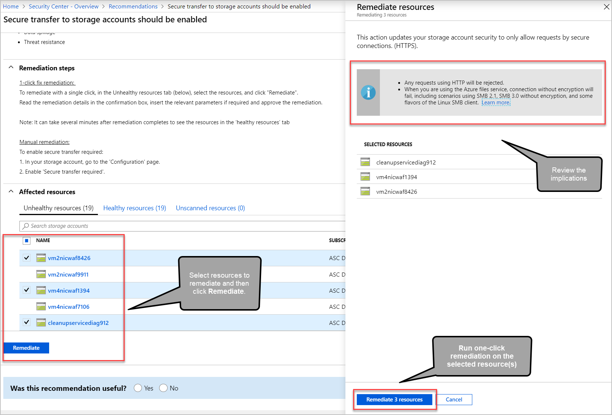

# Remediate recommendations in Azure Security Center

Recommendations give you suggestions on how to better secure your resources. You implement a recommendation by following the remediation steps provided in the recommendation.

## Remediation steps 

After reviewing all the recommendations, decide which one to remediate first. We recommend that you prioritize the security controls with the highest potential to increase your secure score.

1. From the list, select a recommendation.

1. Follow the instructions in the **Remediation steps** section. Each recommendation has its own set of instructions. The following screenshot shows remediation steps for configuring applications to only allow traffic over HTTPS.

    :::image type="content" source="./media/security-center-remediate-recommendations/security-center-remediate-recommendation.png" alt-text="Manual remediation steps for a recommendation" lightbox="./media/security-center-remediate-recommendations/security-center-remediate-recommendation.png":::

1. Once completed, a notification appears informing you whether the issue is resolved.

## Fix button

To simplify remediation and improve your environment's security (and increase your secure score), many recommendations include a **Fix** option.

**Fix** helps you quickly remediate a recommendation on multiple resources.

> [!TIP]
> The **Fix** feature is only available for specific recommendations. To find recommendations that have an available fix, use the **Response actions** filter for the list of recommendations:
> 
> :::image type="content" source="media/security-center-remediate-recommendations/quick-fix-filter.png" alt-text="Use the filters above the recommendations list to find recommendations that have the Fix option":::

To implement a **Fix**:

1. From the list of recommendations that have the **Fix** action icon, :::image type="icon" source="media/security-center-remediate-recommendations/fix-icon.png" border="false":::, select a recommendation.

    :::image type="content" source="./media/security-center-remediate-recommendations/security-center-recommendations-fix-action.png" alt-text="Recommendations list highlighting recommendations with Fix action" lightbox="./media/security-center-remediate-recommendations/security-center-recommendations-fix-action.png#lightbox":::

1. From the **Unhealthy resources** tab, select the resources that you want to implement the recommendation on, and select **Remediate**.

    > [!NOTE]
    > Some of the listed resources might be disabled, because you don't have the appropriate permissions to modify them.

1. In the confirmation box, read the remediation details and implications.

    

    > [!NOTE]
    > The implications are listed in the grey box in the **Remediate resources** window that opens after clicking **Remediate**. They list what changes happen when proceeding with the **Fix**.

1. Insert the relevant parameters if necessary, and approve the remediation.

    > [!NOTE]
    > It can take several minutes after remediation completes to see the resources in the **Healthy resources** tab. To view the remediation actions, check the [activity log](#activity-log).

1. Once completed, a notification appears informing you if the remediation succeeded.

## Fix actions logged to the activity log 

The remediation operation uses a template deployment or REST PATCH API call to apply the configuration on the resource. These operations are logged in [Azure activity log](../azure-resource-manager/management/view-activity-logs.md).

## Next steps

In this document, you were shown how to remediate recommendations in Security Center. To learn more about Security Center, see the following pages:

* [Setting security policies in Azure Security Center](tutorial-security-policy.md) - Learn how to configure security policies for your Azure subscriptions and resource groups
* [What are security policies, initiatives, and recommendations?](security-policy-concept.md)