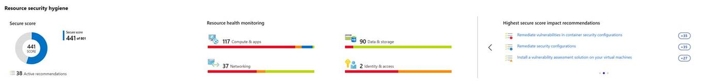
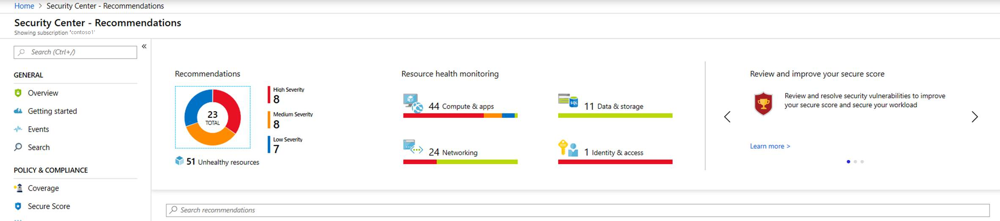
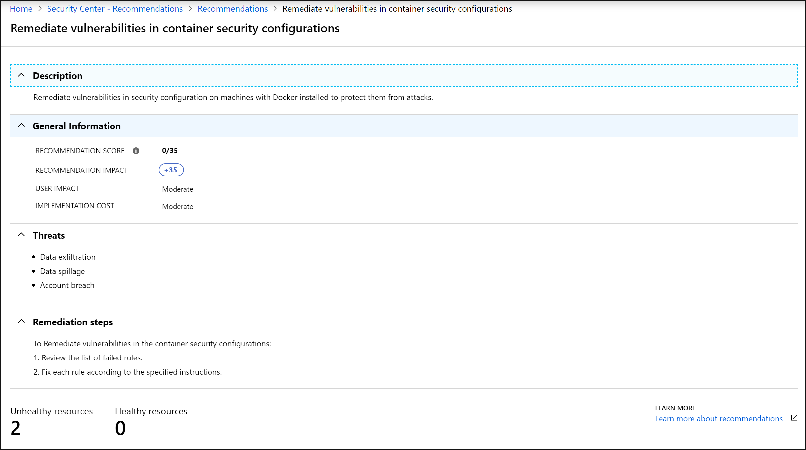

# Improve your secure score in Azure Security Center

With so many services offering security benefits, it's often hard to know what steps to take first to secure and harden your workload. The Azure secure score reviews your security recommendations and prioritizes them for you, so you know which recommendations to perform first. This helps you find the most serious security vulnerabilities so you can prioritize investigation. Secure score is a tool that helps you assess your workload security posture.

## Secure score calculation

Security Center mimics the work of a security analyst, reviewing your security recommendations, and applying advanced algorithms to determine how crucial each recommendation is.
Azure Security center constantly reviews you active recommendations and calculates your secure score based on them, the score of a recommendation is derived from its severity and security best practices that will affect your workload security the most.

Security Center also provides you with an **Overall secure score**. 

**Overall secure score** is an accumulation of all your recommendation scores. You can view your overall secure score across your subscriptions or management groups, depending on what you select. The score will vary based on subscription selected and the active recommendations on these subscriptions.

 
To check which recommendations impact your secure score most, you can view the top three most impactful recommendations in the Security Center dashboard or you can sort the recommendations in the recommendations list blade using the **Secure score impact** column.

To view your overall secure score:

1. In the Azure dashboard, click **Security Center** and then click **Secure score**.
2. At the top you can see Secure score highlights:
   - The **Overall secure score** represents the score per policies, per selected subscription
   - **Secure score by category** shows you which resources need the most attention
   - **Top recommendations by secure score impact** provides you with a list of the recommendations that will improve your secure score the most if you implement them.
 
   

3. In the table below you can see each of your subscriptions and the overall secure score for each.

   > [!NOTE]
   > The sum of the secure score of each subscription does not equal the overall secure score. The secure score is a calculation based on the ratio between your healthy resources and your total resources per recommendation, not a sum of secure scores across your subscriptions. 
   >
4. Click **View recommendations** to see the recommendations for that subscription that you can remediate to improve your secure score.
4. In the list of recommendations, you can see that for each recommendation there is a column that represents the **Secure score impact**. This number represents how much your overall secure score will improve if you follow the recommendations. For example, in the screen below, if you **Remediate vulnerabilities in container security configurations**, your secure score will increase by 35 points.

   

## Individual secure score

In addition, to view individual secure scores, you can find these within the individual recommendation blade.  

The **Recommendation secure score** is a calculation based on the ratio between your healthy resources and your total resources. If the number of healthy resources is equal to the total number of resources, you get the maximum secure score of the recommendation of 50. To try to get your secure score closer to the max score, fix the unhealthy resources by following the recommendations.

The **Recommendation impact** lets you know how much your secure score improves if you apply the recommendation steps. For example, if your secure score is 42 and the **Recommendation impact** is +3, performing the steps outlined in the recommendation improve your score to become 45.

The recommendation shows which threats your workload is exposed to if the remediation steps are not taken.

## Next steps
This article showed you how to improve your security posture using **Secure score** in Azure Security Center. To learn more about Security Center, see:

* [Azure Security Center FAQ](security-center-faq.md)--Find frequently asked questions about using the service.
* [Security health monitoring in Azure Security Center](security-center-monitoring.md)--Learn how to monitor the health of your Azure resources.

