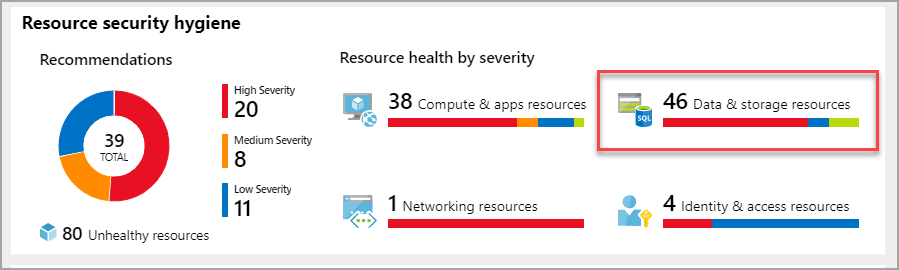
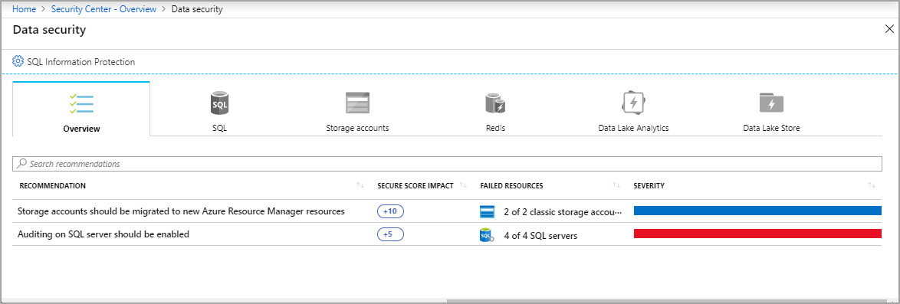
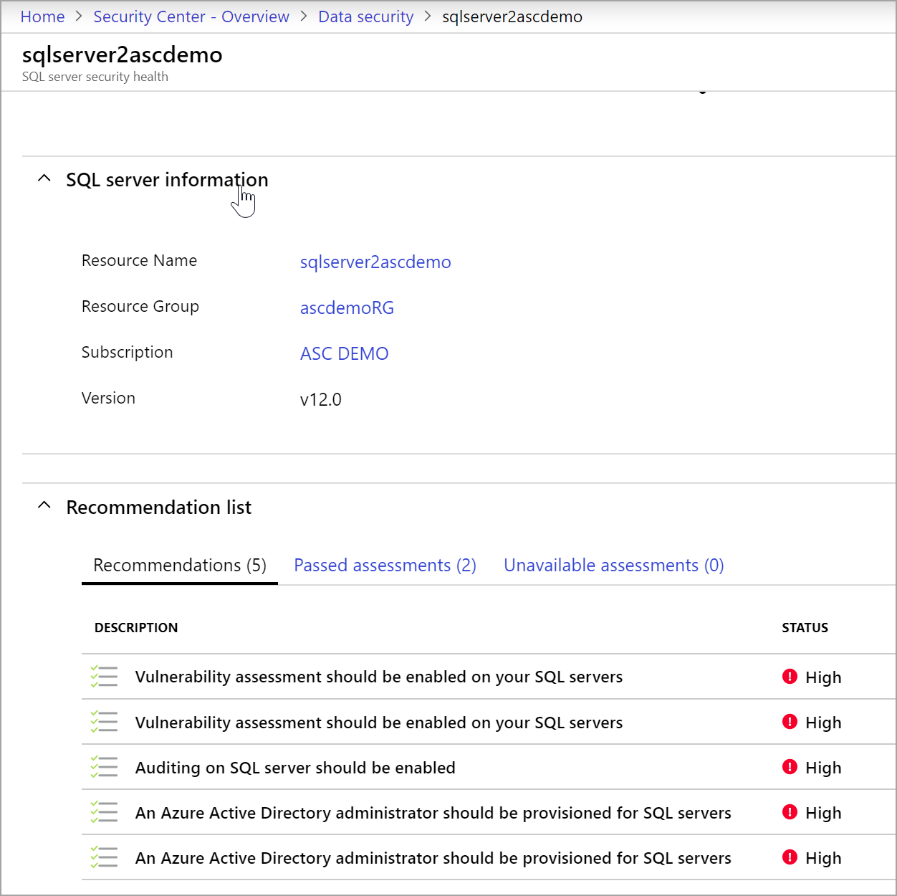
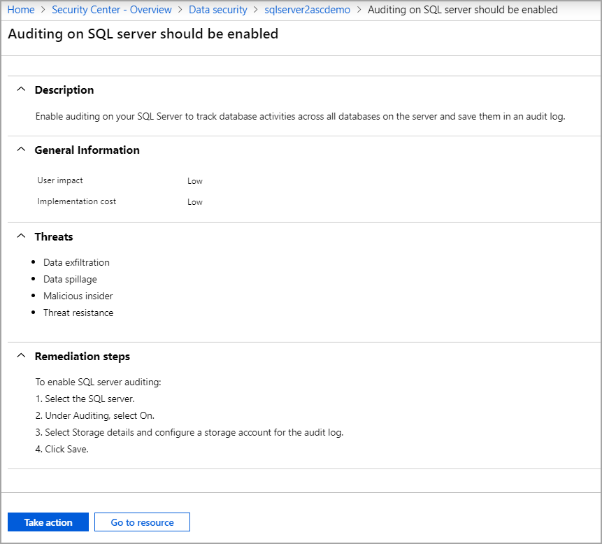
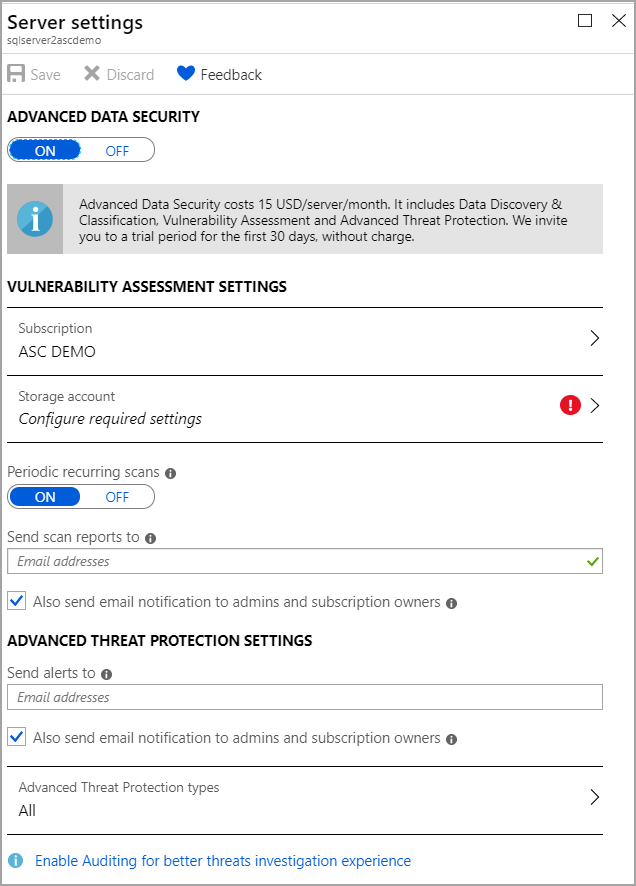

# Protect Azure data and storage services in Azure Security Center
This topic shows you how to view and implement security recommendations for data and storage resources. Azure Security Center found these recommendations when analyzing the security state of your Azure resources.

## View your data security information

1. In the **Resource security hygiene** section, click **Data and storage resources**.

   

    The **Data security** page opens with recommendations for data resources.

     

From this page, you can:

* Click the **Overview** tab lists all the data resources recommendations to be remediated. 
* Click each tab, and view the recommendations by resource type.

    > [!NOTE]
    > For more information about storage encryption, read [Enable encryption for Azure storage account in Azure Security Center](security-center-enable-encryption-for-storage-account.md).

## Remediate a recommendation on a data resource

1. From any of the resource tabs, click a resource. The information page opens listing the recommendations to be remediated.

    

2. Click a recommendation. The Recommendation page opens and displays the **Remediation steps** to implement the recommendation.

   

3. Click **Take action**. The resource settings page appears.

    

4. Follow the **Remediation steps** and click **Save**.

## Data and storage recommendations

|Resource type|Secure score|Recommendation|Description|
|----|----|----|----|
|Storage account|20|Secure transfer to storage accounts should be enabled|Secure transfer is an option that forces your storage account to accept requests only from secure connections (HTTPS). HTTPS ensures authentication between the server and the service and protects data in transit from network layer attacks such as man-in-the-middle, eavesdropping, and session-hijacking.|
|Redis|20|Only secure connections to your Redis Cache should be enabled|Enable only connections via SSL to Azure Cache for Redis. Use of secure connections ensures authentication between the server and the service and protects data in transit from network layer attacks such as man-in-the-middle, eavesdropping, and session-hijacking.|
|SQL|15|Transparent Data Encryption on SQL databases should be enabled|Enable transparent data encryption to protect data-at-rest and meet compliance requirements.|
|SQL|15|SQL server auditing should be enabled|Enable auditing  for Azure SQL servers. (Azure SQL service only. Doesn't include SQL running on your virtual machines.)|
|Data lake analytics|5|Diagnostics logs in Data Lake Analytics should be enabled|Enable logs and retain them up to a year. This enables you to recreate activity trails for investigation purposes when a security incident occurs or your network is compromised. |
|Data lake store|5|Diagnostics logs in Azure Data Lake Store should be enabled|Enable logs and retain them up to a year. This enables you to recreate activity trails for investigation purposes when a security incident occurs or your network is compromised. |
|SQL|30|Vulnerabilities on your SQL databases should be remediated|SQL Vulnerability Assessment scans your database for security vulnerabilities and exposes any deviations from best practices such as misconfigurations, excessive permissions, and unprotected sensitive data. Resolving the vulnerabilities found can greatly improve your database security stature.|
|SQL|20|Provision an Azure AD administrator for SQL server|Provision an Azure AD administrator for your SQL server to enable Azure AD authentication. Azure AD authentication enables simplified permission management and centralized identity management of database users and other Microsoft services.|
|Storage account|15|Access to storage accounts with firewall and virtual network configurations should be restricted|Audit unrestricted network access in your storage account firewall settings. Instead, configure network rules so only applications from allowed networks can access the storage account. To allow connections from specific Internet or on-premises clients, you can grant access to traffic from specific Azure virtual networks or to public Internet IP address ranges.|
|Storage account|1|Storage accounts should be migrated to new Azure Resource Manager resources|Use new Azure Resource Manager v2 for your storage accounts to provide security enhancements such as: stronger access control (RBAC), better auditing, Resource Manager-based deployment and governance, access to managed identities, access to key vault for secrets, and Azure AD-based authentication and support for tags and resource groups for easier security management.|

## See also
To learn more about recommendations that apply to other Azure resource types, see the following topics:

* [Protecting your virtual machines in Azure Security Center](security-center-virtual-machine-recommendations.md)
* [Protecting your applications in Azure Security Center](security-center-application-recommendations.md)
* [Protecting your network in Azure Security Center](security-center-network-recommendations.md)

To learn more about Security Center, see the following topics:

* [Setting security policies in Azure Security Center](tutorial-security-policy.md) -- Learn how to configure security policies for your Azure subscriptions and resource groups.
* [Managing and responding to security alerts in Azure Security Center](security-center-managing-and-responding-alerts.md) -- Learn how to manage and respond to security alerts.
* [Azure Security Center FAQ](security-center-faq.md) -- Find frequently asked questions about using the service.
