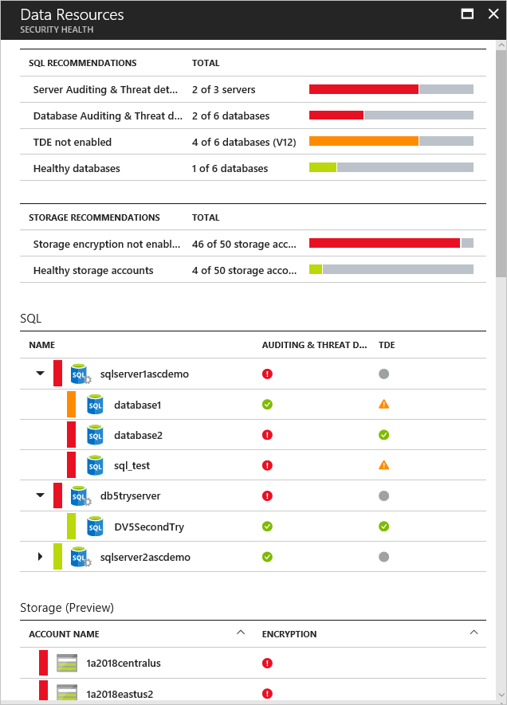
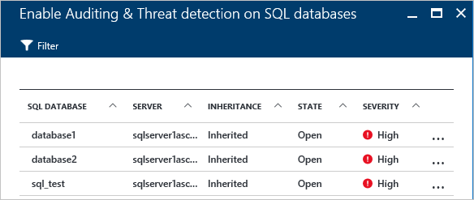
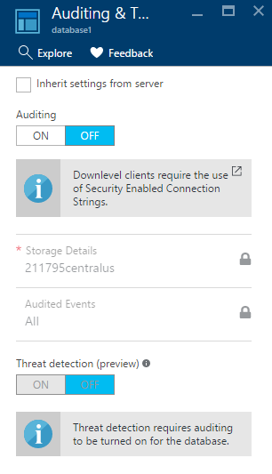

# Protecting Azure SQL service and data in Azure Security Center
Azure Security Center analyzes the security state of your Azure resources. When Security Center identifies potential security vulnerabilities, it creates recommendations that guide you through the process of configuring the needed controls.  Recommendations apply to Azure resource types: virtual machines (VMs), networking, SQL and data, and applications.

This article addresses recommendations that apply to Azure SQL service and data. Recommendations center around enabling auditing for Azure SQL servers and databases, enabling encryption for SQL databases, and enabling encryption of your Azure storage account.  Use the table below as a reference to help you understand the available SQL service and data recommendations and what each one does if you apply it.
### Monitor data security

When you click **Data security** in the **Prevention** section, the **Data Resources** opens with recommendations for SQL and Storage. It also has [recommendations](security-center-sql-service-recommendations.md) for the general health state of the database. For more information about storage encryption, read [Enable encryption for Azure storage account in Azure Security Center](security-center-enable-encryption-for-storage-account.md).

Under **SQL Recommendations**, You can click any recommendation and get more details about further action to resolve an issue. The following example shows the expansion of the **Database Auditing & Threat detection on SQL databases** recommendation.

The **Enable Auditing & Threat detection on SQL databases** has the following information:

* A list of SQL databases
* The server on which they are located
* Information about whether this setting was inherited from the server or if it is unique in this database
* The current state
* The severity of the issue

When you click the database to address this recommendation, the **Auditing & Threat detection** opens as shown in the following screen.

To enable auditing, select **ON** under the **Auditing** option.

## Available SQL service and data recommendations
| Recommendation | Description |
| --- | --- |
| [Enable auditing and threat detection on SQL servers](security-center-enable-auditing-on-sql-servers.md) |Recommends that you turn on auditing and threat detection for Azure SQL servers (Azure SQL service only; doesn't include SQL running on your virtual machines). |
| [Enable auditing and threat detection on SQL databases](security-center-enable-auditing-on-sql-databases.md) |Recommends that you turn on auditing and threat detection for Azure SQL databases (Azure SQL service only; doesn't include SQL running on your virtual machines). |
| [Enable Transparent Data Encryption on SQL databases](security-center-enable-transparent-data-encryption.md) |Recommends that you enable encryption for SQL databases (Azure SQL service only). |

## See also
To learn more about recommendations that apply to other Azure resource types, see the following:

* [Protecting your virtual machines in Azure Security Center](security-center-virtual-machine-recommendations.md)
* [Protecting your applications in Azure Security Center](security-center-application-recommendations.md)
* [Protecting your network in Azure Security Center](security-center-network-recommendations.md)

To learn more about Security Center, see the following:

* [Setting security policies in Azure Security Center](security-center-policies.md) -- Learn how to configure security policies for your Azure subscriptions and resource groups.
* [Managing and responding to security alerts in Azure Security Center](security-center-managing-and-responding-alerts.md) -- Learn how to manage and respond to security alerts.
* [Azure Security Center FAQ](security-center-faq.md) -- Find frequently asked questions about using the service.
