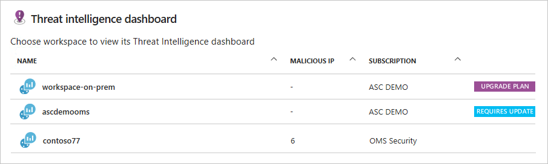
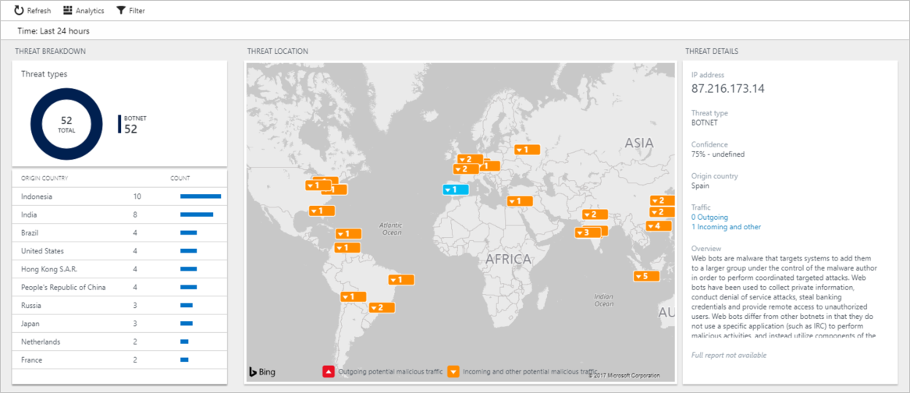

# Threat Intelligence in Azure Security Center
This document helps you use Azure Security Center Threat Intelligence to address security related issues.

## What is threat intelligence?
By using the Threat Intelligence option available in Security Center, IT administrators can identify security threats against the environment, such as identify if a particular computer is part of a botnet. Computers can become nodes in a botnet when attackers illicitly install malware that secretly connects this computer to the command and control. It can also identify potential threats coming from underground communication channels, such as darknet.

In order to build this threat intelligence, Security Center uses data coming from multiple sources within Microsoft. Security Center leverages this data to identify potential threats against your environment. The Threat Intelligence pane is composed by three major options:

- Detected threat types
- Threat origin
- Threat intelligence map

## When should I use threat intelligence?
One of the steps of a [security incident response process](https://docs.microsoft.com/azure/security-center/security-center-planning-and-operations-guide#incident-response) is to identify the severity of the compromise system(s). In this phase, you should perform the following tasks:

- Determine the nature of the attack
- Determine the attack point of origin
- Determine the intent of the attack. Was the attack specifically directed at your organization to acquire specific information, or was it random?
- Identify the systems that have been compromised
- Identify the files that have been accessed and determine the sensitivity of those files
You can leverage Threat Intelligence information in Security Center to help with these tasks. 

## How to access the threat intelligence?
To visualize the current threat intelligence for your environment, you must first select the workspace that your information resides. If you don’t have multiple workspaces you will not see the workspace selector, and it will go directly to the **Threat intelligence** dashboard. Follow the steps below to access the threat intelligence dashboard:

1.	Open **Security Center** dashboard.
2.	In the left pane, under **Detection** click **Threat intelligence**. The **Threat intelligence** dashboard appears.

	

	> [!NOTE]
	> If the last column shows **UPGRADE PLAN** is because this workspace is using the free subscription, and you need to upgrade to standard to use this feature. If it shows REQUIRES UPDATE is because you need to update the [Azure Log Analytics](https://docs.microsoft.com/azure/log-analytics/log-analytics-overview) in order to use this feature. For more information about the pricing plan, read Azure Security Center pricing. 
	> 
3. If you have more than one workspace to investigate, you may prioritize the investigation according to the **MALICIOUS IP** column that shows the current number of malicious IPs in this workspace. Select the workspace that you want to use, and then the **Threat intelligence** dashboard appears.

	

4. This dashboard is divided in four tiles:
	* **Threat types**: summarizes the type of threats were detected in the selected workspace.
	* **Origin country**: aggregates the amount of traffic according to its source location.
	* **Threat location**: help you to identify the current locations around the globe that communicates with your environment. There are orange (incoming) and red (outgoing) arrows in this map that identify the traffic direction, if you click in one of these arrows, it will show the type of threat and the traffic direction.
	* **Threat details**: shows more details about the threat that you selected in the map.

Regardless of which option tile you select, the dashboard that will appear is based on the Log Search  query, the only difference is the type of query and the result.

### Threat types
Once you click the **Threat types** tile the **Log Search** dashboard appears, and there you have the filter options on the left, and the query results in the right.

The query result shows aggregates the threats by name, You can use the left pane to select the attribute that you want to filter, for example if you want to see only the threats that are current connected to the machines, you select **Connected** in the **SESSIONSTATE**, and click **Apply** button.

For Azure VMs, only the network data that flows through the agent is going to appear in the threat intelligence dashboard. The following data types are also used by threat intelligence:

- CEF Data (Type=CommonSecurityLog)
- WireData (Type= WireData)
- IIS Logs (Type=W3CIISLog)
- Windows Firewall (Type=WindowsFirewall)
- DNS Events (Type=DnsEvents)

## See also
In this document, you learned how to use threat intelligence in Security Center to assist you identifying suspicious activity. To learn more about Azure Security Center, see the following:

* [Managing and responding to security alerts in Azure Security Center](https://docs.microsoft.com/azure/security-center/security-center-managing-and-responding-alerts). Learn how to manage alerts, and respond to security incidents in Security Center.
* [Security health monitoring in Azure Security Center](security-center-monitoring.md). Learn how to monitor the health of your Azure resources.
* [Understanding security alerts in Azure Security Center](https://docs.microsoft.com/azure/security-center/security-center-alerts-type). Learn about the different types of security alerts.
* [Azure Security Center Troubleshooting Guide](https://docs.microsoft.com/azure/security-center/security-center-troubleshooting-guide). Learn how to troubleshoot common issues in Security Center. 
* [Azure Security Center FAQ](security-center-faq.md). Find frequently asked questions about using the service.
* [Azure Security Blog](http://blogs.msdn.com/b/azuresecurity/). Find blog posts about Azure security and compliance.

